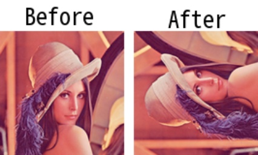

# imrotate90

> [imrotate90(img: np.ndarray, rotate_code: ROTATE) -> np.ndarray](https://github.com/DocsaidLab/Capybara/blob/main/capybara/vision/geometric.py)

- **Description**: Rotates the input image by 90 degrees.

- **Parameters**

  - **img** (`np.ndarray`): The input image to be rotated.
  - **rotate_code** (`ROTATE`): The rotation code. Available options include:
    - ROTATE.ROTATE_90: Rotate by 90 degrees.
    - ROTATE.ROTATE_180: Rotate by 180 degrees.
    - ROTATE.ROTATE_270: Rotate counterclockwise by 90 degrees.

- **Returns**

  - **np.ndarray**: The rotated image.

- **Example**

  ```python
  import capybara as cb

  img = cb.imread('lena.png')
  rotate_img = cb.imrotate90(img, cb.ROTATE.ROTATE_270)
  ```

  
