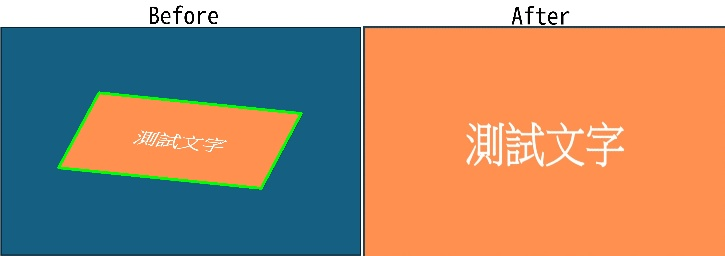

# imwarp_quadrangle

>[imwarp_quadrangle(img: np.ndarray, polygon: Union[Polygon, np.ndarray]) -> np.ndarray](https://github.com/DocsaidLab/DocsaidKit/blob/012540eebaebb2718987dd3ec0f7dcf40f403caa/docsaidkit/vision/geometric.py#L155C1-L203C71)

- **Description**: Apply perspective transformation to the input image using the 4 points defined by the given polygon. The function automatically sorts the four points in the order: the first point is the top-left corner, the second point is the top-right corner, the third point is the bottom-right corner, and the fourth point is the bottom-left corner. The target size of the image transformation is determined by the width and height of the minimum bounding rectangle of the polygon.

- **Parameters**:

    - **img** (`np.ndarray`): Input image to be transformed.
    - **polygon** (`Union[Polygon, np.ndarray]`): Polygon object containing the four points defining the transformation.

- **Returns**:

    - **np.ndarray**: Transformed image.

- **Example**:

    ```python
    import docsaidkit as D

    img = D.imread('./resource/test_warp.jpg')
    polygon = D.Polygon([[602, 404], [1832, 530], [1588, 985], [356, 860]])
    warp_img = D.imwarp_quadrangle(img, polygon)
    ```

    

    The green box in the above figure represents the original polygon range.
