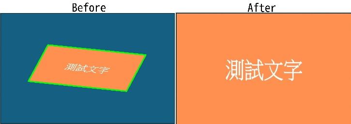

# imwarp_quadrangle

> [imwarp_quadrangle(img: np.ndarray, polygon: Polygon | np.ndarray, dst_size: tuple[int, int] | None = None, do_order_points: bool = True) -> np.ndarray](https://github.com/DocsaidLab/Capybara/blob/main/capybara/vision/geometric.py)

- **Description**: Applies a 4-point perspective transform to the input image.

- **Parameters**

  - **img** (`np.ndarray`): The input image to be transformed.
  - **polygon** (`Polygon | np.ndarray`): A polygon with four points. If `np.ndarray` is provided, it is converted to `Polygon` first.
  - **dst_size** (`tuple[int, int] | None`): Output image size `(width, height)`. If `None`, it is inferred from `polygon.min_box_wh`.
  - **do_order_points** (`bool`): Whether to order the 4 points clockwise (TL, TR, BR, BL). Default is `True`.

- **Returns**

  - **np.ndarray**: The transformed image.

- **Example**

  ```python
  import capybara as cb

  img = cb.imread('./resource/test_warp.jpg')
  polygon = cb.Polygon([[602, 404], [1832, 530], [1588, 985], [356, 860]])
  warp_img = cb.imwarp_quadrangle(img, polygon)
  ```

  

  The green box in the image above represents the original polygon area.
