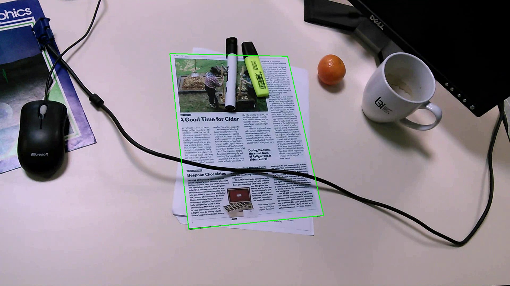
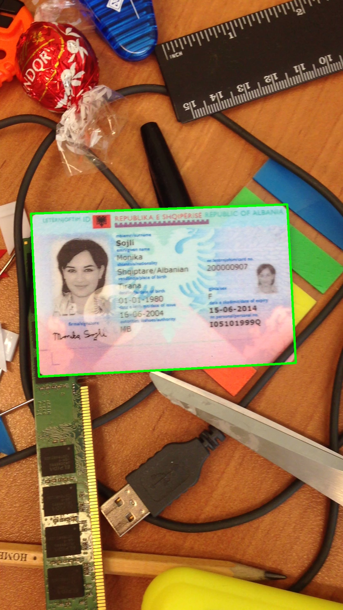
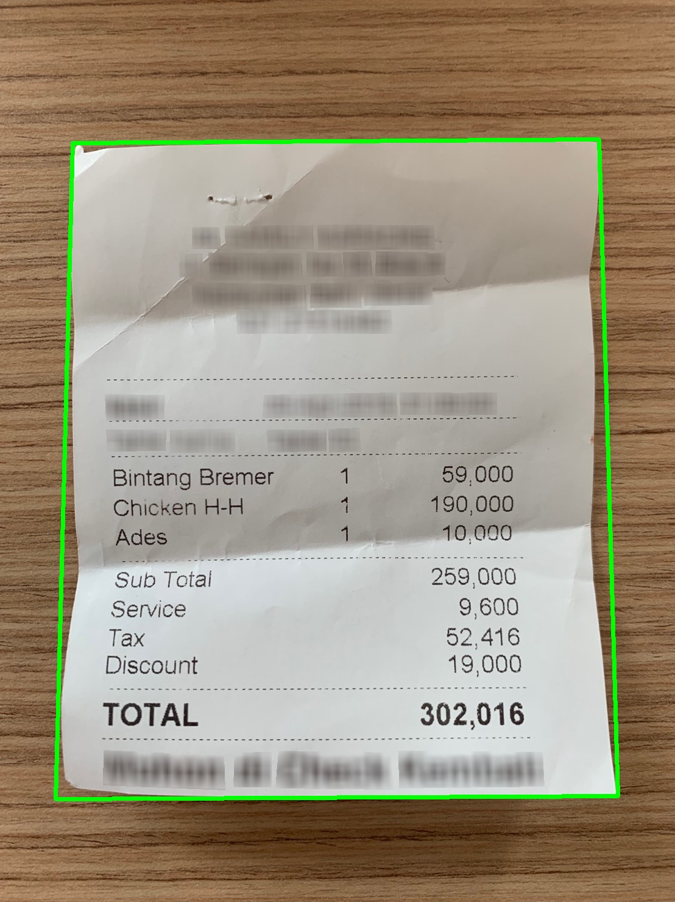

# Dataset

In this chapter, we briefly introduce the datasets used for training and testing our models. These datasets include a variety of document images.

## SmartDoc 2015

The SmartDoc 2015 - Challenge 1 dataset was originally created for the SmartDoc 2015 competition, focusing on evaluating document image capture methods using smartphones. Challenge 1 is particularly about detecting and segmenting document regions from video frames captured from smartphone preview streams.

- **URL**: [**SmartDoc 2015**](https://github.com/jchazalon/smartdoc15-ch1-dataset)

## MIDV-500/2019

MIDV-500 consists of 500 video clips of 50 different types of identity documents, including 17 IDs, 14 passports, 13 driver's licenses, and 6 other identity documents from different countries. It features real-world scenarios to extensively study various document analysis issues. MIDV-2019 includes images with distortions and low light.

- **URL**: [**MIDV**](https://github.com/fcakyon/midv500)

## MIDV-2020

MIDV-2020 features 10 types of documents, including 1000 annotated video clips, 1000 scanned images, and 1000 photos of 1000 unique simulated identity documents, each with unique textual field values and uniquely generated artificial faces.

- **URL**: [**MIDV2020**](http://l3i-share.univ-lr.fr/MIDV2020/midv2020.html)

## CORD v0

This dataset comprises thousands of Indonesian receipts, which include image text annotations for OCR and multi-layer semantic tags for parsing. The provided dataset can be used to address various OCR and parsing tasks.

- **URL**: [**CORD**](https://github.com/clovaai/cord)

## Synthetic Dataset

Considering the limitations of available datasets, we use dynamic image synthesis techniques. In essence, we first collected a dataset of various texts, including images of various documents and certificates found online. We then used an Indoor dataset as a background, onto which we superimposed the text data. Moreover, for the MIDV-500/MIDV-2019/CORD datasets, which all have corresponding polygon data, we also synthesized various images onto these datasets in the spirit of maximizing resource use and increasing dataset diversity.
