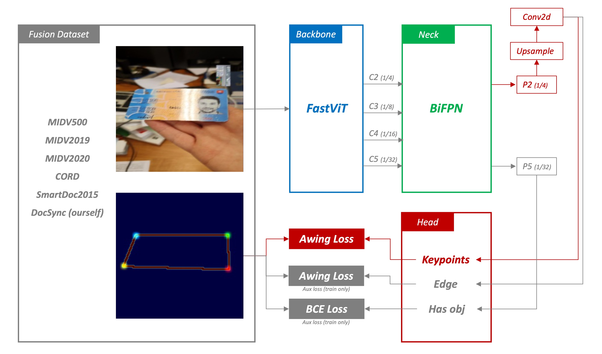
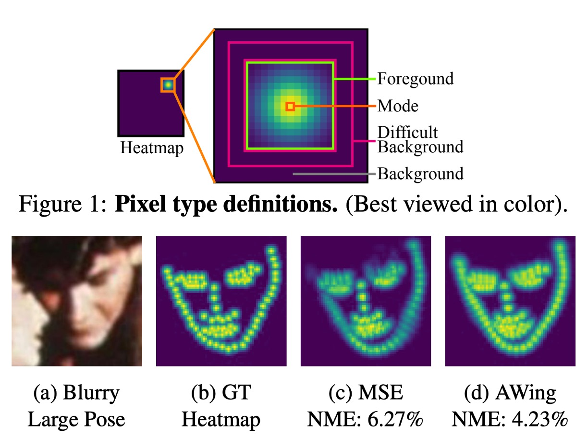

# Model Design

Referencing past research, we first considered a point regression model.

If you're interested in the details of previous research, please refer to: [**References**](./reference.md)

## Point Regression Model

The point regression model was our initial version, structured into four main components:

### 1. Feature Extraction

This part primarily transforms images into vectors. Here, we utilize [**PP-LCNet**](https://arxiv.org/abs/2109.15099) as the feature extractor.

The input image is a 128 x 128 RGB image, and after feature extraction, it outputs a 256-dimensional vector.

:::tip
**Why do you always prefer LCNet?**

We often need to deploy the model on mobile devices. LCNet is exceptionally lightweight, suitable for running on smartphones. Additionally, when we need to quantize the model, LCNet usually doesn't encounter issues with unsupported operations.
:::

### 2. Cross-Attention

In this model, the Neck part enhances the features from the Backbone.

Here, we employ Cross-Attention, a mechanism commonly used in Transformers, which captures relationships between different features and applies them to enhance the features. We expect Cross-Attention to help the model understand spatial relationships between different points in images, thus improving prediction accuracy. Apart from Cross-Attention, we also use positional encodings, aiding the model in understanding the spatial positions of points in images, thereby enhancing prediction accuracy.

Given the nature of point regression, which heavily relies on precise pixel localization, especially on low-level features, we sequentially query from deep features to shallow features (1/32 -> 1/16 -> 1/8 -> 1/4 -> 1/2). This design allows the model to locate documents' positions across different scales effectively. We believe this querying approach can significantly enhance the model's accuracy.

### 3. Point Regression

In the design of our prediction head, we utilize a simple linear layer, converting features into point coordinates. We aim for the model to rely more on the expressive power of Cross-Attention features rather than complex head structures.

### 4. Smooth L1 Loss

In our model, we opt for Smooth L1 Loss as the loss function, commonly used in regression tasks, particularly suitable for handling outliers.

Compared to L1 Loss, Smooth L1 Loss is more robust when the difference between predicted and true values is large, reducing the impact of outliers on model training. Additionally, to mitigate amplification errors in point regression, we "boost the weights of point predictions to 1000". Through our experiments, this design effectively enhances model accuracy.

Besides corner loss, we also employ other losses, including:

- Classification Loss: Used for classifying whether a document exists in an image, employing BCE Loss.

Please note that this classification loss is not merely auxiliary but one of the main losses. Due to the constraints of corner point prediction, the model may still predict corners even when there's no target object. Therefore, in the deployment phase, we need a classification head to inform us whether an object exists.

## Catastrophic Failure

In the architecture of the "Point Regression Model," we encountered a severe issue of "**amplification error**".

The root of this problem lies in the process of training the model, where we need to downscale the original images to 128 x 128 or 256 x 256. This downsizing leads to the loss of detailed information in the original images, causing the model to inaccurately locate document corners during prediction.

**To be precise, the model finds corners based on downscaled images.**

Then, we must upscale these corners to the original image size to find the precise positions of document corners. This upscaling process introduces an offset of approximately 5 to 10 pixels, leading to inaccuracies in predicting document positions.

:::tip
You can imagine: in the original image, a region of about 10 pixels around the target corner will be reduced to 1 pixel during prediction. Then, the model makes predictions, resulting in corner positions offset during upscaling.
:::

## Approaches by Others

Upon encountering this issue, we consciously sought how others resolved it.

Later, we found in many papers within the field of Document Localization, the solution is:

### Predicting on Large Images

This approach ensures that the model accurately finds document corners during prediction.

However, it's slow, very slow.

### Introducing Anchors and Offsets

The Anchor-Based approach can be borrowed from the object detection domain. We would need some prior knowledge to define anchor sizes. However, since documents can appear in images with arbitrary angles and deformations, the design of anchors would limit the model's detection ability within a certain range.

Basically, you can rewrite the pros and cons of the anchor architecture you know here.

In the real world, the aspect ratios of documents are too arbitrary, making anchor design unsuitable.

### Directly Fitting Evaluation Dataset

In earlier papers, the logic seems more like designing an algorithm directly for SmartDoc 2015 rather than creating a universal model.

In recent years' papers, SmartDoc 2015 is typically split into training and testing sets. Through this approach, improvements in scores for SmartDoc 2015 are achieved.

So, you may see many architecture scores in benchmarks that seem decent, but in practical applications, they lack sufficient generalization.

---

We found that researchers in this field don't have a unified view on how to solve this problem.

## Heatmap Regression Model

This model architecture retains the original feature extractor but modifies the Neck and Head sections.

### 1. Feature Extraction

Apart from using LCNet for mobile-friendly models, we also employ a larger model to extract more features. Because we aim to develop a model that surpasses SOTA, LCNet alone isn't sufficient.

In this model, we attempt using lightweight convolutional neural networks like FastViT, MobileNetV2, etc., especially suitable for efficient feature extraction in resource-constrained environments. We expect the Backbone to extract sufficient feature information from input data to prepare for subsequent heatmap regression.

### 2. BiFPN

To better integrate multi-scale features, we introduce BiFPN (Bidirectional Feature Pyramid Network), which enhances feature representation through bidirectional flow of contextual information. We anticipate BiFPN to produce a series of scale-rich and semantically strong feature maps, highly effective in capturing objects at different scales and positively impacting final prediction accuracy.

### 3. Heatmap Regression

To address the aforementioned amplification error, we need a certain "fuzziness" in the predicted results. Meaning, we shouldn't let the model precisely pinpoint where the document corners are but rather make the model say, "**The document corners are approximately in this area**".

For this, we adopted a method commonly used in face keypoint detection or human pose estimation: **heatmap regression**.

Heatmap regression generates a heatmap representation of objects, reflecting the likelihood of objects appearing at different positions. By analyzing these heatmaps, the model can accurately predict the position and pose of objects. In our context, heatmaps are used to find document corners.

### 4. Adaptive Wing Loss

Loss is crucial in model training, responsible for calculating the difference between model predictions and ground truth labels.

In this model, we use Adaptive Wing Loss, a loss function specifically for face keypoint detection. This method innovates upon loss functions in heatmap regression, particularly suitable for face alignment problems. Its core idea is to adjust the shape of the loss function based on different types of true heatmap pixels, applying more penalty to foreground pixels (pixels near facial keypoints) and less penalty to background pixels.

Here, we treat the document corner prediction problem as a face keypoint detection problem and use a loss function specialized for face keypoint detection in heatmap regression. We believe this approach can effectively address issues in document corner detection and perform well in various scenarios.

- **Reference:** [**Adaptive Wing Loss for Robust Face Alignment via Heatmap Regression**](https://arxiv.org/abs/1904.07399)

Apart from corner loss, we also use multiple auxiliary losses, including:

- **Edge Loss:** Here, we simultaneously supervise object boundary information, using AWing Loss.
- **Classification Loss:** Here, used for predicting whether a document exists in the image, employing BCE Loss.

## Resolving Amplification Error

The output of the heatmap regression model is a heatmap, indicating approximately where the document corners are. Then, we **cannot directly use this heatmap** because it's downscaled. The actual steps are as follows:

1. We need to upscale this heatmap to the original image size.
2. Using image post-processing methods, we find the Contour of each heatmap corner area.
3. We calculate the centroid of the Contour, which represents the document corner.

This way, the model can accurately locate corners, resolving the previously mentioned amplification error issue.

## Conclusion

In the architecture of the heatmap model, you can find a significant drawback:

- **Not an end-to-end model**

This has been a question we've been constantly pondering while designing the model. We hope to design an end-to-end model, which would be simpler for users and allow the model to learn from each component. However, due to the challenges encountered in the point regression model, we had to resort to the design approach of the heatmap regression model.

In conclusion, after resolving the amplification error issue, we can focus on discussing model scalability, speed, accuracy, etc.

In our experiments, using a larger Backbone, a more complex Neck, all contribute to improving model accuracy.

During deployment, you only need to consider the computational constraints of the usage scenario and choose the appropriate model.
