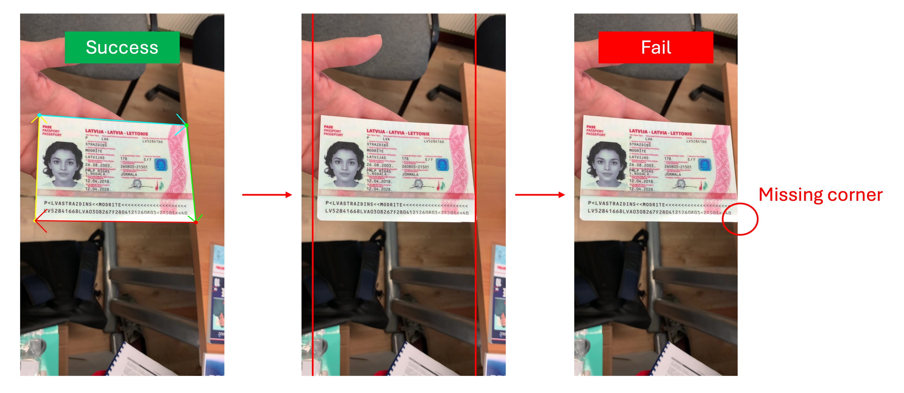

# QuickStart

We provide a simple model inference interface, which includes both pre-processing and post-processing logic.

First, you need to import the necessary dependencies and create the `DocAligner` class.

## Model Inference

Below is a simple example demonstrating how to use `DocAligner` for model inference:

```python
from docaligner import DocAligner

model = DocAligner()
```

Once the model is initialized, you need to prepare an image for inference:

:::tip
You can use the test image provided by `DocAligner`:

Download link: [**run_test_card.jpg**](https://github.com/DocsaidLab/DocAligner/blob/main/docs/run_test_card.jpg)
:::

```python
import docsaidkit as D

img = D.imread('path/to/run_test_card.jpg')
```

Alternatively, you can read it directly from a URL:

```python
import cv2
from skimage import io

img = io.imread('https://github.com/DocsaidLab/DocAligner/blob/main/docs/run_test_card.jpg?raw=true')
img = cv2.cvtColor(img, cv2.COLOR_RGB2BGR)
```


Next, you can use the `model` for inference:

```python
result = model(img)
```

The inference result is encapsulated in a [**Document**](../docsaidkit/funcs/objects/document) object, which contains the document's polygon, OCR text information, etc. In this module, we will only use the `image` and `doc_polygon` attributes. After obtaining the inference result, you can perform various post-processing operations.

:::tip
`DocAligner` is wrapped with `__call__`, so you can directly call the instance for inference.
:::

:::info
The `DocAligner` has an auto-download feature for the model. When you use `DocAligner` for the first time, it will automatically download the model.
:::

## Output Results

### 1. Draw Polygon

Draw and save the image with the document polygon.

```python
# draw
result.draw_doc(
    folder='path/to/save/folder',
    name='output_image.jpg'
)
```

Or output it directly without specifying a path:

```python
# The default output path is the current directory.
# The default output filename is f"output_{D.now()}.jpg".
result.draw_doc()
```


### 2. Get NumPy Image

If you have other requirements, you can use the `gen_doc_info_image` method and then process it further.

```python
img = result.gen_doc_info_image()
```

### 3. Extract Flattened Image

If you know the original size of the document, you can use the `gen_doc_flat_img` method to convert the document image from its polygon boundary to a rectangular image.

```python
H, W = 1080, 1920
flat_img = result.gen_doc_flat_img(image_size=(H, W))
```

For an unknown image category, you can omit the `image_size` parameter. In this case, the minimum rectangle based on the document polygon boundary will be calculated, and the dimensions of the minimum rectangle will be set as `H` and `W`.

```python
flat_img = result.gen_doc_flat_img()
```

:::tip
When your document appears highly skewed in the image, the calculated minimum rectangle might be significantly distorted. In such cases, it's recommended to manually set the `image_size` parameter.
:::

## Why the Model Fail?

This is a complex question, and we need to break it down step by step.

Let's use an image from the MIDV-2020 dataset as an example. You can download this image and test it yourself:


### Document Size in the Image

The first consideration is the size of the document in the image. A document that is too large or too small may not be detected by the model.

Based on our training data, the document scale ranges from approximately 1/2 to 1/8 of the image size, as shown below:


This means if your document size in the image is smaller than a single grid in the 1/8 scale, the model will likely ignore it, assuming it's part of the background.

Detecting very small documents is often not meaningful for downstream tasks, so this characteristic was retained during training.

### Missing Document Corners

A document that is too large usually doesn't affect the model, but in such cases, document corners might be cropped at the image edges or extend beyond the image.

Since the model primarily focuses on corner detection, missing corners can lead to unstable estimation results. If a missing corner is at the document's edge, the model may judge it as an invalid document and not output a polygon, as shown below:



### Blurry Document in the Image

Another cause of detection failure is a blurry document, which can make it difficult for the model to identify the document's boundaries, resulting in detection failure, as shown below:


### Unknown Document Types

Our model is limited in scale, ranging from 5MB to 20MB. While the model has a certain degree of generalization ability, it may fail to detect certain special documents not present in the training dataset.

For example, if we assume the blue calculator in the image below is a "special document":


The model will output an empty polygon because it doesn't recognize the "calculator" as a document. The solution for this is to manually label and train the model with this "special document" to fine-tune the model.

## Model Visualization

We haven't packaged this feature, as it's just an intermediate step, followed by other image post-processing steps.

But if you really want to see it, here's some code to visualize the model's output. Assuming you're using a heatmap model, you can visualize the model's output as follows:

```python
import cv2
import docsaidkit as D
import numpy as np
from docaligner import DocAligner
from docaligner.heatmap_reg.infer import preprocess

model = DocAligner()

img = D.imread('midv2020_example.jpg')

img_infos = preprocess(
    img=img,
    img_size_infer=(256, 256)
)

heatmap = model.detector.model(**img_infos['input'])['heatmap'][0].sum(0)
heatmap = np.uint8(heatmap * 255)
heatmap = D.imresize(heatmap, size=img.shape[:2])
heatmap = cv2.applyColorMap(heatmap, cv2.COLORMAP_JET)
output = cv2.addWeighted(img, 0.5, heatmap, 0.5, 0)
D.imwrite(output)
```


With the above code, you can see the model's output as a heatmap, where darker colors represent regions more likely to be document corners. In case of detection failure, this visualization might help identify potential issues.

## Contact Us

If the above solutions do not resolve your issue, you can email us the problematic images for further inspection.

Please contact us via email: **docsaidlab@gmail.com**
