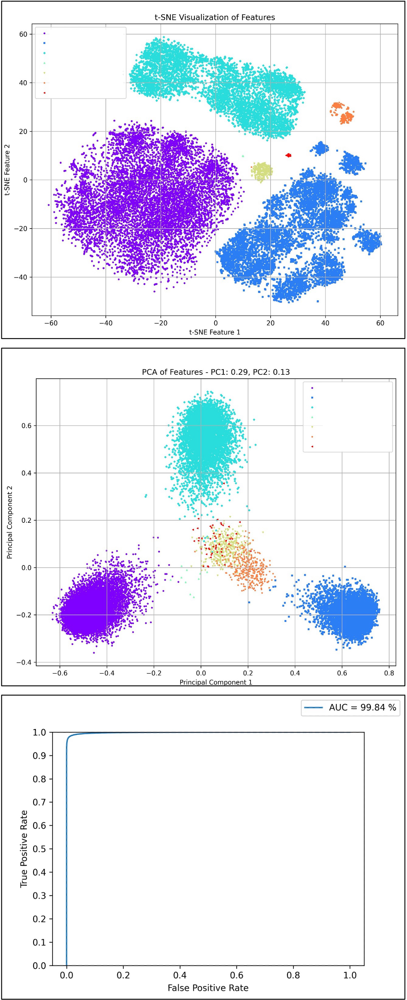

# Evaluation

:::warning
The test dataset for this project is provided by a private institution.

For privacy protection, we only provide the evaluation results of this dataset.
:::

This dataset contains approximately 25,000 images that have been "textually located and cropped" and "de-identified". It includes seven different categories, with extremely unbalanced quantities. The data contains a large number of cropped shape variations caused by different light and shadow changes, blurring, reflections, and corner positioning errors.

We only cleaned the "incorrect category labels" of this dataset and then used all the data to evaluate the model's performance.

## Evaluation Protocols

### AUROC

AUROC (Area Under the Receiver Operating Characteristic Curve) is a statistical metric used to evaluate the performance of classification models, especially in binary classification problems. The AUROC value ranges from 0 to 1, where a higher AUROC value indicates a better ability of the model to discriminate between two classes.

- **ROC Curve**

  - **Definition**: The ROC curve is a graphical evaluation tool that shows the performance of a classification model at all possible classification thresholds. It achieves this by plotting the values of True Positive Rate (TPR) and False Positive Rate (FPR) at different thresholds.
  - **True Positive Rate (TPR)**: Also known as sensitivity, calculated as TPR = TP / (TP + FN), where TP is the number of true positives, and FN is the number of false negatives.
  - **False Positive Rate (FPR)**: Calculated as FPR = FP / (FP + TN), where FP is the number of false positives, and TN is the number of true negatives.

- **Calculation of AUROC**

  - AUROC is the area under the ROC curve. It provides a metric to summarize the performance of the model across all classification thresholds.
  - **Interpretation**:
    - **AUROC = 1**: Perfect classifier, able to completely distinguish between the two classes.
    - **0.5 < AUROC < 1**: The model has some ability to discriminate, with higher AUROC values indicating better performance.
    - **AUROC = 0.5**: No discrimination ability, equivalent to random guessing.
    - **AUROC < 0.5**: Worse than random guessing, but if the model predicts the reverse, it may have better performance.

### TPR@FPR Threshold Table

The TPR@FPR threshold table is a key evaluation tool widely used in the field of face recognition, mainly used to measure the model's performance at different threshold settings. This table is derived from the ROC curve and provides an intuitive and accurate method for evaluating model performance.

For example, if the goal is to achieve a performance of at least 0.9 TPR (True Positive Rate) at an FPR (False Positive Rate) of 0.01, we can determine the corresponding threshold through the TPR-FPR threshold table. This threshold then guides the inference process of the model.

In the implementation of this project, we also adopted a similar evaluation method. We chose the performance of TPR at FPR of 0.0001 as the standard, which helps us better understand the performance of the model under specific conditions.

### Zero-shot Testing

We adopt a zero-shot testing strategy to ensure that all categories or patterns in the test data have not appeared in the training data. This means that during the training phase of the model, it has not encountered or learned any samples or categories from the test set. This approach aims to evaluate and verify the model's generalization ability and recognition performance when facing completely unknown data.

This testing method is particularly suitable for evaluating zero-shot learning models because the core challenge of zero-shot learning is to deal with categories that the model has never seen during training. In the context of zero-shot learning, the model typically needs to use other forms of auxiliary information (such as textual descriptions of categories, attribute labels, or semantic relations between categories) to build an understanding of new categories. Therefore, in zero-shot testing, the model must rely on the knowledge it has learned from the training categories and the potential relationships between categories to identify new samples in the test set.

## Ablation Experiments

- **Global settings**

  - Num of classes: 394,080
  - Num of epochs: 20
  - Num of data per epoch: 2,560,000
  - Batch Size: 512
  - Optimizer: AdamW
  - Settings:
    - flatten: Flatten -> Linear (Default)
    - gap: GlobalAveragePooling2d -> Linear
    - squeeze: Conv2d -> Flatten -> Linear

- **Comprehensive Comparison**

  | Name                                   | TPR@FPR=1e-4 |    ROC     | FLOPs (G) | Size (MB) |
  | -------------------------------------- | :----------: | :--------: | :-------: | :-------: |
  | lcnet050-f256-r128-ln-arc              |    0.754     |   0.9951   |   0.053   |   5.54    |
  | lcnet050-f256-r128-ln-softmax          |    0.663     |   0.9907   |   0.053   |   5.54    |
  | lcnet050-f256-r128-ln-cos              |  **0.784**   | **0.9968** |   0.053   |   5.54    |
  | lcnet050-f256-r128-ln-cos-from-scratch |    0.141     |   0.9273   |   0.053   |   5.54    |
  | lcnet050-f256-r128-ln-cos-squeeze      |    0.772     |   0.9958   |   0.052   | **2.46**  |
  | lcnet050-f256-r128-bn-cos              |    0.721     |   0.992    |   0.053   |   5.54    |
  | lcnet050-f128-r96-ln-cos               |    0.713     |   0.9944   |   0.029   |   2.33    |
  | lcnet050-f256-r128-ln-cos-gap          |    0.480     |   0.9762   |   0.053   |   2.67    |
  | efficientnet_b0-f256-r128-ln-cos       |    0.682     |   0.9931   |   0.242   |   19.89   |

- **Comparison of Target Class Numbers**

  | Name                      | Num_Classes | TPR@FPR=1e-4 |    ROC     |
  | ------------------------- | ----------: | :----------: | :--------: |
  | lcnet050-f256-r128-ln-arc |      16,256 |    0.615     |   0.9867   |
  | lcnet050-f256-r128-ln-arc |     130,048 |    0.666     |   0.9919   |
  | lcnet050-f256-r128-ln-arc |     390,144 |  **0.754**   | **0.9951** |

  - The more the number of classes, the better the model performance.

- **Comparison of MarginLoss**

  | Name                          | TPR@FPR=1e-4 |    ROC     |
  | ----------------------------- | :----------: | :--------: |
  | lcnet050-f256-r128-ln-softmax |    0.663     |   0.9907   |
  | lcnet050-f256-r128-ln-arc     |    0.754     |   0.9951   |
  | lcnet050-f256-r128-ln-cos     |  **0.784**   | **0.9968** |

  - When using CosFace or ArcFace alone, ArcFace performs better.
  - After combining with PartialFC, CosFace performs better.

- **BatchNorm vs LayerNorm**

  | Name                      | TPR@FPR=1e-4 |    ROC     |
  | ------------------------- | :----------: | :--------: |
  | lcnet050-f256-r128-bn-cos |    0.721     |   0.9921   |
  | lcnet050-f256-r128-ln-cos |  **0.784**   | **0.9968** |

  - LayerNorm performs better than BatchNorm.

- **Pretrain vs From-Scratch**

  | Name                                   | TPR@FPR=1e-4 |    ROC     |
  | -------------------------------------- | :----------: | :--------: |
  | lcnet050-f256-r128-ln-cos-from-scratch |    0.141     |   0.9273   |
  | lcnet050-f256-r128-ln-cos              |  **0.784**   | **0.9968** |

  - Pretraining is necessary and can save a lot of time.

- **Methods to Reduce Model Size**

  | Name                              | TPR@FPR=1e-4 |    ROC     | Size (MB) | FLOPs (G) |
  | --------------------------------- | :----------: | :--------: | :-------: | :-------: |
  | lcnet050-f256-r128-ln-cos         |  **0.784**   | **0.9968** |   5.54    |   0.053   |
  | lcnet050-f256-r128-ln-cos-squeeze |    0.772     |   0.9958   | **2.46**  | **0.053** |
  | lcnet050-f256-r128-ln-cos-gap     |    0.480     |   0.9762   |   2.67    |   0.053   |
  | lcnet050-f128-r96-ln-cos          |    0.713     |   0.9944   |   2.33    |   0.029   |

  - Methods:
    - flatten: Flatten -> Linear (Default)
    - gap: GlobalAveragePooling2d -> Linear
    - squeeze: Conv2d -> Flatten -> Linear
    - Reducing resolution and feature dimensions
  - Using the squeeze method sacrifices some performance but reduces the model size by half.
  - Using the gap method significantly reduces accuracy.
  - Reducing resolution and feature dimensions leads to a slight decrease in accuracy.

- **Increasing Backbone Size**

  | Name                             | TPR@FPR=1e-4 |    ROC     |
  | -------------------------------- | :----------: | :--------: |
  | lcnet050-f256-r128-ln-cos        |  **0.784**   | **0.9968** |
  | efficientnet_b0-f256-r128-ln-cos |    0.682     |   0.9931   |

  - Increasing the number of parameters decreases performance, which we attribute to the limited diversity of training data. Since our approach cannot provide too much diversity, increasing the number of parameters does not improve performance.

- **Introduction of ImageNet1K Dataset and Knowledge Distillation using CLIP Model**

  |   Dataset   | with CLIP |  Norm   | Num_Classes | TPR@FPR=1e-4 |    ROC     |
  | :---------: | :-------: | :-----: | :---------: | :----------: | :--------: |
  |   Indoor    |     X     |   LN    |   390,144   |    0.772     |   0.9958   |
  | ImageNet-1K |     X     |   LN    |  1,281,833  |    0.813     |   0.9961   |
  | ImageNet-1K |     V     |   LN    |  1,281,833  |    0.859     |   0.9982   |
  | ImageNet-1K |     V     | LN + BN |  1,281,833  |  **0.912**   | **0.9984** |

  As the dataset size expands, the original parameter settings can no longer allow the model to converge smoothly.

  Therefore, we made some adjustments to the model:

  - **Settings**
    - Num of classes: 1,281,833
    - Num of epochs: 40
    - Num of data per epoch: 25,600,000 (If the model cannot converge smoothly, it may be due to insufficient data.)
    - Batch Size: 1024
    - Optimizer: AdamW
    - Learning Rate: 0.001
    - Learning Rate Scheduler: PolynomialDecay
    - Setting:
      - squeeze: Conv2d -> Flatten -> Linear
  - Using ImageNet-1K to expand the number of categories to about 1.3 million, providing the model with richer image variations and increasing data diversity, resulting in a 4.1% improvement in performance.
  - Introducing the CLIP model on top of ImageNet-1K during training for knowledge distillation resulted in a further 4.6% improvement in performance over the TPR@FPR=1e-4 benchmark.
  - When using both BatchNorm and LayerNorm together, the result can be improved to 91.2%.

## Evaluation Results

In evaluating the model's ability, we adopt the standard of TPR@FPR=1e-4. However, this standard is relatively strict, and using it in deployment may result in a less optimal user experience. Therefore, we recommend using TPR@FPR=1e-1 or TPR@FPR=1e-2 threshold settings during deployment.

Currently, our default threshold is set to `TPR@FPR=1e-2`, which we have determined to be a more suitable threshold after our testing and evaluation. The detailed threshold setting table is as follows:

- **lcnet050_cosface_f256_r128_squeeze_imagenet_clip_20240326 results**

  - **Setting `model_cfg` to "20240326"**
  - **TPR@FPR=1e-4: 0.912**

    |    FPR    | 1e-05 | 1e-04 | 1e-03 | 1e-02 | 1e-01 |   1   |
    | :-------: | :---: | :---: | :---: | :---: | :---: | :---: |
    |    TPR    | 0.856 | 0.912 | 0.953 | 0.980 | 0.996 |  1.0  |
    | Threshold | 0.705 | 0.682 | 0.657 | 0.626 | 0.581 | 0.359 |

  - **TSNE & PCA & ROC Curve**

    
