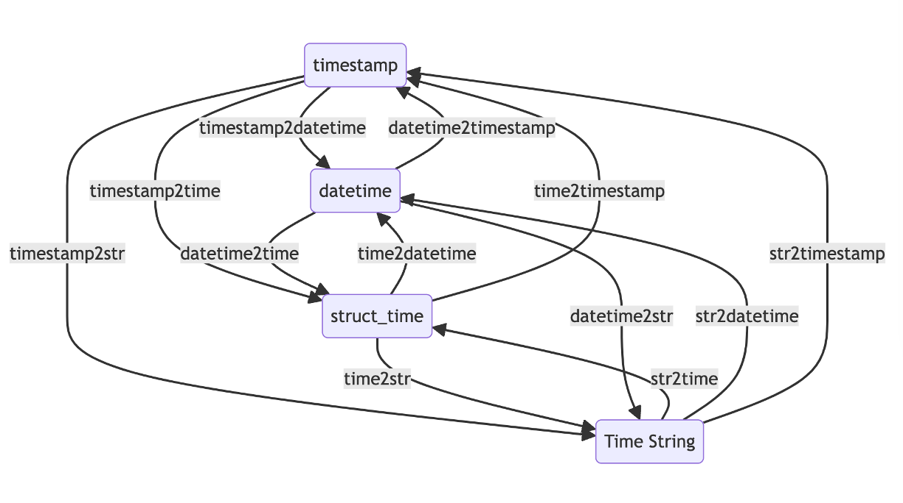
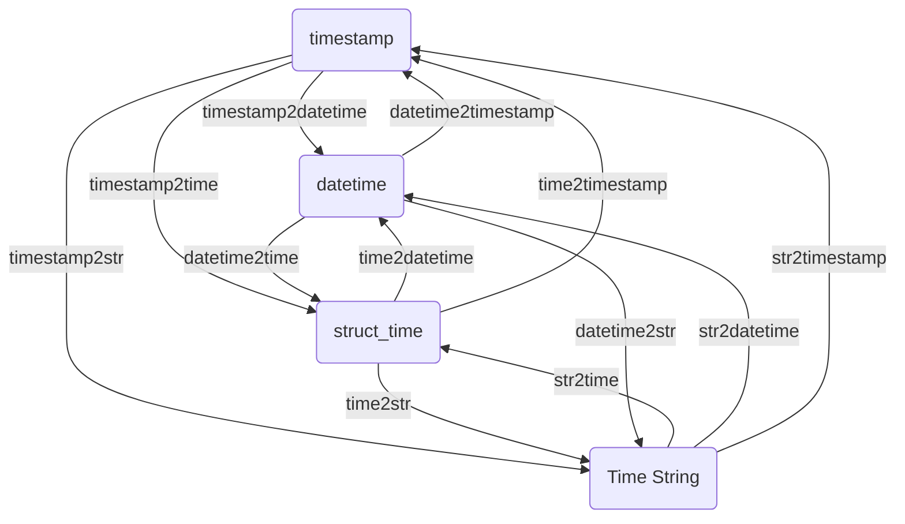

# Time2Time

This is a utility tool for converting time formats.

In Python, conversion between different time formats has always been a nuisance.

To tackle this issue, we've developed several conversion functions that allow seamless conversion between datetime, struct_time, timestamp, and time strings.

Below is the relationship diagram of these functions:



If you're curious about how the above diagram was created, you can refer to the Mermaid code below:



Look at the pictures. First find the conversion function you need, and then search further:

---

## timestamp2datetime

>[timestamp2datetime(ts: Union[int, float]) -> datetime](https://github.com/DocsaidLab/DocsaidKit/blob/012540eebaebb2718987dd3ec0f7dcf40f403caa/docsaidkit/utils/time.py#L188)

- **Description**: Convert a timestamp to a `datetime` object.

- **Parameters**:
    - **ts** (`Union[int, float]`): The timestamp.

- **Returns**:
    - **datetime**: The `datetime` object.

- **Example**:

    ```python
    import docsaidkit as D

    ts = 1634025600
    dt = D.timestamp2datetime(ts)
    print(dt)
    # >>> 2021-10-12 16:00:00
    ```

## timestamp2time

>[timestamp2time(ts: Union[int, float]) -> struct_time](https://github.com/DocsaidLab/DocsaidKit/blob/012540eebaebb2718987dd3ec0f7dcf40f403caa/docsaidkit/utils/time.py#L192)

- **Description**: Convert a timestamp to a `struct_time` object.

- **Parameters**:
    - **ts** (`Union[int, float]`): The timestamp.

- **Returns**:
    - **struct_time**: The `struct_time` object.

- **Example**:

    ```python
    import docsaidkit as D

    ts = 1634025600
    t = D.timestamp2time(ts)
    print(t)
    # >>> time.struct_time(tm_year=2021, tm_mon=10, tm_mday=12, tm_hour=16, tm_min=0, tm_sec=0, tm_wday=1, tm_yday=285, tm_isdst=0)
    ```

## timestamp2str

>[timestamp2str(ts: Union[int, float], fmt: str) -> str](https://github.com/DocsaidLab/DocsaidKit/blob/012540eebaebb2718987dd3ec0f7dcf40f403caa/docsaidkit/utils/time.py#L196)

- **Description**: Convert a timestamp to a string representation of time.

- **Parameters**:
    - **ts** (`Union[int, float]`): The timestamp.
    - **fmt** (`str`): The format of the time.

- **Returns**:
    - **str**: The string representation of time.

- **Example**:

    ```python
    import docsaidkit as D

    ts = 1634025600
    s = D.timestamp2str(ts, fmt='%Y-%m-%d %H:%M:%S')
    print(s)
    # >>> '2021-10-12 16:00:00'
    ```

## time2datetime

>[time2datetime(t: struct_time) -> datetime](https://github.com/DocsaidLab/DocsaidKit/blob/012540eebaebb2718987dd3ec0f7dcf40f403caa/docsaidkit/utils/time.py#L200)

- **Description**: Convert `struct_time` to `datetime`.

- **Parameters**:
    - **t** (`struct_time`): The `struct_time`.

- **Returns**:
    - **datetime**: The `datetime`.

- **Example**:

    ```python
    import docsaidkit as D

    ts = 1634025600
    t = D.timestamp2time(ts)
    dt = D.time2datetime(t)
    print(dt)
    # >>> datetime.datetime(2021, 10, 12, 16, 0)
    ```

## time2timestamp

>[time2timestamp(t: struct_time) -> float](https://github.com/DocsaidLab/DocsaidKit/blob/012540eebaebb2718987dd3ec0f7dcf40f403caa/docsaidkit/utils/time.py#L206)

- **Description**: Convert `struct_time` to a timestamp.

- **Parameters**:
    - **t** (`struct_time`): The `struct_time`.

- **Returns**:
    - **float**: The timestamp.

- **Example**:

    ```python
    import docsaidkit as D

    ts = 1634025600
    t = D.timestamp2time(ts)
    ts = D.time2timestamp(t)
    print(ts)
    # >>> 1634025600.0
    ```

## time2str

>[time2str(t: struct_time, fmt: str) -> str](https://github.com/DocsaidLab/DocsaidKit/blob/012540eebaebb2718987dd3ec0f7dcf40f403caa/docsaidkit/utils/time.py#L212)

- **Description**: Convert `struct_time` to a time string.

- **Parameters**:
    - **t** (`struct_time`): The `struct_time`.
    - **fmt** (`str`): The time format.

- **Returns**:
    - **str**: The time string.

- **Example**:

    ```python
    import docsaidkit as D

    ts = 1634025600
    t = D.timestamp2time(ts)
    s = D.time2str(t, fmt='%Y-%m-%d %H:%M:%S')
    print(s)
    # >>> '2021-10-12 16:00:00'
    ```

## datetime2time

>[datetime2time(dt: datetime) -> struct_time](https://github.com/DocsaidLab/DocsaidKit/blob/012540eebaebb2718987dd3ec0f7dcf40f403caa/docsaidkit/utils/time.py#L218)

- **Description**: Convert `datetime` to `struct_time`.

- **Parameters**:
    - **dt** (`datetime`): The `datetime`.

- **Returns**:
    - **struct_time**: The `struct_time`.

- **Example**:

    ```python
    import docsaidkit as D

    ts = 1634025600
    dt = D.timestamp2datetime(ts)
    t = D.datetime2time(dt)
    print(t)
    # >>> time.struct_time(tm_year=2021, tm_mon=10, tm_mday=12, tm_hour=16, tm_min=0, tm_sec=0, tm_wday=1, tm_yday=285, tm_isdst=-1)
    ```

## datetime2timestamp

>[datetime2timestamp(dt: datetime) -> float](https://github.com/DocsaidLab/DocsaidKit/blob/012540eebaebb2718987dd3ec0f7dcf40f403caa/docsaidkit/utils/time.py#L224)

- **Description**: Convert `datetime` to a timestamp.

- **Parameters**:
    - **dt** (`datetime`): The `datetime`.

- **Returns**:
    - **float**: The timestamp.

- **Example**:

    ```python
    import docsaidkit as D

    ts = 1634025600
    dt = D.timestamp2datetime(ts)
    ts = D.datetime2timestamp(dt)
    print(ts)
    # >>> 1634025600.0
    ```

## datetime2str

>[datetime2str(dt: datetime, fmt: str) -> str](https://github.com/DocsaidLab/DocsaidKit/blob/012540eebaebb2718987dd3ec0f7dcf40f403caa/docsaidkit/utils/time.py#L230)

- **Description**: Convert `datetime` to a time string.

- **Parameters**:
    - **dt** (`datetime`): The `datetime`.
    - **fmt** (`str`): The time format.

- **Returns**:
    - **str**: The time string.

- **Example**:

    ```python
    import docsaidkit as D

    ts = 1634025600
    dt = D.timestamp2datetime(ts)
    s = D.datetime2str(dt, fmt='%Y-%m-%d %H:%M:%S')
    print(s)
    # >>> '2021-10-12 16:00:00'
    ```

## str2time

>[str2time(s: str, fmt: str) -> struct_time](https://github.com/DocsaidLab/DocsaidKit/blob/012540eebaebb2718987dd3ec0f7dcf40f403caa/docsaidkit/utils/time.py#L236)

- **Description**: Convert a time string to `struct_time`.

- **Parameters**:
    - **s** (`str`): The time string.
    - **fmt** (`str`): The time format.

- **Returns**:
    - **struct_time**: The `struct_time`.

- **Example**:

    ```python
    import docsaidkit as D

    s = '2021-10-12 16:00:00'
    t = D.str2time(s, fmt='%Y-%m-%d %H:%M:%S')
    print(t)
    # >>> time.struct_time(tm_year=2021, tm_mon=10, tm_mday=12, tm_hour=16, tm_min=0, tm_sec=0, tm_wday=1, tm_yday=285, tm_isdst=-1)
    ```

## str2datetime

>[str2datetime(s: str, fmt: str) -> datetime](https://github.com/DocsaidLab/DocsaidKit/blob/012540eebaebb2718987dd3ec0f7dcf40f403caa/docsaidkit/utils/time.py#L242)

- **Description**: Convert a time string to `datetime`.

- **Parameters**:
    - **s** (`str`): The time string.
    - **fmt** (`str`): The time format.

- **Returns**:
    - **datetime**: `datetime`.

- **Example**:

    ```python
    import docsaidkit as D

    s = '2021-10-12 16:00:00'
    dt = D.str2datetime(s, fmt='%Y-%m-%d %H:%M:%S')
    print(dt)
    # >>> datetime.datetime(2021, 10, 12, 16, 0)
    ```

## str2timestamp

>[str2timestamp(s: str, fmt: str) -> float](https://github.com/DocsaidLab/DocsaidKit/blob/012540eebaebb2718987dd3ec0f7dcf40f403caa/docsaidkit/utils/time.py#L248)

- **Description**: Convert a time string to a timestamp.

- **Parameters**:
    - **s** (`str`): The time string.
    - **fmt** (`str`): The time format.

- **Returns**:
    - **float**: Timestamp.

- **Example**:

    ```python
    import docsaidkit as D

    s = '2021-10-12 16:00:00'
    ts = D.str2timestamp(s, fmt='%Y-%m-%d %H:%M:%S')
    print(ts)
    # >>> 1634025600.0
    ```
