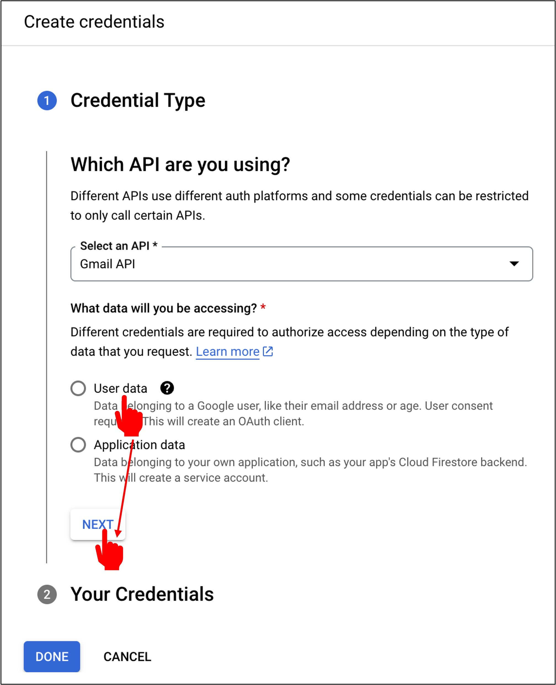
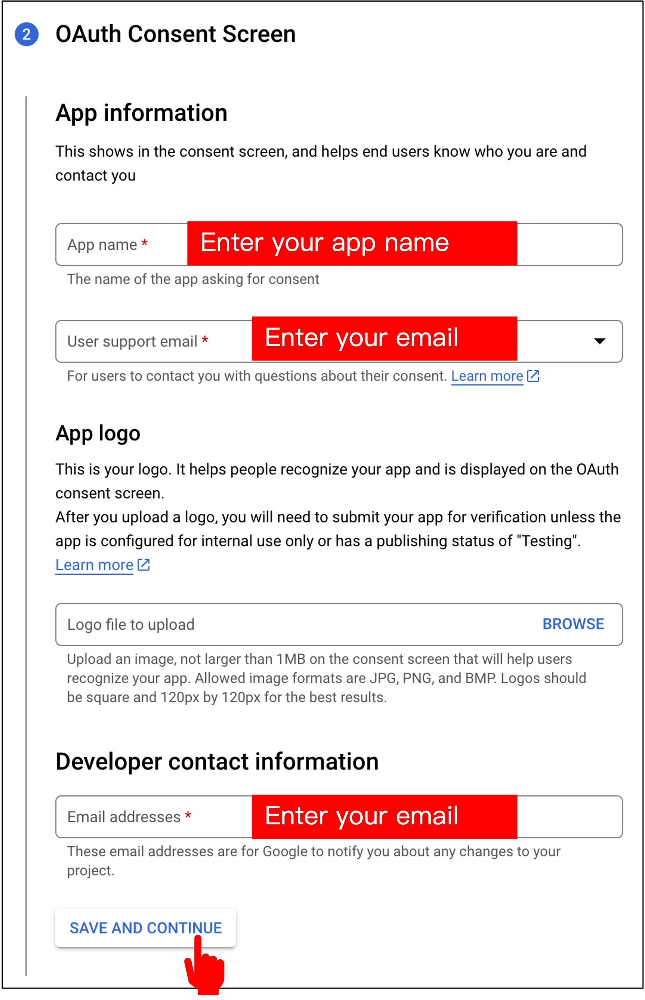
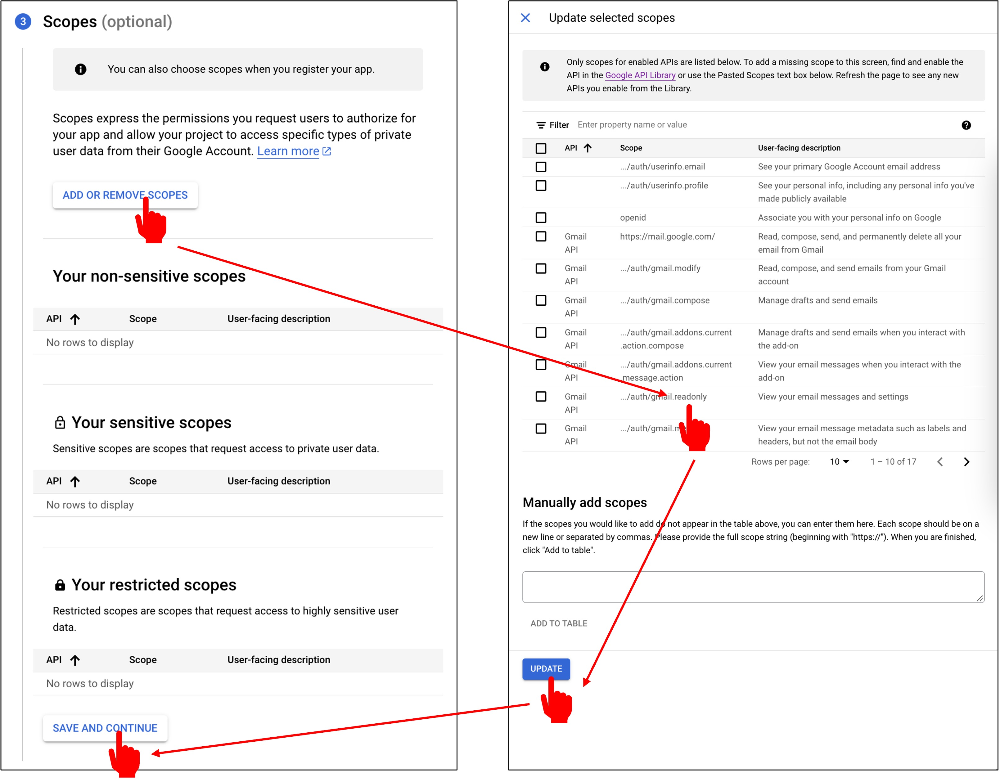

# Gmail API Credentials

After initiating the Gmail API, you'll immediately see the system prompting you to apply for credentials. Let's proceed.

## Applying for Credentials

Click on "Create credentials".

The first step is to set the credential type. We choose "User Data" and then click "Next".

Next is the OAuth Consent Screen. Here, input your preferred application name and your email, then click "Save and Continue".

:::warning
The last developer contact information is how Google will reach you if there are issues. If you enter it incorrectly, you might miss important notifications.
:::

Next is "Scopes". Here, select "Add or Remove Scopes", choose the "ReadOnly" permission, and then click "Update".

Next is "OAuth Client ID". Here, select "Desktop App", and then click "Create".

Once the credentials application is complete, click "Download", and then click "Done".

The downloaded credential is a JSON file. We'll name it `credentials.json` and place it in the project's root directory.

## Setting up OAuth 2.0

After completing the setup, go back to the Gmail API page and click "OAuth consent screen".

Since we only need to access our own Gmail, there's no need for publishing; just add test users.

With this, we've completed the setup for Gmail API credentials.
