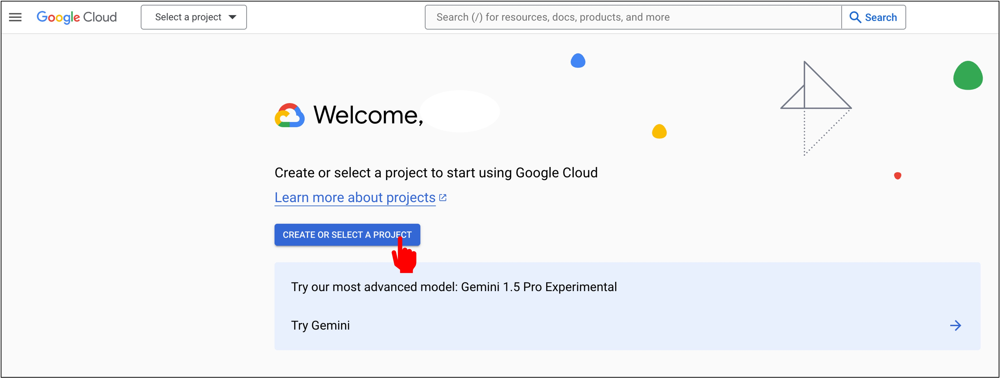
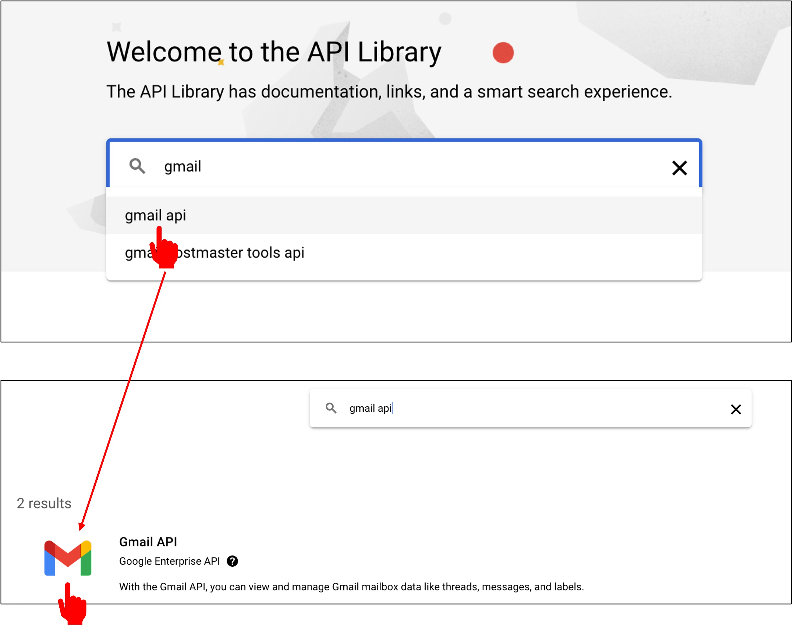

# Gmail API Activation

This is a time-sensitive section as the usage of Gmail API might change with updates from Google.

While reading, please make sure to refer to the latest official documentation: [**Gmail API**](https://developers.google.com/gmail/api).

## Overview

Gmail API is a RESTful application interface that allows developers to access Gmail mailboxes and send emails. For most web applications, Gmail API offers authorized access to user Gmail data, making it suitable for various application scenarios such as:

- Read-only mode for email extraction, indexing, and backup
- Automated or programmatic message sending
- Mail account migration
- Mail organization including filtering and sorting messages
- Standardizing email signatures across an organization

:::warning
Gmail API should not be used to replace IMAP for developing full-fledged email clients. Instead, for full-fledged email client development, refer to IMAP, POP, and SMTP standards.
:::

Common terms used in Gmail API include:

- **Message**: An email message containing sender, recipients, subject, and body. Once created, a message cannot be altered. Each message is represented by a message resource.
- **Thread**: A collection of related messages forming a conversation. In email client applications, when one or more recipients reply to a message with their own messages, a thread is formed.
- **Label**: Mechanism used for organizing messages and threads. For example, you can create a label "Tax" and apply it to all messages and threads related to user taxes. Labels are divided into two categories:
  - **System labels**: Labels created internally, such as Inbox, Trash, or Spam. These labels cannot be deleted or modified. However, certain system labels, like Inbox, can be applied to or removed from messages and threads.
  - **User labels**: Labels created by users. These labels can be deleted or modified by users or applications. User labels are represented by label resources.
- **Draft**: An unsent message. Messages in drafts can be replaced. Sending a draft will automatically delete it and create a message with the Sent system label. Drafts are represented by draft resources.

## Signing In

Before getting started, make sure you have a [**Google Cloud**](https://cloud.google.com/) account.

Next, you'll need to create a project in the Google Cloud Console. Click on "Console".

## Creating a Project

Once in the Console, click on "Create Project".

Then click on "Create a new project".

Enter a project name and click on "Create".

## Enabling Gmail API

After the project is created, select it from the main menu.

Then you'll enter a dashboard. Click on "APIs & Services".

Next, click on "Enable APIs and Services".

Type "Gmail" in the search box and click on "Gmail API".

Click on "Enable".

With that, you've successfully enabled the Gmail API.

