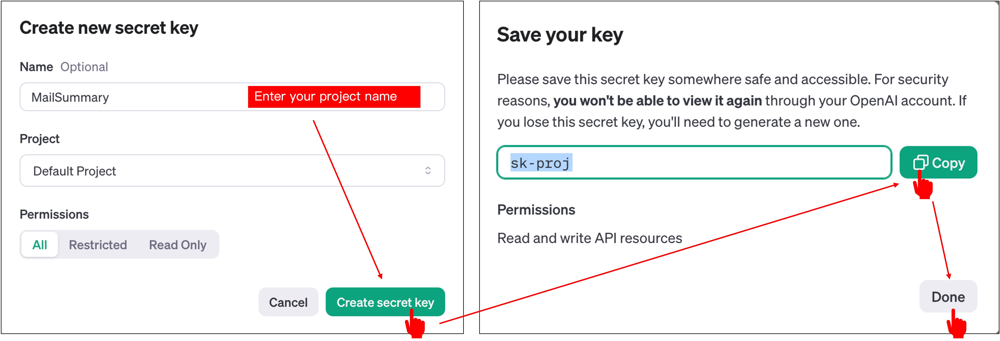

# OpenAI API Activation

In this chapter, we'll register an account on the [OpenAI API](https://platform.openai.com/docs/overview) website and obtain an API key.

:::info
The services provided by OpenAI, such as ChatGPT for text input and GPT via API, are different systems! Even if you're using the paid version of ChatGPT, you'll still need to pay separately for API calls!
:::

## Registering an Account

This part is simpler compared to setting up the Gmail API. Just follow the instructions on the official website to register.

## Obtaining an API Key

After registration, navigate to the "API Keys" section in the sidebar, then click on "Create new secret key".

Choose a name you like for the key, then click "Create".

You'll then see your API key. Copy it down; you'll use this key in your project.

## Ready to Use?

Not quite yet! You need to pay first.

Click on "Billing", and then you can choose how much money (in USD) you want to deposit. This money will be used for your API calls.

That's it! You've completed the registration and activation process for the OpenAI API. Now, you can start using the OpenAI API!