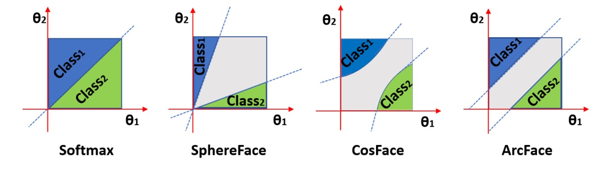

# CIFAR-100

## Sleepless Nights of Overfitting

This project provides a concise PyTorch training example using the CIFAR-100 image classification task, allowing beginners to quickly get started. It also includes flexible adjustment and extension sample code, making it easier for you to adapt to different experimental needs.

Without further ado, let's get started.

:::info
The code for this project is available on GitHub: [**cifar100_training_demo**](https://github.com/DocsaidLab/cifar100_training_demo).
:::

## Download This Project

The initial preparation is complete. Please use the following command to get the code:

```bash
git clone https://github.com/DocsaidLab/cifar100-training-demo.git
```

## Build the Training Environment (Ubuntu 22.04/24.04)

:::tip
**Why Use Docker?**

1. **Consistency**: Ensures "it works on my machine, it works on yours."
2. **No Pollution**: All dependencies are packaged inside the image, so it won't mess up your existing Python/conda setup.
3. **Easy Reproducibility**: If something goes wrong, `docker rm` + `docker run` resets the entire environment instantly.
   (If you are more familiar with venv/conda, you can set up the environment yourself; this project primarily uses Docker.)
   :::

### Setting Up Docker Environment

This section is detailed in our basic toolbox project. Please refer to:

- [**Docsaid Capybara #Advanced**](https://docsaid.org/en/docs/capybara/advance)

### Download and Build the Image

```bash
cd cifar100-training-demo
bash docker/build.bash
```

- Base image: `nvcr.io/nvidia/pytorch:25.03-py3`
- Version details: [**PyTorch Release 25.03**](https://docs.nvidia.com/deeplearning/frameworks/pytorch-release-notes/rel-25-03.html#rel-25-03)
- The first build downloads about \~20 GB and takes roughly 5–20 minutes, depending on your internet speed.

After completion, you can verify the image with:

```bash
docker images | grep cifar100_train
```

## Constructing the Dataset

In PyTorch, the CIFAR-100 dataset is already built into `torchvision`, so we can use it directly:

```python
from torchvision.datasets import CIFAR100

train_dataset = CIFAR100(root='data/', train=True, download=True)
test_dataset = CIFAR100(root='data/', train=False, download=True)
```

But wait!

Since this is for practice, why not try downloading and constructing the dataset yourself? This way, you can better control the data processing flow.

First, download the CIFAR-100 dataset from the official website and unzip it:

```bash
wget https://www.cs.toronto.edu/\~kriz/cifar-100-python.tar.gz
tar xvf cifar-100-python.tar.gz
```

After running this, you will see a folder named `cifar-100-python` in your working directory containing training and testing data.

The folder structure looks roughly like this:

```text
cifar-100-python/
├── train
├── test
├── meta
└── file.txt~
```

These are not image files but Python pickle files packed for easy loading. Therefore, when using them, we need to load the data with the `pickle` module.

## Writing the Dataset Class

Once you have the dataset, we need to write a PyTorch dataset class to read this data.

Here is a simple implementation of a `CIFAR100DatasetSimple` class:

```python
import pickle

import capybara as cb
import numpy as np

DIR = cb.get_curdir(__file__)

class CIFAR100DatasetSimple:

    def __init__(
        self,
        root: str=None,
        mode: str='train',
        image_size: int=32,
        return_tensor: bool=False,
        image_aug_ratio: float=0.5,
    ):

        if mode not in ['train', 'test']:
            raise ValueError("mode must be either 'train' or 'test'")

        if root is None:
            self.root = DIR / 'cifar-100-python'
        else:
            self.root = root

        self.image_size = image_size
        self.return_tensor = return_tensor

        # Load data file
        with open(f'{self.root}/{mode}', 'rb') as f:
            data = pickle.load(f, encoding='bytes')
            self.images = data[b'data']
            self.labels = data[b'fine_labels']
            self.filenames = data[b'filenames']

        # reshape: (N, 3, 32, 32)
        self.images = self.images.reshape(-1, 3, 32, 32)

    def __len__(self):
        return len(self.labels)

    def __getitem__(self, idx):
        img = self.images[idx]
        label = self.labels[idx]

        img = np.transpose(img, (1, 2, 0))  # (C, H, W) -> (H, W, C)
        img = cb.imresize(img, size=self.image_size)

        if self.return_tensor:
            img = np.transpose(img, (2, 0, 1))  # (H, W, C) -> (C, H, W)
            img = img.astype(np.float32) / 255.  # Simple normalization to [0, 1]
            label = np.array(label, dtype=np.int64)
            return img, label

        return img, label
```

This class has several features:

1. You can specify the output image size (`image_size`), default is 32.
2. You can choose whether to convert images to PyTorch Tensor format (`return_tensor`).
3. You can specify the dataset mode (`mode`), either training (`train`) or testing (`test`).

More complex features can be added later. For now, let's train the first baseline model.

## First Model: Acc = 44.26%

You can find some preset configuration files in the `config` folder. We use these config files to control the training process. The first config file we use is `resnet18_baseline.yaml`, which uses the well-known ResNet-18 as the base model.

Before training, go back to the parent directory:

```bash
cd ..
```

Then you can start training with the following command:

```bash
bash cifar100-training-demo/docker/train.bash resnet18_baseline
```

Since this is the first model, let's take a close look at the parameter configuration.

### Key Configuration Explanation

In `config/resnet18_baseline.yaml`, the main configurations are as follows:

1. **Batch Size**: Set to 250, which evenly divides the 50,000 training samples, simplifying the training cycle.

   :::tip
   Generally, we choose batch sizes that are multiples of 32 to better utilize GPU computing resources. However, since we are working with a small dataset, we can ignore this constraint and directly use 250. This way, each epoch only requires 200 iterations (50,000 / 250 = 200).
   :::

2. **Image Size**: Set to 32, matching the original CIFAR-100 image size. Unless otherwise specified, this size will be used in subsequent experiments.

3. **Model Configuration**

   ```yaml
   model:
     name: CIFAR100ModelBaseline
     backbone:
       name: Backbone
       options:
         name: timm_resnet18
         pretrained: False
         features_only: True
     head:
       name: Baseline
       options:
         num_classes: 100
   ```

   - Uses `timm_resnet18` without pretrained weights (`pretrained=False`), making it easier to understand the model’s learning process from scratch.
   - The `Baseline` head converts backbone outputs into predictions for 100 classes.

4. **Training Epochs**: Set to 200. Multiple trials showed minimal improvement beyond 200 epochs.

5. **Optimizer**: Uses `AdamW` with a learning rate (`lr`) of 0.001, yielding relatively stable overall training performance.

6. **Weight Decay**: Set to 0.0001; since the small model already has some inherent regularization, this value is moderately low.

---

Ultimately, this model reached 44.26% test accuracy at epoch 186.

However, the training accuracy already hit 100%, which is a classic sign of overfitting.

## Adjusting Training Hyperparameters

“Overfitting” means the model memorizes the training data perfectly but fails to generalize to other data.

This phenomenon is especially common on small datasets like CIFAR-100 because of many classes but few samples; the model easily memorizes details instead of learning general rules.

### Common solutions include:

1. **Reducing Model Capacity**: Use a smaller model to lower the risk of overfitting.
2. **Data Augmentation**: Random cropping, flipping, brightness adjustment, etc., so the model sees more diverse images and improves generalization.
3. **Regularization**: Apply Dropout, Weight Decay, and other techniques to keep the model “restrained” during learning.
4. **Early Stopping**: Stop training early when validation accuracy stops improving to avoid overfitting.
5. **Using Pretrained Models**: If allowed, fine-tune models pretrained on large datasets (e.g., ImageNet) instead of training from scratch.
6. **Adjust Learning Rate and Batch Size**: Both overly high or low learning rates and batch sizes can destabilize training.

---

We won’t discuss Early Stopping here; we simply run all 200 epochs and report the best score.

Data augmentation is a common technique, so let’s try that next.

## Data Augmentation: Acc = 36.48%

We try improving the model’s generalization using data augmentation.

Here we introduce the `albumentations` library and apply some basic augmentations:

```python
import albumentations as A

class DefaultImageAug:

    def __init__(self, p=0.5):
        self.aug = A.OneOf([
            A.ShiftScaleRotate(),
            A.CoarseDropout(),
            A.ColorJitter(),
            A.HorizontalFlip(),
            A.VerticalFlip(),
        ], p=p)

    def __call__(self, img: np.ndarray):
        img = self.aug(image=img)['image']
        return img
```

The selected augmentations include:

- **ShiftScaleRotate**: Randomly translate, scale, and rotate the image.
- **CoarseDropout**: Randomly mask parts of the image to simulate missing data.
- **ColorJitter**: Randomly adjust brightness, contrast, and saturation.
- **HorizontalFlip**: Random horizontal flip.
- **VerticalFlip**: Random vertical flip.

Experience shows these augmentations effectively improve model generalization.

Then, we add this augmentation to `config/resnet18_augment.yaml`:

```yaml
dataset:
  train_options:
    name: CIFAR100AugDataset
    options:
      mode: train
      return_tensor: True
      image_aug_ratio: 1.0
  valid_options:
    name: CIFAR100AugDataset
    options:
      mode: test
      return_tensor: True
```

However, the result was disappointing.

The test accuracy dropped to only 36.48%, much lower than the previous 44.26%.

This is because, for low-resolution 32×32 images like CIFAR-100, applying too strong augmentations at once (e.g., ±45° rotation, large occlusions, or vertical flips) severely distorts the original semantics, preventing the model from stably learning basic features.

## Strong Regularization: Acc = 40.12%

Next, we try improving generalization via regularization.

Generally, CNNs already have some built-in regularization due to convolution’s translation invariance and parameter sharing. Compared to Transformers, which tend to overfit early in training, CNNs usually don’t require strong extra regularization.

Still, we give it a try.

We increase `weight_decay` to 0.1 to observe its effect on learning and generalization.

In `config/resnet18_baseline_wd01.yaml`, modify `weight_decay`:

```yaml
optimizer:
  name: AdamW
  options:
    lr: 0.001
    betas: [0.9, 0.999]
    weight_decay: 0.1
    amsgrad: False
```

As expected, test accuracy dropped to 40.12%, below the original 44.26%.

This reflects a common phenomenon:

- For small datasets like CIFAR-100, overly strong regularization can suppress the model’s ability to fit the training distribution sufficiently, causing it to converge prematurely before learning discriminative features, ultimately hurting generalization.

## Label Smoothing: Acc = 44.81%

Now we try Label Smoothing to improve generalization.

Label Smoothing converts one-hot class labels into smoothed distributions to reduce overfitting.

We configure this in `config/resnet18_baseline_lbsmooth.yaml`:

It’s simple to use—just add `label_smoothing` to the loss function:

```python
loss_fn = nn.CrossEntropyLoss(label_smoothing=0.1)
```

Experiment results show the model reached 44.81% test accuracy at epoch 59, surpassing the previous 44.26%, and achieving this accuracy more than 100 epochs earlier.

This shows Label Smoothing effectively reduces overfitting and improves generalization for this task.

## Ultimately, Data Is Still Insufficient

By this point in the experiments, we can draw a realistic conclusion:

> **Some problems cannot be solved by model design or hyperparameter tuning alone.**

Take CIFAR-100 as an example: although it has a decent number of samples, the resolution is low, semantic information is sparse, and each class has limited samples. These data characteristics make it difficult for the model to learn discriminative features with strong generalization ability.

From a practical perspective, the most direct solution is: **increase the data.**

However, data collection is often a costly endeavor.

In many application scenarios, data is hard to obtain, and labeling is time-consuming and labor-intensive. This has long been a core bottleneck for deep learning deployment. Therefore, a more common and pragmatic choice in practice is: **Transfer Learning**.

Through transfer learning, we do not need to train a model from scratch. Instead, we leverage models pretrained on large-scale datasets (such as ImageNet) as backbones, then fine-tune them on the target task.

This strategy has multiple advantages:

- **Faster Convergence**: Initial weights already contain semantic features, helping the model quickly find a learning direction.
- **Improved Performance**: Even with limited target data, the model can fully utilize general representations.
- **Reduced Overfitting**: Pretrained models provide a stable starting point, resulting in better generalization.

Next, we will test using pretrained models provided by `timm` to see how this works in practice.

:::info
**What is timm?**

This package is well-known in the deep learning community.

`timm` is a PyTorch model library that offers a large collection of pretrained models and utilities, enabling users to quickly implement various deep learning tasks. It includes many state-of-the-art model architectures and training techniques, especially suitable for image classification, object detection, and related tasks.

- [**Timm GitHub**](https://github.com/huggingface/pytorch-image-models)
  :::

## Pretrained Weights: Acc = 56.70%

Continuing from the Baseline settings, we temporarily avoid using `label_smoothing` or other regularization techniques, focusing solely on the backbone’s pretrained weights.

This time, we use the `resnet18_pretrained.yaml` configuration file, where the main adjustment is in the backbone section by setting `pretrained` to `True` to enable ImageNet pretrained weights.

```yaml
model:
  name: CIFAR100ModelBaseline
  backbone:
    name: Backbone
    options:
      name: timm_resnet18
      pretrained: True
      features_only: True
  head:
    name: Baseline
    options:
      num_classes: 100
```

At epoch 112, the model achieved 56.70% accuracy on the test set, an improvement of **12.44%** compared to the original 44.26%.

This is a significant effect and more effective than all previous hyperparameter tuning tricks!

However, transfer learning is not a panacea. When the pretrained data and target task differ greatly, the model may fail to transfer effectively and even cause so-called "**Negative Transfer**." For example, applying an image pretrained model to natural language tasks yields almost no positive benefit.

In our case, CIFAR-100 is a standard image classification task closely related to ImageNet’s context, so transfer learning performs quite well.

## Margin Loss: Acc = 57.92%

At this point, our strategy must shift.

If relying on the conventional cross-entropy loss no longer improves accuracy, we can try **actively increasing training difficulty** to force the model to learn more discriminative feature representations. This is exactly the problem Margin Loss addresses.

### Why Margin?

In traditional classification, cross-entropy encourages the model to raise the logit score of the correct class but **does not enforce a sufficient margin (gap) between the correct and incorrect class scores**. In other words, as long as the correct class is highest, it doesn’t matter by how much.

While sufficient for classification, this design often leads to ambiguous decision boundaries and unstable generalization when samples are close, data noisy, or classes similar.

Margin Loss is designed to solve this:

> **Not only be correct, but be confidently correct.**

### What is Margin Loss?

The core idea of Margin Loss is:

> **In logit or feature space, increase the distance between positive and negative samples while reducing intra-class variance.**

Common Margin Losses include:

- **Large Margin Softmax (L-Softmax)**
- **ArcFace / CosFace / SphereFace**
- **Triplet Loss / Contrastive Loss**

These methods typically add an angular or magnitude margin before softmax, encouraging embeddings with clearer class boundaries. Below is a conceptual illustration of angular margin:



The figure shows Margin Loss pulling features of the same class closer and pushing different classes farther apart, improving classification confidence and stability.

### Relation to Geometric Space

When implementing these losses, features are often projected onto a unit hypersphere by applying L2 normalization, constraining embeddings to lie on a sphere of radius 1.

Benefits include:

- **Removing feature length interference to focus on direction (angle)**
- **Easier to control margin’s effect on angle**
- **Mathematically converting classification to an angular classification problem**

Hence, many Margin-based methods apply margin on cosine similarity rather than raw logits.

### Experimental Results

Using the pretrained ResNet-18 backbone, we add Margin Loss settings in `config/resnet18_pretrained_arcface.yaml`.

We tested two implementations, `ArcFace` and `CosFace`, with different margin settings.

```python
class ArcFace(nn.Module):

    def __init__(self, s=64.0, m=0.5):
        super(ArcFace, self).__init__()
        self.s = s
        self.margin = m
        self.cos_m = math.cos(m)
        self.sin_m = math.sin(m)
        self.theta = math.cos(math.pi - m)
        self.sinmm = math.sin(math.pi - m) * m
        self.easy_margin = False

    def forward(self, logits: torch.Tensor, labels: torch.Tensor):
        index = torch.where(labels != -1)[0]
        target_logit = logits[index, labels[index].view(-1)]
        with torch.no_grad():
            target_logit.arccos_()
            logits.arccos_()
            final_target_logit = target_logit + self.margin
            logits[index, labels[index].view(-1)] = final_target_logit
            logits.cos_()
        logits = logits * self.s
        return logits


class CosFace(nn.Module):

    def __init__(self, s=64.0, m=0.40):
        super(CosFace, self).__init__()
        self.s = s
        self.m = m

    def forward(self, logits: torch.Tensor, labels: torch.Tensor):
        index = torch.where(labels != -1)[0]
        logits[index, labels[index].view(-1)] -= self.m
        logits *= self.s
        return logits
```

After several experiments, we found little difference in performance between them, but ArcFace scored slightly higher.

Therefore, we report ArcFace results: at epoch 199, the model achieved 57.92% accuracy on the test set. This is a 1.22% improvement over the standard Softmax loss.

This shows Margin Loss has real value in enhancing the model’s discriminative power, especially when classes are similar, effectively reducing overfitting and improving generalization.

## Enlarged Input Images: Acc = 79.57%

Maintaining the Margin Loss settings, we next try enlarging the input image size to see if accuracy can be further improved.

In `config/resnet18_pretrained_arcface_224x224.yaml`, we set `image_size` to 224:

```yaml
global_settings:
  image_size: [224, 224]
```

With larger input images, the test set accuracy reached a peak of 79.57% at epoch 29, improving **21.65%** over the previous 57.92%.

This result is surprising:

- **Simply enlarging the original $32 \times 32$ images to $224 \times 224$ can greatly boost model performance?**

Reasons include:

1. **Resolution Aligned with Pretraining Habits**

   ResNet-50 and most ImageNet models are pretrained on $224 \times 224$ inputs. Feeding $32 \times 32$ directly means convolution kernels “see through” the entire image at once, compressing hierarchical features and making details indistinguishable. Enlarging resolution lets convolutions extract textures and local structures at appropriate receptive fields.

2. **Spatial Sampling Points Greatly Increase**

   $32^2$ → $224^2$ means a **49-fold** increase in pixels. Even after bilinear interpolation smoothing, the model captures more edges, textures, and color distributions, enhancing discriminative signals.

3. **Avoid Early Signal Distortion and Aliasing**

   At low resolution, object details are averaged out by multiple stride/pooling layers; enlarging images preserves key features before downsampling. Higher resolution reduces improper folding of high-frequency signals caused by convolution strides, maintaining feature stability.

---

Although accuracy significantly improves, some issues remain.

First, computation greatly increases: training time rises from about 3 minutes to roughly 2 hours (on RTX 4090).

Second, the model reaches about 80% accuracy within the first 30 epochs, indicating it learns most features early on. Subsequent gains are minor, suggesting the dataset information is largely exhausted, and further hundreds of epochs yield little new value.

## Enlarged Model Capacity: Acc = 61.76%

What if we keep the input image size the same but increase the model capacity?

Generally, larger models can theoretically learn richer features but are also more prone to overfitting.

Since we introduced Margin Loss earlier, which should reduce overfitting risk, we can try increasing the model capacity. Here, we use the `resnet50_pretrained_arcface.yaml` config, changing the backbone to ResNet-50 while keeping the input image size at 32×32.

```yaml
model:
  name: CIFAR100ModelMargin
  backbone:
    name: Backbone
    options:
      name: timm_resnet50
      pretrained: True
      features_only: True
  head:
    name: MarginHead
    options:
      hid_dim: 512
      num_classes: 100
```

Training results show that at epoch 199, the model reached 61.76% test accuracy—an improvement of 3.84% over the previous 57.92%—at the cost of nearly doubling the number of parameters.

This suggests that when input size cannot be increased, enlarging model capacity still effectively boosts performance, especially with Margin Loss helping the model better learn class boundaries.

## Enlarged Input Image: Acc = 81.21%

Finally, we enlarged both the model and the input image size to see if further gains are possible.

In `config/resnet50_pretrained_arcface_224x224.yaml`, we set `image_size` to 224:

```yaml
global_settings:
  image_size: [224, 224]
```

With larger input images, the model reached over 80% accuracy within the first five epochs, ultimately achieving 81.21% test accuracy at epoch 174.

This is close to the ResNet-18 + 224×224 result but with nearly double the parameters. Evidently, this dataset has reached a saturation point where increasing model capacity no longer brings significant performance gains.

## Knowledge Distillation: Acc = 57.37%

Keeping ResNet-18 and input size at 32×32, to further improve performance, knowledge distillation (KD) can be applied to transfer the discriminative ability learned by a large teacher model trained at high resolution to a lightweight student model.

The core idea is to use the teacher model’s learned knowledge during training to guide the student model, improving its generalization and convergence efficiency.

Unlike traditional supervised learning, KD not only relies on hard labels (ground truth) but also uses the teacher’s output probability distributions (soft labels) as additional supervision. These soft labels encode relative relationships between classes, helping the student learn a more discriminative feature space.

The distillation loss is defined as:

$$
\mathcal{L}_{\text{distill}} = (1 - \alpha)\,\mathcal{L}_{\text{CE}}(y, p_s) + \alpha T^2 \cdot \mathrm{KL}(p_t^{(T)} \,||\, p_s^{(T)})
$$

- $\mathcal{L}_{\text{CE}}$: Cross-entropy loss between student predictions and true labels.
- $\mathrm{KL}$: Kullback–Leibler divergence between teacher and student probability distributions at temperature $T$.
- $\alpha$: Balancing factor between true labels and distillation signal (commonly 0.5–0.9).
- $T$: Temperature parameter, which smooths logits to highlight inter-class differences.

---

In this experiment, the teacher model is a ResNet-50 pretrained and trained on 224×224 inputs, and the student model is ResNet-18 with the original CIFAR-100 size 32×32. The teacher is frozen during training, providing soft labels as auxiliary supervision only.

Training architecture and flow:

<div align="center">
<figure style={{ "width": "60%"}}>

</figure>
</div>

1. Pretrain the teacher model and obtain its logit outputs.
2. Apply softmax with temperature on both teacher and student logits to get soft labels.
3. Train the student model using the KD loss.
4. During deployment, only keep the student model; the teacher is not involved.

### Experimental Results

In `config/resnet18_pretrained_arcface_kd.yaml`, KD parameters are set. We load the pretrained ResNet-50 teacher model trained with 224×224 inputs:

```yaml
common:
  batch_size: 250
  image_size: [32, 32]
  is_restore: True
  restore_ind: "2025-05-26-00-49-22"
  restore_ckpt: "epoch=177-step=35600.ckpt"
  preview_batch: 1000
```

Results show accuracy around 57.37%, similar to Margin Loss baseline.

The teacher model was not as helpful as expected on this dataset.

Possible reasons include:

1. **Insufficient Student Capacity**: ResNet-18’s representational space is much smaller than ResNet-50’s, and mimicking the teacher’s fine-grained decision boundaries may be too challenging.
2. **Input Resolution Gap**: The teacher was trained on 224×224 inputs, but the student only sees 32×32, making it hard for the student to capture teacher-learned features.

There may be other factors, but these two are the main considerations.

## Experiment and Results Summary

Below is a table summarizing each experiment’s configuration and final accuracy on the CIFAR-100 test set:

<div style={{
  whiteSpace: 'nowrap',
  overflowX: 'auto',
  fontSize: '1rem',
  lineHeight: '0.8',
  justifyContent: 'center',
  display: 'flex',
}}>

| Config File                                | Accuracy | Description                                                                       |
| ------------------------------------------ | -------- | --------------------------------------------------------------------------------- |
| `resnet18_baseline.yaml`                   | 44.26%   | ResNet-18, no pretraining, AdamW (lr=0.001), WD=0.0001                            |
| `resnet18_augment.yaml`                    | 36.48%   | Added Albumentations data augmentation (rotation, dropout, flips)                 |
| `resnet18_baseline_wd01.yaml`              | 40.12%   | ResNet-18, no pretraining, weight decay set to 0.1                                |
| `resnet18_baseline_lbsmooth.yaml`          | 44.81%   | ResNet-18, no pretraining, label smoothing=0.1                                    |
| `resnet18_pretrained.yaml`                 | 56.70%   | ResNet-18, **with ImageNet pretrained weights**                                   |
| `resnet18_pretrained_arcface.yaml`         | 57.92%   | ResNet-18 pretrained + Margin Loss (ArcFace)                                      |
| `resnet18_pretrained_arcface_224x224.yaml` | 79.57%   | ResNet-18 pretrained + Margin Loss, input enlarged to 224 × 224                   |
| `resnet50_pretrained_arcface.yaml`         | 61.76%   | ResNet-50 pretrained + Margin Loss, input size remains 32 × 32                    |
| `resnet50_pretrained_arcface_224x224.yaml` | 81.21%   | ResNet-50 pretrained + Margin Loss, 224 × 224 input                               |
| `resnet18_pretrained_arcface_kd.yaml`      | 57.37%   | Knowledge Distillation (Teacher: ResNet-50 224 × 224; Student: ResNet-18 32 × 32) |

</div>

## And More

So far, we focused on experiments based on ResNet-18 with fixed input size 32×32.

However, improving CIFAR-100 accuracy is not limited to these approaches. In fact, the [Paper with Code](https://paperswithcode.com/sota/image-classification-on-cifar-100) leaderboard shows top CIFAR-100 results exceeding 96%.

These models often combine several strategies such as:

- Using large-scale Vision Transformer (ViT) architectures or custom CNNs
- High-resolution inputs
- Pretrained transfer learning and advanced augmentation techniques (e.g., RandAugment, MixUp, CutMix)
- Longer training schedules with Cosine Annealing or One-Cycle learning rate policies
- Modern regularization methods like Label Smoothing and Sharpness-Aware Minimization
- Multi-model distillation and ensemble methods for final inference

These techniques may not be feasible for every development scenario, especially in resource-constrained deployments. But one clear takeaway is:

> **Performance limits stem from the overall training strategy design, not just the model itself.**

If you are also using CIFAR-100 for experiments, don’t hesitate to try different architectures and strategy combinations.

Finally, wishing you great success and joy on your deep learning journey!
