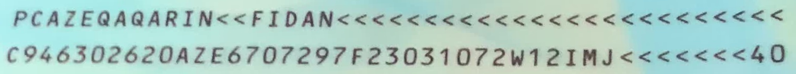

# Advanced Settings

When calling the `MRZScanner` model, you can pass parameters to configure advanced settings.

## Initialization

The following are the advanced setting options during the initialization phase:

### 1. Backend

Backend is an enumeration type used to specify the computation backend of the `MRZScanner`.

It includes the following options:

- **cpu**: Use the CPU for computation.
- **cuda**: Use the GPU for computation (requires appropriate hardware support).

```python
from capybara import Backend

model = MRZScanner(backend=Backend.cuda) # Use CUDA backend
#
# Or
#
model = MRZScanner(backend=Backend.cpu) # Use CPU backend
```

We use ONNXRuntime as the inference engine for the model. Although ONNXRuntime supports multiple backend engines (including CPU, CUDA, OpenCL, DirectX, TensorRT, etc.), we have made a slight encapsulation to simplify usage. Currently, we provide only the CPU and CUDA backend engines. Additionally, using CUDA computation requires both appropriate hardware support and the installation of the corresponding CUDA drivers and toolkit.

If CUDA is not installed on your system, or the installed version is incorrect, you will not be able to use the CUDA computation backend.

:::tip

1. If you have other needs, please refer to the [**ONNXRuntime official documentation**](https://onnxruntime.ai/docs/execution-providers/index.html) for customization.
2. For installation-related issues, please refer to the [**ONNXRuntime Release Notes**](https://onnxruntime.ai/docs/execution-providers/CUDA-ExecutionProvider.html#requirements).
   :::

### 2. ModelType

ModelType is an enumeration type used to specify the model type used by `MRZScanner`.

Currently, the following options are available:

- **spotting**: Uses an end-to-end model architecture and loads a single model.
- **two_stage**: Uses a two-stage model architecture and loads two models.
- **detection**: Loads only the detection model for MRZ.
- **recognition**: Loads only the recognition model for MRZ.

You can specify the model to use through the `model_type` parameter.

```python
from mrzscanner import MRZScanner

model = MRZScanner(model_type=MRZScanner.spotting)
```

### 3. ModelCfg

You can view all available models using `list_models`.

```python
from mrzscanner import MRZScanner

print(MRZScanner().list_models())
# {
#    'spotting': ['20240919'],
#    'detection': ['20250222'],
#    'recognition': ['20250221']
# }
```

Select the version you want and specify the model to use with parameters such as `spotting_cfg`, `detection_cfg`, `recognition_cfg`, etc., along with `ModelType`.

1. **spotting**:

   ```python
   model = MRZScanner(
      model_type=ModelType.spotting,
      spotting_cfg='20240919'
   )
   ```

2. **two_stage**:

   ```python
   model = MRZScanner(
      model_type=ModelType.two_stage,
      detection_cfg='20250222',
      recognition_cfg='20250221'
   )
   ```

3. **detection**:

   ```python
   model = MRZScanner(
      model_type=ModelType.detection,
      detection_cfg='20250222'
   )
   ```

4. **recognition**:

   ```python
   model = MRZScanner(
      model_type=ModelType.recognition,
      recognition_cfg='20250221'
   )
   ```

You may also choose not to specify, as we have already configured default versions for each model.

## ModelType.spotting

This model is an end-to-end model that directly detects the position of the MRZ and performs recognition. The downside is that its accuracy is relatively lower and it does not return the coordinates of the MRZ.

Example usage:

```python
import cv2
from skimage import io
from mrzscanner import MRZScanner, ModelType

# Create the model
model = MRZScanner(
   model_type=ModelType.spotting,
   spotting_cfg='20240919'
)

# Read image from URL
img = io.imread('https://github.com/DocsaidLab/MRZScanner/blob/main/docs/test_mrz.jpg?raw=true')
img = cv2.cvtColor(img, cv2.COLOR_RGB2BGR)

# Model inference
result = model(img, do_center_crop=True, do_postprocess=False)

# Output results
print(result)
# {
#    'mrz_polygon': None,
#    'mrz_texts': [
#        'PCAZEQAOARIN<<FIDAN<<<<<<<<<<<<<<<<<<<<<<<<<',
#        'C946302620AZE6707297F23031072W12IMJ<<<<<<<40'
#    ],
#    'msg': <ErrorCodes.NO_ERROR: 'No error.'>
# }
```

## ModelType.two_stage

This model is a two-stage model that first detects the position of the MRZ and then performs recognition. The advantage is higher accuracy, and it also returns the coordinates of the MRZ.

Example usage, where we can also draw the MRZ's position:

```python
import cv2
from skimage import io
from mrzscanner import MRZScanner, ModelType

# Create the model
model = MRZScanner(
   model_type=ModelType.two_stage,
   detection_cfg='20250222',
   recognition_cfg='20250221'
)

# Read image from URL
img = io.imread('https://github.com/DocsaidLab/MRZScanner/blob/main/docs/test_mrz.jpg?raw=true')
img = cv2.cvtColor(img, cv2.COLOR_RGB2BGR)

# Model inference
result = model(img, do_center_crop=True, do_postprocess=False)

# Output results
print(result)
# {
#     'mrz_polygon':
#         array(
#             [
#                 [ 158.536 , 1916.3734],
#                 [1682.7792, 1976.1683],
#                 [1677.1018, 2120.8926],
#                 [ 152.8586, 2061.0977]
#             ],
#             dtype=float32
#         ),
#     'mrz_texts': [
#         'PCAZEQAQARIN<<FIDAN<<<<<<<<<<<<<<<<<<<<<<<<<',
#         'C946302620AZE6707297F23031072W12IMJ<<<<<<<40'
#     ],
#     'msg': <ErrorCodes.NO_ERROR: 'No error.'>
# }

# Draw the MRZ's position
from capybara import draw_polygon, imwrite, centercrop

poly_img = draw_polygon(img, result['mrz_polygon'], color=(0, 0, 255), thickness=5)
imwrite(centercrop(poly_img))
```

<div align="center" >
<figure style={{width: "70%"}}>

</figure>
</div>

## ModelType.detection

This model only detects the position of the MRZ and does not perform recognition.

Example usage:

```python
import cv2
from skimage import io
from mrzscanner import MRZScanner, ModelType

# Create the model
model = MRZScanner(
   model_type=ModelType.detection,
   detection_cfg='20250222',
)

# Read image from URL
img = io.imread('https://github.com/DocsaidLab/MRZScanner/blob/main/docs/test_mrz.jpg?raw=true')
img = cv2.cvtColor(img, cv2.COLOR_RGB2BGR)

# Model inference
result = model(img, do_center_crop=True)

# Output results
print(result)
# {
#     'mrz_polygon':
#         array(
#             [
#                 [ 158.536 , 1916.3734],
#                 [1682.7792, 1976.1683],
#                 [1677.1018, 2120.8926],
#                 [ 152.8586, 2061.0977]
#             ],
#             dtype=float32
#         ),
#     'mrz_texts': None,
#     'msg': <ErrorCodes.NO_ERROR: 'No error.'>
# }
```

The MRZ detection result is the same as before, so we will not draw it again here.

## ModelType.recognition

This model only performs MRZ recognition and does not detect the position of the MRZ.

To use this model, you need to prepare the cropped MRZ image and pass it to the model.

First, let's prepare the cropped MRZ image using the previously detected coordinates:

```python
import numpy as np
from skimage import io
from capybara import imwarp_quadrangle, imwrite

polygon = np.array([
    [ 158.536 , 1916.3734],
    [1682.7792, 1976.1683],
    [1677.1018, 2120.8926],
    [ 152.8586, 2061.0977]
], dtype=np.float32)

img = io.imread('https://github.com/DocsaidLab/MRZScanner/blob/main/docs/test_mrz.jpg?raw=true')
img = cv2.cvtColor(img, cv2.COLOR_RGB2BGR)

mrz_img = imwarp_quadrangle(img, polygon)
imwrite(mrz_img)
```

After running the above code, we can extract the cropped MRZ image:

<div align="center" >
<figure style={{width: "90%"}}>

</figure>
</div>

Once we have the image, we can run the recognition model separately:

```python
from mrzscanner import MRZScanner, ModelType

# Create the model
model = MRZScanner(
   model_type=ModelType.recognition,
   recognition_cfg='20250221'
)

# Input the cropped MRZ image
result = model(mrz_img, do_center_crop=False)

# Output results
print(result)
# {
#     'mrz_polygon': None,
#     'mrz_texts': [
#         'PCAZEQAQARIN<<FIDAN<<<<<<<<<<<<<<<<<<<<<<<<<',
#         'C946302620AZE6707297F23031072W12IMJ<<<<<<<40'
#     ],
#     'msg': <ErrorCodes.NO_ERROR: 'No error.'>
# }
```

:::warning
Note that the parameter setting is `do_center_crop=False` because we have already cropped the image.
:::
