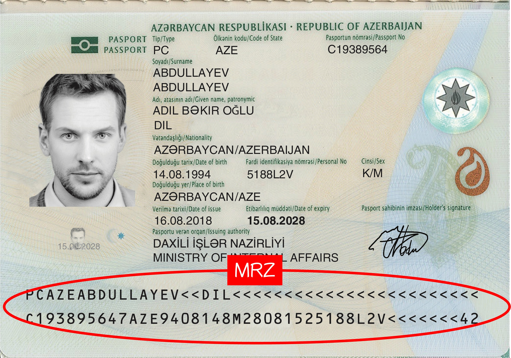

# Introduction

The core functionality of this project is **MRZ Text Recognition**.

- [**MRZScanner Github**](https://github.com/DocsaidLab/MRZScanner)

## Overview

MRZ (Machine Readable Zone) refers to a specific area on travel documents such as passports, visas, and ID cards. The information in this area can be quickly read by machines. MRZ is designed and generated according to the International Civil Aviation Organization’s (ICAO) Document 9303, intended to speed up border checks and improve the accuracy of data processing.

- [**Document 9303**](./reference.md#icao-9303)

While many may not be familiar with MRZ, most people have a passport, which contains an MRZ block. It typically looks like the section outlined in red:

<figure>

<figcaption>Image Source: [**MIDV-2020 Synthetic Dataset**](http://l3i-share.univ-lr.fr/MIDV2020/midv2020.html)</figcaption>
</figure>

---

In addition to passports, MRZ blocks can also be found on ID cards, driver’s licenses, and visas in certain countries.

Some of the most notable characteristics of MRZ blocks are:

1. **Fixed Structure**: Different types of MRZs have distinct structures, and each field has a defined meaning.
2. **Clean Text Area**: The background of the MRZ is usually solid-colored, the text is black, and there is consistent spacing between characters.
3. **Simplified Character Set**: MRZ blocks contain only numbers and uppercase letters, with a total of just 37 possible characters.

:::info
The structure of MRZ varies depending on the type of document. The main formats include:

1. **TD1 (ID cards, etc.):** Consists of three lines with 30 characters per line, totaling 90 characters.
2. **TD2 (passport cards, etc.):** Consists of two lines with 36 characters per line, totaling 72 characters.
3. **TD3 (passports, etc.):** Consists of two lines with 44 characters per line, totaling 88 characters.
4. **MRVA (Visa type A):** Consists of two lines with 44 characters per line, totaling 88 characters.
5. **MRVB (Visa type B):** Consists of two lines with 36 characters per line, totaling 72 characters.
   :::

## Structure Overview

We refer to a well-known MRZ parsing project on Github, [**Arg0s1080/mrz**](https://github.com/Arg0s1080/mrz), to explain the structure of an MRZ:

## Text Recognition

Our main topic is "MRZ Text Recognition." Although this area is quite niche with few research papers available, the problem can be broken down into an OCR (Optical Character Recognition) issue. With a few tweaks to some OCR models, we could potentially solve the problem quite easily.

But that would be wasteful!

OCR models are generally designed to recognize a wide range of text types, including numbers, uppercase and lowercase letters, and punctuation marks, often predicting from thousands of character classes. These models are complex and require significant computational resources.

If we were to apply such a model directly to MRZ recognition, it would seem rather unprofessional, wouldn’t it?

Thus, we need to redesign the model specifically for the unique characteristics of MRZs. A specialized model can more efficiently perform the task, avoiding unnecessary text types, saving computational resources, and improving both recognition speed and accuracy.

### Two-Stage Recognition

To design a specialized model, we can divide MRZ recognition into two stages:

1. **Region Localization**: Using a lightweight model focused on locating the MRZ block within the image.
2. **Text Recognition**: A second lightweight model focused on recognizing the text within the MRZ block.

We completed the MRZ localization model within one week and followed it up with the MRZ recognition model the next week. Combined, the models are about 5 MB in size, and the recognition accuracy for single-frame images is around 95%.

:::tip
**Definition**: The accuracy mentioned here refers to the recognition of all text within the MRZ block. If any character is misrecognized, the entire image is considered incorrect.
:::

That said, the only downside of this approach is...

### It's Boring

No matter how you look at it, completing this task "smoothly" feels more like a routine job.

Since the client sent the request, we followed the process and delivered it. After handing it off, we set it aside and started thinking about a new solution.

- **If we don't use two-stage recognition, then it must be a single-stage recognition!**

We need to directly recognize the MRZ block's text from the original image.

### Single-Stage Recognition

We spent another three months developing a single-stage MRZ recognition model.

To be honest, it took much longer than we initially expected, and it felt a bit frustrating.

The problem turned out to be more difficult than anticipated. Many times, we thought about giving up and sticking with the two-stage solution. While it might be boring, at least it’s accurate! Why give ourselves unnecessary trouble?

The difficulty with the single-stage model is that it needs to search for MRZ blocks, which can vary in size and orientation, across the entire image, and then recognize the text. On top of that, the model must remain lightweight to meet mobile application requirements. All these factors made the model hard to converge and its performance suboptimal.

:::info
Detailed technical explanations will be introduced in later chapters: [**Model Design**](./model_arch.md).
:::

Despite the frustrations during development, we managed to complete it.

Since we couldn’t get back the time and money spent, we decided to open-source the solution and share it with everyone.

This single-stage solution is what we consider a "transitional result." The ideal version in our minds should be more robust, more accurate, and able to handle more application scenarios.

:::tip
We plan to read more papers and continue improving the model's performance in the future.
:::

## Model Evaluation

Unfortunately, this is where we hit a roadblock.

Firstly, there is no standard dataset for this type of task. We had to synthesize our dataset and annotate it ourselves, making the data somewhat unreliable. Although the MIDV dataset provides a decent number of samples, they are largely synthetic and don’t yield great results when fine-tuning the model, let alone for evaluating model performance.

Thus, unlike previous projects, we cannot provide a comprehensive evaluation report for this model.

## Conclusion

In this project, we achieved the following:

1. Validated the effectiveness of a synthetic dataset.
2. Integrated MRZ localization and recognition into a single-stage recognition model.
3. Unified the parsing of all MRZ formats and provided a standardized interface for processing.

We also borrowed some real passports and residence permits from friends to test the system on various passports. Under controlled conditions, the recognition performance was reasonably stable.

If you are interested in this topic, feel free to test it out, and we welcome your feedback.

We would also love to hear your suggestions and are happy to engage in discussions.
