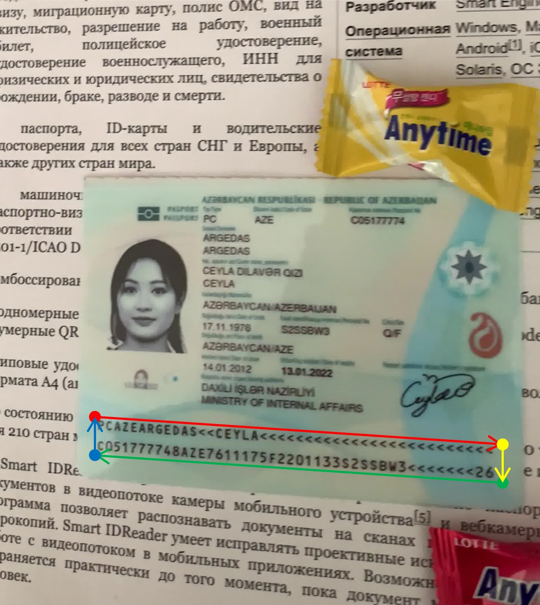
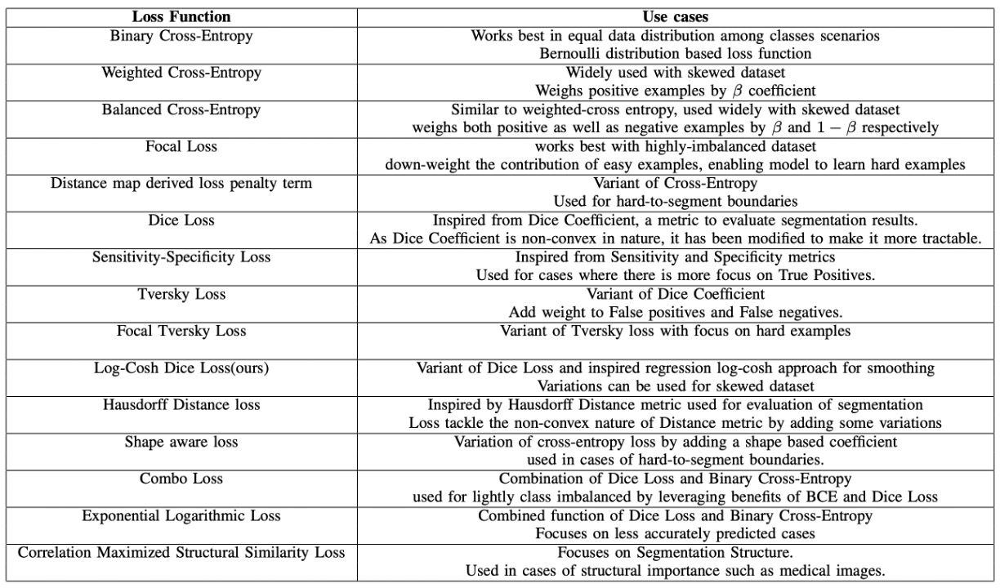
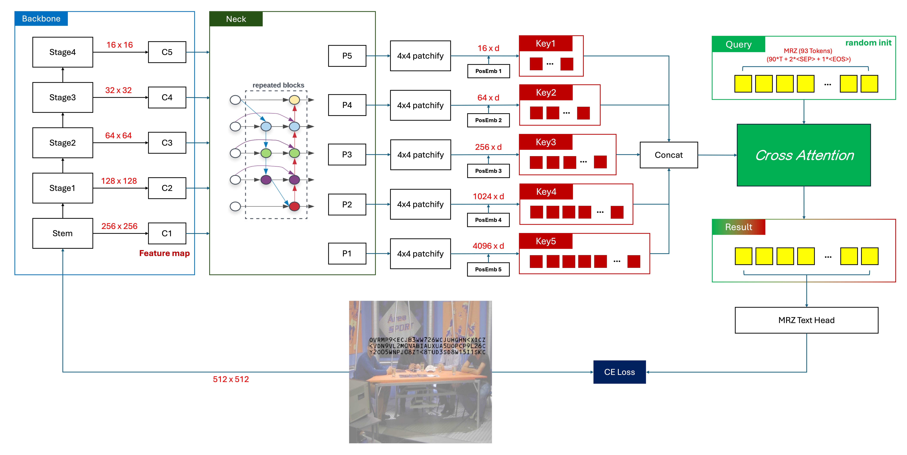

# Model Design

The world is simple, yet we complicate it ourselves.

Yes, we're the ones causing our own headaches—both annoyed and intrigued at the same time.

## Two-Stage Recognition Model

A two-stage model refers to dividing MRZ recognition into two phases: localization and recognition.

Following this approach, we can start designing related models. First, let's look at the localization model.

### Localization Model

Localization of the MRZ area can generally be divided into two directions:

1. **Locate the corners of the MRZ area:**

   

   <figure style={{"width": "50%"}}>
   
   <figcaption>Image source: [**MIDV-2020 Synthetic Dataset**](http://l3i-share.univ-lr.fr/MIDV2020/midv2020.html)</figcaption>
   </figure>
   

   This is similar to the document localization projects we've done before, except that here we are localizing the MRZ area instead of a document.

   The difference is that in document localization, the corner points exist "realistically" on the image and don't require the model to "imagine" a corner. In contrast, for the MRZ area, we need the model to "guess" these corner points.

   It turns out that using this method results in an unstable model; just a slight movement of the passport can cause the predicted corner points to wander around the MRZ area.

   ***

2. **Segmentation of the MRZ area:**

    

    <figure style={{"width": "50%"}}>
    
    <figcaption>Image source: [**MIDV-2020 Synthetic Dataset**](http://l3i-share.univ-lr.fr/MIDV2020/midv2020.html)</figcaption>
    </figure>
    

   This approach is more stable because we can directly use a segmentation model to predict the MRZ area boundaries. The text in the MRZ area is realistically present in the image, so the model doesn't have to make unnecessary assumptions. This way, we can directly segment the MRZ area and avoid concerns about the corner points.

---

We adopted the segmentation approach.

In real-world scenarios, the passport held by the user is inevitably tilted, so we need to correct the MRZ area to transform it into a proper rectangle.

For the loss function, we referred to a review paper:

- [**[20.06] A survey of loss functions for semantic segmentation**](https://arxiv.org/abs/2006.14822)

This paper provides a unified comparison and introduction of various segmentation loss functions proposed in recent years, and presents a solution to existing problems, namely **Log-Cosh Dice Loss**.

Interested readers can refer to this paper; we won't go into further details here.

<figure style={{width: "90%"}}>

</figure>

In our experiments, using `Log-Cosh Dice Loss` alone yielded suboptimal results, so we had to combine it with pixel classification loss `CrossEntropyLoss` and pixel regression loss `SmoothL1Loss` for training.

### Recognition Model

The recognition model is simpler because we've already segmented the MRZ area, and we just need to input that area into a text recognition model to get the final result.

At this stage, there are several design directions we can consider:

1. **Segment the string and recognize them one by one:**

   Some MRZs have two lines of text, such as the TD2 and TD3 formats, while others have three lines, such as the TD1 format. We can split these texts and recognize them one by one.

   The recognition model needs to convert a string of image text into text output. There are many possible methods, such as the earlier popular CRNN+CTC or the more recent CLIP4STR, among others.

   This method has many drawbacks, such as the need for additional logic to handle two or three lines in the MRZ area, or difficulties in distinguishing characters due to narrow spacing between MRZ lines in some documents.

   :::tip
   If you're interested in the related papers, you can refer to the articles we've previously read:

   - [**[15.07] CRNN: I Want It All!**](https://docsaid.org/en/papers/text-recognition/crnn/)
   - [**[23.05] CLIP4STR: The Blessing of Multimodality**](https://docsaid.org/en/papers/text-recognition/clip4str/)
     :::

---

2. **Recognize the entire MRZ cropped image at once:**

   Since the aspect ratio of the MRZ area is not significantly different, we can crop the entire MRZ area and recognize the entire image at once. This situation is particularly suitable for using Transformer-based models to solve the problem.

   For example, if you only use the Transformer Encoder architecture, the model design can look like this:

    

    <figure style={{"width": "50%"}}>
    
    </figure>
    

   Due to the self-attention mechanism, multiple Tokens may point to the same character in the image, which may confuse the model if a typical decoding approach is used:

   > It's clearly the image of this character, why should it be decoded as another character?

   Based on our experiments, using CTC for text decoding yields better results in this case, because each Token originates from an image area of "a particular" character, and we just need to merge the outputs at the final stage to get the final text result.

   ***

   Of course, if you dislike CTC and think it’s a hassle, you could consider adopting an Encoder-Decoder architecture. The model design could look like this:

    <figure>
    
    </figure>

   This approach allows direct string decoding without the need for an additional CTC layer, because the tokens input to the Decoder are queries for the characters, and each token is responsible for finding the corresponding character in the correct order.

   :::tip
   The Decoder here can output in parallel, without needing an autoregressive approach.

   Upon further reflection, the reason we use autoregression is that we need to "base the next prediction on the previous prediction." However, in this case, such operations are clearly unnecessary.

   Each MRZ character is independent, and the prediction for the first position does not affect the prediction for the second position. All the necessary information is already present in the Encoder’s output, and the Decoder's job is merely to query and retrieve the correct sequence.

   Of course, simply talking about it isn't enough; we have also tested both parallel output and autoregressive training methods, and the result shows that parallel output converges faster, achieves better performance, and generalizes better.
   :::

### Error Propagation

This brings us back to the issue of corner points.

All two-stage models face a common challenge: **error propagation**.

No model is 100% accurate. Since we can never fully model the statistical population, every rule has exceptions, and every model has errors. Regardless of the method chosen, the final challenge is the same:

- **Inaccurate corner estimation**

Inaccurate corner estimation leads to an inaccurate MRZ region after correction. An inaccurate MRZ region then leads to inaccurate text recognition. This becomes a classic example of error propagation.

## Single-Stage Recognition Model

The primary challenge of a single-stage model is dealing with multi-scale features.

The MRZ region can vary with the user’s capture angle, meaning that before detecting text, we must handle the image at different scales.

### Model Architecture

### Backbone

Recently, Google released a new paper: **MobileNet-V4**, which is optimized for mobile devices. This is great news for us, and we’ll use it as our Backbone, using the pretrained weights from `timm`, with an input image size of 512 x 512 in RGB.
https://docsaid.org/papers/lightweight/mobilenet-v4/

- [**[24.04] MobileNet-V4: The Legacy After Five Years**](https://docsaid.org/en/papers/lightweight/mobilenet-v4/)
- [**huggingface/pytorch-image-models**](https://github.com/huggingface/pytorch-image-models)

:::tip
After testing, we found that at an input resolution of 512 x 512, the text size in the MRZ area is around 4 to 8 pixels. Reducing the resolution further leads to blurry text in the MRZ area, degrading recognition performance.
:::

### Neck

To better fuse multi-scale features, we introduced BiFPN. By allowing bidirectional flow of contextual information, BiFPN enhances feature representation. It produces a set of rich, scale-aware feature maps that effectively capture objects at different scales, positively impacting prediction accuracy.

In our ablation study, we tried removing this component and directly using the Backbone output feature maps, but training failed.

- [**[19.11] EfficientDet: BiFPN Is the Key**](https://docsaid.org/papers/feature-fusion/bifpn/)

### Patchify

Now for some unconventional experimentation.

---

We need to convert feature maps from each stage into a format that Transformers can process. Here, we use standard convolution operations to turn feature maps into patches.

Here are some of our settings:

1.  **Patch Size: 4 x 4.**

    We measured the text size in the MRZ area and found that small characters are around 4 to 8 pixels. Given this, we set the patch size to 4 x 4.

2.  **Each feature map has a corresponding Patch Embedding and Position Embedding.**

    Since each feature map has a different scale, they can’t share the same embedding, or information exchange across scales won’t work properly. We considered designing a shared embedding, but it was too complex, so we abandoned that idea.

    We also tested shared weights for Patch Embedding, where all feature maps share the same Conv2d for embedding, but the results were poor.

### Cross-Attention

Finally, we used Cross-Attention for text recognition.

We randomly initialized 93 tokens.

- **Why 93 tokens?**

We based this on the longest MRZ format, TD1, which has 90 characters. TD1 has three lines, so we need 2 "separator" characters. Additionally, we need one "end" character, making a total of 93 tokens.

The separator character is `&`, and the end character is `[EOS]`. If there are extra positions, we mark them with `[EOS]`, and the model can predict whatever it wants beyond that point, but we won’t supervise it.

---

For the Transformer decoder, here are the basic settings:

- Dimension: 256
- Layers: 6
- Attention heads: 4
- Dropout: 0
- Normalization: Post-LN

The main design philosophy of this architecture is to provide the Decoder with a "multi-scale" feature space so it can freely choose the appropriate scale for text recognition. We don't need to worry about the position of the text in the image—this is up to the model to handle.

### Additional Notes

During the experiment, we kept some records, which may be helpful:

1. **Models with dimensions 64 and 128 can converge, but reducing the dimension doubles the convergence time.**

   On an RTX4090, training a model with 256 dimensions takes around 50 hours. For 128 dimensions, it takes around 100 hours; for 64 dimensions, about 200 hours.

   Why not try 512 dimensions? Because it makes the model too large, exceeding 100 MB, which isn't what we want.

---

2. **Adding extra branches, like Polygon or text center points, can speed up convergence.**

   But it’s impractical! Collecting data is hard enough; adding MRZ area annotation makes it even more challenging. In the end, the benefits don’t justify the effort.

---

3. **Removing the Neck.**

   It can still converge, but the time triples, so think carefully.

---

4. **Removing position encoding.**

   No convergence.

---

5. **Adjusting weight decay from $10^{-5}$ to $10^{-2}$.**

   Faster convergence but reduced generalization.

   Small models inherently have some regularization, so they don’t need strong weight decay.

---

6. **Using Pre-LN.**

   Faster convergence but reduced generalization.

   Pre-LN reduces model depth to some extent, which isn’t ideal for small models.

---

7. **Increasing data augmentation.**

   To speed up experiments, we limited the rotation of MRZ images to within ±45 degrees.

   We tried using full rotation and more augmentations, but the model couldn’t handle such a heavy load and failed to converge.

## Conclusion

We believe the current single-stage model design is still missing some key components. We plan to continue reading more literature and conducting further experiments.

Scaling up the model size is probably the most effective solution. The challenge lies in how to meet all these requirements while maintaining a "lightweight" parameter size, which is our next focus.

As mentioned earlier, this problem can already be solved reliably in almost all cases with a **two-stage** solution. If you're serious about this, we still recommend going back to developing a two-stage model, which will save you from many unnecessary headaches.
