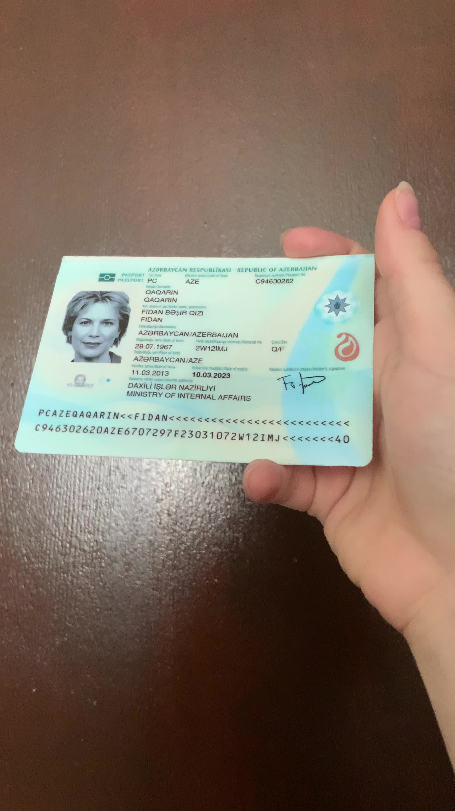

# QuickStart

We provide a simple model inference interface that includes preprocessing and postprocessing logic.

First, you need to import the necessary dependencies and create an instance of the `MRZScanner` class.

## Model Inference

Below is a simple example demonstrating how to use `MRZScanner` for model inference:

```python
from mrzscanner import MRZScanner

model = MRZScanner()
```

After initializing the model, prepare an image for inference:

:::tip
You can use the test image provided by `MRZScanner`:

Download link: [**midv2020_test_mrz.jpg**](https://github.com/DocsaidLab/MRZScanner/blob/main/docs/test_mrz.jpg)

<div align="center">
<figure style={{width: "50%"}}>

</figure>
</div>
:::

```python
import docsaidkit as D

img = D.imread('path/to/run_test_card.jpg')
```

Or you can read it directly from a URL:

```python
import cv2
from skimage import io

img = io.imread('https://github.com/DocsaidLab/MRZScanner/blob/main/docs/test_mrz.jpg?raw=true')
img = cv2.cvtColor(img, cv2.COLOR_RGB2BGR)
```

This image is quite long, and performing inference directly might cause excessive text deformation. Therefore, when calling the model, enable the `do_center_crop` parameter:

Next, you can perform inference using the `model`:

```python
from mrzscanner import MRZScanner

model = MRZScanner()

result, msg = model(img, do_center_crop=True)
print(result)
# >>> ('PCAZEQAOARIN<<FIDAN<<<<<<<<<<<<<<<<<<<<<<<<<',
#      'C946302620AZE6707297F23031072W12IMJ<<<<<<<40')
print(msg)
# >>> <ErrorCodes.NO_ERROR: 'No error.'>
```

:::tip
`MRZScanner` is encapsulated with `__call__`, so you can directly call the instance for inference.
:::

:::info
We have implemented an automatic model download feature. When you use `MRZScanner` for the first time, the model will be downloaded automatically.
:::

## Using with `DocAligner`

Looking closely at the output results above, you might notice a few typos even after using `do_center_crop`.

Since we performed full-image scanning earlier, the model might misinterpret some text in the image.

To improve accuracy, we can use `DocAligner` to help align the MRZ region:

```python
import cv2
from docaligner import DocAligner  # Import DocAligner
from mrzscanner import MRZScanner
from skimage import io

model = MRZScanner()
doc_aligner = DocAligner()

img = io.imread(
    'https://github.com/DocsaidLab/MRZScanner/blob/main/docs/test_mrz.jpg?raw=true')
img = cv2.cvtColor(img, cv2.COLOR_RGB2BGR)

flat_img = doc_aligner(img).doc_flat_img  # Align the MRZ region
print(model(flat_img))
# >>> ('PCAZEQAQARIN<<FIDAN<<<<<<<<<<<<<<<<<<<<<<<<<',
#      'C946302620AZE6707297F23031072W12IMJ<<<<<<<40')
```

After using `DocAligner`, there's no need to use the `do_center_crop` parameter.

Now, you can see that the output results are more accurate—the MRZ region of the image has been successfully recognized.

## Error Messages

To help users understand the reasons behind errors, we designed the `ErrorCodes` class.

When the model inference fails, an error message is generated, covering the following scenarios:

```python
class ErrorCodes(Enum):
    NO_ERROR = 'No error.'
    INVALID_INPUT_FORMAT = 'Invalid input format.'
    POSTPROCESS_FAILED_LINE_COUNT = 'Postprocess failed, number of lines not 2 or 3.'
    POSTPROCESS_FAILED_TD1_LENGTH = 'Postprocess failed, length of lines not 30 when `doc_type` is TD1.'
    POSTPROCESS_FAILED_TD2_TD3_LENGTH = 'Postprocess failed, length of lines not 36 or 44 when `doc_type` is TD2 or TD3.'
```

This filters out basic errors, such as incorrect input formats, incorrect line counts, etc.

## Check Digits

Check Digits are a key part of MRZ used to ensure data accuracy. They validate numerical correctness to prevent input errors.

- Detailed steps are documented in [**Reference: Check Digits**](./reference#check-digit).

---

Here’s what we want to emphasize:

- **We do not provide a function to calculate Check Digits!**

This is because the calculation method for MRZ Check Digits is not standardized. Besides the official calculation methods, different regions can define their own Check Digit algorithms for MRZ, so providing a predefined method might limit user flexibility.

:::info
Fun fact:

The Check Digits on the back of Taiwan's Resident Certificate (ARC) differ from global standards. Without collaboration with the government, it is impossible to determine their calculation method.
:::

Our goal is to train a model that focuses on MRZ recognition. Each output format is automatically determined by the model. Many other open-source projects provide Check Digit calculation features. For example, the [**Arg0s1080/mrz**](https://github.com/Arg0s1080/mrz) project includes a Check Digit calculation function, and we recommend users utilize that project directly.
