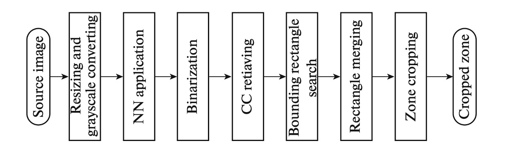
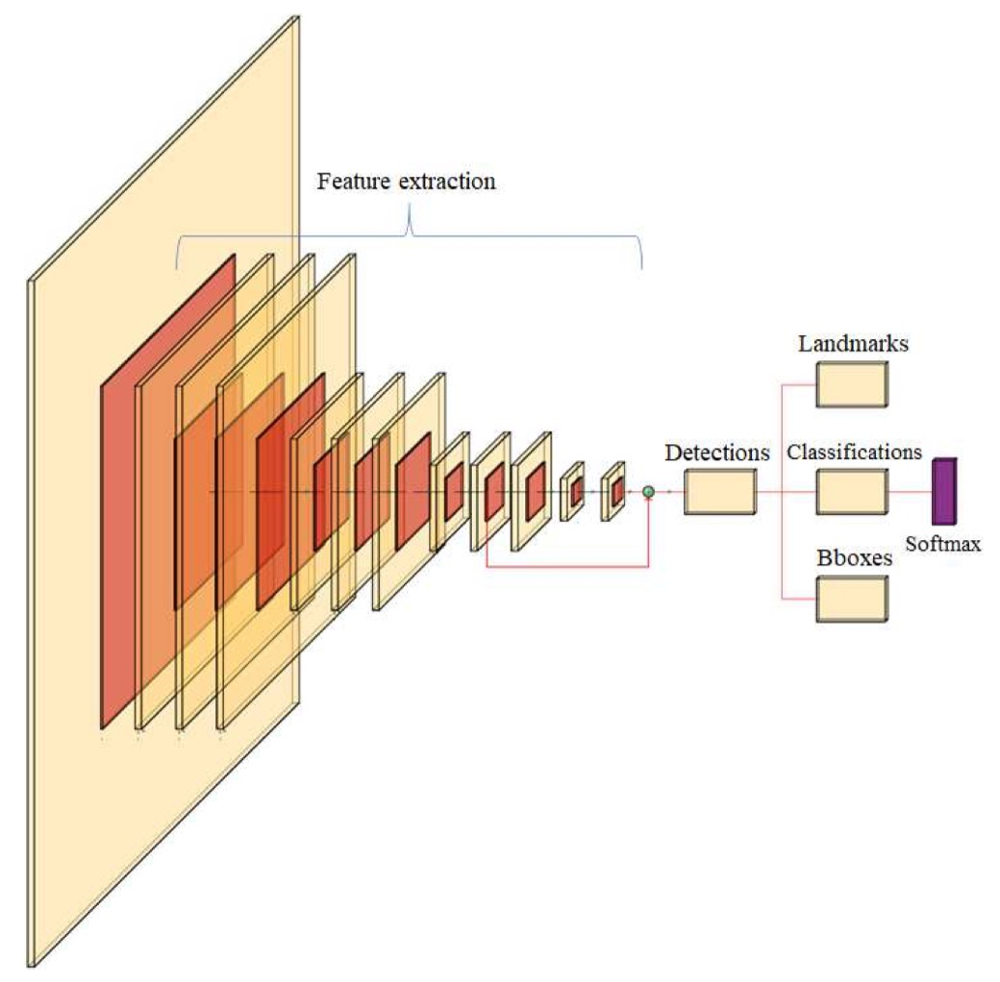

# References

## Researchs

- [**[20.03] Machine-Readable Zones Detection in Images Captured by Mobile Devices’ Cameras**](https://www.researchgate.net/publication/344847851_Machine-Readable_Zones_Detection_in_Images_Captured_by_Mobile_Devices'_Cameras)

  - This paper proposes a machine-readable zone (MRZ) detection method based on connected component arrangement. By analyzing the distribution of black connected components’ centers, the algorithm determines the document orientation, achieving rotation invariance. The algorithm searches for paths that match MRZ features, clusters them, and selects the most consistent cluster, using a bounding box to enclose the result. Tests show that this method outperforms existing techniques with low computational complexity, making it suitable for real-time execution on mobile devices.

- [**[20.09] MRZ Code Extraction from Visa and Passport Documents Using Convolutional Neural Network**](https://arxiv.org/abs/2009.05489)

  - This paper introduces a convolutional neural network (CNN)-based model to successfully extract MRZ information from passport images, regardless of orientation or size. Traditional computer vision methods like Optical Character Recognition (OCR) struggle to accurately extract MRZ information from passports, but this model overcomes that issue. On a dataset of passports and visas, the model achieved a 100% MRZ detection rate and a character recognition Macro-F1 score of 98.36%, demonstrating its excellent performance in document authentication.

    

- [**[22.12] Hough Encoder for Machine Readable Zone Localization**](https://www.researchgate.net/profile/Vladimir-Arlazarov/publication/366599215_Hough_Encoder_for_Machine_Readable_Zone_Localization/links/64e58a6f0453074fbda7a98c/Hough-Encoder-for-Machine-Readable-Zone-Localization.pdf)

  - This paper presents a method combining neural networks with image processing, focusing on lightweight and high-precision MRZ localization. The network processes input images to generate heatmaps of MRZ characters, using connected component analysis to group characters into lines and further evaluate the MRZ’s bounding box. A lightweight version of the Hough encoder is employed, optimized for handling projection-distorted images. The proposed network is 100 times smaller than typical autoencoders and performs well on open synthetic datasets, with fewer parameters than common Unet-based solutions.

    

- [**[23.06] MobileMRZNet: Efficient and Lightweight MRZ Detection for Mobile Devices**](https://www.researchgate.net/figure/MRZ-region-in-simulated-Turkish-ID-document-and-decomposition-of-the-MRZ-region_fig1_371323943)

  - This paper introduces MobileMRZNet, a fast and lightweight MRZ detection method based on the BlazeFace model, specifically designed for mobile GPUs. It achieves fast and accurate MRZ region detection. The model was trained on a dataset comprising real and simulated Turkish ID cards, showing excellent generalization ability. During testing, the model achieved around 81% IoU accuracy and 100% character recognition accuracy within three frames. The model is approximately 400 KB in size and runs in under 10 milliseconds on mobile devices, offering speed, lightness, and robustness compared to existing MRZ detection methods.

    

## ICAO 9303

- [**Part 1: Introduction**](https://www.icao.int/publications/Documents/9303_p1_cons_en.pdf)
- [**Part 2: Specifications for the Security of the Design, Manufacture and Issuance of MRTDs**](https://www.icao.int/publications/Documents/9303_p2_cons_en.pdf)
- [**Part 3: Specifications Common to all MRTDs**](https://www.icao.int/publications/Documents/9303_p3_cons_en.pdf)
- [**Part 4: Specifications for Machine Readable Passports (MRPs) and other TD3 Size MRTDs**](https://www.icao.int/publications/Documents/9303_p4_cons_en.pdf)
- [**Part 5: Specifications for TD1 Size Machine Readable Official Travel Documents (MROTDs)**](https://www.icao.int/publications/Documents/9303_p5_cons_en.pdf)
- [**Part 6: Specifications for TD2 Size Machine Readable Official Travel Documents (MROTDs)**](https://www.icao.int/publications/Documents/9303_p6_cons_en.pdf)
- [**Part 7: Machine Readable Visas**](https://www.icao.int/publications/Documents/9303_p7_cons_en.pdf)
- [**Part 8: Emergency Travel Documents**](https://www.icao.int/publications/Documents/9303_p8_cons_en.pdf)
- [**Part 9: Deployment of Biometric Identification and Electronic Storage of Data in MRTDs**](https://www.icao.int/publications/Documents/9303_p9_cons_en.pdf)
- [**Part 10: Logical Data Structure (LDS) for Storage of Biometrics and Other Data in the Contactless Integrated Circuit (IC)**](https://www.icao.int/publications/Documents/9303_p10_cons_en.pdf)
- [**Part 11: Security Mechanisms for MRTDs**](https://www.icao.int/publications/Documents/9303_p11_cons_en.pdf)
- [**Part 12: Public Key Infrastructure for MRTDs**](https://www.icao.int/publications/Documents/9303_p12_cons_en.pdf)
- [**Part 13: Visible Digital Seals**](https://www.icao.int/publications/Documents/9303_p13_cons_en.pdf)

## Check Digit

The Machine-Readable Zone (MRZ) is a key part of passports, visas, and other documents, allowing machines to quickly retrieve essential information. To ensure the accuracy and integrity of the data in the MRZ, a **check digit** is often included. The check digit is a verification mechanism based on numbers and letters that helps detect errors during data input or reading. While the check digit calculation may seem complex, the basic principles can be broken down into a series of regular steps.

### Steps for Calculating the Check Digit

1. **Character-to-Number Conversion**
   The first step in calculating the check digit is converting the MRZ characters into numerical values. Different characters are mapped to specific values as follows:

   - **Numbers (0-9)**: The value is the number itself. For example, `0` corresponds to the value `0`, and `9` corresponds to the value `9`.
   - **Letters (A-Z)**: Letters are mapped to values based on their position in the alphabet. For example, `A` is converted to `10`, `B` to `11`, and so on, up to `Z`, which is `35`.
   - **Special Symbols**: In the MRZ, the `<` symbol is commonly used as a placeholder and is assigned the value `0`.

2. **Applying Weights**
   During the check digit calculation, each character’s numeric value is multiplied by a predetermined weight. The weights follow a fixed repeating cycle:

   - The first character is multiplied by `7`.
   - The second character is multiplied by `3`.
   - The third character is multiplied by `1`.
   - The cycle then repeats for subsequent characters (i.e., 7, 3, 1, 7, 3, 1, ...).

   This weighted pattern ensures that each character's importance is varied, helping prevent simple errors from going undetected.

3. **Summing the Products**
   After multiplying each character's value by its corresponding weight, sum all the resulting products to get a total value.

4. **Modulo Operation**
   Finally, take the sum and calculate the modulo 10 (i.e., divide by 10 and take the remainder). This remainder is the check digit. If the remainder is `0`, the check digit is `0`; if the remainder is between `1` and `9`, that is the check digit.

### Example of Check Digit Calculation

Let's go through a concrete example.

Assume the following MRZ string: `123ABC<`.

1. **Convert Characters to Numbers**:

   - `1` → 1
   - `2` → 2
   - `3` → 3
   - `A` → 10
   - `B` → 11
   - `C` → 12
   - `<` → 0

2. **Apply Weights**:

   - 1st character `1`: 1 × 7 = 7
   - 2nd character `2`: 2 × 3 = 6
   - 3rd character `3`: 3 × 1 = 3
   - 4th character `A`: 10 × 7 = 70
   - 5th character `B`: 11 × 3 = 33
   - 6th character `C`: 12 × 1 = 12
   - 7th character `<`: 0 × 7 = 0

3. **Sum the Products**:

   - 7 + 6 + 3 + 70 + 33 + 12 + 0 = 131

4. **Modulo 10**:

   - 131 % 10 = 1

   Therefore, the check digit is `1`.

Check digits are designed to help detect errors during data input. In the MRZ of passports, visas, and other documents, several critical fields, such as the passport number, birth date, and expiration date, usually come with check digits. Each of these key fields is followed by a check digit so that when the document is read by a machine, the system can verify the data’s accuracy by recalculating the check digit. If the check digit doesn’t match, this indicates a potential reading error or data tampering.
