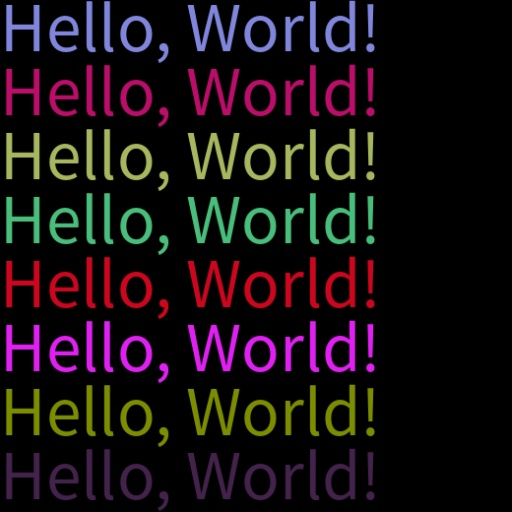

# Advanced

Beyond basic usage, `WordCanvas` offers several advanced settings that allow you to flexibly control the output of text images. Here we introduce randomness settings, which are primarily used for training models.

## Random Fonts

Enable the random font feature using the `random_font` parameter. When `random_font` is set to `True`, the `font_bank` parameter becomes active, while `font_path` is ignored.

You should specify the `font_bank` parameter to your font library since the default is the package's `fonts` directory. For demonstration, we've placed two fonts in the `fonts` directory, so if you do not modify `font_bank`, it will randomly select from these two fonts.

```python
import numpy as np
from wordcanvas import WordCanvas

gen = WordCanvas(
    random_font=True,
    output_size=(64, 512),
    font_bank="path/to/your/font/bank"
)

imgs = []
for _ in range(8):
    text = 'Hello, World!'
    img, infos = gen(text)
    imgs.append(img)

# Combine all images for output
img = np.concatenate(imgs, axis=0)
```


## Random Text Content

If you are unsure of what text to generate, you can use the `random_text` parameter.

When `random_text` is set to `True`, the originally input `text` will be ignored.

```python
import numpy as np
from wordcanvas import WordCanvas

gen = WordCanvas(
    random_text=True,
    output_size=(64, 512),
)

imgs = []
for _ in range(8):
    text = 'Hello!World!' # This input will be ignored
    img, infos = gen(text)
    imgs.append(img)

# Combine all images for output
img = np.concatenate(imgs, axis=0)
```


## Specifying Text Length

When `random_text` is enabled, you can use:

- `min_random_text_length`: Minimum text length
- `max_random_text_length`: Maximum text length

These two parameters specify the range of text lengths.

```python
import numpy as np
from wordcanvas import WordCanvas

# Always generate text with 5 characters
gen = WordCanvas(
    random_text=True,
    min_random_text_length=5,
    max_random_text_length=5,
    output_size=(64, 512),
)

imgs = []
for _ in range(8):
    img, infos = gen()
    imgs.append(img)

# Combine all images for output
img = np.concatenate(imgs, axis=0)
```


## Random Background Color

Use the `random_background_color` parameter to enable the random background color feature.

```python
import numpy as np
from wordcanvas import WordCanvas

gen = WordCanvas(
    random_background_color=True,
    output_size=(64, 512),
)

imgs = []
for _ in range(8):
    text = 'Hello, World!'
    img, infos = gen(text)
    imgs.append(img)

# Combine all images for output
img = np.concatenate(imgs, axis=0)
```


## Random Text Color

Use the `random_text_color` parameter to enable the random text color feature.

```python
import numpy as np
from wordcanvas import WordCanvas

gen = WordCanvas(
    random_text_color=True,
    output_size=(64, 512),
)

imgs = []
for _ in range(8):
    text = 'Hello, World!'
    img, infos = gen(text)
    imgs.append(img)

# Combine all images for output
img = np.concatenate(imgs, axis=0)
```



## Random Text Alignment

Use the `random_align_mode` parameter to enable the random text alignment feature.

```python
import numpy as np
from wordcanvas import WordCanvas

gen = WordCanvas(
    random_align_mode=True,
    output_size=(64, 512),
)

imgs = []
for _ in range(8):
    text = 'Hello, World!'
    img, infos = gen(text)
    imgs.append(img)

# Combine all images for output
img = np.concatenate(imgs, axis=0)
```


## Random Text Direction

Use the `random_direction` parameter to enable the random text direction feature.

It's recommended to use this parameter in conjunction with `output_direction` for convenient image output.

```python
import numpy as np
from wordcanvas import WordCanvas, OutputDirection

gen = WordCanvas(
    random_direction=True,
    output_direction=OutputDirection.Horizontal,
    output_size=(64, 512),
)

imgs = []
for _ in range(8):
    text = '午安，或是晚安。'
    img, infos = gen(text)
    imgs.append(img)

# Combine all images for output
img = np.concatenate(imgs, axis=0)
```


## Full Randomization

If you want all settings to be random, you can use the `enable_all_random` parameter.

This parameter activates a mode where everything is randomized.

```python
import numpy as np
from wordcanvas import WordCanvas

gen = WordCanvas(
    enable_all_random=True,
    output_size=(64, 512),
)

imgs = []
for _ in range(20):
    img, infos = gen()
    imgs.append(img)

# Combine all images for output
img = np.concatenate(imgs, axis=0)
```


:::warning
This parameter does not adjust parameters that require reinitialization, such as `random_font`, `random_text`, etc. These need to be set manually.
:::

## Dashboard Revisited

Let's return to the dashboard feature.


When randomness-related parameters are enabled, parameters set to True will be marked in green, while those set to False will be marked in red.

We hope this design allows you to quickly verify related settings.

## Font Weights

:::tip
This feature was introduced in version 0.2.0.
:::

Since different fonts support varying numbers of characters, we may encounter issues with uneven font weights during model training.

To put it simply, the probability of randomly selecting each font is equal. However, some characters are only supported by a few fonts, meaning certain characters might rarely be trained on.

To mitigate this issue, we introduced the `use_random_font_weight` parameter.

```python
import numpy as np
from wordcanvas import WordCanvas

gen = WordCanvas(
    random_font=True,
    use_random_font_weight=True,
    output_size=(64, 512),
)
```

When you enable this parameter, `WordCanvas` adjusts the font selection probability based on the number of characters each font supports. Fonts that support fewer characters will be less likely to be chosen, resulting in a more balanced distribution.

However, there's still room for improvement. We believe that by first calculating the frequency of all characters, and then assigning selection weights, we could achieve better results. We plan to release this feature in version 0.5.0.

## Blocklist

:::tip
This feature was introduced in version 0.4.0.
:::

We found that some fonts claim to support certain characters but fail to render them correctly.

For instance, a font file might list a set of supported characters, but in practice, some of those characters do not display properly.

This was quite frustrating, so we developed a blocklist feature that allows you to exclude such fonts by using the `block_font_list` parameter:

```python
import numpy as np
from wordcanvas import WordCanvas

gen = WordCanvas(
    random_font=True,
    use_random_font_weight=True,
    block_font_list=['Blocked Font Name']
)
```

We have also created a default blocklist, `DEFAULT_FONT_BLOCK_LIST`. Whenever we find a font that falsely claims to support certain characters, we add it to this list:

```python
DEFAULT_FONT_BLOCK_LIST = [
    "AbyssinicaSIL",
    "AdobeBlank",
    "Akatab",
    "Alkalami",
    "Andika",
    "AnnapurnaSIL",
    "AoboshiOne",
    "AppleGothic",
    "BM-HANNA",
    "CharisSIL",
    "DaiBannaSIL",
    "FlowCircular",
    "GentiumBookPlus",
    "Harmattan",
    "GentiumPlus",
    "IMFeFCsc28P",
    "JejuGothic"
    "JejuMyeongjo",
    "KayPhoDu",
    "KouzanMouhitu",
    "KumarOne",
    "LastResort",
    "LakkiReddy",
    "Lateef",
    "LisuBosa",
    "Lohit-Devanagari",
    "Mingzat",
    "Namdhinggo",
    "Narnoor",
    "NotoColorEmojiCompatTest",
    "NotoColorEmoji",
    "NotoSansDevanagariUI",
    "NotoSansHK[wght]",
    "NotoSansJP[wght]",
    "NotoSansKR[wght]",
    "NotoSansSC[wght]",
    "NotoSansTC[wght]",
    "NotoSerifHK[wght]",
    "NotoSerifJP[wght]",
    "NotoSerifKR[wght]",
    "NotoSerifSC[wght]",
    "NotoSerifTC[wght]",
    "NotoSansOldHungarian",
    "NuosuSIL",
    "Padauk",
    "PadyakkeExpandedOne",
    "Ponnala",
    "RedHatDisplay",
    "RedHatMono",
    "RedHatText",
    "Ranga",
    "RaviPrakash",
    "RubikPixels",
    "Ruwudu",
    "ScheherazadeNew",
    "SoukouMincho",
    "Walkway",
    "851tegaki_zatsu_normal_0883",
]
```

## Summary

Our goal in developing this tool is to create a flexible solution for generating various text images, particularly for training machine learning models.

Introducing randomness is intended to simulate real-world scenarios, which greatly enhances the adaptability and generalization capabilities of models. We hope you find these features useful.
