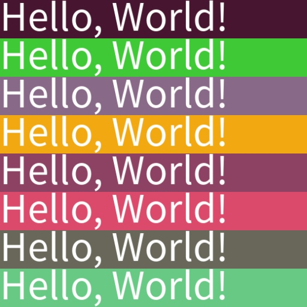
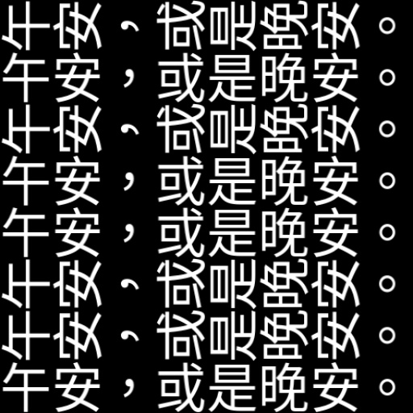

# Advanced

In addition to basic usage, we also provide advanced settings to give you more flexibility in controlling the output text images. Here, we introduce randomization features, mainly used for training models.

To use the randomization features, you should use the `RandomWordCanvas` class.

## Random Fonts

Use the `random_font` parameter to enable random font functionality. When `random_font` is set to `True`, the `font_bank` parameter will take effect, and the `font_path` will be ignored.

You should specify the `font_bank` parameter pointing to your font library, as the default value is the `fonts` directory under the package. For example, we have preplaced two fonts in the `fonts` directory. If you do not modify `font_bank`, it will randomly choose between these two fonts.

```python
import numpy as np
from wordcanvas import RandomWordCanvas

gen = RandomWordCanvas(
    random_font=True,
    output_size=(64, 512),
    # font_bank="path/to/your/font/bank"
)

imgs = []
for _ in range(8):
    text = 'Hello, World!'
    img = gen(text)
    imgs.append(img)

# Combine all images and output
img = np.concatenate(imgs, axis=0)
```


## Random Text Content

If you're unsure what text to generate, you can use the `random_text` parameter.

When `random_text` is set to `True`, the original `text` input will be ignored.

```python
import numpy as np
from wordcanvas import RandomWordCanvas

gen = RandomWordCanvas(
    random_text=True,
    output_size=(64, 512),
)

imgs = []
for _ in range(8):
    text = 'Hello!World!' # This input will be ignored
    img = gen(text)
    imgs.append(img)

# Combine all images and output
img = np.concatenate(imgs, axis=0)
```


## Specify String Length

When `random_text` is enabled, you can use:

- `min_random_text_length`: minimum text length
- `max_random_text_length`: maximum text length

These two parameters allow you to specify the text length range.

```python
import numpy as np
from wordcanvas import RandomWordCanvas

# Generate fixed-length text of 5 characters
gen = RandomWordCanvas(
    random_text=True,
    min_random_text_length=5,
    max_random_text_length=5,
    output_size=(64, 512),
)

imgs = []
for _ in range(8):
    img = gen()
    imgs.append(img)

# Combine all images and output
img = np.concatenate(imgs, axis=0)
```


## Random Background Color

Use the `random_background_color` parameter to enable random background color functionality.

```python
import numpy as np
from wordcanvas import RandomWordCanvas

gen = RandomWordCanvas(
    random_background_color=True,
    output_size=(64, 512),
)

imgs = []
for _ in range(8):
    text = 'Hello, World!'
    img = gen(text)
    imgs.append(img)

# Combine all images and output
img = np.concatenate(imgs, axis=0)
```



## Random Text Color

Use the `random_text_color` parameter to enable the random text color feature.

```python
import numpy as np
from wordcanvas import RandomWordCanvas

gen = RandomWordCanvas(
    random_text_color=True,
    output_size=(64, 512),
)

imgs = []
for _ in range(8):
    text = 'Hello, World!'
    img = gen(text)
    imgs.append(img)

# Combine all images and output
img = np.concatenate(imgs, axis=0)
```


## Random Text Alignment

Use the `random_align_mode` parameter to enable the random text alignment feature.

```python
import numpy as np
from wordcanvas import RandomWordCanvas

gen = RandomWordCanvas(
    random_align_mode=True,
    output_size=(64, 512),
)

imgs = []
for _ in range(8):
    text = 'Hello, World!'
    img = gen(text)
    imgs.append(img)

# Combine all images and output
img = np.concatenate(imgs, axis=0)
```


## Random Text Direction

Use the `random_direction` parameter to enable the random text direction feature.

It is recommended to use this parameter with `output_direction` for easier output image handling.

```python
import numpy as np
from wordcanvas import RandomWordCanvas, OutputDirection

gen = RandomWordCanvas(
    random_direction=True,
    output_direction=OutputDirection.Horizontal,
    output_size=(64, 512),
)

imgs = []
for _ in range(8):
    text = 'Good afternoon, or good night.'
    img = gen(text)
    imgs.append(img)

# Combine all images and output
img = np.concatenate(imgs, axis=0)
```



## Random Text Stroke

Use the `random_stroke_width` parameter to enable the random text stroke feature. You can also use `min_random_stroke_width` and `max_random_stroke_width` to specify the stroke width range.

The stroke color can be set via `stroke_fill` or enable random stroke color using `random_stroke_fill`.

```python
import numpy as np
from wordcanvas import RandomWordCanvas

gen = RandomWordCanvas(
    random_stroke_width=True,  # Enable random stroke width
    random_stroke_fill=True,   # Enable random stroke color
    min_random_stroke_width=1, # Minimum stroke width
    max_random_stroke_width=5, # Maximum stroke width
    output_size=(64, 512),
)

imgs = []
for _ in range(8):
    text = 'Hello, World!'
    img = gen(text)
    imgs.append(img)

# Combine all images and output
img = np.concatenate(imgs, axis=0)
```


:::warning
Using `random_stroke_width` may trigger a warning:

```python
Using `random_stroke_width` may cause an OSError: array allocation size too large error with certain text.
This is a known issue with the `Pillow` library (see https://github.com/python-pillow/Pillow/issues/7287) and cannot be resolved directly.
```

During testing, we found that using `stroke_width` in `Pillow` intermittently causes an `OSError`. This is a known issue with `Pillow`, and the related issue link is included in the warning for you to review.
:::

## Random Line Spacing

Use the `random_spacing` parameter to enable the random line spacing feature. You can pair it with `min_random_spacing` and `max_random_spacing` to specify the spacing range.

```python
import numpy as np
from wordcanvas import RandomWordCanvas, AlignMode

gen = RandomWordCanvas(
    random_spacing=True,
    min_random_spacing=10,
    max_random_spacing=100,
    align_mode=AlignMode.Center,
    output_size=(128, 512),
)

imgs = []
for _ in range(2):
    img = gen('你好！\nHello, World!')
    imgs.append(img)

# Combine all images and output
img = np.concatenate(imgs, axis=1)
```


## Font Weight

Due to variations in the number of characters supported by each font, we might encounter uneven font weights during model training. To alleviate this, you can use the `random_font_weight` parameter.

:::tip
In simple terms, since each font has an equal chance of being selected, but some characters are only supported by a few fonts, you may notice that certain characters are rarely trained on.
:::

```python
from wordcanvas import RandomWordCanvas

gen = RandomWordCanvas(
    random_font=True,
    random_font_weight=True,
    output_size=(64, 512),
)
```

When this parameter is enabled, `RandomWordCanvas` adjusts the font selection probability based on the number of characters a font supports. Fonts with fewer supported characters are less likely to be selected, achieving a more balanced distribution.

## Block List

While using fonts, we have found that some font files are inconsistent.

For example, while the list of characters supported by a font can be read from the font file, certain characters may fail to render correctly during actual use. To address this, we have developed a block list feature that allows you to exclude problematic fonts.

Use the `block_font_list` parameter to set the block list:

```python
import numpy as np
from wordcanvas import WordCanvas, RandomWordCanvas

gen = WordCanvas(
    block_font_list=['AABB']
)

gen_random = RandomWordCanvas(
    block_font_list=['AABB'],
)
```

After setting this, the program will automatically filter out fonts containing `*AABB*.(ttf|otf)` and prevent them from being selected.

## Dashboard

Returning to the dashboard, the information for `RandomWordCanvas` is even more detailed:


When randomization parameters are enabled, parameters set to `True` are marked in green, while those set to `False` are marked in red.

This design aims to help you quickly confirm the relevant settings.

## Summary

In the development of these tools, our goal was to create a versatile tool capable of generating various text images, especially for deep learning model training.

The introduction of randomness aims to simulate various real-world scenarios, which is highly beneficial for improving model adaptability and generalization. We hope you find these features useful!
