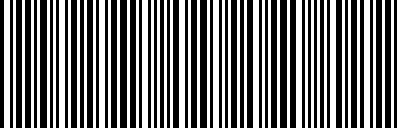

# BarcodeGenerator

:::tip
This feature was added in version 0.5.0.
:::

This functionality is a small feature we often implement in practice. Creating a separate project for it would be excessive, so we included it here.

We implemented barcode generators for Code 39 and Code 128 formats.

## Code 39

Code 39 (also known as Alpha39, Code 3 of 9, Code 3/9, Type 39, USS Code39, or USD-3) is a variable-length barcode defined in ISO/IEC 16388:2007. It can represent 43 characters, including uppercase Latin letters (A to Z), numbers (0 to 9), and several special characters (-, ., $, /, +, %, and space). There is an additional symbol used as a stop character (represented as "\*"). Each character consists of nine parts: five bars and four spaces, with three parts wider (binary 1) and six parts narrower. The ratio between narrow and wide parts is flexible, typically between 1:2 and 1:3.

:::info
Information above excerpted from [**Wikipedia: Code39**](https://en.wikipedia.org/wiki/Code39)
:::

Usage example:

```python
import docsaidkit as D
from wordcanvas import Code39Generator

gen = Code39Generator(
    width_rate=2,
    color=(0, 0, 0)
)

img = gen('ABCD1234', w=400, h=128)
D.imwrite(img)
```

- `width_rate` sets the ratio between narrow and wide bars, defaulting to 2. The recommended ratio is between 1:2 and 1:3.
- `color` sets the color of the barcode, defaulting to black.

The resulting barcode looks like this:



## Code 128

Code 128 is a high-density, one-dimensional barcode developed by Computer Identics in 1981. It is designed for encoding a diverse character set and offers higher encoding efficiency and data capacity compared to Code 39, making it suitable for applications requiring longer and more varied data.

Code 128 can encode all 128 ASCII characters, including numbers, uppercase and lowercase letters, and various special characters. It is divided into three subsets: A, B, and C. Subset A includes control characters and uppercase letters, subset B includes uppercase and lowercase letters and special characters, and subset C is used for compressing numeric data, encoding two digits into one character.

Compared to Code 39, Code 128 uses fewer elements to represent more characters, resulting in shorter and more compact barcodes for the same amount of data. A Code 128 barcode begins with a specific start character indicating the subset (A, B, or C) and ends with a unique stop character. Each Code 128 barcode includes a checksum for data accuracy, calculated based on the barcode content to detect reading errors.

Usage example:

```python
import docsaidkit as D
from wordcanvas import Code128Generator, CodeType

# Using default values
gen = Code128Generator(
    code_type=CodeType.Code128_B,
    color=(0, 0, 0)
)

barcode_img = gen("ABCD1234", w=400, h=128)
D.imwrite(barcode_img)
```


## Advanced Illustration

Let's consider a more complex scenario:

Draw a 128 x 400 Code 39 barcode on a 200 x 600 canvas, placing it at coordinates (36, 100) with a background color of (200, 200, 0). The code would look like this:

```python
import numpy as np
import docsaidkit as D
from wordcanvas import Code39Generator

gen = Code39Generator()

# Set canvas size and background color
output_img = np.zeros((200, 600, 3), dtype=np.uint8) + (200, 200, 0)

# Set barcode dimensions
x, y, w, h = np.array([100, 36, 400, 128])

# Generate barcode with size 400 x 128
barcode_img = gen("ABCD1234", w=400, h=128)

# Place barcode on the canvas
slice_x = slice(x, x+w)
slice_y = slice(y, y+h)
output_img[slice_y, slice_x] = \
np.where(barcode_img > 0, output_img[slice_y, slice_x], barcode_img)
```


---

Similarly, you can achieve the same result with Code 128:

```python
from wordcanvas import Code128Generator

gen = Code128Generator()

# ... rest of the code remains the same

```


