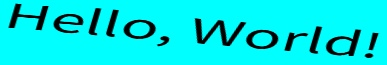

# Augmentation

We have not incorporated image augmentation functionality within `WordCanvas` because we believe this is a highly personalized requirement, with different application scenarios possibly needing different augmentation methods. However, we provide some simple examples to demonstrate how to implement image augmentation processes.

We typically use the [**albumentations**](https://github.com/albumentations-team/albumentations) package for image augmentation, but you are free to use any library you prefer.

## Example 1: `Shear`

After generating text images, apply a custom operation, with `Shear` as an example here.

The `Shear` class is responsible for applying shear transformations to images. Shearing changes the geometric shape of the image, creating a horizontal skew. This can help models learn to recognize objects in different directions and positions.

- **Parameters**
    - max_shear_left: Maximum shear angle to the left. The default value is 20 degrees.
    - max_shear_right: Maximum shear angle to the right. Also defaults to 20 degrees.
    - p: Probability of the operation. By default, it's 0.5, meaning there's a 50% chance any given image will be sheared.

- **Usage**

    ```python
    from wordcanvas import Shear, WordCanvas

    gen = WordCanvas()
    shear = Shear(max_shear_left=20, max_shear_right=20, p=0.5)

    img, _ = gen('Hello, World!')
    img = shear(img)
    ```

    

## Example 2: `SafeRotate`

When using operations related to `Shift`, `Scale`, or `Rotate`, you may encounter issues with filling the background color.

In such cases, use the `infos` to get the background color.

```python
from wordcanvas import ExampleAug, WordCanvas
import albumentations as A

gen = WordCanvas(
    background_color=(255, 255, 0),
    text_color=(0, 0, 0)
)

aug =  A.SafeRotate(
    limit=30,
    border_mode=cv2.BORDER_CONSTANT,
    value=infos['background_color'],
    p=1
)

img, infos = gen('Hello, World!')
img = aug(image=img)['image']
```



## Example 3: Modifying Behavior

You might realize:

- If every `WordCanvas` generated image comes with a random background color, isn't it unscientific to reinitialize the `albumentations` class every time?

Correct! Therefore, we modify the behavior of `albumentations` so that it only needs to be initialized once and can be used continuously.

```python
import albumentations as A
import cv2
import numpy as np
from wordcanvas import WordCanvas

gen = WordCanvas(
    random_background_color=True
)

aug = A.SafeRotate(
    limit=30,
    border_mode=cv2.BORDER_CONSTANT,
    p=1
)

imgs = []
for _ in range(8):
    img, infos = gen('Hello, World!')

    # Modify albu class behavior
    aug.value = infos['background_color']

    img = aug(image=img)['image']

    imgs.append(img)

# Display results
img = np.concatenate(imgs, axis=0)
```


## Conclusion

In this project, we focus solely on enhancing images without needing to adjust complex elements like bounding boxes and masks. If you have any questions or suggestions, feel free to leave a comment below, and we will respond promptly.

This concludes the introduction to this project. Enjoy using it!
