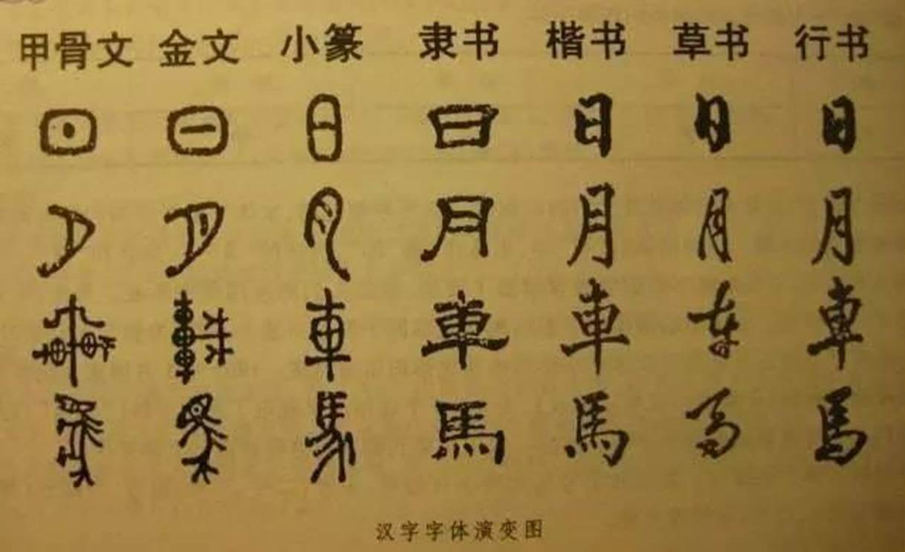

# Introduction

The core functionality of this project is the "**Text-to-Image Generation Tool**", named **WordCanvas**.

- [**WordCanvas Github**](https://github.com/DocsaidLab/WordCanvas)

## Overview

In the current field of Optical Character Recognition (OCR), the accuracy of models is contingent upon the quality and diversity of datasets.

Here, we list several challenges faced by current research:

1. **Insufficient Data**: Existing datasets are limited in scale and do not cover all possible scenarios and samples.
2. **Class Imbalance**: Some categories are underrepresented, exhibiting a severe long-tail distribution.
3. **Lack of Diversity**: Samples in existing datasets are too homogeneous to represent real-world diversity.
4. **Synthetic vs. Real Data Disparity**: There is a discrepancy between synthetic datasets and the data found in real application scenarios.

Moreover, compared to just a few hundred Latin characters, the number of Chinese characters is a disaster. In the study of Chinese OCR, in addition to the above issues, there are many unique challenges to consider.

### Character Diversity and Quantity

Chinese includes thousands of common characters and nearly a hundred thousand obscure characters, with a highly uneven distribution from common to rare.

:::tip
Nearly a hundred thousand? Are you pulling my leg?

This number is based on the statistics from: [**Wikipedia Unicode Expanded Chinese Characters**](https://zh.wikipedia.org/zh-tw/Wikipedia:Unicode%E6%89%A9%E5%B1%95%E6%B1%89%E5%AD%97). Currently, there are over ninety thousand Chinese characters, and the number continues to grow.
:::

### Complex Glyph Structures and Semantic Dependence

Chinese characters are composed of multiple strokes, whose shapes and arrangements vary greatly. Many similar characters can only be distinguished through context.

:::tip
For example: (口, 囗), (日, 曰), (木, 朩), etc.
:::

### Writing Styles

The challenges caused by writing styles are not limited to a single script. Each script can generate a multitude of different typefaces. However, the vast number of Chinese characters, combined with different fonts and writing styles (such as regular, running, and cursive scripts), further complicates recognition.

### Vertical and Mixed Layout Text

Chinese text often appears in vertical layouts, especially in scenarios related to traditional culture. Additionally, mixed Chinese and English text layouts are common, posing extra challenges for text localization and recognition.

### Limited Annotation Resources

High-quality datasets require extensive and accurate annotation, which is both time-consuming and costly.

:::tip
Even if you find the material, annotators often cannot recognize those obscure characters.
:::

## Goals

This project aims to address the aforementioned issues.

Well, the problems are massive, but at least we can start by solving a part of them.

＊

We generate a large variety of Chinese text images through synthetic data to address issues of insufficient data, class imbalance, and lack of diversity. For this, we've looked at some existing text synthesis tools for inspiration, allowing us to decide to build a new text image generator from scratch.

Our generation module is not based on a predefined text encoding table but on fonts. Meaning, we can generate text images of any font, supporting various text directions, alignment modes, text lengths, text colors, background colors, etc.

- **If you can find the font, we can use it to generate images.**

## Design Philosophy

In terms of design, we considered whether to use a "function-oriented design" or an "object-oriented design." We ultimately chose the latter, because no matter what you choose, you're likely to find it challenging to use.

Indeed, **the vast array of options can overwhelm users**, and object-oriented design better organizes these parameters. We've designed a dashboard (as shown below) hoping you can understand and adjust the settings as easily as driving a car.

＊

Overall, in this project, we have accomplished several functions:

1. **Dashboard**: Understand and adjust current settings.
2. **Image Generation**: Generate diverse text images.
3. **Output Alignment**: Support four types of alignment.
4. **Output Orientation**: Support both horizontal and vertical orientations.
5. **Flattened Text**: Support the flattened text feature.
6. **Standardized Output Size**: Support a standardized output size for images.
7. **Random Font Selection**: Support selecting fonts randomly.
8. **Random Text Selection**: Support selecting text randomly.
9. **Random Text Length**: Support selecting text length randomly.
10. **Random Text Color**: Support selecting text color randomly.
11. **Random Background Color**: Support selecting background color randomly.
12. **Random Text Orientation**: Support selecting text orientation randomly.
13. **Random Alignment**: Support selecting alignment modes randomly.
14. **Random Minimum Text Length**: Support specifying a minimum text length.
15. **Random Maximum Text Length**: Support specifying a maximum text length.

## Finally

If you have other requirements, feel free to leave a comment below.

If time allows, we will add new features according to your needs.