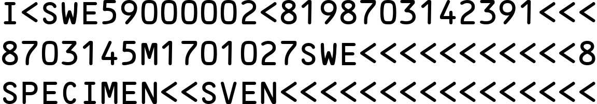

# MRZGenerator

After completing the development of `WordCanvas`, we can use this tool to do some other tasks.

In this chapter, we will develop a feature that renders the "MRZ image" from the "given input text."

:::info
This feature is mainly used to support the training of our [**MRZScanner**](https://docsaid.org/en/docs/mrzscanner) model.

Interested readers can try out the model we provided: [**MRZScanner Demo**](https://docsaid.org/en/playground/mrzscanner-demo)
:::

## What is MRZ?

MRZ (Machine Readable Zone) refers to a specific area on travel documents such as passports, visas, and identity cards, where the information can be quickly read by machines. MRZ is designed and generated according to the guidelines of ICAO Document 9303 to accelerate border checks and improve the accuracy of information processing.

- [**ICAO Doc9309**](https://www.icao.int/publications/Documents/9303_p1_cons_en.pdf)

The structure of MRZ varies depending on the type of document, with the following common formats:

1. **TD1 (Identity cards, etc.):**

   - Consists of three lines, each with 30 characters, totaling 90 characters.
   - Includes: Document type, country code, document number, date of birth, gender, expiration date, nationality, surname, given name, optional data 1, optional data 2.

2. **TD2 (Passport cards, etc.):**

   - Consists of two lines, each with 36 characters, totaling 72 characters.
   - Includes: Document type, country code, surname, given name, document number, nationality, date of birth, gender, expiration date, optional data.

3. **TD3 (Passports, etc.):**

   - Consists of two lines, each with 44 characters, totaling 88 characters.
   - Includes: Document type, country code, surname, given name, document number, nationality, date of birth, gender, expiration date, optional data.

4. **MRVA (Visa type A):**

   - Consists of two lines, each with 44 characters, totaling 88 characters.
   - Includes: Document type, country code, surname, given name, document number, nationality, date of birth, gender, expiration date, optional data.

5. **MRVB (Visa type B):**
   - Consists of two lines, each with 36 characters, totaling 72 characters.
   - Includes: Document type, country code, surname, given name, document number, nationality, date of birth, gender, expiration date, optional data.

## Synthetic Images

When we want to train an MRZ detection model, we need a large dataset. However, these datasets often contain personal information, making them difficult to collect. To address this issue, we can use `WordCanvas` to generate synthetic MRZ images.

We have already implemented the relevant features, and you can refer to the following example to use `MRZGenerator`:

```python
from wordcanvas import MRZGenerator

mrz_gen = MRZGenerator(
    text_color=(0, 0, 0),
    background_color=(255, 255, 255),
)

output_infos = mrz_gen()
img = output_infos['image']
```

In this configuration, you can manually specify the text color, background color, and separator. Since MRZ text consists of 2 to 3 lines, the separator is set to `\n`.

After the setup, simply call it as a function, and we’ve implemented the `__call__` method:

```python
output_infos = mrz_gen()
```

This will generate a synthetic MRZ image, with the output format as:

- `typ`: MRZ type.
- `text`: MRZ text.
- `points`: Coordinates of each character in the MRZ.
- `image`: MRZ image.

When no parameters are provided, the MRZ type (TD1, TD2, TD3) will be chosen randomly, and MRZ text will be generated randomly, then synthesized into an image.

Here is an example of the output image:


## Display Coordinates of Each Character

If you're interested in the position of each character, which can help in training a text detection model, we’ve provided this feature. You can simply call the `points` property, and we will directly plot the points for you:

```python
import cv2
from capybara import draw_points
from wordcanvas import MRZGenerator

mrz_gen = MRZGenerator(
    text_color=(0, 0, 0),
    background_color=(255, 255, 255),
)

output_infos = mrz_gen()

img = output_infos['image']
points = output_infos['points']
points_img = draw_points(img, points, scales=5)
```


## Modify Text Background Color and Spacing

You can modify the text and background colors using the `text_color` and `background_color` parameters:

```python
mrz_gen = MRZGenerator(
    text_color=(255, 0, 0),
    background_color=(0, 127, 127),
)

output_infos = mrz_gen()
img = output_infos['image']
```


---

You can adjust the spacing between characters using the `spacing` parameter:

```python
mrz_gen = MRZGenerator(
    spacing=100,
)

output_infos = mrz_gen()
img = output_infos['image']
```


## Specify MRZ Text

If you want to specify the MRZ text, you can pass the `mrz_type` and `mrz_text` parameters when calling the function. We’ve implemented some basic checks in the function, such as verifying that the text length matches the type.

:::warning
Please note that we do not perform hash checks. This feature is only for generating synthetic images and does not require real MRZ text.
:::

```python
mrz_gen = MRZGenerator(spacing=32)

output_infos = mrz_gen(
    mrz_type='TD1',
    mrz_text=[
        "I<SWE59000002<8198703142391<<<",
        "8703145M1701027SWE<<<<<<<<<<<8",
        "SPECIMEN<<SVEN<<<<<<<<<<<<<<<<"
    ]
)

img = output_infos['image']
```



## Further Reading

- [**Arg0s1080/mrz**](https://github.com/Arg0s1080/mrz)
- [**Detecting machine-readable zones in passport images**](https://pyimagesearch.com/2015/11/30/detecting-machine-readable-zones-in-passport-images/)
- [**ultimateMRZ-SDK**](https://github.com/DoubangoTelecom/ultimateMRZ-SDK)
- [**QKMRZScanner**](https://github.com/Mattijah/QKMRZScanner)
- [**PassportScanner**](https://github.com/evermeer/PassportScanner)
