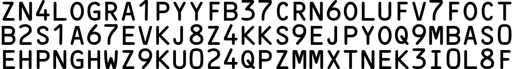
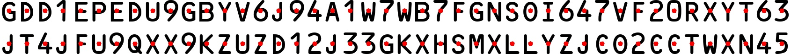

# MRZGenerator

:::tip
This feature was added in version 0.5.0.
:::

After developing `WordCanvas`, we can use this tool for various tasks.

In this section, we will develop a feature to generate "Machine Readable Zone (MRZ)" images.

## What is MRZ?

MRZ (Machine Readable Zone) refers to a specific area on travel documents such as passports, visas, and ID cards. Information in this area can be quickly read by machines. MRZ is designed and generated according to the specifications of the International Civil Aviation Organization (ICAO) Document 9303 to expedite border checks and improve data processing accuracy.

- [**ICAO Doc9309**](https://www.icao.int/publications/Documents/9303_p1_cons_en.pdf)

The structure of MRZ varies depending on the type of document and includes the following types:

1. **TD1 (ID cards, etc.):**

   - Consists of three lines, each with 30 characters, totaling 90 characters.
   - Includes information such as document type, country code, document number, date of birth, sex, expiration date, nationality, surname, given names, optional data 1, and optional data 2.

2. **TD2 (passport cards, etc.):**

   - Consists of two lines, each with 36 characters, totaling 72 characters.
   - Includes information such as document type, country code, surname, given names, document number, nationality, date of birth, sex, expiration date, and optional data.

3. **TD3 (passports, etc.):**

   - Consists of two lines, each with 44 characters, totaling 88 characters.
   - Includes information such as document type, country code, surname, given names, document number, nationality, date of birth, sex, expiration date, and optional data.

4. **MRVA (Visa Type A):**

   - Consists of two lines, each with 44 characters, totaling 88 characters.
   - Includes information such as document type, country code, surname, given names, document number, nationality, date of birth, sex, expiration date, and optional data.

5. **MRVB (Visa Type B):**

   - Consists of two lines, each with 36 characters, totaling 72 characters.
   - Includes information such as document type, country code, surname, given names, document number, nationality, date of birth, sex, expiration date, and optional data.

## Synthetic Images

When training an MRZ detection model, a large dataset is needed, but such data typically contains personal information, making it difficult to collect. To solve this problem, we can use `WordCanvas` to generate synthetic MRZ images.

The relevant functionality is already implemented. Refer to the following example to invoke `MRZGenerator`:

```python
import docsaidkit as D
from wordcanvas import MRZGenerator

mrz_gen = MRZGenerator(
    text_color=(0, 0, 0),
    background_color=(255, 255, 255),
    interval=None,
    delimiter='&',
)
```

In this setup, you can manually specify the text color, background color, and delimiter. Since MRZ text spans 2-3 lines, the delimiter helps distinguish between each line when outputting text. The default delimiter is `&`.

After setting up, you can call it as a function, as the `__call__` method is already implemented:

```python
output_infos = mrz_gen()
```

This generates a synthetic MRZ image with the following output format:

- `typ`: MRZ type.
- `text`: MRZ text.
- `points`: Coordinates of each character in the MRZ.
- `image`: MRZ image.

If no parameters are given during output, the MRZ type (TD1, TD2, TD3) is chosen randomly. The MRZ text is generated randomly, and the image is synthesized.

Example output image:

```python
D.imwrite(output_infos['image'])
```



## Displaying Coordinates of Each Character

If you are interested in the position of each character, which can help in training text detection models, you can use the `points` attribute to get this information. Let's draw a picture to visualize it:

```python
import cv2
import docsaidkit as D
from wordcanvas import MRZGenerator

def draw_points(img, points, color=(0, 255, 0), radius=5):
    for point in points:
        cv2.circle(img, point, radius, color, -1)
    return img

mrz_gen = MRZGenerator(
    text_color=(0, 0, 0),
    background_color=(255, 255, 255),
    interval=None,
    delimiter='&',
)

output_infos = mrz_gen()

img = draw_points(results['image'], results['points'])
D.imwrite(img)
```



## Changing Text and Background Colors

You can change the text and background colors using the `text_color` and `background_color` parameters:

```python
mrz_gen = MRZGenerator(
    text_color=(255, 0, 0),
    background_color=(0, 127, 127),
)

output_infos = mrz_gen()
D.imwrite(output_infos['image'])
```


---

Adjust the spacing between characters using the `interval` parameter:

```python
mrz_gen = MRZGenerator(
    interval=100,
)

output_infos = mrz_gen()
D.imwrite(output_infos['image'])
```


## Specifying MRZ Text

If you want to specify MRZ text, you can pass the `mrz_type` and `mrz_text` parameters when calling the function. We perform basic checks, such as verifying text length and type match.

:::warning
Please note, we do not perform hash checks; this feature is intended for image synthesis, not for generating valid MRZ text.
:::

```python
mrz_gen = MRZGenerator(interval=32)

output_infos = mrz_gen(
    mrz_type='TD1',
    mrz_text=[
        "I<SWE59000002<8198703142391<<<",
        "8703145M1701027SWE<<<<<<<<<<<8",
        "SPECIMEN<<SVEN<<<<<<<<<<<<<<<<"
    ]
)

D.imwrite(output_infos['image'])
```


## Further Reading

- [**Arg0s1080/mrz**](https://github.com/Arg0s1080/mrz)
- [**Detecting machine-readable zones in passport images**](https://pyimagesearch.com/2015/11/30/detecting-machine-readable-zones-in-passport-images/)
- [**ultimateMRZ-SDK**](https://github.com/DoubangoTelecom/ultimateMRZ-SDK)
- [**QKMRZScanner**](https://github.com/Mattijah/QKMRZScanner)
- [**PassportScanner**](https://github.com/evermeer/PassportScanner)
