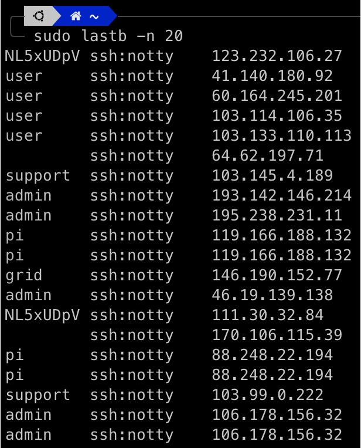

外部に SSH チャンネルを公開すると、すぐに多数の悪意ある接続が発生し、サーバーへのログインを試みる状況に直面します。

<!-- truncate -->

<div align="center">
<figure style={{"width": "40%"}}>

</figure>
<figcaption>攻撃のイメージ図</figcaption>
</div>

---

一般的な対策として、Fail2ban を使用してサーバーを保護します。Fail2ban はサーバーへのブルートフォース攻撃を防ぐためのソフトウェアです。

システムが疑わしい動作（例：繰り返しログインに失敗する）を検出すると、Fail2ban は自動的にファイアウォールのルールを変更して攻撃者の IP アドレスをブロックします。

## 1. Fail2ban のインストール

多くの Linux ディストリビューションでは、パッケージ管理ツールを使用して Fail2ban をインストールできます。

私たちのサーバーは Ubuntu を使用しているため、`apt` を使用します：

```bash
sudo apt install fail2ban
```

## 2. 設定

設定ファイルは `/etc/fail2ban/jail.conf` にあります。

直接このファイルを編集するのではなく、`jail.local` にコピーして編集することをお勧めします：

```bash
sudo cp /etc/fail2ban/jail.conf /etc/fail2ban/jail.local
```

`jail.local` を編集します：

```bash
sudo vim /etc/fail2ban/jail.local
```

このファイルにはいくつかの重要な設定パラメータがあります。それぞれの機能は以下の通りです：

- **ignoreip:** 無視する IP アドレスまたはネットワークセグメント（例：127.0.0.1/8）
- **bantime:** ブロック時間（秒単位、デフォルトは 600 秒）
- **findtime:** この時間内に失敗が記録されるかを観察する時間枠（デフォルトは 600 秒）
- **maxretry:** `findtime` 内で許容される最大失敗回数

## 3. 起動と監視

Fail2ban を起動します：

```bash
sudo service fail2ban start
```

Fail2ban のステータスを確認します：

```bash
sudo fail2ban-client status
```

## 4. カスタムルールの追加

特定のサービスに対して特別なルールを設定する場合は、`jail.local` に対応するセクションを追加または編集します。たとえば、SSH の設定：

```bash
[sshd]
enabled = true
port = ssh
filter = sshd
logpath = /var/log/auth.log
maxretry = 3
```

## 5. テスト

設定を変更した後、Fail2ban を再起動して変更を適用します：

```bash
sudo service fail2ban restart
```

その後、別のマシンまたは異なる IP を使用して、ログインを何度も失敗させ、ブロックされるかどうかを確認します。

## 6. ログの確認

定期的にログファイルを確認し、ルールを更新して最適な保護を維持してください：

```bash
sudo fail2ban-client status sshd
```

## 結論

設定は手順が多いように感じるかもしれませんが、それほど複雑ではありません。

このガイドが、Fail2ban の設定をスムーズに完了するのに役立つことを願っています。
