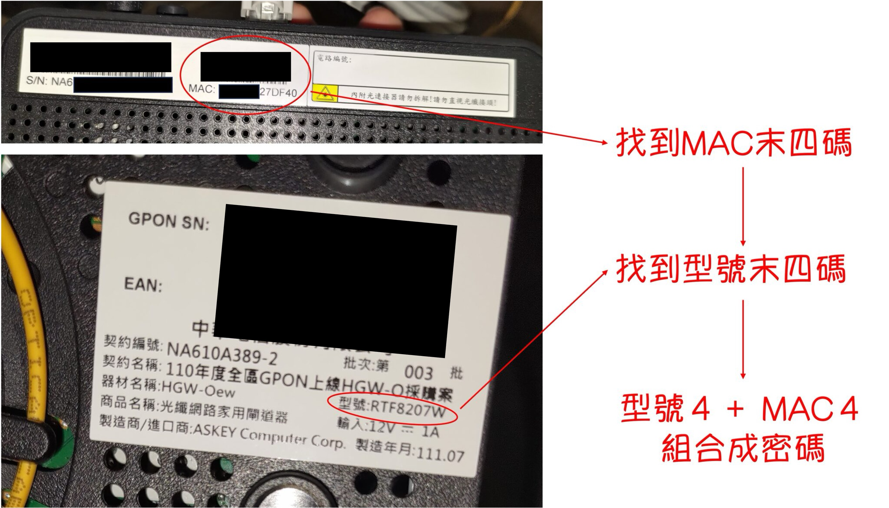

今回は中華電信の「小烏龜」、つまり RTF8207W モデムにログインします。

<!-- truncate -->

### 1. 管理画面にログイン

通常、ウェブブラウザで `192.168.1.1` または他の IP アドレスを入力してアクセスできます。具体的なアドレスはルーターのモデルによって異なる場合があります。

<figure style={{"width": "60%"}}>

</figure>

### 2. エンジニアアカウント

一般的に、アカウントは `cht` で、パスワードは「モデル番号の末尾 4 桁＋ MAC アドレスの末尾 4 桁」となります。

<figure style={{"width": "60%"}}>

</figure>

### 3. ログイン

これで自由に操作できるようになります。

:::danger
設定を誤って破損させ、ネットワークが崩壊して接続できなくなった場合は、**中華電信のエンジニア**に連絡してください。

本記事は参考情報として提供しており、いかなる責任も負いません。
:::
