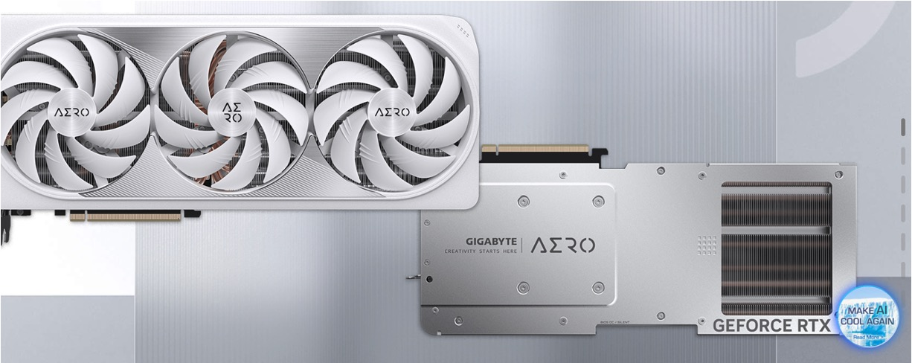
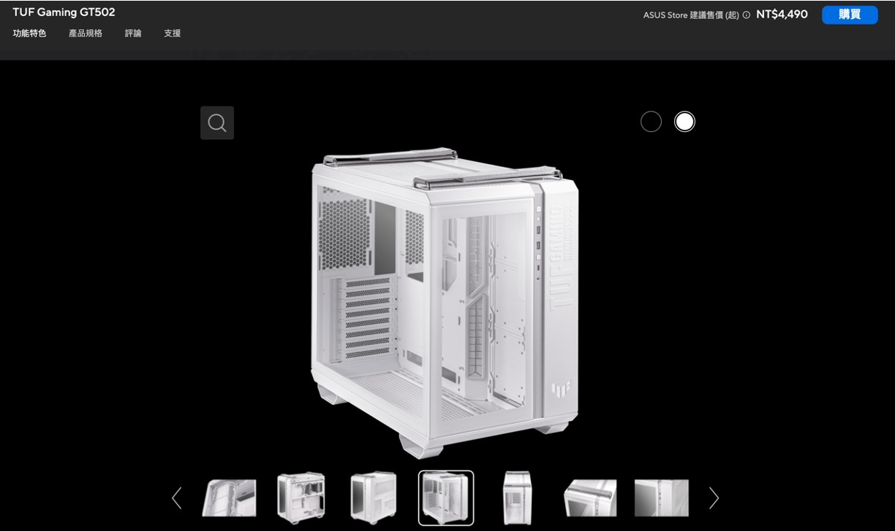

突然ですが、パソコンを買いたくなりました。

特に理由はありません。ただ RTX 4090 を使ってモデルをトレーニングしたいと思っただけです。

<!-- truncate -->

## 免責事項

自分で時間をかけて、トレーニング用の PC を組み立てました。その記録をここに残します。

1. 本記録に基づいて PC を自作し、これによって問題が生じたり損失が発生した場合、当方は一切責任を負いません。
2. 本記事は個人的な記録用であり、推奨や広告を目的とするものではありません。
3. 記事内で言及されている製品やブランドは記録上の必要に過ぎず、商業的な提携や推奨を意図するものではありません。

## 購入明細

免責事項をご覧いただいたところで、正式に話を始めましょう。

以下の表は購入リストを記録したものです：

| 品名               | アイテム                                                                          | 数量 | 合計 (NTD) |
| ------------------ | --------------------------------------------------------------------------------- | ---- | ---------- |
| CPU                | Intel i9-13900K 【24 コア/32 スレッド】3.0GHz-5.8GHz 36MB LGA1700 125W            | 1    | $ 19,500   |
| マザーボード       | GIGABYTE Z790 AORUS ELITE (ATX/Realtek 2.5Gb) 16+1+2 相電源                       | 1    | $ 7,990    |
| グラフィックカード | GIGABYTE RTX 4090 AERO OC 24G ホワイト 金属バックプレート                         | 1    | $ 60,990   |
| メモリ             | Kingston 64 GB (デュアルチャネル 32GBx2) DDR5 6000 CL36 FURY Beast ホワイト       | 2    | $ 12,258   |
| ストレージ         | Micron Crucial P5 Plus 2TB (Gen4 M.2 PCIe 4.0) NVMe SSD (読込 6600M / 書込 5500M) | 2    | $ 7,800    |
| 水冷システム       | NZXT Kraken 360 RGB ホワイト                                                      | 1    | $ 7,990    |
| ケース             | ASUS TUF Gaming GT502 ホワイト ATX                                                | 1    | $ 5,490    |
| ケースファン       | ASUS TUF Gaming TF120 ARGB ホワイト 3 個セット (ケース特典)                       | 1    | -          |
| ケースファン       | ASUS TUF Gaming TF120 ARGB ホワイト 3 個セット (追加購入)                         | 1    | $ 1,690    |
| ケースファン       | ASUS TUF Gaming TF120 ARGB ホワイト 単品 (追加購入)                               | 4    | $ 2,196    |
| 電源ユニット       | FSP HYDRO PTM PRO 1200W ATX3.0 プラチナ 全モジュール                              | 1    | $ 5,790    |
| 接続ケーブル       | SilverStone 1 分 4 A.RGB 接続ケーブル（SST-CPL03）                                | 2    | $ 250      |

- **総額（税込み）**：NTD 131,944、換算で約 628,207 円
- **日付**：2023 年 9 月

:::info
同じ仕様の完成品 PC を見てみたところ、価格は約 180,000 NTD でした。

やっぱり自作する方がお得ですね！
:::

## RTX 4090

すべてはここから始まりました。

まず、PC ショップ「原價屋」に行き、RTX 4090 をチェックしたところ、以下のメーカーがありました：ASUS（華碩）、GIGABYTE（技嘉）、MSI（微星）。

次にテスト動画を探してみました：

- [**MSI RTX 4090 Suprim X vs. RTX 4090 Gaming X Trio, Thermals, Power & Overclocking**](https://www.youtube.com/watch?v=uyMnMPLYk2w)

MSI の動作温度は特に高いように見えました。一方で、他の 2 社（ASUS と GIGABYTE）は温度がほぼ同じでした。

さらに関連する記事も調べました：

- [**【情報】6 種類の RTX 4090 の冷却性能比較**](https://forum.gamer.com.tw/C.php?bsn=60030&snA=615853)

全体的に見ると、GIGABYTE のパフォーマンスが最も良いようです。そこで、GIGABYTE の製品から最も見た目が良い「ホワイト風之力」バージョンを選びました。

詳細スペック：

- アイテム：GIGABYTE RTX 4090 AERO OC 24G ホワイト 風之力 メタルバックプレート付き
- 価格：「原價屋」 $ 60,900 NTD
- 長さ：34.2 cm

  

:::tip
今回の GPU は ATX 規格とも関係があります。この部分については、電源ユニットのセクションで触れます。
:::

## マザーボード

グラフィックカードが決まったら、次はマザーボードの選定です。

ここで「ソケット」の問題が出てきます。マザーボードは CPU によって対応が異なるため、次の情報を調べてみました：

- 第 12 世代の Intel：600 シリーズマザーボード、LGA 1700 ソケット。
- 第 13 世代の Intel：700 シリーズマザーボード、LGA 1700 ソケット。
- 第 14 世代の Intel：700 シリーズマザーボード、LGA 1700 ソケット。

LGA 1700 ソケットは長期間使える選択肢のようです。そのため、700 シリーズのマザーボードを選ぶことにしました。

### LGA 1700 ソケット

[**Wikipedia の LGA 1700 に関する記述**](https://zh.wikipedia.org/zh-tw/LGA_1700) によると：

LGA 1700 は、2021 年に Intel が Alder Lake マイクロアーキテクチャ（第 12 世代 Intel Core）および Raptor Lake マイクロアーキテクチャ（第 13 世代、第 14 世代 Intel Core）用に導入したデスクトップ向けマイクロプロセッサ用ソケットです。このソケットは LGA 1200 に取って代わり、DDR5 メモリをサポートします。接点数の大幅な増加により、LGA 1200 および LGA 1151（パッケージサイズ 37.5 mm x 37.5 mm）に対応していた CPU クーラーは、LGA 1700（パッケージサイズ 45.0 mm x 37.5 mm）とは互換性がありません。

### チップセット仕様

実際に購入を検討する際には、B660、H670、Z690 といったさまざまなマザーボードを目にすることがあります。このため、さらに詳しく情報を調べてみました：

  
クリックして展開

| **特徴**                                                  | **H610**                                     | **B660**                                     | **H670**                                     | **Z690**                                     | **W680**                                     | **Z790**                                     |
| --------------------------------------------------------- | -------------------------------------------- | -------------------------------------------- | -------------------------------------------- | -------------------------------------------- | -------------------------------------------- | -------------------------------------------- |
| **CPU オーバークロック**                                  | なし                                         | なし (メモリオーバークロックは対応)          | なし (メモリオーバークロックは対応)          | あり                                         | あり                                         | あり                                         |
| **バスインターフェイス**                                  | DMI 4.0 x4                                   | DMI 4.0 x8                                   | DMI 4.0 x8                                   | DMI 4.0 x8                                   | DMI 4.0 x8                                   | DMI 4.0 x8                                   |
| **対応 CPU**                                              | Alder Lake, Raptor Lake, Raptor Lake Refresh | Alder Lake, Raptor Lake, Raptor Lake Refresh | Alder Lake, Raptor Lake, Raptor Lake Refresh | Alder Lake, Raptor Lake, Raptor Lake Refresh | Alder Lake, Raptor Lake, Raptor Lake Refresh | Alder Lake, Raptor Lake, Raptor Lake Refresh |
| **対応メモリ**                                            | 最大 64GB, DDR4 3200 / DDR5 4800             | 最大 128GB, DDR4 3200 / DDR5 4800            | 最大 128GB, DDR4 3200 / DDR5 4800            | 最大 128GB, DDR4 3200 / DDR5 4800            | 最大 128GB, DDR4 3200 / DDR5 4800            | 最大 128GB, DDR4 3200 / DDR5 4800            |
| **最大 DIMM スロット**                                    | 2                                            | 4                                            | 4                                            | 4                                            | 4                                            | 4                                            |
| **最大 USB 2.0 ポート数**                                 | 10                                           | 12                                           | 14                                           | 14                                           | 14                                           | 14                                           |
| **USB 3.2 Gen 1 (5 Gbit/s)**                              | 最大 4 個                                    | 最大 6 個                                    | 最大 8 個                                    | 最大 10 個                                   | 最大 10 個                                   | 最大 10 個                                   |
| **USB 3.2 Gen 2 (10 Gbit/s)**                             | 最大 1 個                                    | 最大 2 個                                    | 最大 4 個                                    | 最大 4 個                                    | 最大 4 個                                    | 最大 10 個                                   |
| **USB 3.2 Gen 2x2 (20 Gbit/s)**                           | なし                                         | 最大 2 個                                    | 最大 4 個                                    | 最大 4 個                                    | 最大 4 個                                    | 最大 5 個                                    |
| **最大 SATA 3.0 ポート数**                                | 4                                            | 4                                            | 8                                            | 8                                            | 8                                            | 8                                            |
| **プロセッサ PCI Express 5.0 設定**                       | 1x16                                         | 1x16+1x4                                     | 1x16+1x4 または 2x8+1x4                      | 1x16+1x4 または 2x8+1x4                      | 1x16+1x4 または 2x8+1x4                      | 1x16 または 2x8                              |
| **PCH PCI Express 4.0 設定**                              | なし                                         | 6                                            | 12                                           | 16                                           | 16                                           | 16                                           |
| **PCH PCI Express 3.0 設定**                              | 8                                            | 12                                           | 12                                           | 12                                           | 12                                           | 12                                           |
| **内蔵ディスプレイサポート (デジタルポート/パイプ数)**    | 3                                            | 4                                            | 4                                            | 4                                            | 4                                            | 4                                            |
| **内蔵 Wi-Fi (802.11ax / Wi-Fi 6E)**                      | あり                                         | あり                                         | あり                                         | あり                                         | あり                                         | あり                                         |
| **SATA RAID 0/1/5/10 対応**                               | なし                                         | あり                                         | あり                                         | あり                                         | あり                                         | あり                                         |
| **Intel Optane Memory 対応**                              | なし                                         | あり                                         | あり                                         | あり                                         | あり                                         | あり                                         |
| **Intel Smart Sound テクノロジー**                        | あり                                         | あり                                         | あり                                         | あり                                         | あり                                         | あり                                         |
| **Intel Active Management, Trusted Execution, vPro 対応** | なし                                         | なし                                         | なし                                         | なし                                         | あり                                         | なし                                         |
| **チップセット TDP**                                      | 6W                                           | 6W                                           | 6W                                           | 6W                                           | 6W                                           | 6W                                           |
| **リリース日**                                            | 2022 年 Q1                                   | 2022 年 Q1                                   | 2022 年 Q1                                   | 2021 年 Q4                                   | 2022 年 Q2                                   | 2022 年 Q4                                   |

あれこれ情報が多すぎますね。とりあえず良いものを選びましょう。Z790 に決定です！

詳細スペック：

- アイテム：GIGABYTE Z790 AORUS ELITE (ATX/Realtek 2.5Gb) 16+1+2 フェーズ電源
- 価格：「原價屋」$ 7,990 NTD

  

## CPU

Intel 第 13 世代と第 14 世代には、いろいろと問題があると聞きます。

ただし、私たちはオーバークロックをしないので、大きな問題にはならないはずです。それなら、まずは第 13 世代を購入してみましょう！

詳細スペック：

- アイテム：Intel i9-13900K 【24 コア/32 スレッド】3.0GHz-5.8GHz 36MB LGA 1700 ソケット 125W
- 価格：「原價屋」$ 19,500 NTD

:::tip
私たちが使用しているのは Ubuntu システムです。使用中にクラッシュの問題が発生しました。

しかし、あるシステムアップデート以降、この問題は解消されました。そのため、この問題を CPU の欠陥と結論付けるべきかどうかは不明です。
:::

## メモリ

メモリの主要 3 メーカーといえば、Micron（美光）、Kingston（金士頓）、ADATA（威剛）でしょう。この部分については私たちは専門家ではありませんので、この 3 社から選ぶことにしました。

重要なのは容量です。モデルをトレーニングするなら、128GB をフル搭載するのが基本ですよね！

詳細スペック：

- アイテム：Kingston 64GB (デュアルチャンネル 32GBx2) DDR5 6000 CL36 FURY Beast ホワイト
- 価格：「原價屋」$ 6,129 NTD / 1 セット
- 数量：2 セット

  

---

## ストレージ

この部分については、PTT（台湾の掲示板）で「ストレージの達人」が作成したガイドを見つけました：

- [**SSD（ソリッドステートドライブ）選び方ガイド**](https://www.ptt.cc/bbs/PC_Shopping/M.1675587557.A.3D3.html)

ガイドには多くの追加情報や、各メーカーの比較などが含まれており、非常に詳しい内容でした。しかし、その情報量の多さに圧倒され、最終的に「Micron を選ぶのが良い」という結論にたどり着きました。（~ちょっと適当すぎ？~）

---

調査の結果、QLC（クアッドレベルセル）は避けた方が良いという結論に至りました。理由としては、書き込み速度が遅く、寿命が短いと言われているためです。また、PCIe 5.0 の SSD にはいくつか問題があるようです（詳細は以下リンクを参照）。そのため、TLC 技術を採用した PCIe 4.0 の SSD を選びました。

- [**Crucial, Corsair PCIe 5.0 SSDs running hot, throttling, and shutting down without heatsink**](https://www.neowin.net/news/crucial-corsair-pcie-50-ssds-running-hot-throttling-and-shutting-down-without-heatsink/?fbclid=IwAR0aM7igqoPCImgSMKCtPTNLRw5nOeGJPxLN3HYN89CsTSFEEtl2YsDqbCU)

:::tip
ただし、技術の進化は非常に速いため、これらの問題が将来的に解決される可能性もあります。常に最新情報を確認することが重要です。
:::

---

モデルをトレーニングするなら、4TB のストレージが必要です。これでデータセットも十分保存できます。

詳細スペック：

- アイテム：Micron Crucial P5 Plus 2TB PCIe 4.0 NVMe SSD（読み取り 6600MB/s、書き込み 5500MB/s）TLC
- 価格：「原價屋」$ 3,900 NTD / 1 個
- 数量：2 個

  

## 水冷システム

水冷システムのメーカーには、ASUS（華碩）、MSI（微星）、Corsair（海賊船）、NZXT などがあります。選択肢は多いですが、ネットで調べてもあまり参考になる比較情報が見つかりませんでした。そのため、今回は保証期間を重視して選ぶことにしました。

ほとんどのメーカーの保証期間は 3 年ですが、NZXT は 6+1 年の保証が付いています。この点を考慮して、NZXT を選択しました。

詳細スペック：

- アイテム：NZXT Kraken 360 RGB ホワイト
- 価格：「原價屋」$ 7,990 NTD
- 厚さ：5.6 cm

  

:::tip
もしこの分野に詳しい方がいらっしゃれば、ぜひ専門的なアドバイスをお寄せください。次回の自作 PC では、その意見を最優先で考慮します。
:::

## ケースとファン

ここでは、すべてのパーツが収まるケースを選び、その中にいくつかのファンを取り付けることにしました。

詳細スペック：

- アイテム：
  - ASUS TUF Gaming GT502 ホワイト ATX
  - TUF Gaming TF120 ARGB ホワイト 3 ファンセット (ケース特典) x1
  - TUF Gaming TF120 ARGB ホワイト 3 ファンセット (追加購入) x1
  - TUF Gaming TF120 ARGB ホワイト 単品ファン (追加購入) x4
- 価格：

  - ケースと特典付き、「原價屋」$ 5,490 NTD
  - 3 ファンセット追加購入、「原價屋」$ 1,690 NTD / 1 セット
  - 単品ファン追加購入、「原價屋」$ 549 NTD / 1 個

  

## 電源ユニット

この部分については、インターネットで年度推奨の電源ユニットブランドを調べました。

推奨リストに載っているブランドはどれも選択肢になりますが、私たちは保証期間と価格を重視し、FSP（全漢）を選びました。

詳細スペック：

- アイテム：FSP HYDRO PTM PRO 1200W ATX3.0 プラチナ 全モジュール式
- 価格：「原價屋」$ 5,790 NTD

  

---

GPU の話題を引き継ぎ、ここで ATX 3.0 に関する知識を補足します：

- [**ATX 3.0 規格**](https://zh.wikipedia.org/zh-tw/ATX%E8%A6%8F%E6%A0%BC)

  ATX 3.0 規格は 2022 年 2 月に発表されました。新しい 16 ピン 12VHPWR 電源インターフェースを採用しており、GPU に最大 600W の電力を供給できます。このインターフェースには、電源ユニットと電力特性を交渉するためのデータラインが含まれており、電源ユニットが供給可能な電力以上を消費しないようになっています。また、この規格では、電力ピークの処理に関する要件がさらに厳格化されています。

4090 の消費電力需要に対応するため、電源ユニットを選ぶ際には ATX 3.0 の互換性に注意する必要があります。4090 がリリースされた後、一部のシステムで電源不足による不具合が報告されました。その多くは、電源ユニットの容量不足によってシステムが安定して動作できなかったことが原因です。

## 完成

たくさんのパーツを購入しましたが、自分たちで組み立てる自信はありませんでした。そこで、最終的な作業は「原價屋」の技術者に委託しました。写真撮影が苦手なので、以下の動画を参考にしてください。最終的な完成品は大体こんな感じですが、私たちの構成では GPU と 4 本のメモリもすべて白色です。

- [**ASUS TUF GT502 CUSTOM SETUP | Black & White PC BUILD | i9-13900k | ASUS TUF RTX 4070TI | ProArt Z790**](https://www.youtube.com/watch?v=puMYF4wpzTQ)

  

---

今回の組み立てはこれで終了です。これから楽しくモデルのトレーニングを始めます～

## 後記 1

:::info
2024 年 6 月更新
:::

モデルをフル稼働でトレーニングした場合、台湾の家庭用電力量料金基準に基づくと、月額の電気代は約 5,000 NTD となります。

## 後記 2

:::info
2024 年 10 月更新
:::

1 年間使用してみて、4TB のストレージ容量はかなり控えめだと感じました：

1. WebFace42M データセットだけで約 0.9TB を使用します。
2. ImageNet 21k データセットでは約 1.3TB を使用します。
3. ...

他にも大規模なデータセットがたくさんありますが、4TB では全然足りません。次回購入する場合、少なくとも 16TB は必要だと感じます。
