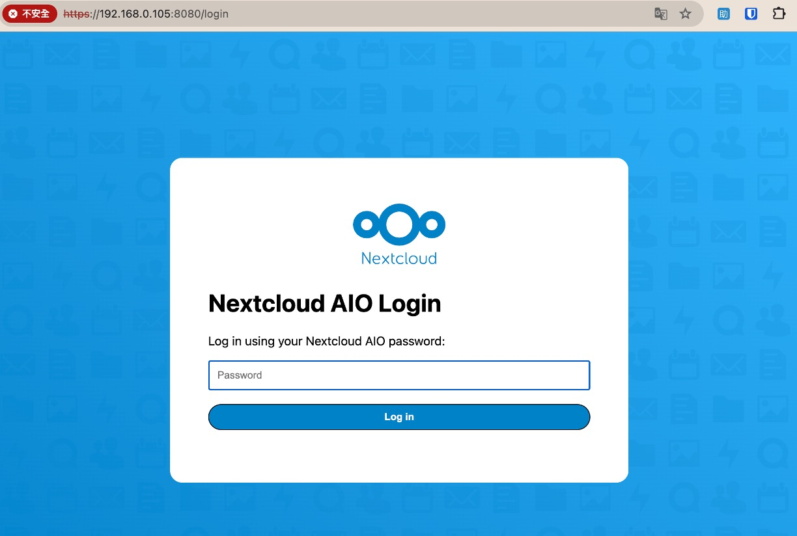
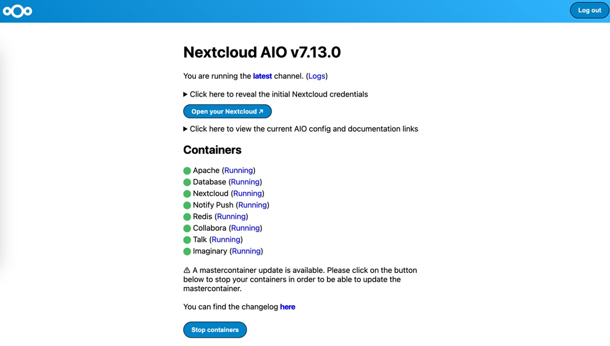

以前、ファイルを Google Drive に保存しており、ファイルのダウンロードは wget コマンドを使っていました。

しかし、ある日突然、以前のダウンロードコマンドが使えなくなりました...

そういうわけで、Nextcloud を試してみることにしました。

<!-- truncate -->

以下は Ubuntu 22.04 を基にした設定手順です。

:::tip
始める前に、ドメインを用意し、そのドメインをサーバーにポイントしてください。

やり方が分からない場合は、Google で「**namecheap 使い方**」を検索してください。
:::

## Nextcloud のインストール

**質問 1：なぜ Nextcloud を使うのか？**

- 自分専用のクラウドを持ちたい、他人のサーバーにファイルを置きたくないから。

**質問 2：Nextcloud と Owncloud の違いは？**

- Nextcloud は Owncloud の開発者が分派して作ったものです。機能はほとんど同じですが、Nextcloud の開発スピードが速いのが特徴です。

**質問 3：Nextcloud をどうやってインストールするのか？**

- この質問は少し複雑です。Nextcloud には多くのインストール方法があり、それぞれにメリットとデメリットがあります。
- 本記事では、唯一お勧めする方法として Docker を使ったインストール手順を紹介します。

## Nextcloud All-in-One の設定

- 公式ドキュメント：[**Nextcloud All-in-One**](https://github.com/nextcloud/all-in-one)

まず、Docker と Docker Compose がインストールされていることを確認してください。

:::tip
まだインストールしていない場合は、Google で「Docker & Docker Compose インストール方法」を検索してください。
:::

次に、NextCloud 用のフォルダを作成し、`docker-compose.yml` という Docker Compose 設定ファイルを作成します：

```bash
mkdir nextcloud
vim nextcloud/docker-compose.yml
```

以下の内容を `docker-compose.yml` に貼り付けます：

```yaml
services:
  nextcloud-aio-mastercontainer:
    image: nextcloud/all-in-one:latest
    init: true
    restart: always
    container_name: nextcloud-aio-mastercontainer
    volumes:
      - nextcloud_aio_mastercontainer:/mnt/docker-aio-config
      - /var/run/docker.sock:/var/run/docker.sock:ro
    ports:
      - 80:80
      - 8080:8080
      - 8443:8443
volumes:
  nextcloud_aio_mastercontainer:
    name: nextcloud_aio_mastercontainer
```

上記のコマンド内容を簡単に説明します：

- `--init`：ゾンビプロセスが発生しないようにします。
- `--name nextcloud-aio-mastercontainer`：コンテナの名前を設定します。この名前は変更不可です。変更すると mastercontainer の更新が失敗する可能性があります。
- `--restart always`：コンテナを Docker デーモンと一緒に常に再起動するように設定します。
- `--publish 80:80`：コンテナのポート 80 をホストのポート 80 に公開します。有効な証明書を取得するために必要です（必要なければ削除可能）。
- `--publish 8080:8080`：コンテナのポート 8080 をホストのポート 8080 に公開します。このポートはデフォルトで自己署名証明書を使用します。他のプロセスがポート 8080 を使用している場合、例えば `8081:8080` に変更可能です。
- `--publish 8443:8443`：コンテナのポート 8443 をホストのポート 8443 に公開します。このポートを使用して AIO インターフェースにアクセスし、有効な証明書を取得できます（必要なければ削除可能）。
- `--volume nextcloud_aio_mastercontainer:/mnt/docker-aio-config`：mastercontainer が作成するファイルを nextcloud_aio_mastercontainer という名前の Docker ボリュームに保存します。この設定は変更不可です。
- `--volume /var/run/docker.sock:/var/run/docker.sock:ro`：Docker ソケットをコンテナにマウントし、他のコンテナの起動や追加機能をサポートします。Windows/macOS や Docker のルートレスモードの場合は調整が必要です。
- `nextcloud/all-in-one:latest`：使用する Docker イメージを指定します。

その他の詳細な設定については、公式ドキュメントを参照してください：[compose.yaml](https://github.com/nextcloud/all-in-one/blob/main/compose.yaml)

## システムサービスの設定

上記の設定が完了したら、次にシステムサービスの設定を行います。

```bash
sudo vim /etc/systemd/system/nextcloud.service
```

以下の内容を貼り付けます：

```bash {7}
[Unit]
Description=NextCloud Docker Compose
Requires=docker.service
After=docker.service

[Service]
WorkingDirectory=/home/[YourName]/nextcloud
ExecStart=/usr/bin/docker compose up --remove-orphans
ExecStop=/usr/bin/docker compose down
Restart=always

[Install]
WantedBy=multi-user.target
```

`[YourName]` を自分のユーザー名に置き換えるのを忘れないでください。

## Nextcloud の起動

```bash
sudo systemctl enable nextcloud
sudo systemctl start nextcloud
```

## Nextcloud の設定

1. **Nextcloud AIO インターフェースへのアクセス**：

   - 初回起動後、`https://ip.address.of.this.server:8080` にアクセスして Nextcloud AIO インターフェースを開きます。ここで、`ip.address.of.this.server` は Nextcloud サービスをデプロイしたサーバーの IP アドレスに置き換えてください。
   - 注意点として、このポート（8080）にはドメイン名ではなく IP アドレスを使ってアクセスしてください。これは HTTP Strict Transport Security（HSTS）がドメイン名でのアクセスをブロックする可能性があるためです。HSTS は、ブラウザに HTTPS 接続のみを要求する Web セキュリティポリシーです。

2. **自己署名証明書の使用**：

   - ポート 8080 にアクセスすると、通信のセキュリティを確保するために自己署名証明書が使用される場合があります。自己署名証明書は信頼された認証局（CA）によって発行されたものではないため、ブラウザはこの証明書を信頼できないと警告するかもしれません。この証明書を手動でブラウザに受け入れる必要があります。

3. **有効な証明書の自動取得**：

   - ファイアウォールやルーターでポート 80 と 8443 を開放または転送しており、ドメインをサーバーにポイントしている場合、`https://your-domain-that-points-to-this-server.tld:8443` にアクセスすることで、信頼された CA によって発行された有効な証明書を自動的に取得できます。
   - `your-domain-that-points-to-this-server.tld` はサーバーを指す実際のドメインに置き換えてください。

4. **Nextcloud Talk 用ポートの開放**：

   - Nextcloud Talk の機能（ビデオ通話やメッセージング）が正常に動作するようにするため、ファイアウォールやルーターで Talk コンテナ用に 3478/TCP と 3478/UDP ポートを開放する必要があります。

- **よくある質問：**

  - **家庭用ネットワークの動的 IP をドメインにポイントするには？**

    - No-IP などのサービスを試しましたが、最終的には固定 IP を取得するために通信事業者（例：日本では NTT など）に直接依頼するのが最速で便利でした。

  - **Docker を使いたくない場合の他の方法は？**

    - ありますが、Nextcloud を直接インストールする必要があり、依存関係の問題をすべて自分で解決する必要があります。
    - 正直、かなり面倒です。

  - **セットアップは完了したのに接続できない場合は？**

    - ファイアウォールがブロックしている可能性があります。ファイアウォールが無効化されている場合、ルーターがブロックしている可能性があります。

---

設定用の URL にアクセスすると、通常の管理画面よりもさらに詳細な設定が可能なインターフェースが表示されます。

<div align="center">
<figure style={{"width": "60%"}}>

</figure>
</div>

ここで、次のことに気づくかもしれません：

- **パスワードがない！**

初回ログイン時にパスワードが表示されますが、見逃してしまうことがよくあります。

その場合、以下のコマンドを使ってパスワードを確認できます：

```bash
sudo grep password /var/lib/docker/volumes/nextcloud_aio_mastercontainer/_data/data/configuration.json
```

ログイン後、以下のような設定画面が表示されます：

<div align="center">
<figure style={{"width": "60%"}}>

</figure>
</div>

この画面は、設定が完了した結果として表示されるものです。

初回ログインの場合は、まず準備したドメインを入力する必要があります。その後、システムから追加の Docker イメージをダウンロードするよう求められます。ダウンロードが完了すると、システムが自動的に再起動します。

再起動後、Nextcloud を使用できるようになります。

## 結論

上記の手順を完了した後、ブラウザのアドレスバーに自分のドメインを入力すると、美しいインターフェースが表示されます。これがあなたのプライベートクラウドです。

<div align="center">
<figure style={{"width": "60%"}}>

</figure>
</div>

このインターフェースには多くの機能があり、ファイルの管理や共有を簡単に行えます。

さらに、スマートフォンに Nextcloud アプリをダウンロードすることで、モバイル端末から直接ファイルを管理することもできます。

Nextcloud を使えば、Google Drive の容量制限を心配する必要がなくなります。
