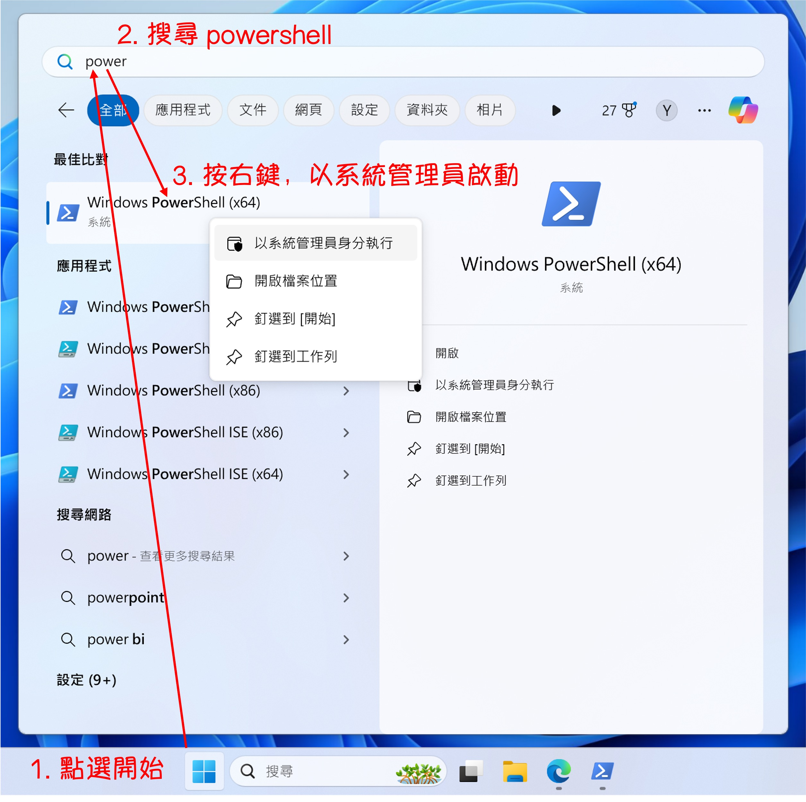

少し前に、Windows システムで開発を行う必要があるプロジェクトを受けました。

なんとも懐かしい話です！最後に Windows を使ったのはもう数年前のことでした。

<!-- truncate -->

まずは幾つかの方法を試し、最終的に PowerShell を使用して Python 環境を設定することに決めました。

本当は WSL を使って設定しようと思いましたが、それでは環境が Linux 環境になってしまう…（？）

Linux 環境が手元にあるのに、わざわざ Windows で設定する必要があるのか？

## 作業環境

Mac が提供する仮想化ツール：[**Parallels Desktop**](https://www.parallels.com/products/desktop/)を使用しました。

Parallels Desktop を通じて、Mac 上で Windows システムをスムーズに動かせます。現在はデフォルトで Windows 11 をインストールしています。

:::tip
Apple M1 チップは ARM アーキテクチャを採用しており、発売当初は互換性に多くの課題がありましたが、数年経った今ではだいぶ改善されました。
:::

## Chocolatey のインストール

まずは PowerShell を起動します。

<div align="center">
<figure style={{"width": "70%"}}>

</figure>
</div>

Chocolatey は Windows 向けのパッケージ管理システムで、NuGet と PowerShell 技術を活用してソフトウェアのインストール、アップグレード、管理を自動化します。Linux の`apt-get`や`yum`に似ており、Windows ユーザーが簡単で一貫した方法でソフトウェアを管理できるようになります。

Chocolatey のインストールは比較的簡単で、管理者権限で PowerShell を実行し、以下のコマンドを入力するだけです：

```powershell
Set-ExecutionPolicy Bypass -Scope Process -Force; [System.Net.ServicePointManager]::SecurityProtocol = [System.Net.ServicePointManager]::SecurityProtocol -bor 3072; iex ((New-Object System.Net.WebClient).DownloadString('https://community.chocolatey.org/install.ps1'))
```

インストール後、次のコマンドを入力して Chocolatey が正常にインストールされたか確認します：

```powershell
choco -v
```

Chocolatey のバージョン番号が表示されれば、インストール成功です。

:::tip
上記コマンドの詳細説明は以下の通りです：

1. **Set-ExecutionPolicy Bypass -Scope Process -Force**:

   - PowerShell の実行ポリシーを一時的に変更します。
   - `Bypass`は全ての実行ポリシーをスキップし、制限を行いません。
   - `-Scope Process`はこの変更を現在の PowerShell セッションにのみ適用します。
   - `-Force`は確認プロンプトなしで強制的に変更を適用します。

2. **[System.Net.ServicePointManager]::SecurityProtocol = [System.Net.ServicePointManager]::SecurityProtocol -bor 3072**:

   - ネットワークセキュリティプロトコルを設定します。
   - `-bor 3072`は TLS 1.2（3072）を有効にするビット単位の「OR」演算子です。

3. **iex ((New-Object System.Net.WebClient).DownloadString('https://community.chocolatey.org/install.ps1'))**:
   - Chocolatey のインストールスクリプトをダウンロードして実行します。

全体として、PowerShell の実行ポリシーを一時的に変更し、ネットワークセキュリティを設定して TLS 1.2 をサポートし、Chocolatey のインストールスクリプトをダウンロードして実行するコマンドです。
:::

:::info
**Chocolatey の主なコマンド：**

- **インストール**
  ```powershell
  choco install <packageName>
  ```
- **アップグレード**
  ```powershell
  choco upgrade <packageName>
  ```
- **インストール済みパッケージの一覧表示**
  ```powershell
  choco list --localonly
  ```
- **アンインストール**
  ```powershell
  choco uninstall <packageName>
  ```
  :::

## Git のインストール

インストール後、管理者権限で PowerShell を再度実行し、以下のコマンドで Git をインストールします：

```powershell
choco install git -y
```

インストール後、以下のコマンドで Git が正常にインストールされたか確認します：

```powershell
git --version
# >>> git version 2.45.2.windows.1
```

## Python のインストール

Python バージョン管理には pyenv を使用します。

:::tip
世の中には Anaconda や Miniconda、WinPython など多くの選択肢がありますが、Linux 開発で慣れ親しんでいる pyenv を選びました。
:::

Windows で pyenv を直接利用するのは難しいですが、`pyenv-win`というプロジェクトを使えば Windows でも利用可能です。

以下の手順に従ってください：

### 手順 1：`pyenv-win` のインストール

- [**参考資料： pyenv-win/docs/installation.md**](https://github.com/pyenv-win/pyenv-win/blob/master/docs/installation.md)

`pyenv-win` プロジェクトをダウンロードします：

```powershell
Invoke-WebRequest -UseBasicParsing -Uri "https://raw.githubusercontent.com/pyenv-win/pyenv-win/master/pyenv-win/install-pyenv-win.ps1" -OutFile "./install-pyenv-win.ps1"; &"./install-pyenv-win.ps1"
```

以下のような `UnauthorizedAccess` エラーが表示された場合は、管理者権限で Windows PowerShell を実行し、次のコマンドを入力してください：

```powershell
Set-ExecutionPolicy -ExecutionPolicy RemoteSigned -Scope LocalMachine
```

完了後、もう一度上記のインストールコマンドを実行してください。

### 手順 2：インストールの確認

1. **PowerShell の再起動**：

   - PowerShell ウィンドウを閉じて再度開き、環境変数の変更を適用します。

2. **`pyenv` のインストール確認**：

   - 次のコマンドを入力して、`pyenv` のバージョンを確認します：

     ```powershell
     pyenv --version
     ```

### 手順 3：`pyenv` で Python バージョンをインストール

1. **利用可能な Python バージョンの確認**：

   - 次のコマンドを使用して、利用可能なすべての Python バージョンを一覧表示します：

     ```powershell
     pyenv install --list
     ```

2. **特定の Python バージョンをインストール**：

   - 例えば、Python 3.10.11 をインストールする場合：

     ```powershell
     pyenv install 3.10.11
     ```

3. **グローバル Python バージョンの設定**：

   - 必須ではありませんが、すべてのシェルで同じ Python バージョンを使用する場合は、インストールした Python バージョンをグローバルのデフォルトバージョンに設定できます：

     ```powershell
     pyenv global 3.10.11
     ```

4. **Python インストールの確認**：

   - 次のコマンドを入力して、Python が正しくインストールされているか確認します：

     ```powershell
     python --version
     ```

## VS Code のインストール

最後に、Visual Studio Code を開発ツールとしてインストールします。

[**VS Code 公式サイト**](https://code.visualstudio.com/Download)からインストーラーをダウンロードしてインストールします。

<div align="center">
<figure style={{"width": "70%"}}>

</figure>
</div>

インストール後、PowerShell から直接 `code` コマンドで VS Code を開けるようにするため、VS Code のインストールパスを環境変数に追加する必要があります。以下のパスをコピーしてください：

```powershell
C:\Users\your_user_name\AppData\Local\Programs\Microsoft VS Code\bin
```

:::tip
`your_user_name` を自分のユーザー名に置き換えてください。
:::

## 余談

正直なところ、PowerShell のデフォルト表示はあまり美しくないと感じます。

この点については、[**oh-my-posh**](https://ohmyposh.dev/) を使用して PowerShell の外観をカスタマイズすることをお勧めします。

ただし、この記事の主題ではないため、興味のある読者は以下をご覧ください：

- [**チュートリアル - Oh My Posh を使用して PowerShell または WSL のプロンプトをカスタマイズ**](https://learn.microsoft.com/ja-jp/windows/terminal/tutorials/custom-prompt-setup)

## 結論

PowerShell を使うことで、Python 環境を迅速に設定し、開発ツールをインストールすることができます。

もちろん、この記事では基本的な設定のみをカバーしており、参考としてご利用ください。
