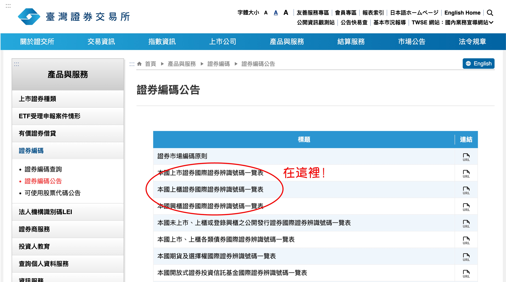
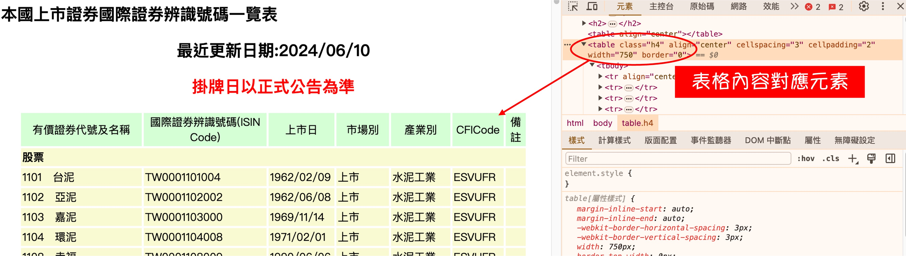

台湾株式市場では、株式コードが定期的に変更されます。毎回手動で調べるのは非効率的です。

そこで、自動化が必要です！

<!-- truncate -->

## 環境のセットアップ

問題を解決するためにプログラムを作成しましょう。まずは必要なライブラリをインストールします：

```bash
pip install requests beautifulsoup4 json
```

:::tip
ここでは、Python 環境がすでにセットアップ済みで正常に動作することを前提としています。
:::

## 目標のウェブページ

株式関連のデータは台湾証券取引所（TWSE）のウェブサイトにあります。目標のウェブページを見つけましょう：

- [**台湾証券取引所/証券コード公告**](https://www.twse.com.tw/zh/products/code/announcement.html)

  <div align="center">
  <figure style={{"width": "80%"}}>
  
  </figure>
  </div>

以下の 3 つの URL をリストアップしておきます：

```python
urls = [
    "https://isin.twse.com.tw/isin/C_public.jsp?strMode=2", # 上場証券
    "https://isin.twse.com.tw/isin/C_public.jsp?strMode=4", # 店頭市場証券
    "https://isin.twse.com.tw/isin/C_public.jsp?strMode=5"  # 新興市場証券
]
```

## ウェブページの解析

<div align="center">
<figure style={{"width": "80%"}}>

</figure>
</div>

ウェブページを開いて、メインの表に対応する HTML タグを確認すると：`class=h4`です。

ターゲットを特定したので、プログラムを作成します：

```python title="update_stocks_code.py"
import json
import requests
from bs4 import BeautifulSoup

# 台湾証券取引所の公告内容を取得
urls = [
    "https://isin.twse.com.tw/isin/C_public.jsp?strMode=2", # 上場証券
    "https://isin.twse.com.tw/isin/C_public.jsp?strMode=4", # 店頭市場証券
    "https://isin.twse.com.tw/isin/C_public.jsp?strMode=5"  # 新興市場証券
]

# データを保存する辞書
data = {}

total_urls = len(urls)
for index, url in enumerate(urls, start=1):
    print(f"Processing URL {index}/{total_urls}: {url}")

    response = requests.get(url)
    response.encoding = 'big5'  # 正しいエンコーディングを設定

    # BeautifulSoupを使ってHTMLを解析
    soup = BeautifulSoup(response.text, 'html.parser')
    table = soup.find('table', {'class': 'h4'})

    if not table:
        print(f"Table not found for URL: {url}")
        continue

    for row in table.find_all('tr')[1:]:  # ヘッダーをスキップ
        cells = row.find_all('td')
        if len(cells) != 7:
            continue

        code, name = cells[0].text.split("\u3000")
        internationality = cells[1].text
        list_date = cells[2].text
        market_type = cells[3].text
        industry_type = cells[4].text

        data[code] = {
            "名称": name,
            "コード": code,
            "市場区分": market_type,
            "業種区分": industry_type,
            "上場日": list_date,
            "国際コード": internationality
        }

with open("stock_infos.json", "w", encoding="utf-8") as f:
    json.dump(data, f, ensure_ascii=False, indent=2)

print("All data has been processed and saved to stock_infos.json")
```

## 出力結果

```json title="stock_infos.json"
{
  "1101": {
    "名称": "台泥",
    "コード": "1101",
    "市場区分": "上場",
    "業種区分": "セメント工業",
    "上場日": "1962/02/09",
    "国際コード": "TW0001101004"
  },
  "1102": {
    "名称": "亜泥",
    "コード": "1102",
    "市場区分": "上場",
    "業種区分": "セメント工業",
    "上場日": "1962/06/08",
    "国際コード": "TW0001102002"
  },
  ...以下省略...
}
```

結果は JSON 形式で出力されるため、他のプログラムとの連携が簡単になります。

## よくある質問

### 一般株式のみ取得したい

4 桁のコードを持つ株式、ETF やワラントを除外したい場合、以下の条件を追加します：

```python
if len(code) != 4:
    continue
```

### 特定の業種だけを取得したい

市場区分や業種区分、上場日など、条件を指定することも可能です。これには、出力された JSON ファイルを Pandas で読み込んでフィルタリングを行います：

```python
import pandas as pd

df = pd.read_json("stock_infos.json", orient="index")
target = df[df["業種区分"] == "セメント工業"]
```

### プログラムが動かない

台湾証券取引所のウェブサイトが改版された可能性があります。ウェブページの構造が変わった場合、コードを修正する必要があります。

## 結論

このプログラムを定期的に実行するだけで、最新の株式情報を取得できます。
