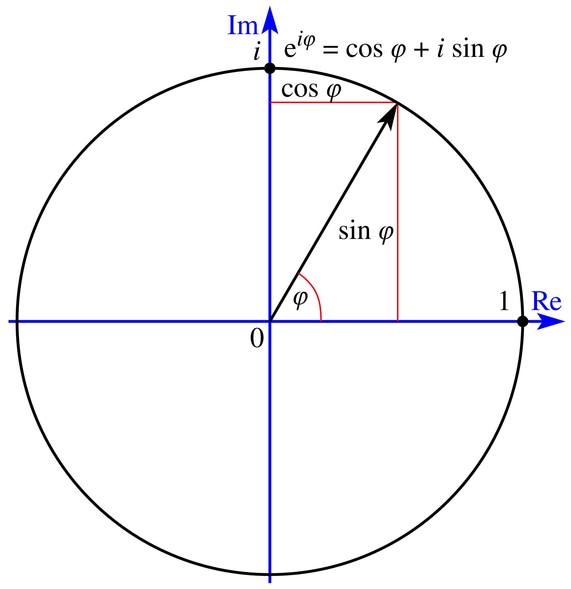

import InteractiveSineWave from '@site/src/components/InteractiveSineWave';
import WaveSuperposition from '@site/src/components/WaveSuperposition';
import FourierTransformDemo from '@site/src/components/FourierTransformDemo';

論文のノートを作成している際にフーリエ変換に出会い、これについて話したいと思いましたが、内容が長くなりすぎて、本題から外れてしまいました。

そこで、この章を独立させ、関連する知識を簡単に紹介します。

<!-- truncate -->

## 三角関数

皆さん、子供の頃に三角関数を学んだことがあると思いますが、ほとんどの方が三角関数の達人ではないでしょうか。

三角関数は物理学や工学の分野で広く使用されており、特に波動や振動の記述に役立ちます。

波とは本質的にエネルギーの伝達方法であり、この伝達は通常「周期的な振動」という形で現れます。

周期的？

よく知られている例として振り子があります。振り子が左右に動く過程は、周期的な運動の一例です。その運動軌跡を観察すると、位置が波のように変化し、正の値からゼロ、次に負の値に変わり、再び繰り返されるのがわかります。

そのため、波をより正確に記述するために三角関数を使用し、数式で表すと次のようになります：

$$
y(t) = A \sin(2\pi f t)
$$

ここで、各変数は振り子の運動に関係しています：

- $y(t)$：時刻 $t$ における振り子の位置。
- $A$：振幅、振り子が振れる最大の距離。
- $f$：周波数、振り子が 1 秒間に何回振れるか。

正弦関数を使用することで、波の特性をより正確に記述できます。

もしよく観察すると、いくつかの波はゼロから始まるのではなく、少し遅れて振動を開始することがあります。この遅れは「位相 $\phi$」で表されます。

波形の完全な式は次のように書けます：

$$
y(t) = A \sin(2\pi f t + \phi)
$$

または、余弦関数を使って表現することもできます：

$$
y(t) = A \cos(2\pi f t + \phi)
$$

正弦波と余弦波の違いは位相にあり、どちらも波の変化を記述するために使用できます。

さらに、波の変化の速度をより詳細に記述するために、「角速度 $\omega$」を使用できます。これは、波が 1 秒間にどれだけ位相を変化させるかを示し、次のように表されます：

$$
\omega = 2\pi f
$$

観察しやすくするために、インタラクティブなグラフを手書きしました。振幅、周波数、位相を調整して、正弦波の変化を観察できます。

<InteractiveSineWave />

### 波の重ね合わせ

正弦波と余弦波があれば、ちょうど x 軸と y 軸のように基本的な要素が揃ったことになります。異なる波形を重ね合わせることで、より複雑な波を作成できます。例えば、次のような式です：

$$
y(t) = A \cos(2\pi f t) + B \sin(2\pi f t)
$$

この式では、$A$と$B$は係数で、余弦波と正弦波の成分の大きさを決定します。複数の波を重ね合わせることで、複雑な波形を作ることができます。

以下のインタラクティブなグラフを使って、2 つの正弦波のパラメータを調整し、それらを重ね合わせた波形を観察できます。

<WaveSuperposition />

### 複素数の形式

正弦波と余弦波の三角関数表示は非常に直感的ですが、数学や工学の応用では、波形を複素数で表現する方が簡潔で強力です。

なぜでしょうか？

それは、複素数を使うことで正弦波と余弦波の組み合わせを 1 つの式に統一でき、また重ね合わせや微分、積分などの計算が便利に行えるからです。

複素数の形式を理解する前に、まず複素数の基本的な概念を簡単に復習しましょう。複素数は実部と虚部で構成され、次のように表されます：

$$
z = a + bi
$$

ここで：

- $a$ は実部。
- $b$ は虚部。
- $i$ は虚数単位で、$i^2 = -1$を満たします。

複素数はまた、「極座標形式」で表すこともできます：

$$
z = r(\cos\theta + i\sin\theta)
$$

ここで：

- $r = \sqrt{a^2 + b^2}$ は複素数の絶対値で、複素数が原点から点 $(a, b)$ までの距離を示します。
- $\theta = \tan^{-1}(b/a)$ は複素数の偏角で、実軸の正方向から反時計回りに回転した角度です。
- $\cos\theta$ と $\sin\theta$ は角度 $\theta$ に対応する方向を定義します。

直交座標系で点 $(a, b)$ は、極座標系で $(r, \theta)$ として表現できます。

$r$ と $\theta$ を三角関数に代入すると、$z = r(\cos\theta + i\sin\theta)$ となります。

## オイラーの公式

数学的定義から見ると、指数関数 $e^x$ は無限級数として展開できます：

$$
e^x = 1 + \frac{x}{1!} + \frac{x^2}{2!} + \frac{x^3}{3!} + \cdots
$$

この級数は $x$ が実数のときには直感的ですが、$x$ が複素数の場合にも適用できます。

例えば、$x = i\theta$ のとき、式に代入すると次のようになります：

$$
e^{i\theta} = 1 + \frac{i\theta}{1!} + \frac{(i\theta)^2}{2!} + \frac{(i\theta)^3}{3!} + \cdots
$$

$(i\theta)^n$ を展開すると、$i^2 = -1, i^3 = -i, i^4 = 1$ などの周期性が現れます。よって、$e^{i\theta}$ の展開は実部と虚部に分けることができます。

実部の項は次のようになります：

$$
1 + \frac{(i\theta)^2}{2!} + \frac{(i\theta)^4}{4!} + \cdots = 1 - \frac{\theta^2}{2!} + \frac{\theta^4}{4!} - \cdots
$$

これはちょうど $\cos\theta$ の展開式に一致します。同様に、虚部の項は次のようになります：

$$
\frac{(i\theta)}{1!} + \frac{(i\theta)^3}{3!} + \frac{(i\theta)^5}{5!} + \cdots = i\left(\theta - \frac{\theta^3}{3!} + \frac{\theta^5}{5!} - \cdots\right)
$$

これもまさに $\sin\theta$ の展開式に一致します。

したがって、実部と虚部を総合すると、あの有名なオイラーの公式が得られます：

$$
e^{i\theta} = \cos\theta + i\sin\theta
$$

ここで：

- $e^{i\theta}$ は複素数の指数表示で、実部 $\cos\theta$ と虚部 $i\sin\theta$ を含んでいます。
- 複素数の実部と虚部は、それぞれ波形の横方向の運動と縦方向の運動に対応します。

## 複素数波

<figure style={{"width": "40%"}}>

<figcaption>オイラーの公式の幾何学的な意味、出典：[**Wikipedia**](https://en.wikipedia.org/wiki/Euler%27s_formula)</figcaption>
</figure>

---

オイラーの公式を使って、波形の式を改訂することができます。例えば、次の複素数波形を考えてみましょう：

$$
z(t) = A e^{i(2\pi f t + \phi)}
$$

$e^{i(2\pi f t + \phi)}$ を展開し、オイラーの公式を使うと次のようになります：

$$
z(t) = A \left[\cos(2\pi f t + \phi) + i\sin(2\pi f t + \phi)\right]
$$

これにより、同一の波形が次のように表されることがわかります：

- **実部** $\Re(z) = A \cos(2\pi f t + \phi)$
- **虚部** $\Im(z) = A \sin(2\pi f t + \phi)$

したがって、正弦波と余弦波を複素数形式で表現する場合、複素数の実部と虚部を使って表すことができます：

1. **正弦波** $y(t) = A \sin(2\pi f t + \phi)$：

   - 複素数の虚部を使って表すと：
     $$
     y(t) = \Im \left(A e^{i(2\pi f t + \phi)}\right)
     $$

2. **余弦波** $y(t) = A \cos(2\pi f t + \phi)$：
   - 複素数の実部を使って表すと：
     $$
     y(t) = \Re \left(A e^{i(2\pi f t + \phi)}\right)
     $$

ここで、$A e^{i(2\pi f t + \phi)}$ は統一された複素数表示であり、実部と虚部がそれぞれ余弦波と正弦波に対応しています。

### 波の重ね合わせ

三角関数を用いて二つの波形を直接重ね合わせる場合、三角関数の加法定理を使用する必要があります。例えば、次のような式です：

$$
\cos(A + B) = \cos A \cos B - \sin A \sin B
$$

および

$$
\sin(A + B) = \sin A \cos B + \cos A \sin B
$$

二つの波形が重なる場合：

$$
y_1(t) = A_1 \cos(2\pi f_1 t + \phi_1), \quad y_2(t) = A_2 \sin(2\pi f_2 t + \phi_2)
$$

それぞれの波形を展開し、$\cos$ と $\sin$ の加法定理を処理して、実部と虚部を整理する必要があります。

この過程は非常に煩雑で、特に波形の数が増えると、式の複雑さは指数関数的に増加します。

:::tip
台湾の高校生を除けば、こんなことを手計算でやろうとする人はほとんどいないでしょう？
:::

複素数形式では、各波形は次のように表されます：

$$
z_1 = A_1 e^{i(2\pi f_1 t + \phi_1)}, \quad z_2 = A_2 e^{i(2\pi f_2 t + \phi_2)}
$$

波形の重ね合わせは次のようになります：

$$
z(t) = z_1 + z_2 = A_1 e^{i(2\pi f_1 t + \phi_1)} + A_2 e^{i(2\pi f_2 t + \phi_2)}
$$

ここで重要なのは、複素数の加法が「線形」であるという点です。つまり、二つの波形の振幅と位相は直接加算または分離して保持でき、三角関数の展開を使って処理する必要はありません。

一方で、複素数には実部と虚部が組み込まれており、これ自体が $\cos$ と $\sin$ の情報を含んでいます。複素数加法では、実部と虚部がそれぞれ波形の余弦成分と正弦成分に対応するため、三角関数を手動で分解する必要はありません。

複素数形式のもう一つの利点は、波形の「振幅」と「位相」を明確に分離できることです：

- 振幅は複素数の絶対値 $|z|$ で決まります。
- 位相は複素数の偏角 $\arg(z)$ で決まります。

波形の重ね合わせでは、これらの情報を個別に処理することも、まとめて計算に使うこともできます。例えば、重ね合わせた波形の振幅を簡単に分析したい場合、$|z| = \sqrt{\Re(z)^2 + \Im(z)^2}$ を直接計算すればよいのです。

最後に、波形の位相回転は複素数の相角偏移に対応します。重ね合わせた後の波形の位相を調整する必要がある場合、$e^{i\theta}$ に回転角度 $\Delta\theta$ を加えるだけでよく、$\cos$ と $\sin$ の位相を個別に調整する必要はありません。

## フーリエ変換

上で説明した内容は、フーリエ変換の数学的公式を理解するための準備に過ぎません。

フーリエ変換の核心となる概念は次の通りです：

- **任意の信号は、正弦波と余弦波の重ね合わせとして表現できる**。

これはつまり、たとえ信号が非常に複雑に見えても、例えば音楽の一節や画像、あるいはインパルス信号であっても、それを簡単な基本的な波形の組み合わせとして分解できるということです。これらの基本的な波形が、私たちがよく知っている正弦波と余弦波であり、これらが異なる周波数、振幅、位相で共同して信号の全体像を形成します。

正弦波と余弦波は非常に強力な数学的性質を持っています。周期的な現象に対して、正弦波と余弦波は「基底」として機能します。空間で位置を記述する際の $x, y, z$ の座標軸のようなものです。適切な線形結合を通じて、私たちは任意の複雑な形状や変化を表現できます。

信号 $y(t)$ が時間変化する関数であると仮定したとき、フーリエ変換は次の二つの重要な質問に答える手助けをします：

1. **この信号にはどんな周波数成分が含まれているのか？**
2. **各周波数の振幅と位相はどのくらいか？**

この周波数分解により、信号を全く異なる角度から理解できるようになります。時間的に変化する波形を直接観察するのではなく、信号の周波数特性をより明確に見ることができます。

フーリエ変換の数学的定義は、信号を「時間領域」から「周波数領域」へ変換する方法を提供します。その核心となる公式は次の通りです：

$$
Y(f) = \int_{-\infty}^\infty y(t) e^{-i 2\pi f t} \, dt
$$

この公式の各部分の物理的意味は次の通りです：

1. **元の信号 $y(t)$**：

   $y(t)$ は時間領域で定義された関数です。これは音楽の音波、電気信号の振幅変化、または特定の時間内で変化するインパルスのシーケンスなど、あらゆる種類の信号であり得ます。

   $y(t)$ は、信号の各時刻 $t$ での振幅値を含んでいます。

2. **複素指数関数 $e^{-i 2\pi f t}$**：

   これはフーリエ変換の鍵となる部分で、実際には正弦波と余弦波の組み合わせです：

   $$
   e^{-i 2\pi f t} = \cos(2\pi f t) - i \sin(2\pi f t)
   $$

   フーリエ変換において、$e^{-i 2\pi f t}$ は周波数 $f$ を持つ複素波形を用いて $y(t)$ と一致させ、信号のその周波数成分の強度を抽出します。

---

積分操作は本質的に内積の計算であり、$y(t)$ と $e^{-i 2\pi f t}$ の類似度を測定します。

この「類似度」が、信号の周波数 $f$ における貢献度を決定します。

フーリエ変換は、すべての可能な周波数 $f$ に対してスキャンを行います。

各 $f$ に対して、積分計算によって得られた値 $Y(f)$ がその周波数の強度を表します。これが「スペクトル」と呼ばれる理由です。

ここまで説明したところで、実際に自分で計算してみましょう：

単一周波数の信号を考えます：

$$
y(t) = A \cos(2\pi f_0 t + \phi)
$$

オイラーの公式を使って、これを次のように表現します：

$$
y(t) = \Re\left\{ A e^{i (2\pi f_0 t + \phi)} \right\}
$$

この信号に対してフーリエ変換を行うと：

$$
Y(f) = \int_{-\infty}^\infty y(t) e^{-i 2\pi f t} \, dt
$$

$y(t)$ の表現を代入すると次のようになります：

$$
Y(f) = \int_{-\infty}^\infty \Re\left\{ A e^{i (2\pi f_0 t + \phi)} \right\} e^{-i 2\pi f t} \, dt
$$

フーリエ変換の核心は積分操作であり、その効果は時間領域上のすべての点と周波数波形を一致させることです。もし $f = f_0$ ならば、$e^{-i 2\pi f t}$ と $e^{i 2\pi f_0 t}$ は完全に一致し、積分の結果はゼロではなくなります。

もし $f \neq f_0$ ならば、これらの波形は位相が一致せず、積分の結果はほぼゼロになります。

周波数が一致したとき、得られる結果は次のようになります：

$$
Y(f_0) = A e^{i \phi}
$$

これは、スペクトル $Y(f)$ がその周波数の強度（$A$ によって与えられる）だけでなく、その周波数の位相（$\phi$ によって与えられる）も含んでいることを示しています。

これが、フーリエ変換が信号を完全に記述できる重要な理由です。

## フーリエ級数

フーリエ級数はフーリエ変換の特別な場合であり、主に周期的な信号を扱うために使用されます。

フーリエ変換が信号の周波数スペクトルを連続的な周波数範囲に拡張できるのに対して、フーリエ級数は周期的信号を「離散的な周波数」を用いて表現することに焦点を当てています。

フーリエ級数の核心となる概念は次の通りです：

- **任意の周期的信号は、「離散周波数」の正弦波と余弦波の線形結合として表現できる**。

これは、信号が周期的であれば、限られた数の正弦波と余弦波を使ってその信号を近似でき、周波数の組み合わせが増えるにつれて、近似精度が高くなることを意味します。

周期 $T$ を持つ信号 $x(t)$ は、フーリエ級数で次のように表すことができます：

$$
x(t) = a_0 + \sum_{n=1}^\infty \left[ a_n \cos\left(\frac{2\pi n t}{T}\right) + b_n \sin\left(\frac{2\pi n t}{T}\right) \right]
$$

ここで、$a_0, a_n, b_n$ はフーリエ級数の係数で、それぞれ異なる周波数に対応する正弦波と余弦波の振幅を示します。これらの係数は次の式で決定されます：

1. **直流成分（$a_0$）**：

   $$
   a_0 = \frac{1}{T} \int_{0}^T x(t) \, dt
   $$

   これは信号の平均値、すなわち信号の全周期にわたる直流成分を表します。

2. **余弦波係数（$a_n$）**：

   $$
   a_n = \frac{2}{T} \int_{0}^T x(t) \cos\left(\frac{2\pi n t}{T}\right) \, dt
   $$

   これは信号中の周波数 $\frac{n}{T}$ に対応する余弦波の振幅を表します。

3. **正弦波係数（$b_n$）**：

   $$
   b_n = \frac{2}{T} \int_{0}^T x(t) \sin\left(\frac{2\pi n t}{T}\right) \, dt
   $$

   これは信号中の周波数 $\frac{n}{T}$ に対応する正弦波の振幅を表します。

同様に、計算と表記を簡素化するために、フーリエ級数は複素数形式でも表されます：

$$
x(t) = \sum_{n=-\infty}^\infty c_n e^{i \frac{2\pi n t}{T}}
$$

ここで、$c_n$ は複素数の係数で、次のように定義されます：

$$
c_n = \frac{1}{T} \int_{0}^T x(t) e^{-i \frac{2\pi n t}{T}} \, dt
$$

この形式では：

- 実部 $\Re\{c_n\}$ は $a_n$ に対応します。
- 虚部 $\Im\{c_n\}$ は $b_n$ に対応します。

フーリエ級数は工学や科学の分野で広く応用されており、例えば機械構造における周期的振動の研究や、方形波、三角波、鋸歯状波などの周期的電気信号の分析などに使用されます。

## 最後に

ここではフーリエ変換に関する簡単な紹介を行ったに過ぎません。

次回は、離散フーリエ変換（DFT）と高速フーリエ変換（FFT）、フーリエ変換と畳み込みの関係、周波数領域フィルタ設計と実装、さらにフーリエ解析の量子物理学や画像処理への応用について触れる予定です。これらを話すには三日三晩かかりそうです。

興味のある方は、ぜひ関連資料を参照して、フーリエ変換の原理や応用についてさらに深く学んでください。

残りの少ないスペースでは、ちょっとした遊び心を加えた最後の遊園地を紹介します。フーリエ変換の魅力を共に感じてみましょう！

## 遊園地

設定に基づいて、プログラムは時間領域における対応する波形を描画し、その周波数領域での分析結果を観察します。

頻度領域での分布結果が「設定パネル」の数値と一致するのを確認でき、その他の周波数はその波形を近似するために生成されたものです。

<FourierTransformDemo />
