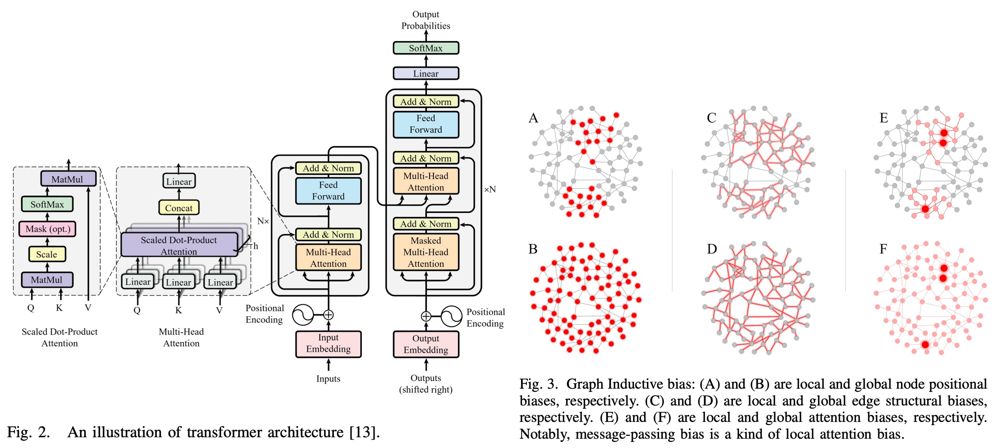

import GraphDemo from '@site/src/components/GraphDemo';
import GraphFeatureMatrixDemo from '@site/src/components/GraphFeatureMatrixDemo';

この文章は、論文ノートを書く際にグラフ畳み込みネットワークに出会ったことから書きました。

内容が非常に長いため、別の記事として紹介することにしました。

<!-- truncate -->

OpenAI のおかげで、現在、誰もが Transformer に非常に詳しいはずです。（そうでしょ？）

さまざまな自己注意機構や多頭注意機構、位置エンコーディングなど、すでに馴染みのある言葉ですね。

ですので、ここでは Transformer の概念を借りて、グラフ畳み込みネットワークを説明したいと思います。

## グラフ畳み込みネットワーク

グラフ畳み込みネットワーク（Graph Convolutional Networks、略して GCN）は、グラフ構造データに基づいて深層学習を行うモデルです。従来の畳み込みニューラルネットワーク（CNN）が規則的な格子データ（例えば画像）に適用されるのに対して、GCN は不規則なグラフ構造データを扱うことができ、ソーシャルネットワーク、知識グラフ、バイオインフォマティクスなどの分野で広く使用されています。

グラフの定義には 2 つの基本的な要素があります：

1. **ノード（Node）**：データ内の実体を表します。例えば、人、物、または概念などです。
2. **エッジ（Edge）**：ノード間の関係を示します。例えば、友達関係や物の類似性などです。

各「ノード」には特徴ベクトルがあり、例えば「人」を表す場合、身長、体重、年齢、性別、趣味などの特徴を用いて表現します。これらの特徴ベクトルは「特徴行列（Feature Matrix）」を構成します。一方、「エッジ」の関係は「隣接行列（Adjacency Matrix）」で表されます。

隣接行列は、グラフのノード間の接続関係を記述するための行列です。ノードが $n$ 個のグラフに対して、隣接行列 $A$ は $n \times n$ の行列であり、次のように定義されます：

- $A_{ij} = 1$ はノード $i$ とノード $j$ がエッジで接続されていることを示します。
- $A_{ij} = 0$ はノード $i$ とノード $j$ がエッジで接続されていないことを示します。

:::tip
ここで少し休憩。これまでの内容、どこかで見覚えがありませんか？

- **これって Transformer の注意行列に似ていませんか？**

ここで少し比較してみましょう：

- **ノード（Node）**：これは Transformer におけるトークンです。
- **エッジ（Edge）**：これはトークン間の関係です。
  :::

その後で Transformer と GCN の比較について再度議論しましょう。まずは GCN の基本概念の説明を続けます：

隣接行列の性質と特徴は以下の通りです：

- **対称性**：グラフが無向グラフであれば、隣接行列は対称行列です。つまり、$A_{ij} = A_{ji}$ です。
- **自己接続**：一部のグラフではノードが自己接続を許可します。つまり、$A_{ii} = 1$ですが、多くの場合、$A_{ii} = 0$として設定されます。

## 例を挙げてみましょう

Alice、Bob、Carol という 3 人がいて、彼らの友達関係は次のようになっています：

- Alice と Bob は友達です。
- Bob と Carol は友達です。
- Alice と Carol は直接的な友達関係がありません。

この関係は次のような隣接行列で表現できます：

$$
A =
\begin{bmatrix}
0 & 1 & 0 \\
1 & 0 & 1 \\
0 & 1 & 0
\end{bmatrix}
$$

この行列では：

- $A_{12} = A_{21} = 1$：Alice と Bob は友達です。
- $A_{23} = A_{32} = 1$：Bob と Carol は友達です。
- 他の要素は 0 で、直接的な友達関係がないことを示しています。

この隣接行列は「対称的」なので、このグラフは「無向グラフ」です。

グラフを画像にすると、次のようになります：

<GraphDemo />

## 隣接行列の拡張

実際の応用では、隣接行列はさらに拡張して、より多くの情報を表現できます。例えば：

1. **加重隣接行列**：

   もし友達同士の関係に強さの違いがある場合、重みを使って表現できます。例えば、Alice と Bob の間のやり取り回数が 3 回で、Bob と Carol の間のやり取り回数が 5 回である場合、加重隣接行列は次のように表せます：

   $$
   A =
   \begin{bmatrix}
   0 & 3 & 0 \\
   3 & 0 & 5 \\
   0 & 5 & 0
   \end{bmatrix}
   $$

2. **有向隣接行列**：

   もし友達関係が有向であれば（例えば、Alice が Bob に連絡を取るが、Bob は Alice に連絡しない場合）、隣接行列は非対称行列になります。例えば次のように：

   $$
   A =
   \begin{bmatrix}
   0 & 1 & 0 \\
   0 & 0 & 1 \\
   0 & 1 & 0
   \end{bmatrix}
   $$

   ここで、$A_{12} = 1$は Alice が Bob に連絡したことを示し、$A_{21} = 0$は Bob が Alice に連絡していないことを示しています。

## 特徴行列

隣接行列に加えて、グラフ内の各ノードには特徴ベクトルが含まれており、これらの特徴ベクトルは**特徴行列（Feature Matrix）** $X$を構成します。

$ n $個のノードがあり、各ノードに$d$次元の特徴があるグラフの場合、特徴行列$X$は$n \times d$の行列であり、$i$行目はノード$i$の特徴ベクトルを表します。

例えば、各人が 2 つの特徴（年齢と運動習慣）を持っているとしましょう（1 は運動習慣あり、0 は運動習慣なし）。以下のような特徴行列を構築できます：

$$
X =
\begin{bmatrix}
35 & 1 \\
50 & 0 \\
22 & 1
\end{bmatrix}
$$

この行列は次のように解釈できます：

- 第一行 $[35, 1]$ は、Alice の年齢が 35 歳で運動習慣があることを示しています。
- 第二行 $[50, 0]$ は、Bob の年齢が 50 歳で運動習慣がないことを示しています。
- 第三行 $[22, 1]$ は、Carol の年齢が 22 歳で運動習慣があることを示しています。

ここで、ノードの年齢は円の大きさで、運動習慣の有無は色で表しています：

<GraphFeatureMatrixDemo />

## GCN の数学

隣接行列と特徴行列について理解した後、グラフ畳み込みネットワーク（GCN）の数学的原理について詳しく探っていきます。

GCN の基本的なアイデアは、「畳み込み操作」を使ってグラフ構造上で情報を伝達および集約し、ノードの表現（すなわち埋め込みベクトル）を学習することです。

従来の畳み込みニューラルネットワーク（CNN）では、畳み込み操作は主に画像の空間構造で行われ、畳み込みカーネルを使って局所的な特徴を抽出します。同様に、GCN ではグラフの隣接関係構造で操作を行い、隣接するノードからの情報を使って各ノードの特徴表現を更新します。

GCN の各層は、**メッセージ伝達機構**として見ることができ、その主なステップは次の通りです：

1. **メッセージ集約（Aggregation）**：各ノードの隣接ノードから情報を集めます。
2. **メッセージ更新（Update）**：集約された情報を自分自身の特徴と組み合わせ、非線形関数で更新します。

GCN の基本操作は次の式で表すことができます：

$$
H^{(l+1)} = \sigma\left(\hat{A} H^{(l)} W^{(l)}\right)
$$

ここで：

- $H^{(l)}$ は第 $l$ 層のノード特徴行列です。第 1 層の場合、$H^{(0)} = X$ となり、入力の特徴行列です。
- $W^{(l)}$ は第 $l$ 層の学習可能な重み行列です。
- $\sigma$ は非線形活性化関数（例：ReLU）です。
- $\hat{A}$ は**正規化された隣接行列**で、トレーニングの安定性を保ち、ノードの次数（degree）を考慮します。

元の隣接行列$A$をそのまま使ってメッセージを伝達すると、固有値が大きすぎたり小さすぎたりして、モデルの安定性に影響を与える可能性があります。

そのため、隣接行列は正規化処理が施されます：

$$
\hat{A} = \tilde{D}^{-1/2} \tilde{A} \tilde{D}^{-1/2}
$$

ここで：

- $\tilde{A} = A + I_n$、$I_n$ は $n \times n$ の単位行列で、このステップは**自己接続の追加**と呼ばれ、各ノードが自身と接続されることを意味します。
- $\tilde{D}$ は $\tilde{A}$ の次数行列で、対角線上の要素 $\tilde{D}_{ii} = \sum_j \tilde{A}_{ij}$ です。

この正規化によって、メッセージ伝達の際にノードの次数が考慮され、次数が過度に高いまたは低いノードが学習に影響を与えないようにします。

前述の例を使って、隣接行列$A$と特徴行列$X$の情報を次のように示します：

$$
A =
\begin{bmatrix}
0 & 1 & 0 \\
1 & 0 & 1 \\
0 & 1 & 0
\end{bmatrix},
\quad
X =
\begin{bmatrix}
35 & 1 \\
50 & 0 \\
22 & 1
\end{bmatrix}
$$

- **ステップ 1：自己接続の追加**

  まず、自己接続を追加して、$\tilde{A}$を得ます：

  $$
  \tilde{A} = A + I_3 =
  \begin{bmatrix}
  1 & 1 & 0 \\
  1 & 1 & 1 \\
  0 & 1 & 1
  \end{bmatrix}
  $$

- **ステップ 2：次数行列$\tilde{D}$の計算**

  $$
  \tilde{D} =
  \begin{bmatrix}
  2 & 0 & 0 \\
  0 & 3 & 0 \\
  0 & 0 & 2
  \end{bmatrix}
  $$

- **ステップ 3：正規化隣接行列$\hat{A}$の計算**

  $$
  \hat{A} = \tilde{D}^{-1/2} \tilde{A} \tilde{D}^{-1/2} =
  \begin{bmatrix}
  \frac{1}{\sqrt{2}} & 0 & 0 \\
  0 & \frac{1}{\sqrt{3}} & 0 \\
  0 & 0 & \frac{1}{\sqrt{2}}
  \end{bmatrix}
  \begin{bmatrix}
  1 & 1 & 0 \\
  1 & 1 & 1 \\
  0 & 1 & 1
  \end{bmatrix}
  \begin{bmatrix}
  \frac{1}{\sqrt{2}} & 0 & 0 \\
  0 & \frac{1}{\sqrt{3}} & 0 \\
  0 & 0 & \frac{1}{\sqrt{2}}
  \end{bmatrix}
  $$

  計算結果は次のようになります：

  $$
  \hat{A} \approx
  \begin{bmatrix}
  0.5 & \frac{1}{\sqrt{6}} & 0 \\
  \frac{1}{\sqrt{6}} & \frac{1}{3} & \frac{1}{\sqrt{6}} \\
  0 & \frac{1}{\sqrt{6}} & 0.5
  \end{bmatrix}
  $$

- **ステップ 4：GCN 層の適用**

  GCN 層の重み行列$W^{(0)}$が次のように与えられるとします：

  $$
  W^{(0)} =
  \begin{bmatrix}
  w_{11} & w_{12} \\
  w_{21} & w_{22}
  \end{bmatrix}
  $$

  すると、次の層の特徴行列$H^{(1)}$は次のように計算されます：

  $$
  H^{(1)} = \sigma\left(\hat{A} X W^{(0)}\right)
  $$

  実際の計算手順は次の通りです：

  1. **行列積の計算**：まず$\hat{A} X$を計算します：

     $$
     \hat{A} X \approx
     \begin{bmatrix}
     0.5 & \frac{1}{\sqrt{6}} & 0 \\
     \frac{1}{\sqrt{6}} & \frac{1}{3} & \frac{1}{\sqrt{6}} \\
     0 & \frac{1}{\sqrt{6}} & 0.5
     \end{bmatrix}
     \begin{bmatrix}
     35 & 1 \\
     50 & 0 \\
     22 & 1
     \end{bmatrix}
     =
     \begin{bmatrix}
     0.5 \times 35 + \frac{1}{\sqrt{6}} \times 50 + 0 \times 22 & 0.5 \times 1 + \frac{1}{\sqrt{6}} \times 0 + 0 \times 1 \\
     \frac{1}{\sqrt{6}} \times 35 + \frac{1}{3} \times 50 + \frac{1}{\sqrt{6}} \times 22 & \frac{1}{\sqrt{6}} \times 1 + \frac{1}{3} \times 0 + \frac{1}{\sqrt{6}} \times 1 \\
     0 \times 35 + \frac{1}{\sqrt{6}} \times 50 + 0.5 \times 22 & 0 \times 1 + \frac{1}{\sqrt{6}} \times 0 + 0.5 \times 1
     \end{bmatrix}
     $$

  2. **重み行列$W^{(0)}$の適用**：次に、結果を$W^{(0)}$で掛け算します。

  3. **非線形関数$\sigma$の適用**：通常、ReLU 関数（$\sigma(x) = \max(0, x)$）を使用します。

これらのステップを通じて、GCN は各ノードの特徴とその隣接ノードの特徴を組み合わせ、新しい特徴表現を生成します。

このメッセージ伝達と集約のメカニズムにより、GCN はグラフ構造内の局所的および全体的な情報をキャプチャでき、ノード分類、グラフ分類、リンク予測などのさまざまなグラフ関連タスクで優れた性能を発揮します。

実際の応用では、通常、複数の GCN 層を積み重ねて、より広範囲なノード情報をキャプチャします。

各層の出力を次の層の入力として使い、階層的に高次の特徴表現を抽出します。例えば、2 層の GCN では各ノードの表現に 2 ホップ隣接ノードの情報が含まれ、3 層 GCN では 3 ホップ隣接ノードの情報が含まれる、といった具合です。

## GCN vs Transformer

さて、最初に取り上げた質問に戻りましょう：

グラフニューラルネットワーク（GCN）と Transformer は、その設計目的や適用されるシーンが異なるものの、ノード、エッジ、特徴行列に基づくメッセージ伝達と集約という多くの共通するコアコンセプトを持っています。それでは、これらの間にはどのような関係があるのでしょうか？

- **GCN は Transformer の一例と見なせるのでしょうか？**

まずは、GCN と Transformer のコアとなる公式を振り返ってみましょう：

- **GCN の基本的な更新式**

  $$
  H^{(l+1)} = \sigma\left(\hat{A} H^{(l)} W^{(l)}\right)
  $$

  ここで：

  - $H^{(l)}$：第 $l$ 層のノード特徴行列
  - $\hat{A} = D^{-\frac{1}{2}} A D^{-\frac{1}{2}}$：加重正則化された隣接行列
  - $W^{(l)}$：第 $l$ 層の学習可能な重み行列
  - $\sigma$：非線形活性化関数

  この式は、隣接行列$\hat{A}$を使ってノード特徴を局所的な隣接情報で加重集約し、グラフの構造情報とノード特徴を捉えます。

- **Transformer の自己注意機構の式**

  $$
  \text{Attention}(Q, K, V) = \text{softmax}\left(\frac{QK^\top}{\sqrt{d_k}}\right)V
  $$

  ここで：

  - $Q, K, V$ はそれぞれクエリ（Query）、キー（Key）、バリュー（Value）行列
  - $d_k$ はキーのベクトルの次元
  - $\text{softmax}$ は正規化を行い、重みの合計が 1 になるようにします。

  この式は、特徴間の相似性に基づいて動的に計算された注意重みを使用し、全体的な依存関係を学習します。これは固定のグラフ構造には依存しません。

### 制限された注意機構

もし、Transformer の注意行列をグラフの隣接行列（すなわち$\hat{A}$）に制限し、さらに注意重みが固定値（グラフの静的構造に基づく）であると仮定すると、Transformer の自己注意の式は次のように簡略化できます：

$$
\text{Attention}(Q, K, V) = \text{softmax}\left(\frac{QK^\top}{\sqrt{d_k}}\right)V \rightarrow \text{softmax}(\hat{A}) V
$$

ここで、クエリ、キー、バリュー行列$Q, K, V$がすべて同じノード特徴行列$H^{(l)}$から来ており、重み行列$W_Q = W_K = W_V = I$（単位行列）であると仮定すると、式は次のように変わります：

$$
\text{Attention}(H^{(l)}, H^{(l)}, H^{(l)}) = \text{softmax}\left(\frac{H^{(l)} H^{(l)\top}}{\sqrt{d_k}}\right) H^{(l)}
$$

さらに、$\text{softmax}\left(\frac{H^{(l)} H^{(l)\top}}{\sqrt{d_k}}\right)$を$\hat{A}$に置き換えると、注意重みが正規化された隣接行列であると仮定すると、自己注意の式は次のように簡略化されます：

$$
\text{Attention}(H^{(l)}, H^{(l)}, H^{(l)}) = \hat{A} H^{(l)}
$$

この時、Transformer の更新式は次のようになります：

$$
H^{(l+1)} = \sigma\left(\hat{A} H^{(l)} W^{(l)}\right)
$$

これで、Transformer と GCN を比較すると、Transformer では自己注意機構が各ノードをグラフ内の他の全てのノードと情報をやり取りすることを可能にし、グローバルな依存関係を形成します。数学的には、注意重み行列$\text{softmax}\left(\frac{QK^\top}{\sqrt{d_k}}\right)$は全結合の重み行列であり、動的に計算されます。一方、GCN ではメッセージ伝達は局所的な隣接領域に限定され、重み行列$\hat{A}$は疎で固定されたものです。

### 重みの学習の違い

Transformer では、注意重みはクエリとキーの相似性によって動的に学習されます。具体的な式は次の通りです：

$$
\alpha_{ij} = \frac{\exp\left(\frac{Q_i K_j^\top}{\sqrt{d_k}}\right)}{\sum_{k} \exp\left(\frac{Q_i K_k^\top}{\sqrt{d_k}}\right)}
$$

ここで、$\alpha_{ij}$はノード$i$がノード$j$に対する注意重みを示します。この動的な計算により、モデルは異なる入力データに基づいて重みを適応的に調整し、複雑な関連性を捉えることができます。

一方、GCN では重みはグラフの隣接構造によって決定され、次の式で表されます：

$$
\hat{A}_{ij} = \frac{A_{ij}}{\sqrt{d_i d_j}}
$$

ここで、$A_{ij}$は隣接行列の要素で、ノード$i$とノード$j$が接続されているかどうかを示し、$d_i$と$d_j$はそれぞれノード$i$とノード$j$の次数です。

この固定の重み計算方式はモデルの表現力を制限しますが、計算の複雑さを低減する効果もあります。

### 情報伝達の範囲と効率

Transformer では、情報はグラフ全体にわたって伝達されることができます。数学的には、全結合の注意行列として現れ、その計算複雑度は$O(N^2)$、ここで$N$はノードの数です。これにより、Transformer は大規模なグラフを処理する際に計算のボトルネックに直面する可能性があります。

これに対して、GCN の情報伝達は局所的な隣接領域に限定され、重み行列$\hat{A}$は疎であり、計算複雑度は通常$O(N \cdot d)$、ここで$d$はノードの平均次数です。これにより、GCN は大規模なグラフを効率的に処理することができます。

---

したがって、式の簡略化という観点から見ると：

1. **注意行列がグラフの隣接行列$\hat{A}$に制限される**：
   Transformer の元々の自己注意機構は、任意のノード間で情報を伝達することを許容していますが、GCN はグラフの局所的な隣接領域に限定されています。この制限は、情報伝達の範囲がグラフの構造に基づいて決まることを意味し、動的な学習には依存しません。

2. **注意重みが固定値である**：
   Transformer の自己注意重みは動的に計算され、クエリとキーの相似性に基づいています。しかし、これを$\hat{A}$（隣接行列）に固定すると、重みは動的ではなく、静的な構造に基づくものになります。これにより、これらの重みは学習可能ではなく、固定されたものになります。

以上の 2 つの条件に基づいて、GCN は Transformer の特別なケースとして捉えることができると考えます。

:::tip
ここで強調しておきたいのは、「私たちは」と言っている点で、これは私たちの学習過程における一つの理解方法に過ぎません。個人的な見解を代表するものです。

もし誤解があれば、指摘していただけるとありがたいです！
:::

## 結論

グラフ畳み込みネットワーク（GCN）と Transformer は、似て非なる存在であり、それぞれに得意な分野があります。

実際の応用においては、両者にはそれぞれの利点があります。たとえば、Transformer の自己注意機構は、モデルがデータの特徴に基づいて動的に情報伝達の重みを調整できるため、複雑で多様なデータパターンを扱う際に優れた利点を持っています。一方、GCN の固定された重みは、構造化されたデータにおいては非常に有効ですが、動的な関係性を必要とする場面では限界があります。

さらに、GCN は、ソーシャルネットワーク分析、知識グラフ、推薦システムなどのように、明確なグラフ構造を持つデータを処理するのに適しており、グラフのトポロジ情報を効率的に活用できます。Transformer は、自然言語処理やコンピュータビジョンなど、シーケンシャルデータや高次元データを扱う分野で優れたパフォーマンスを発揮し、長距離の依存関係や複雑なパターンを捉えることができます。

グラフ畳み込みネットワークのテーマは非常に広範で、多くのバリエーションや応用が存在します。ここでは基本的な概念を紹介したに過ぎません。

この文章が、グラフ畳み込みネットワークの基本的な原理と応用を理解する手助けとなることを願っています。

GCN と Transformer の最新の応用についてもっと知りたいですか？ぜひ論文をチェックしてみましょう！

- [**[24.07] Graph Transformers: A Survey**](https://arxiv.org/abs/2407.09777)

   

   <figure style={{"width": "80%"}}>
   
   </figure>
   

:::tip
この論文には 200 を超える参考文献があります。毎日 1 篇ずつ読めば、1 年間楽しく過ごせるかもしれません！（~実際はそんなことはありません~）
:::

## 参考文献

- [**[16.09] Semi-Supervised Classification with Graph Convolutional Networks**](https://arxiv.org/abs/1609.02907)
- [**[17.06] Attention is All You Need**](https://arxiv.org/abs/1706.03762)
