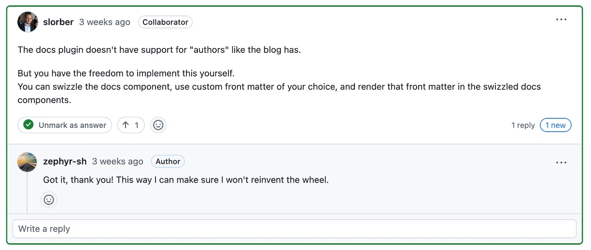
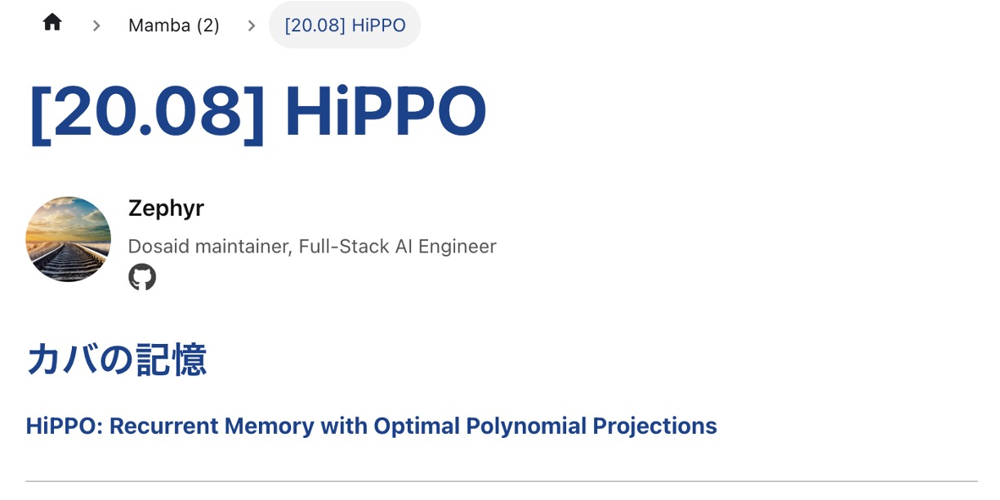

もしあなたが Docusaurus を使ってウェブサイトを作成しているなら、Docusaurus には主に 2 つのコンテンツタイプがあることをご存知でしょう：

- ブログ用のプラグインは：`@docusaurus/plugin-content-blog`
- 技術文書部分は：`@docusaurus/plugin-content-docs`

その中で、`blog`には著者情報を追加する機能があり、`docs`にはその機能がありません。

あらら、晴天の霹靂！

<!-- truncate -->

## まずはオフィシャルに問い合わせてみる

最初に Docusaurus の GitHub で質問を投稿し、オフィシャルがこの機能をサポートしているかどうかを確認しました。

- [**How to add author info to docs? #10701**](https://github.com/facebook/docusaurus/discussions/10701)

    <div align="center">
    <figure style={{"width": "90%"}}>
    
    </figure>
    </div>

もしかしたら Docusaurus の作者が親切に、この機能を追加してくれるかもしれません。

しかし、しばらく待った後、オフィシャルからの返信は次の通りでした：

<div align="center">
<figure style={{"width": "90%"}}>

</figure>
</div>

簡単に言うと、自分で解決しなさいということでした。オフィシャルはサポートしていません。

お願いするよりも自分でなんとかするしかない、ということで、私たちは覚悟を決めて進めることにしました。

## 著者情報を追加する

元々の設計では、著者情報は `blog/authors.yml` というファイルに格納されています。その内容はおおよそ以下のようになります：

```yml
Z. Yuan:
  name: Z. Yuan
  title: Dosaid maintainer, Full-Stack AI Engineer
  url: https://github.com/zephyr-sh
  image_url: https://github.com/zephyr-sh.png
  socials:
    github: "zephyr-sh"
```

同じパスに新しく `blog/authors.json` というファイルを作成し、同じ内容を JSON 形式で書き換えます：

```json
{
  "Z. Yuan": {
    "name": "Z. Yuan",
    "title": "Dosaid maintainer, Full-Stack AI Engineer",
    "url": "https://github.com/zephyr-sh",
    "image_url": "https://github.com/zephyr-sh.png",
    "socials": {
      "github": "zephyr-sh"
    }
  }
}
```

:::info
開発中に YML ファイルを解析する方法が非常に面倒だったため、テストを重ねた結果、JSON 形式に変更する方が最も簡単でした。
:::

:::tip
これは `docs` 用のファイルですが、`blog` フォルダ内に保存しています。こうすることで、更新時に一緒に処理し忘れないようにしています。
:::

## DocItem/Content を抽出する

:::warning
この手順からは、Docusaurus のソースコードを変更する必要があります。

その後、Docusaurus に破壊的なバージョンアップがあった場合、この変更がサイトが正常に動作しなくなる原因となる可能性があります。サイトのメンテナンスができるか確認した上で、引き続き進めてください。
:::

まず、`DocItemContent`のコードを抽出します。以下のコマンドを実行してください：

```shell
npx docusaurus swizzle @docusaurus/theme-classic DocItem/Content
```

実行後、いくつかの問題に直面することになります：

1. **Which language do you want to use?**

   私たちは `JavaScript` を選択します。

2. **Which swizzle action do you want to do?**

   私たちは `Eject` を選択します。

3. **Do you really want to swizzle this unsafe internal component?**

   私たちは `YES: I know what I am doing!` を選択します。

---

これで、`src/theme/DocItem/Content` というパスに `index.js` というファイルが作成されます。このファイルを編集する必要があります。

- このプログラムのソースコードはこちらにあります：[**docusaurus-theme-classic/src/theme/DocItem/Content**](https://github.com/facebook/docusaurus/blob/main/packages/docusaurus-theme-classic/src/theme/DocItem/Content)

編集後のコードは以下の通りです：

```jsx
import { useDoc } from "@docusaurus/plugin-content-docs/client";
import { ThemeClassNames } from "@docusaurus/theme-common";
import DocItemAuthors from "@theme/DocItem/Authors";
import Heading from "@theme/Heading";
import MDXContent from "@theme/MDXContent";
import clsx from "clsx";
import React from "react";

function useSyntheticTitle() {
  const { metadata, frontMatter, contentTitle } = useDoc();
  const shouldRender =
    !frontMatter.hide_title && typeof contentTitle === "undefined";
  if (!shouldRender) {
    return null;
  }
  return metadata.title;
}

export default function DocItemContent({ children }) {
  const syntheticTitle = useSyntheticTitle();

  return (
    <div className={clsx(ThemeClassNames.docs.docMarkdown, "markdown")}>
      {syntheticTitle ? (
        <header>
          <Heading as="h1">{syntheticTitle}</Heading>
          <DocItemAuthors />
          <MDXContent>{children}</MDXContent>
        </header>
      ) : (
        <>
          <DocItemAuthors />
          <MDXContent>{children}</MDXContent>
        </>
      )}
    </div>
  );
}
```

主要追加したモジュール

- `import DocItemAuthors from "@theme/DocItem/Authors";`

この部分は後で実装します。

## DocItem/Authors の実装

それでは、`Authors` コンポーネントを実装していきます。以下のコマンドを実行してください：

```shell
mkdir -p src/theme/DocItem/Authors
touch src/theme/DocItem/Authors/index.js
touch src/theme/DocItem/Authors/styles.module.css
```

この部分は、`Blog` の `Authors` コンポーネントを参考にして、同じように実装します。

- [**docusaurus-theme-classic/src/theme/Blog/Components/Author**](https://github.com/facebook/docusaurus/tree/main/packages/docusaurus-theme-classic/src/theme/Blog/Components/Author)

その中で `DocItem/Authors/index.js` のコードは以下の通りです：

```jsx
import { useDoc } from "@docusaurus/plugin-content-docs/client";
import authorsData from "@site/blog/authors.json";
import React from "react";
import {
  FaEnvelope,
  FaGithub,
  FaLinkedin,
  FaRss,
  FaStackOverflow,
  FaTwitter,
} from "react-icons/fa";
import styles from "./index.module.css";

function normalizeSocialLink(platform, handleOrUrl) {
  const isAbsoluteUrl =
    handleOrUrl.startsWith("http://") || handleOrUrl.startsWith("https://");
  if (isAbsoluteUrl) {
    return handleOrUrl;
  }
  switch (platform) {
    case "x":
      return `https://x.com/${handleOrUrl}`;
    case "github":
      return `https://github.com/${handleOrUrl}`;
    case "linkedin":
      return `https://www.linkedin.com/in/${handleOrUrl}/`;
    case "stackoverflow":
      return `https://stackoverflow.com/users/${handleOrUrl}`;
    case "newsletter":
      return handleOrUrl;
    case "email":
      return `mailto:${handleOrUrl}`;
    default:
      return handleOrUrl;
  }
}

const socialIconMap = {
  x: FaTwitter,
  github: FaGithub,
  linkedin: FaLinkedin,
  stackoverflow: FaStackOverflow,
  email: FaEnvelope,
  newsletter: FaRss,
};

export default function DocItemAuthors() {
  const { frontMatter } = useDoc();
  let { authors } = frontMatter;

  if (!authors) {
    return null;
  }

  if (typeof authors === "string") {
    authors = [authors];
  }

  const resolvedAuthors = authors
    .map((authorKeyOrObj) => {
      if (typeof authorKeyOrObj === "string") {
        const authorInfo = authorsData[authorKeyOrObj];
        if (!authorInfo) {
          console.warn(
            `No author data found for key '${authorKeyOrObj}' in authors.json`
          );
          return null;
        }
        return {
          name: authorInfo.name,
          title: authorInfo.title,
          url: authorInfo.url,
          imageURL: authorInfo.image_url,
          socials: authorInfo.socials,
          description: authorInfo.description,
        };
      } else {
        const { name, title, url, image_url, imageURL, socials, description } =
          authorKeyOrObj;
        return {
          name,
          title,
          url,
          imageURL: imageURL || image_url,
          socials,
          description,
        };
      }
    })
    .filter(Boolean);

  if (resolvedAuthors.length === 0) {
    return null;
  }

  return (
    <div className={`${styles.docAuthors} margin-bottom--md`}>
      {resolvedAuthors.map((author, index) => {
        const { name, title, url, imageURL, socials, description } = author;
        return (
          <div key={index} className={styles.docAuthor}>
            {imageURL && (
              
            )}
            <div>
              <div className={styles.docAuthorName}>
                {url ? (
                  <a href={url} target="_blank" rel="noopener noreferrer">
                    {name}
                  </a>
                ) : (
                  name
                )}
              </div>
              {title && <div className={styles.docAuthorTitle}>{title}</div>}
              {description && (
                <div className={styles.docAuthorDesc}>{description}</div>
              )}

              {socials && (
                <div className={styles.docAuthorSocials}>
                  {Object.entries(socials).map(([platform, handleOrUrl]) => {
                    const SocialIcon = socialIconMap[platform] || FaEnvelope;
                    const normalizedUrl = normalizeSocialLink(
                      platform,
                      handleOrUrl
                    );
                    return (
                      <a
                        key={platform}
                        href={normalizedUrl}
                        target="_blank"
                        rel="noopener noreferrer"
                        className={styles.docAuthorSocialLink}
                      >
                        <SocialIcon size={20} />
                      </a>
                    );
                  })}
                </div>
              )}
            </div>
          </div>
        );
      })}
    </div>
  );
}
```

ここでは `react-icons` を使用しているため、もしインストールしていない場合は、以下のコマンドを実行してください：

```shell
yarn add react-icons
```

注意すべき点は、いくつかの場所でハードコーディングが行われていることです。例えば：

```jsx
function normalizeSocialLink(platform, handleOrUrl) {
  const isAbsoluteUrl =
    handleOrUrl.startsWith("http://") || handleOrUrl.startsWith("https://");
  if (isAbsoluteUrl) {
    return handleOrUrl;
  }
  switch (platform) {
    case "x":
      return `https://x.com/${handleOrUrl}`;
    case "github":
      return `https://github.com/${handleOrUrl}`;
    case "linkedin":
      return `https://www.linkedin.com/in/${handleOrUrl}/`;
    case "stackoverflow":
      return `https://stackoverflow.com/users/${handleOrUrl}`;
    case "newsletter":
      return handleOrUrl;
    case "email":
      return `mailto:${handleOrUrl}`;
    default:
      return handleOrUrl;
  }
}

const socialIconMap = {
  x: FaTwitter,
  github: FaGithub,
  linkedin: FaLinkedin,
  stackoverflow: FaStackOverflow,
  email: FaEnvelope,
  newsletter: FaRss,
};
```

もしこれらのソーシャルメディアの URL 形式が変更された場合、その部分を修正する必要があります。

最後に、`DocItem/Authors/styles.module.css` のコードは以下の通りです：

```css
.docAuthor {
  display: flex;
  align-items: center;
  margin-bottom: 2rem;
}

.docAuthorImg {
  width: 60px;
  height: 60px;
  border-radius: 50%;
  margin-right: 0.75rem;
  object-fit: cover;
}

.docAuthorName {
  font-weight: 600;
  font-size: 1rem;
  margin-bottom: 0.25rem;
  color: #111;
}

.docAuthorName a {
  text-decoration: none;
  color: inherit;
}

.docAuthorName a:hover {
  text-decoration: underline;
}

.docAuthorTitle {
  font-size: 0.85rem;
  color: #555;
  margin-bottom: 0.25rem;
  line-height: 1.2;
}

.docAuthorDesc {
  font-size: 0.85rem;
  color: #333;
  margin-bottom: 0.4rem;
  line-height: 1.4;
}

.docAuthorSocials {
  display: flex;
  gap: 0.5rem;
  flex-wrap: wrap;
  align-items: center;
}

.docAuthorSocialLink {
  display: inline-flex;
  align-items: center;
  text-decoration: none;
  color: inherit;
  line-height: 1;
}

.docAuthorSocialLink:hover {
  color: var(--ifm-color-primary);
}
```

こちらの実装方法は個人のスタイルにより異なりますが、私たちは何度かテストした結果、このスタイルが良いと感じました。

必要に応じて、これらのスタイルを変更することができます。

## ドキュメントの FrontMatter を調整する

最後に、`docs`のドキュメントで著者情報を表示できるようにするため、ファイルの`FrontMatter`に著者情報を追加する必要があります。

私たちのウェブサイトの記事例：[**[20.08] HiPPO: カバの記憶**](https://docsaid.org/ja/papers/mamba/hippo)

この記事の元々の書き方は次の通りでした：

```mdx
# [20.08] HiPPO

## カバの記憶

[**HiPPO: Recurrent Memory with Optimal Polynomial Projections**](https://arxiv.org/abs/2008.07669)
```

今、著者情報を追加するために、「**#**」をタイトルとして使用することはできません。その代わりに`FrontMatter`を使ってタイトルを定義する必要があります。

したがって、次のように修正します：

```mdx
---
title: "[20.08] HiPPO"
authors: Z. Yuan
---

## カバの記憶

[**HiPPO: Recurrent Memory with Optimal Polynomial Projections**](https://arxiv.org/abs/2008.07669)
```

`authors` の部分に著者名を指定することで、著者情報が表示されます。

:::tip
`authors` の名前が `authors.json` の名前と一致していることを確認してください。一致していないと、著者情報は表示されません。
:::

## 実装完了

最後に、ウェブサイトでの効果を見てみましょう：

<div align="center">
<figure style={{"width": "60%"}}>

</figure>
</div>

上の図のように、私たちはついに`docs`のドキュメントに著者情報を追加することに成功しました。素晴らしいですね！

これが私たちの実装過程です。あなたのお役に立てれば幸いです。
