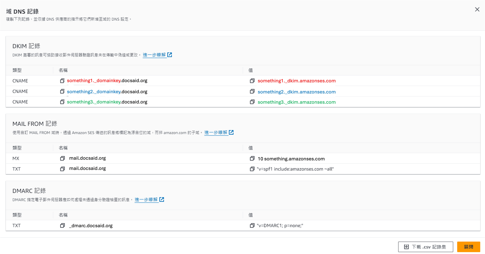
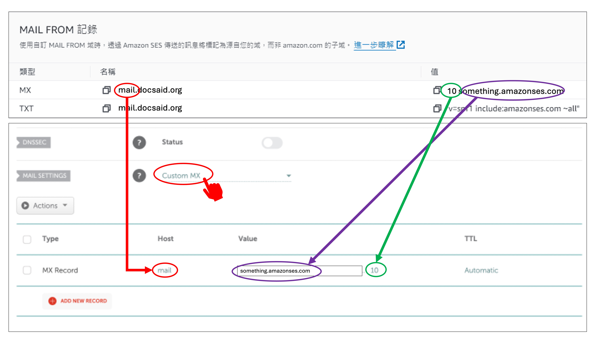

Amazon SES サービスを有効にしようとした際、検証プロセスの中で Amazon から DNS レコードの設定を求められました。

この設定方法を見つけるのに、結構な時間を費やしました。（約 30 分）

ここに記録しておくので、今後の参考にしてください。

<!-- truncate -->

## Amazon SES 設定

Amazon SES の設定については、すでに詳しい解説記事が存在します。以下のリンクを参考にしてください。

- [**Amazon SES メールサービス、2024 年最新の申請手順完全ガイド**](https://www.quantsnote.com/amazon-ses-how-to-apply/)

私たちは順調に設定を進め、「**送信ドメインの検証**」のステップまで到達しましたが、ここでつまずきました。

私たちのドメインは Namecheap で取得しているため、Namecheap 上で DNS レコードを設定する必要があります。

では、具体的にどのように設定すればよいのでしょうか？

## DNS レコード

Amazon SES の「**送信ドメインの検証**」カード内にある「**DNS レコードを取得**」をクリックすると、詳細な DNS レコード情報が記載されたポップアップが表示されます。以下のような画面になります。

ここで、例として `docsaid.org` が検証対象のドメインとなっています。

この DNS レコードを取得したら、Namecheap に設定していきます。

:::tip
各フィールドのデータは一部変更しており、当サイトのセキュリティを保護しています。
:::

## DKIM レコード

まず、Namecheap のサイトを開き、ログイン後、「**ドメインリスト**」をクリックし、設定したいドメインの「**管理**」を選択します。

ドメイン管理ページで「**Advanced DNS**」セクションを探してクリックします。

上の画像のように、「**Add New Record**」ボタンがあるので、これをクリックし、「**CNAME Record**」を選択します。

次に、先ほどの DKIM レコード情報を入力します。入力時の注意点は以下の通りです。

1. DKIM の `Name` フィールドの値は、`Host` フィールドに入力しますが、ドメイン部分を除いたプレフィックスのみを入力します。
2. `Value` フィールドには、提供された値をそのままコピー＆ペーストします。

## MAIL FROM レコード

この部分で最も時間がかかりました。というのも、必要なのは MX レコードの設定だけで、それ以外は無視しても問題ないからです。

Namecheap の「**Advanced DNS**」ページで、「**MAIL SETTINGS**」セクションを探します。横にあるドロップダウンメニューから「**Custom MX**」を選択します。

次に、Amazon SES から提供された MX レコードを入力します。以下の点に注意してください。

1. Amazon SES で設定したサブドメインに応じて、対応する `Host` フィールドを入力します。例では `mail` を使用していますが、別のサブドメインを使う場合は、それに対応する値を入力してください。
2. `Value` フィールドには、優先度を示す `10` を `Priority` フィールドに入力し、それ以降の値を `Value` フィールドに入力します。

:::info
Namecheap の Mail Settings は `Email Forwarding` と `Custom MX` のいずれか一方しか選択できません。

- `Email Forwarding` を有効にすると、Namecheap 側で MX レコードが固定され、メール転送サーバーにしか設定できなくなります。
- `Custom MX` を有効にすると、Amazon SES が提供する MX レコードを手動で設定でき、SES 側でバウンス処理が可能になります。
  :::

## DMARC レコード

この設定は最も簡単です。Namecheap の「**Advanced DNS**」ページで、「**Add New Record**」をクリックし、「**TXT Record**」を選択します。

その後、Amazon SES から提供された DMARC レコードを入力します。唯一の注意点は、`"` を入力しないことです。

## まとめ

以上で、Amazon SES の DNS 設定を Namecheap 上で完了しました。

設定が完了したら、しばらく待ちます。通常 30 分ほどで Amazon SES が DNS レコードを自動検証し、正常に完了すると Amazon SES から成功の通知メールが届きます。

成功を祈ります！
