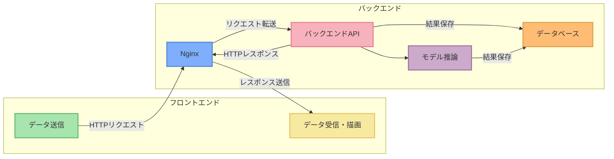
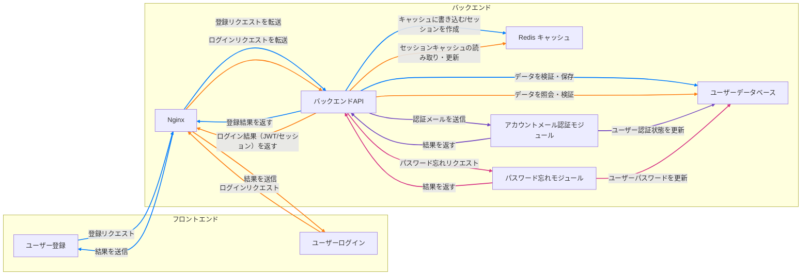
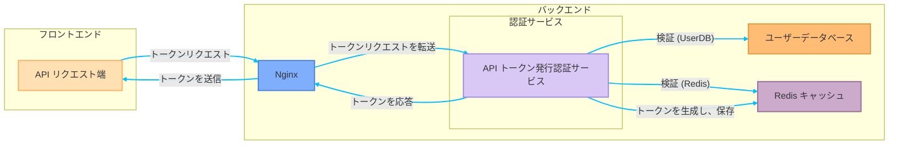
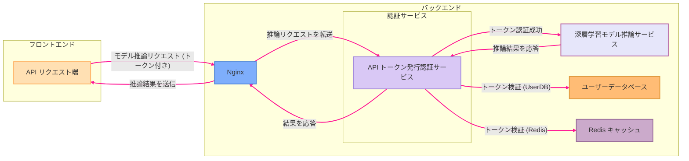
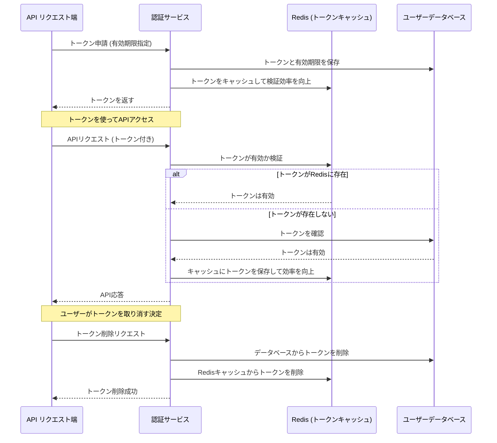
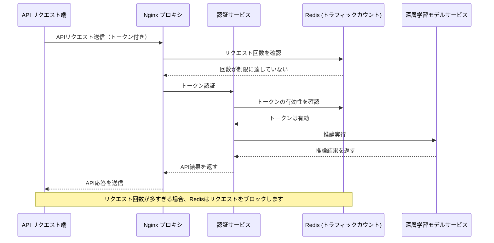

こんにちは、もしくはこんばんは。

最近、記事の更新が少し滞ってしまいました。まず最初に、皆さんにお詫びを申し上げます。

なぜかというと、私は本業から外れて、フロントエンドとバックエンドを作っていたからです。

<!-- truncate -->

## まさかの暇つぶし？

確かに。

---

最近、ちょうど長期休暇を取ることができ、やっと手が空いて、以前時間がなくて解決できなかった問題を整理することができました：

- **このサイトにはバックエンドがない！**

おそらく少しは知っているかもしれませんが、このサイトは Docusaurus フレームワークを使って作成された静的サイトです。サイトを作成した当初、私はただ気まぐれにブログを書いたり、論文のメモをシェアしたりしようと思っていただけで、特別な計画や大きな目標はありませんでした。

静的サイトと動的サイトにはそれぞれの長所と短所があることは、私がもう一度説明するまでもないでしょう。以前は WordPress を使ってサイトを作ろうとしましたが、数歩進んだところで何か人物が現れてお金を要求してきて、本当にイライラさせられました：

> **サイトを作るだけでこんなに利益が少ないのに、どうして誰かが私のお財布を狙っているんだろう？**

その後、WordPress をしばらく運用しましたが、結局諦めました。

全てが高額な有料サービスが原因ではなく、そのコードがカスタマイズしづらかったからです……まあ、言い訳をしても仕方ないですが、PHP を書くのが苦手だというのが本音です。

それに比べて、やはりフロントエンドとバックエンドが分離された構造の方が、私にはずっと快適に感じました。

その後の話はご存知の通り、最終的には Docusaurus を選び、今に至っています。ぐるっと回って、また静的サイトの構造に戻ってきました。

＊

サイトの内容が徐々に増えていくと、読者からのメールが届き始めました。たいていはモデルの使い方に関する質問です：環境の設定方法、依存関係のインストール方法、さらには運用中に遭遇した奇妙なエラーの解決方法など。

これらは簡単に解決できます。彼らには ChatGPT に聞くように伝えれば、問題は解決です。（~あまりにも手軽すぎる？~）

手軽ではありません。今の AI ツールは非常に強力で、大半の問題はすぐに答えが得られます。無駄に私とメールのやり取りをする必要はありません。

もちろん、AI では解決できない問題もあります。例えば、読者が私のバックエンド API を直接呼び出せるようにしてほしい、というリクエストがありました！

おっと！一見簡単な要求に見えますが、実際に実行するとなるといくつか問題が発生します。その話は後ほど。

## 初代バックエンド

少し時間を戻してみましょう。

いくつかのモデルを作った後、私はそのモデルをみんなに使ってもらいたいと思うようになりました。それは、まるで海辺で砂で城壁を作り、波が来てその城壁がどれだけ丈夫かを試すのを待っているようなものです。波に崩されても問題ありません、少なくともやってみたという努力があったのです。

モデルを作るのも同じです。おそらくどのエンジニアも、モデルを作り終わった後、それを隠して誰にも知られないようにすることはないでしょう……それなら作る意味がないですから。

そこで、私はいくつかのモデルのデモを作り、初代バックエンドを作成しました：そう、これがこのサイトのナビゲーションバーにある「遊び場」です。もしまだ試したことがなければ、ぜひ遊んでみてください。

「デモを作るだけなら、バックエンドなんて必要ないだろう」と思うかもしれません。

その通りです。一般的に、モデルをウェブ上で使う方法は 2 つの解決策があります：

1. **ウェブから直接モデルをロードして、ブラウザで推論を実行する。**

   この案は最初に出た時点で自分で却下しました。

   ブラウザでモデルを動かすことは不可能ではありませんが、面倒です。少なくとも 3 つ以上のブラウザに対応し、それぞれの動作環境設定が異なります。これを聞いた WebAssembly で大変だったフロントエンドの仲間たちは、きっと私を止めていたでしょう。

2. **バックエンドサービスを提供して、推論結果を返す。**

   これは後に私が採用した案です。

   フロントエンドはデータの送受信だけを行い、面倒な処理はすべてバックエンドに任せます。しかし、これには必ずバックエンドシステムを自分で作成して、対応するサービスを提供しなければならないという意味でもあります。

---

フロントエンドにはすでに Docusaurus を使用しているので、ここでは必然的にフロントエンドとバックエンドが分離された構造を採用しなければなりません。

プログラムを書き始める前に、まずは図を描きました。この構成は、次のような形になります：

実際、この構成図の他にも多くの仕様やシステムの操作フロー、入力・出力の詳細設計などを書きましたが、非常に煩雑なのでここでは構成図だけにとどめておきます。

仕様を決めた後は、図に従って作業を進め、現在の「遊び場」の背後にある運用ロジックが完成しました。

ここまで見ると、シンプルに見えるかもしれませんが、私が選んだ技術スタックについて少し話してみましょう。

1. **Nginx**

   ここでよく聞くもう一つの選択肢は Apache です。かつて Apache はウェブサーバーの王者であり、豊富な機能と多様なモジュール、大きなコミュニティを誇り、広範なユーザーを持っています。しかし、Apache の設定は少し複雑であり、高い同時接続数の処理能力において Nginx に劣ります。

   正直言うと、Apache が悪いとは思いませんが、私は Nginx のシンプルで直感的な設定スタイルが好きです。静的リソースの代理やリバースプロキシ、負荷分散など、Nginx の設定方法は理解しやすいです。ただし、これは好みの問題であり、この設定スタイルを好まない人もいます。

   最後に、Nginx はもともと大量の同時接続を処理するために設計されており、安定性とパフォーマンスは市場と時間によって証明されています。これも一つの良い選択肢だと思います。

   ***

2. **FastAPI**

   バックエンドフレームワークでよく聞くのは C#や Node.js ですが、残念ながら私はそれらにはあまり詳しくありません。

   AI エンジニアとして、最も馴染みがあるのは Python 環境です。今、急に Node.js や他の言語のバックエンドフレームワークを学び始めるのは、私にとって学習コストが高すぎます。その場合、開発が数ヶ月遅れる可能性も十分にあります。

   それで、私は FastAPI を選びました。

   FastAPI は非同期操作を天然にサポートしており、後端のモデル推論のような時間がかかるが効率的に並行リクエストを処理する必要があるシーンに非常に適しています。さらに、FastAPI には Pydantic による検証機能が組み込まれており、API のドキュメントを自動生成でき、テストインターフェースも準備されているため、API の開発とメンテナンスの際の苦痛が大幅に減少します。

   重要なのは、FastAPI の設計がシンプルで理解しやすい点です。Django のように重くて煩雑ではなく、Flask のように自由すぎてアーキテクチャが混乱することもなく、開発体験はまさに理想的です。

   ***

3. **PostgreSQL**

   データベースについて話すと、私は実は MySQL の方が詳しいです。

   MySQL は開発コミュニティ内でも評判が良く、多くの初心者にとって最初のデータベースとして選ばれますが、Oracle に買収されて以来、MySQL のオープンソースライセンスが商業化の方向にシフトしており、そのエコシステムに不確定性を感じるようになっています。

   それに対して、PostgreSQL はオープンソースコミュニティで安定的に成長し続けています。継続的なコミュニティサポートに加え、PostgreSQL は JSON データ型や GIS 地理情報処理など、複雑なデータ要求に対して強力な機能を提供しています。

   さらに、PostgreSQL は FastAPI やさまざまな ORM ツール（例えば SQLAlchemy）との統合が非常にスムーズで、使いやすい体験を提供します。さらに、PostgreSQL は大量の同時接続や高負荷リクエストの処理能力にも優れており、将来的にサイトのトラフィックが増えたり、バックエンドの要求が複雑になったりしても、データベースがボトルネックになる心配は少ないでしょう。

   ***

これまで話したことは、必ずしも最適な組み合わせではありませんが、現時点でのニーズには十分に対応できるものです。

私のシンプルな構成には、これで十分です。

## 第二代バックエンド

最初に触れた問題に戻ります。読者からのメールで、私のバックエンド API をウェブインターフェースを介さずに直接プログラムで呼び出したいという要望がありました。これは面白いリクエストで、ユーザーがシステムとより自動化され、高効率な方法でインタラクトしたいと考えていることを示唆しています。

では、API を直接開放してユーザーが自由に呼び出せるようにすると、どんな問題が発生するのでしょうか？

1. **トラフィックが爆発する**

   API が直接外部に開放されると、ユーザーはプログラムを使って高頻度でリクエストを送ることができ、それがサーバーのトラフィック急増を引き起こし、負荷能力を超えてしまう可能性があります。

   例えば、一部のユーザーは適切なリクエスト頻度を設定せず、API が短期間で大量のリクエストを受けることになります。これが他のユーザーの正常なアクセスに影響を与えることになります。また、クローラーや悪意のあるスクリプトを使って API をテストする人もおり、サーバーの帯域幅や計算資源が大量に消費され、サービスの安定性に悪影響を与える可能性があります。

   ***

2. **セキュリティリスクがある**

   API を開放した後、適切な認証やアクセス制御がなければ、誰でも本来アクセスすべきでないデータを取得したり、危険な操作を実行したりする可能性があります。例えば、API に適切な認証機能（OAuth や JWT など）がなければ、悪意のある者が簡単なリクエストを使って合法的なユーザーを模倣し、セキュリティリスクを引き起こす可能性があります。

   ***

その他にも延長的な問題はまだまだありますが、ここでは省略します。

とにかく、直接開放することはできません。私自身と私のサーバーがそのために危機的な状況に陥るかもしれません。

そのため、API を開放するというニーズを満たすためには、ユーザー認証と API 認証の認可システムを自分で作成しなければならないということです。

さて、いつものように言いますが：エンジニアは未経験を恐れず、手を動かさなければならない、私は今すぐプログラムを書きます！

### ユーザーログインシステム

完全なユーザーシステムには、ユーザー登録、ログイン、権限管理、メール認証などの機能が含まれます。

元々使用している FastAPI と PostgreSQL データベースに加えて、Redis を導入してセッションキャッシュとトークン管理を行いました。ユーザー体験を向上させるために、メール認証やパスワード忘れ機能も設計し、SMTP サービスを利用して認証メールを送信しました。

さて、ここでまた構成図を描くことができます。簡単に描いてみました：

このユーザーシステムには、ユーザーデータベース、パスワード暗号化、登録メール認証、パスワード忘れリセットプロセスなど、さまざまな詳細が含まれています。ここでは、Google や Facebook のアカウントを使ったサードパーティログイン機能の統合については考慮していません。もしサードパーティログイン認証を追加するなら、それにはさらに多くの作業が必要になりますので、それは未来の自分に任せておきます。

登録メール認証の部分について言うと、これが思っていたよりも手間がかかりました。

最初に Amazon SES を申請したところ、1 日後に拒否されました。彼らは私を怪しいと感じたようです。（何故？）

<figure style={{"width": "60%"}}>

</figure>

それなら、自分でメールサーバーを立てればいいかと思って、また手動で色々と操作をして、1 日かかってようやくサーバーを立てました。

しかし、送信したメールは再び Gmail に拒否されました。なぜなら、彼らも私を怪しいと感じたからです。（😭 😭 😭）

最終的に、別のプロバイダーを見つけてこの問題を解決したので、それについてはもう言及しません。

そんなこんなで、1 週間以上かかってようやく規格を完成させ、簡単なページの構築を終えましたが、数千行のコードを書きました。その結果、CP（コストパフォーマンス）値がとても低いように感じます。

ここまでプログラムを書いて、私はなぜどの企業でもフロントエンドとバックエンドが常にお互いに不満を持ち、喧嘩しているのかが理解できました。結局、仕様を決めることがどれだけ重要かということです。たとえ一人で書いていても、仕様をしっかりと定めておかないと、自分で苦しむことになります。

### API Token 発行システム

ユーザーシステムを完成させた後、ついに API トークンの機能を作成することができました。

現在、最も一般的なトークン形式は JWT（JSON Web Token）で、その特徴の一つは JWT が自己完結型（self-contained）であることです。トークンが有効であるかどうかを確認するだけで、ユーザーの身分と権限を知ることができ、データベースの頻繁なクエリを減らし、パフォーマンスを向上させます。さらに、JWT 内部にユーザー ID、権限、有効期限などの情報を保存でき、追加の API クエリを避けることができます。

そのため、私は JWT をそのまま使用しました。ユーザーはログインして身分を認証した後、システムが JWT を生成し、Redis に保存します。ユーザーが API リクエストを送信する際に、JWT が Bearer トークンとしてバックエンドに送られ、身分認証を行います。トークンが認証されると、バックエンドのモデル推論サービスにアクセスできるようになります。

この部分は比較的シンプルで、トークンを申請するための構成図は次のようになります：

ユーザーがトークンを取得した後、このトークンを使って API を呼び出すことができます。この部分で、Redis はトラフィック制限と呼び出し回数の計算に使用されます。全体的な呼び出しフローは次のようになります：

### API トークン管理機構

トークン設計時に、私はトークンの有効期限をユーザー自身で設定できるようにし、再発行メカニズムは設けませんでした。代わりに、手動でトークンの取り消しと削除を行うことができ、API のアクセス権限の柔軟性とセキュリティを確保しています。

ユーザーがトークンを申請する際に、有効期限（例えば 1 時間、1 日、7 日、または 1 年など）を指定できます。一度トークンが期限切れになると、システムは自動的に無効にし、ユーザーは新しいトークンを再度申請する必要があります。

この設計により、開発者は自分のニーズに合わせた適切なトークン期限を選択でき、頻繁な再認証を避けることができます。

ユーザーはいつでもトークンを取り消したり削除したりすることができ、トークンが漏洩したり、もはや必要でなくなった場合、即座に削除して無効にすることができます。

トークンの状態は Redis に保存されており、ユーザーが手動でトークンを取り消すと、システムは即座にそれを無効としてマークします。その後の API リクエストは拒否されます。これにより、不要な長期間の認証リスクを避け、システムの可制御性を確保することができます。

このフローの構成図は次のようになります：

:::info
**なぜ再発行メカニズムを使わないのか？**

- ユーザーが自分で有効期限を設定できることで、API の柔軟性が向上し、システムが過度にユーザーのトークン管理に干渉しないようにできます。
- 再発行メカニズムがないことで、トークンは設定された期限内で固定的に有効となり、頻繁な再認証による余分な検証負担を回避できます。
- トークンを手動で取り消すことができるため、トークンが漏洩した場合やもはや不要になった場合、即座に無効にすることができ、セキュリティが向上します。

この設計は、長期的にアクセスが必要だが、セキュリティも保ちたいユーザーにとって、シンプルでありながら制御可能なトークン管理方法を提供します。
:::

### API トラフィック制限

トークンを取得した後、次の問題は「悪意のあるユーザーが API を濫用するのをどう防ぐか？」です。

API は大量の推論リクエスト（AI モデルの推論やバッチクエリなど）を含む可能性があるため、制限をかけないと、悪意のある攻撃によって正常なユーザーの使用に影響を及ぼすことがあります。そこで、私は「レート制限（Rate Limiting）」メカニズムを導入し、Redis を使用してリクエスト回数を記録し、短時間で制限に達した場合にリクエストを一時的にブロックするようにしました。

このプロセスの構成図は次のようになります：

## 技術スタック小結

このウェブサイトのバックエンドは、今回のアップグレード後に次のような技術スタックに更新されました：

- **フロントエンドフレームワーク**：React（Docusaurus）
- **バックエンドフレームワーク**：FastAPI（Python）
- **データベース**：PostgreSQL
- **キャッシュサービス**：Redis
- **リバースプロキシと負荷分散**：Nginx

新たに追加された Redis 以外は、実際に上記の技術はすべて初代バックエンドにもすでに存在していましたが、その当時はこれらの関連情報を明確に表示する専用のフロントエンドページがありませんでした。このアップデートを通じて、ユーザーが直接操作できるフロントエンドバックエンドページを追加し、より多くのサービスと機能を提供できるようになりました。

私にとって、Python と FastAPI はすでに日常的な必需ツールであり、この技術スタックは特に革新的ではありませんが、確実に開発効率と使用感を大幅に向上させました。デプロイに関しては、私が慣れている Docker Compose と Nginx を使い、自宅のサーバーで構築しています。クラウドサーバーに移行したいとも思いましたが、コストが高いため（安価なものは性能が低い）、実際にはまだ自宅サーバーでやりくりしています。

ともあれ、このシステムは現在順調に運用されており、まずは動作を確認し、引き続き改善を加えていく予定です。

## 最後に

論文を読むとき、論理が抽象的に感じることが多いですが、何度も読み返すことで、大抵は再現できるようになります。（計算リソース不足の問題を除けば）

フロントエンドのドキュメントは一見明快ですが、実際に作業をすると、どのステップにも罠が隠れていて、非常に狡猾です。（~不慣れなら素直に言えばよかったのに！~）過去の深夜のデバッグ作業は、「ロスが収束しない」、「GPU メモリ不足」といった AI エンジニアの日常的な問題に対処していましたが、現在はむしろ React のエラーやフォームボタンの無効化、バックエンド API の仕様不一致など、面倒な問題に直面しています。

それでも、今回の作業は ChatGPT を使ってリアルタイムで助けを求めながら進めることができました。もし ChatGPT がなかった時代に戻っていたら、このバックエンドを作成できたかどうかは本当に分かりません。

今後、時間があればさらに機能を追加していく予定です。もしこのシステムについて他にアドバイスや意見があれば、コメント欄で気軽に交流・シェアしてください。

もし使用中にバグを見つけたり問題に直面した場合、システムの安全のために、ぜひ私に直接メールで連絡してください。詳細なエラーメッセージやスクリーンショットを提供していただけると、問題を迅速に特定し修正する手助けになります。

このシステムで楽しいひとときをお過ごしください！
