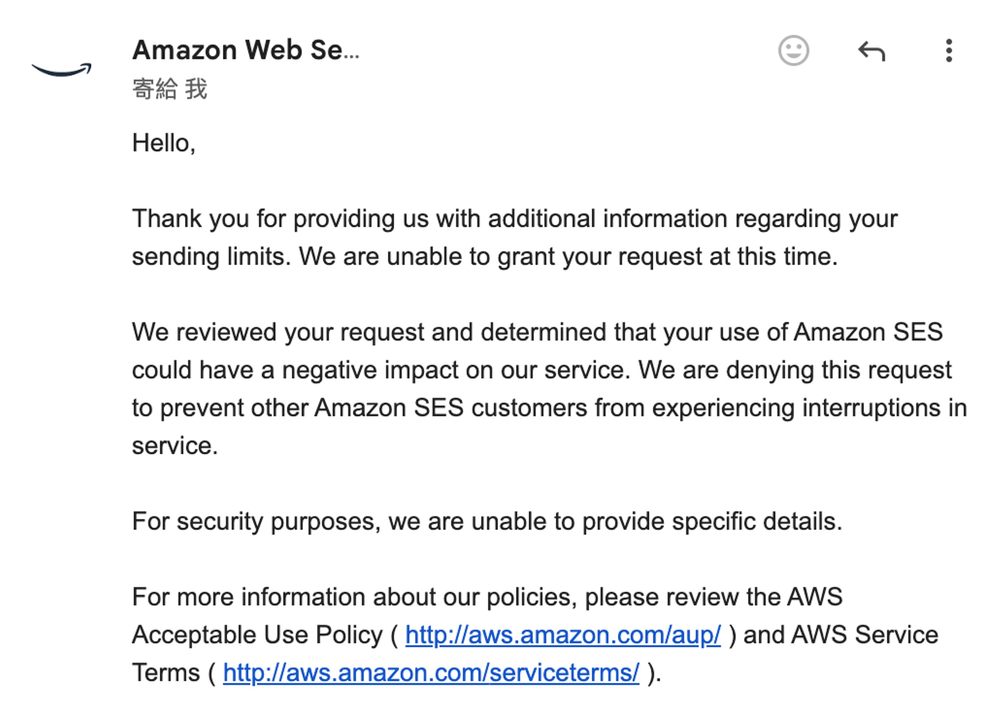

こんにちは、もしくはこんばんは。

最近、記事の更新が少し遅れてしまって、皆さんに謝らなければなりません。

実は、あまり本業に専念せず、フロントエンドとバックエンドを作っていたんです。

<!-- truncate -->

## まさかの暇つぶし？

確かに。

---

ちょうど長期休暇があり、以前時間がなくて解決できなかった問題を整理する時間が取れました：

- **このサイトにはバックエンドがない！**

おそらく少しはご存知かと思いますが、このサイトは Docusaurus フレームワークを基にした静的サイトです。このサイトを立ち上げた当初は、たまにブログを書いたり、論文のメモを共有したりすることを考えていただけで、特に大きな計画や目標はありませんでした。

静的サイトと動的サイトそれぞれの長所と短所については、私が言うまでもないでしょう。以前、Wordpress を使ってサイトを作ろうと試みましたが、少し進んだところで、誰かが金を要求してきて、本当にイライラしました。結局何度か試してみた後、再び静的サイトに戻ったのです。

得るものもあれば失うものもあり、サイトの内容が徐々に増えていく中で、読者からの問い合わせが増えてきました。多くはモデルの使い方についての質問で、環境設定や依存パッケージのインストール方法、さらには運用中に発生した奇妙なエラーの解決方法などが含まれています。

これらの問題は比較的簡単に解決でき、ChatGPT に聞いてもらえば大丈夫です。（~ちょっと雑すぎませんか？~）

一方で、もう少し厄介な要望もありました。それは「バックエンド API を直接呼び出したい！」というものです。

## 初代バックエンド：シンプルなデザイン

少し前に、いくつかの記事を書いた後、私は自分のモデルをみんなに使ってもらいたいと思い、いくつかのデモを作成しました。そして、初代バックエンドが誕生しました。そう、サイトのナビゲーションバーにある「遊園地」です。まだ遊んでいない方は、ぜひ試してみてください。

さて、モデルをウェブ上で使いたい場合、一般的には 2 つの解決方法があります：

- **1. モデルをウェブページに直接読み込んで、ブラウザで推論を行う。**

  この方法は、私自身ですぐに却下しました。

  というのも、モデルをダウンロードできるエンドポイントを提供しなければならず、後から来るトラフィックの問題が私を殺すことになるからです。

- **2. バックエンドサービスを提供し、推論結果を返す。**

  これが私が後に選んだ方法です。

  しかし、これには必ずバックエンドシステムを自分で作る必要があるという意味もあります。

---

フロントエンドにはすでに Docusaurus を使っているため、必然的にフロントエンドとバックエンドを分離した構造を採用することになります。プログラムを書く前に、まずはアーキテクチャ図を描いてみました。

実際にはアーキテクチャ図の他にも、仕様書やシステム操作フロー、入力と出力の詳細設計などを作成しましたが、ここではアーキテクチャ図だけを示しておきます。詳細は長くなりすぎるので、割愛します。

このアーキテクチャは次のような形になります：

仕様を決めた後は、それに従って作業を進めました。これが今の「遊園地」の背後にある運用ロジックです。

ここまでで見た目は簡単そうに見えますが、選んだ技術スタックについて少しだけ話しておきましょう。

技術選定には、見えない細かいディテールが隠れていることがよくあります：

1. **Nginx**

   ここでよく使われる選択肢は Apache ですが、Apache はかつてウェブサーバ界の王者で、機能が豊富でモジュールが多様、コミュニティも大きくて、ユーザー層が広いです。しかし、設定が少し複雑で、高並列接続の処理能力が Nginx に少し劣ります。

   実際のところ、Apache が悪いとは思いませんが、私は Nginx のシンプルで直感的な設定が非常に気に入っています。静的資源の代理やリバースプロキシ、ロードバランシングの設定方法が、非常に明確で直感的です。

   また、Nginx 自体は大量の並列接続を処理するために設計されており、安定性とパフォーマンスが市場や時間によって検証されているため、非常に安心して使用できます。

   ***

2. **FastAPI**

   FastAPI を選んだ理由の一つは、私が Python の開発環境に慣れているからです。今、急に NodeJS や他の言語のバックエンドフレームワークを学び始めると、学習コストが大きくなり、開発の進捗が遅れる可能性があるからです。

   FastAPI の他の特徴も私にとって魅力的でした。非同期（async）操作をネイティブでサポートしており、バックエンドのモデル推論のような時間がかかるが効率的に並列リクエストを処理しなければならない場面に非常に適しています。さらに、Pydantic によるバリデーション機能も内蔵されていて、API ドキュメントを自動生成し、テストインターフェースも準備してくれるので、API の開発と保守の苦労を大きく減らしてくれました。

   そして、FastAPI はその設計が明確で理解しやすく、Django のように重くて複雑ではなく、Flask のように自由すぎて構造が乱れることもなく、開発体験が絶妙に良かったです。

   ***

3. **PostgreSQL**

   データベースについては、私は以前 MySQL に慣れていました。

   MySQL は開発者の間で高評価を得ており、多くの初心者がまず選ぶデータベースです。しかし、Oracle に買収された後、MySQL のオープンソースライセンスが商業化方向に進み、そのエコシステムの不確実性が高まってきました。

   一方、PostgreSQL はオープンソースコミュニティで安定して成長し続けており、強力な機能（例えば、ネイティブの JSON データ型や GIS 地理情報処理など）をサポートしています。これにより、複雑なデータ要求がある場合に非常に柔軟で実用的な選択肢となります。

   さらに、PostgreSQL は FastAPI や SQLAlchemy などの ORM ツールとの統合が非常にスムーズで、使っていてとても快適です。また、PostgreSQL は高い並列処理能力と高負荷リクエストの処理能力を持ち合わせており、将来的にサイトのトラフィックが増加しても、データベースがボトルネックになることはないでしょう。

   ***

ここまで話しましたが、これが最適な組み合わせというわけではなく、現段階での要件を十分に満たすための選択です。

## 第二代バックエンド：シンプルなデザイン

冒頭で触れた問題に戻りますが、読者から「私のバックエンド API を直接プログラムで呼び出したい」というリクエストがありました。

元々設計していた API は、ウェブサイト用にシンプルに提供されていて、完全なセキュリティや認証機能が備わっていませんでした。もし外部に公開するとなると、さまざまなセキュリティ問題が発生する可能性があるため、私は自分で少し手を加えて、より完全な API 認証と認可システムを作成することにしました。

でも、私は詳しくない！

理解していなかったものの、目標はすでに決まっていたので、あとはやるしかないという感じです！

### ユーザー認証システム

API 認証の前提として、ユーザーシステムをしっかり作成する必要があります。具体的には、ユーザー登録、ログイン、権限管理、メール認証などの機能を含んでいます。

元々使っていた FastAPI と PostgreSQL に加えて、Redis を導入してセッションキャッシュとトークン管理を行うことにしました。ユーザー体験を向上させるために、メール認証とパスワードリセット機能も設計し、SMTP サービスを使って認証メールを送信しました。

さて、ここでまたアーキテクチャ図を作成することができますので、簡単に描いてみました：

このユーザーシステムには、ユーザーデータベース、パスワード暗号化、登録メール認証、パスワードリセットプロセスなど、さまざまな細かい部分が含まれています。ここでは、Google や Facebook などのサードパーティログインサービスを統合することについては考慮していません。これを統合するにはさらに作業が必要ですが、それは未来の自分に任せることにしました。

登録メール認証の部分については、予想以上に面倒でした。

最初、Amazon SES を申し込んだのですが、1 日待った後、拒否されてしまいました。理由は「疑わしい」とのこと。（何それ？）

<figure style={{"width": "60%"}}>

</figure>

仕方ないので、自分でメールサーバを立ててみようと思いました。

そしてサーバを立てて、送信したメールがそのまま Gmail に拒否されました。「あなたが疑わしい」と言われてしまいました。（😭 😭 😭）

最終的には、別のプロバイダーを見つけて、何とか解決しました。

### API トークン発行システム

ユーザーシステムが完成した後、ようやく API トークンの機能に取り掛かりました。

ここでは JWT（JSON Web Token）メカニズムを使って、トークンを生成し、検証します。ユーザーはログインによって認証され、システムは JWT を生成して Redis に保存します。ユーザーが API リクエストを送信する際、JWT は Bearer トークンとして送られ、バックエンドで認証が行われます。トークンが有効であることが確認されると、バックエンドのモデル推論サービスにアクセスできるようになります。

ここでは比較的シンプルで、トークン申請のアーキテクチャ図は次のようになります：

ユーザーがトークンを取得すると、そのトークンを使って API を呼び出すことができます。この部分で Redis は、リクエストのレート制限や呼び出し回数の計算に使われます。全体の呼び出しフローは次のようになります：

## 技術スタックまとめ

第二世代バックエンドでは、主に 2 つのコア機能を追加しました：ユーザー登録システムと API トークン発行メカニズム。

このアップグレードを経て、全体的な技術スタックはより明確で完全なものとなりました。以下の通りです：

- **フロントエンドフレームワーク**：React（Docusaurus）
- **バックエンドフレームワーク**：FastAPI（Python）
- **データベース**：PostgreSQL
- **キャッシュサービス**：Redis
- **リバースプロキシとロードバランシング**：Nginx

新しく追加された Redis を除けば、実はこれらの技術は第一世代バックエンドにもすでに存在していました。ただし、その当時は専用のフロントエンドページがなく、これらの情報を明確に表示することができませんでした。今回の改修を契機に、管理をより直感的かつ効率的に行える専用のフロントエンド管理ページを作成しました。

深層学習エンジニアとして、Python と FastAPI は私の日常的なツールです。この技術スタックが特別に革新的とは言えませんが、確実に開発効率と使用感を大きく向上させました。やはり、慣れ親しんだツールを使うことで、より早く実現できるのです。

デプロイについては、引き続き Docker Compose と Nginx を使用し、私の自宅サーバーに設置しています。クラウドに移行したいという気持ちもありますが、コストが高すぎて実現できないため、今は自宅サーバーで我慢しています。

開発過程で感じたことは、バックエンドの仕様を事前に明確に定義することが非常に重要だということです。明確なエンドポイントの入力・出力仕様を作成することで、フロントとバックエンドの統合時の障害を大幅に減らすことができます。今回のプロジェクトは私一人で完結させたため、クロスチームの協力によく見られるコミュニケーション摩擦を避けることができました。実務的には、フロントエンドとバックエンドが分離されたチームで開発する場合、責任やインターフェースの仕様を決めるだけでも、何週間も議論が続くことがあります。

とにかく、このシステムは現在順調に運用されており、まずは動かしてみて、さらに改善を続けていきます。

## 最後に

論文を読んでいるとき、論理が抽象的であることが多いですが、何度か読み返せば大抵はうまく再現できます。

フロントエンドのドキュメントは一見簡単そうに見えますが、実際に手を動かすと、毎回罠が隠れていて、非常に厄介です。（~慣れていないので文句を言っても仕方ないですが！~）

以前、深夜にデバッグをしていたときは、「損失が収束しない」「GPU のメモリ不足」など、AI エンジニア特有の問題が多かったのですが、今では React が頻繁にエラーを起こし、フォームボタンが機能しない、バックエンドの API 仕様が合わないといった問題に直面しています。

さらに、この作業は ChatGPT に即座に助けを求められる状況で行ったため、もし ChatGPT が発表される前の時代に戻っていたら、このバックエンドシステムを完成させることができたかどうか、本当にわかりません。

今後はさらに多くの機能を追加し、使用体験を向上させていく予定です。もし使用中にバグを発見したり、問題が発生した場合は、システムのセキュリティを保護するために、私にメールで直接ご連絡ください。エラーメッセージやスクリーンショットを添付していただけると、問題をより迅速に特定して修正するのに役立ちます。

また、このシステムに関して何か提案や感想があれば、ぜひコメント欄で私と共有してください。

ここで楽しんでいただけることを願っています！
