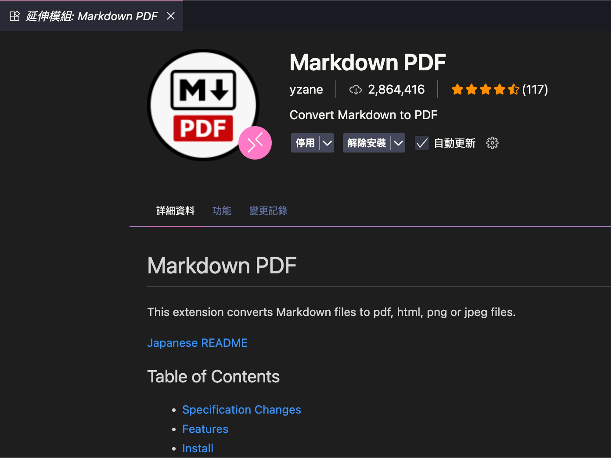

Markdown ファイルを PDF に変換したい場合、一般的にいくつかのツールが見つかると思います。

私は VS Code 上で **Markdown PDF** 拡張機能を使って PDF をエクスポートしています。

<!-- truncate -->

## Markdown PDF

このプラグインは私の環境で以下のように表示されます：

<div align="center">
<figure style={{ "width": "70%"}}>

</figure>
</div>

Markdown PDF の利点は以下の通りです：

- VS Code の **Command Palette → “Markdown PDF: Export (pdf)”** を直接呼び出すだけで PDF が生成でき、HTML / PNG / JPEG など多様な出力形式に対応しています。
- 内蔵の _puppeteer_ により、ヘッドレス Chrome で HTML → PDF のレンダリングが行われるため、数学式（KaTeX）、コードブロックのシンタックスハイライト、CSS テーマが正しく保持されます。
- **Mermaid Server** の URL をカスタマイズ可能であり、これが後述するエクスポートエラー修正の鍵となっています。

インストール後、`settings.json` にいくつかの設定項目が追加されますが、本記事では `markdown-pdf.mermaidServer` に注目します。

## Mermaid エクスポートエラー

Markdown 内に以下のような記述がある場合：

```text
graph TD
    A --> B
    A --> C
    B --> D
    C --> D
```

当サイトの基本機能を借りて上記を Mermaid 図としてレンダリングすると、以下のようになります：

<div align="center">

</div>

使用上は特に問題なく、VS Code のプレビュー画面にもエラーは出ませんが、**PDF エクスポート時には以下のいずれかの現象が発生します**：

1. **全く反応しない**：元の Mermaid ブロックが PDF 内で単なるテキストとして扱われ、図がレンダリングされません。

   ```text
   graph TD
       A --> B
       A --> C
       B --> D
       C --> D
   ```

2. **爆弾アイコン＋白紙ページ**：PDF 内に “💣” マークのみ表示されるか、ページ全体が空白になり、Mermaid の記述がそのまま表示されます。

調査したところ、Markdown PDF と最新版 Mermaid との間に**互換性の問題**があることがわかりました。

Mermaid 10.4.0 以降、公式は **ES Module** で配布を始め、従来の puppeteer の `evaluate()` スクリプト注入が正しく動作しなくなったため、テキストの「syntax error」や空のレンダリングが発生しています。

## 解決策

結論から言います。

設定画面で `markdown-pdf.mermaidServer` を探し、これを **Mermaid 10.3.1** のバージョンに指定します。以下の画像のように設定してください：

<div align="center">
<figure style={{ "width": "90%"}}>

</figure>
</div>

デフォルトの URL：

```text
https://unpkg.com/mermaid/dist/mermaid.min.js
```

を

```text
https://unpkg.com/mermaid@10.3.1/dist/mermaid.js
```

に置き換えます。

## 他のバージョンは使えるか？

GitHub 上で関連 issue をいくつか確認しました。代表的なものは以下です：

- [**Markdown-pdf: Mermaid Server VSCode URL no longer resolves #312**](https://github.com/yzane/vscode-markdown-pdf/issues/312)
- [**[BUG] Mermaid Diagrams Not Rendered in Exported PDF #342**](https://github.com/yzane/vscode-markdown-pdf/issues/342)

下記の 2 つは多くのユーザーが推奨する解決策です：

<div align="center">
<figure style={{ "width": "90%"}}>

</figure>
</div>

しかし、私が試した結果、**Mermaid 10.3.1 だけがすべての図表（Graph、sequenceDiagram、gantt）を正常に変換できました**。classDiagram や stateDiagram など他の形式は個別に試す必要があります。

最後に、もし他に良い方法や別バージョンで成功した経験があれば、ぜひコメント欄で教えてください。
