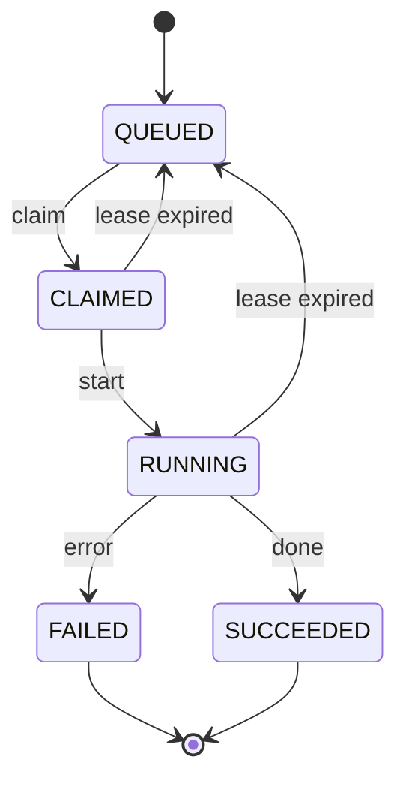

job queue は簡単だと思う：

1. `status = QUEUED` の job を 1 件拾う
2. `RUNNING` に変える
3. 仕事を始める

…ところがある日、気づく：

> **同じ job が 2 回走っている。**

ログの重複でも UI の表示ミスでもなく、
本当に 2 つの worker が同じ仕事を同時にやってしまった。

おめでとう。これで「並行の世界」に正式入門です。

<!-- truncate -->

## 問題は UPDATE ではない

多くの人が最初に疑うのは：

> UPDATE はロックするんじゃないの？
> なぜ同時に更新できるの？

実は、**本当の問題はもっと手前**で起きています。

一番よくある、そして一番素朴な書き方はこんな感じ（イメージ）：

```text
worker A: SELECT ... LIMIT 1  -> job_42 を取る
worker B: SELECT ... LIMIT 1  -> job_42 を取る
worker A: UPDATE job_42 -> RUNNING
worker B: UPDATE job_42 -> RUNNING
```

あなたの頭の中では、これは「妥当な順序」：

> 先に見て、あとで書き換える。

でも並行システムでは、これは 2 本の**完全に独立した世界線**です。

鍵は UPDATE がロックを取るかどうかではなく、こういうこと：

> **A と B が「まだ更新していない段階」で、同じ事実を見てしまう。**

一度これが起きると、後でどれだけ慎重にしてももう手遅れです。

## まずステートマシンを描く

job のステートマシンをきちんと定義しないと、
後のロジックは全部こうなります：

> 「そんなに都合よく起きないでしょ？」

これは非常に危険な仮定です。

まずは、最低限かつ運用しやすいステートマシンの例：

<div align="center">



</div>

`CLAIMED / RUNNING` をまとめてもいいし、
`RETRYING / DEAD` を分けてもいい。

どれも設計上の選択です。

**ただし、譲れないことが 1 つあります**：

> **「claim」はアトミックでなければならない。**

つまり：

- 「完全に成功」するか
- あるいは「何も起きない」か
- 中間状態を他の worker に観測させない

## 方法 1

一番堅いのは transaction + Compare-and-Swap です。

現実的でよく使われ、そしてデバッグしやすい。

ポイントは 2 つだけ：

- claim を**極短い transaction**に閉じ込める
- `UPDATE ... WHERE old_state = ...` を CAS として使う

SQL の例（カラムは適宜置き換えてください）：

```sql
BEGIN IMMEDIATE;

SELECT id
FROM jobs
WHERE queue = :queue
  AND status = 'QUEUED'
  AND retry_count < :max_retry
ORDER BY created_at ASC
LIMIT 1;

UPDATE jobs
SET status = 'CLAIMED',
    claimed_at = :now,
    retry_count = retry_count + 1
WHERE id = :id
  AND status = 'QUEUED';

COMMIT;
```

ここで重要なのは SQL の見た目ではなく、その後の判定です：

- `UPDATE` の更新件数が **≠ 1** の場合

  - 自分が触る前に、誰かが先に取ったということ
  - この場合は**claim 失敗**として扱い、リトライすればいい

この `AND status = 'QUEUED'` が、最も安くて、でも極めて効く compare-and-swap です。

## 方法 2

SQLite が十分新しいなら、「1 件選ぶ + 更新する」を 1 文の `UPDATE … RETURNING` にまとめられます：

```sql
UPDATE jobs
SET status = 'CLAIMED',
    claimed_at = :now,
    retry_count = retry_count + 1
WHERE id = (
  SELECT id
  FROM jobs
  WHERE queue = :queue
    AND status = 'QUEUED'
  ORDER BY created_at ASC
  LIMIT 1
)
RETURNING id;
```

メリットは明確です：

- round-trip が 1 回減る
- claim の意味が 1 つの SQL にまとまる
- 成功なら `id` が返り、失敗なら空になる

ただし忘れないでください：

> **見た目がきれいになっただけで、本質は CAS です。**

必要なインデックス、短い transaction、エラーハンドリングは同じように欠かせません。

## よくある落とし穴

1. **claim を大きな transaction で包む**

   claim は「席を取る」だけです。

   もしこう書くと：

   ```
   BEGIN;
   -- claim job
   -- モデルを回す / API を叩く / ずっと計算する
   -- 結果を書く
   COMMIT;
   ```

   それは全 worker にこう宣言しているのと同じです：

   > **「長時間 write lock を持つので、みんな並んでください。」**

   **対策**：
   claim は短い transaction で行う。
   実行処理は transaction の外で行う。
   結果の書き込みは別の短い transaction で行う。

   ***

2. **worker の分離を忘れる**

   例えば：

   - queue が複数ある
   - 処理ロジックのバージョンが違う
   - worker の優先度が違う

   のに同じ `jobs` テーブルを共用すると、
   必ず「拾ってはいけない job を拾う」問題に当たります。

   **対策**：
   claim の `WHERE` 条件で明確に制限する：

   - queue
   - version
   - capability

   worker が**自分の世界だけを見られる**ようにします。

   ***

3. **claim のついでに掃除をする**

   例えば：

   - 期限切れ job の掃除
   - 失敗 job の retry
   - 統計計算

   これらは claim の critical section を不必要に長くします。

   **対策**：
   「拾う」と「掃除」を別プロセスにする。
   お互いに影響させない。

## まとめ

job queue が本当に難しいのは、性能ではなく正しさです。

この 3 つだけ覚えておけばいい：

- **SELECT + UPDATE はアトミックではない**
- claim は CAS の発想で設計する
- write lock を取る transaction は、短くて短いほどいい

これで、魂に刺さる質問を避けられます：

> 「なぜ同じ job が 2 回走ったの？」

## 参考資料

- [SQLite: Transactions](https://www.sqlite.org/lang_transaction.html)
- [SQLite: UPDATE (RETURNING clause)](https://www.sqlite.org/lang_update.html)
