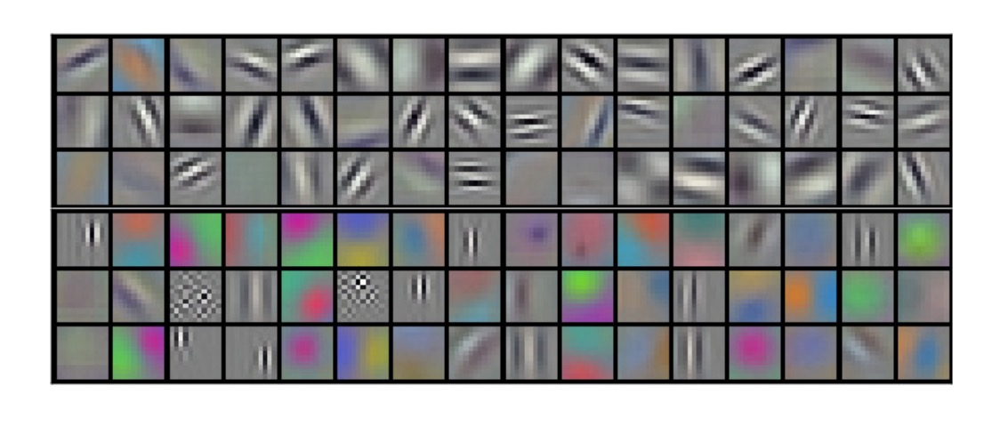

# [12.09] AlexNet

## 畳み込みネットワークの台頭

[**ImageNet Classification with Deep Convolutional Neural Networks**](https://proceedings.neurips.cc/paper_files/paper/2012/file/c399862d3b9d6b76c8436e924a68c45b-Paper.pdf)

---

ニューラルネットワークの研究は、もっと前から始まっていました。

そして、AlexNet は重要なマイルストーンであり、2012 年の ImageNet チャレンジで驚くべき成果を収めました。

## 問題の定義

この時点で、畳み込みネットワークの応用はすでに見え始めていました。

それ以前、LeNet-5 は手書きの数字認識問題を解決するために畳み込みニューラルネットワーク（CNN）を成功裏に利用しました。

- [**Gradient-Based Learning Applied to Document Recognition**](http://vision.stanford.edu/cs598_spring07/papers/Lecun98.pdf)

さらに、このアーキテクチャは CIFAR-10、MNIST などの小規模なデータセットにも適用され始めました。

従来のフィードフォワードニューラルネットワーク（全結合ニューラルネットワーク）と比較して、畳み込みニューラルネットワークはそのアーキテクチャの帰納的バイアスにより、画像データに対して非常に強力な学習能力を持ち、その構造は画像内の空間的依存関係と統計的定常性を効果的に捉えることができ、パラメータ数も少ないため、訓練が容易です。

CNN は魅力的な特徴を持っていますが、高解像度の画像での大規模な応用は依然として非常に高コストです。

ちょうどその時、NVIDIA も現場におり、現代の GPU（当時は GTX580-3GB）と高度に最適化された 2D 畳み込み実装の組み合わせにより、十分な計算能力を提供し、大規模な CNN の訓練をサポートしました。

最終的に、大規模なデータセットの問題も解決されました。

2009 年に提案された大規模な画像データセット：ImageNet は、これらのモデルを過度に過学習することなく効果的に訓練できる十分なラベル付きサンプルを提供しました。

＊

アルゴリズム、データ、計算能力は揃いました。

次の問題は、「どのようにしてより深く、より大きな CNN を設計して、画像認識の性能を改善するか？」です。

## 問題の解決

### モデルアーキテクチャ


AlexNet は深層畳み込みニューラルネットワークを使用しており、5 つの畳み込み層と 3 つの全結合層があります。

このアーキテクチャはその後長い間使用され、畳み込みニューラルネットワークに関する後続の研究はほとんどがこの基盤の上で進化しました。

:::tip
この時点では、畳み込みニューラルネットワークのパラダイムはまだ確立されておらず、私たちがよく知っている 5 層のダウンサンプリングや Batch Normalization などはまだありませんでした。
:::

### ReLU 活性化関数

過去の研究では、ReLU 活性化関数が Sigmoid や tanh 関数に取って代わり、収束速度が速く、勾配消失問題を回避できることが示されました。

その式は次の通りです：$f(x) = \max(0, x)$。

これは、入力が 0 より大きい場合、出力は入力と等しく、入力が 0 未満の場合、出力は 0 になることを意味します。

$$ f(x) = \begin{cases} x, & \text{if } x > 0 \\ 0, & \text{otherwise} \end{cases} $$

### 複数 GPU による訓練

もう、なぜ AlexNet のモデルアーキテクチャ図が切り取られているのかを聞かないでください！

なぜなら、元々の論文の図がそうだったからです。

著者はここで、モデルを 2 つに分け、2 つの GPU にそれぞれ配置したことを示したかっただけです。

### ローカルレスポンス正規化（LRN）

この時点では Batch Normalization はありませんでしたが、モデルには依然として正規化が必要であり、そうでなければ訓練が非常に困難になります。

LRN の基本的なアイデアは、各ニューロンの活性化値を正規化することで、その周囲のニューロンの活性化値の影響を受け、過剰に活性化されたニューロンを抑制し、異なるニューロン間での競争を促進することです。

これは生物の神経ニューロンにおける側抑制メカニズムに似ており、特定のニューロンが過度に活性化され、他のニューロンが常に不活性であるような状況を防ぎます。

AlexNet では、LRN は次のように定義されます：

ニューロンの位置$(x, y)$での活性化値$a^i_{x,y}$があり、これは第$i$個の畳み込みカーネルを適用し、ReLU 非線形変換を通して得られたものです。

LRN 後の標準化された活性化値$b^i_{x,y}$は次の式で計算されます：

$$b^i_{x,y} = \dfrac{a^i_{x,y}}{\left(k + \alpha \sum_{j=\max(0, i - n/2)}^{\min(N-1, i + n/2)} (a^j_{x,y})^2 \right)^\beta}$$

ここでの記号の意味は次の通りです：

- $a^i_{x,y}$：位置$(x, y)$で第$i$個の畳み込みカーネルを適用した後の出力活性化値（ReLU 非線形変換後）。
- $b^i_{x,y}$：LRN 後の標準化された活性化値。
- $k$, $\alpha$, $\beta$, $n$：LRN のハイパーパラメータで、これらは検証セットを通じて調整されます。
  - $k = 2$
  - $\alpha = 10^{-4}$
  - $\beta = 0.75$
  - $n = 5$
- $N$：その層の総畳み込みカーネル数。
- $j$：隣接する畳み込みカーネルのインデックスを走査し、その範囲は$[\max(0, i - n/2), \min(N-1, i + n/2)]$です。

### 重複最大プーリング

AlexNet では、最大プーリング層のサイズは 3x3、ストライドは 2 です。

この操作により、特徴マップのサイズが半分になり、計算量が削減されます。

著者は、重複領域を持つ最大プーリングを設計することで、過学習を抑制し、モデルの汎化能力を向上させることができると述べています。

### Dropout

訓練中、著者はモデルが過学習しやすいことに気づき、この問題を解決するために Dropout 技術を導入しました。

Dropout は各訓練反復でランダムに神経ネットワーク内のいくつかのニューロンを「ドロップ」（出力をゼロに設定）します。

これは、毎回の前向き伝播過程でネットワークがランダムなサブセット構造で計算を行うことを意味します。

ドロップされたニューロンは前向き伝播に貢献せず、逆伝播にも参加しません。

これにより、神経ネットワークは特定のニューロンの存在に依存せずに学習を行うため、ニューロン間の複雑な共同適応現象を減少させることができます。

:::tip
推論時には、Dropout は無効になり、すべてのニューロンが計算に参加します。
:::

### モデル実装

次に、ネットワーク全体の構成を詳しく見ていきましょう：

1. 224x224 の画像を入力します。
2. 第一層の畳み込みカーネルのサイズは 11x11、ストライドは 4、出力は 96 個の特徴マップ、出力サイズは 55x55 です。
3. 次に最大プーリング層があります。
4. 第二層の畳み込みカーネルのサイズは 5x5、出力は 256 個の特徴マップ、出力サイズは 27x27 です。
5. 再度最大プーリング層があります。
6. 第三層の畳み込みカーネルのサイズは 3x3、出力は 384 個の特徴マップ、出力サイズは 13x13 です。
7. 第四層の畳み込みカーネルのサイズは 3x3、出力は 384 個の特徴マップ、出力サイズは 13x13 です。
8. 第五層の畳み込みカーネルのサイズは 3x3、出力は 256 個の特徴マップ、出力サイズは 13x13 です。
9. 最後に 3 層の全結合層があり、第一層は 4096 個のニューロン、第二層も 4096 個のニューロン、最後の層は 1000 個のニューロン、ImageNet の 1000 クラスに対応しています。

論文によれば、以下のいくつかの重要点があります：

1. 各畳み込み層と全結合層の後に ReLU 活性化関数があります。
2. 第一層と第二層の畳み込み後にローカル正規化（LRN）が適用されています。
3. 最大プーリングはローカル正規化と第五の畳み込み層後に使用され、サイズは 3x3、ストライドは 2 です。
4. 前の 2 つの全結合層間で Dropout が使用され、ドロップ率は 0.5 です。

全体的な情報は非常に明確になりましたので、モデルをそのまま実装できます。

```python
import torch.nn as nn

class AlexNet(nn.Module):

    def __init__(self, num_classes=1000):
        super(AlexNet, self).__init__()

        self.stage1 = nn.Sequential(
            nn.Conv2d(3, 96, kernel_size=11, stride=4, padding=2),
            nn.ReLU(),
            nn.LocalResponseNorm(size=5, alpha=0.0001, beta=0.75, k=2),
            nn.MaxPool2d(kernel_size=3, stride=2)
        )

        self.stage2 = nn.Sequential(
            nn.Conv2d(96, 256, kernel_size=5, padding=2),
            nn.ReLU(),
            nn.LocalResponseNorm(size=5, alpha=0.0001, beta=0.75, k=2),
            nn.MaxPool2d(kernel_size=3, stride=2)
        )

        self.stage3 = nn.Sequential(
            nn.Conv2d(256, 384, kernel_size=3, padding=1),
            nn.ReLU()
        )

        self.stage4 = nn.Sequential(
            nn.Conv2d(384, 384, kernel_size=3, padding=1),
            nn.ReLU()
        )

        self.stage5 = nn.Sequential(
            nn.Conv2d(384, 256, kernel_size=3, padding=1),
            nn.ReLU(),
            nn.MaxPool2d(kernel_size=3, stride=2)
        )

        self.classifier = nn.Sequential(
            nn.Flatten(),
            nn.Dropout(0.5),
            nn.Linear(256 * 6 * 6, 4096),
            nn.ReLU(),
            nn.Dropout(0.5),
            nn.Linear(4096, 4096),
            nn.ReLU(),
            nn.Linear(4096, num_classes),
        )

    def forward(self, x):
        x = self.stage1(x)
        x = self.stage2(x)
        x = self.stage3(x)
        x = self.stage4(x)
        x = self.stage5(x)
        x = self.classifier(x)
        return x
```

## 討論

### 畳み込みネットワークは何を学習するのか？



著者は第一層の畳み込みカーネルを可視化し、これらのカーネルがエッジ、色、テクスチャなどの特徴を学習していることを示しています。

過去の研究では、これらの特徴を手動で設計し、それを機械学習アルゴリズムに提供していました。例えば、私たちがよく知っている SIFT、HOG、Sobel 演算子などです。

AlexNet 以降、手動で特徴を設計することは推奨されなくなり、今ではネットワークが自分でより良い特徴を学べるように設計することが問われるようになっています。

### ILSVRC-2010 結果

| モデル            | Top-1 | Top-5 |
| ----------------- | ----- | ----- |
| Sparse coding [2] | 47.1% | 28.2% |
| SIFT + FVs [24]   | 45.7% | 25.7% |
| CNN               | 37.5% | 17.0% |

ILSVRC-2010 のコンペティションでの AlexNet の結果は次の通りです：

- **Top-1 誤差率**: 37.5%
- **Top-5 誤差率**: 17.0%

当時の他の最良の方法と比較すると：

- **Sparse coding**方法の Top-1 誤差率は 47.1%、Top-5 誤差率は 28.2%でした。
- **SIFT + Fisher Vectors (FVs)**方法の Top-1 誤差率は 45.7%、Top-5 誤差率は 25.7%でした。

これにより、AlexNet は ILSVRC-2010 において他の方法を大きく上回る結果を出したことが示されました。

### ILSVRC-2012 結果

| モデル         | Top-1 (val) | Top-5 (val) | Top-5 (test) |
| -------------- | ----------- | ----------- | ------------ |
| SIFT + FVs [7] | —           | —           | 26.2%        |
| 1 CNN          | 40.7%       | 18.2%       | —            |
| 5 CNNs         | 38.1%       | 16.4%       | 16.4%        |
| 1 CNN\*        | 39.0%       | 16.6%       | —            |
| 7 CNNs\*       | 36.7%       | 15.4%       | 15.3%        |

- \*これらのモデルは、ImageNet 2011 Fall リリース版全体で事前訓練されました。

ILSVRC-2012 のコンペティションでは、テストセットのラベルが公開されなかったため、すべてのモデルのテスト誤差率を完全に報告することはできませんが、以下は重要な結果です：

- 単一の CNN モデルは検証セットで Top-5 誤差率 18.2%を達成しました。
- 5 つの類似した CNN モデルの予測を平均化すると、Top-5 誤差率は 16.4%に低下しました。
- 6 番目の畳み込み層を含む CNN モデルを ImageNet 2011 Fall リリース版全体（1500 万枚の画像と 22000 クラス）で事前訓練し、その後 ILSVRC-2012 で微調整すると、Top-5 誤差率は 16.6%になりました。
- ImageNet 2011 Fall リリース版で事前訓練した 2 つの CNN モデルと前述の 5 つの CNN モデルの予測を平均化すると、Top-5 誤差率は 15.3%に低下しました。

ILSVRC-2012 の競技者の中で、最も優れた方法は、異なるタイプの密なサンプリング特徴量を用いて FVs を計算し、複数の分類器で予測を平均化することで、26.2%の Top-5 誤差率を達成しました。

## 結論

AlexNet は ILSVRC-2012 コンペティションで驚くべき成果を収め、その登場はコンピュータビジョン分野における深層学習の台頭を象徴しています。

このネットワークの設計と訓練方法は、その後の深層学習の発展に深遠な影響を与えました。
