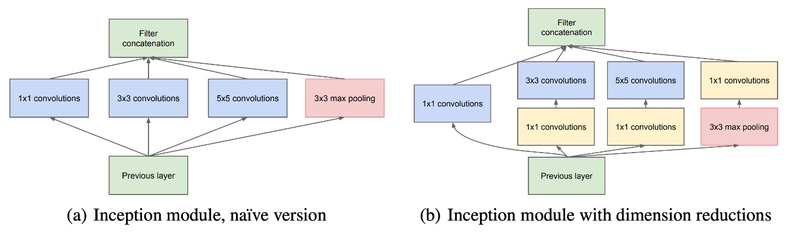
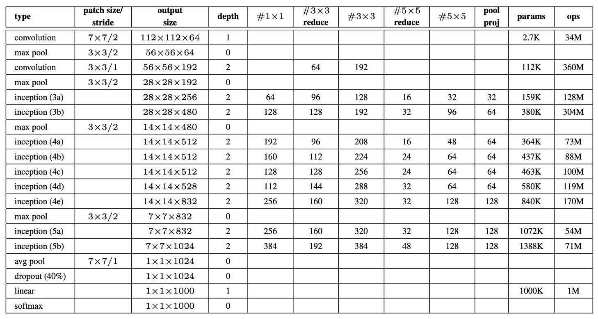

## またの名を Inception-V1

[**Going deeper with convolutions**](https://arxiv.org/abs/1409.4842)

---

GoogLeNet は Inception アーキテクチャを採用しており、そのインスピレーションは「Network in Network」モデルと、ネット上の「we need to go deeper」というミームに由来しています。

- [**[13.12] Network in network**](https://arxiv.org/abs/1312.4400)

私たちは、論文で自分たちの研究動機がネット上のミームから来ていると真面目に述べられることはあまり見たことがありません。

しかし、著者がこのように書いているので、私たちもその通りに伝えます：

<figure style={{ "width": "60%"}}>

<figcaption>画像出典：[Know your meme: We need to go deeper](https://knowyourmeme.com/memes/we-need-to-go-deeper)</figcaption>
</figure>

Inception アーキテクチャにおける「深さ」には 2 つの意味があります。一つは新しい組織形式、すなわち「Inception モジュール」を導入したこと、もう一つはより深いネットワーク構造を実現したことです。

GoogLeNet の名前は、Yann LeCun の LeNet-5 ネットワークに敬意を表して付けられました。この名前は Inception アーキテクチャの特定のバージョンを指しており、このバージョンが ILSVRC14 コンペティションに参加するために使用されました。

## 問題の解決

### Inception モジュール

Inception アーキテクチャの核心的なアイデアは、既存の密な構成要素を使って最適な局所的な疎な構造を近似し、覆うことです。

モジュール内では、1×1、3×3、5×5 の畳み込みカーネルを使って、異なる空間的分布の特徴を処理し、すべての層の出力フィルターを一つの出力ベクトルとして結合し、次の段階の入力とします。畳み込みカーネルが大きくなりすぎるのを避けるため、これらの畳み込みフィルターのサイズ制限は、絶対的な必要性よりも便宜によるものです。

畳み込みニューラルネットワークにおいてプーリング操作の重要性を考慮し、各 Inception モジュールには畳み込みフィルターに加えて、並列のプーリングパスも含まれており、プーリング層の出力と畳み込み層の出力を結合し、特徴表現をさらに豊かにしています。

計算量の急激な増加を避けるため、Inception アーキテクチャでは 1×1 畳み込みを使用して次元縮小を実行しています。この畳み込みは、次元削減ツールとしてだけでなく、非線形の活性化層としても機能します。このアプローチは計算資源の要求を大幅に削減し、特に 3×3 および 5×5 畳み込みの前に計算の複雑さを減らしました。

Inception モジュールが積み重なると、特徴の抽象度が段階的に向上し、上位層の特徴空間の密度が次第に減少するため、3×3 および 5×5 の畳み込みの比率は層数が増えるにつれて増加します。

### パラメータ設定

上表は GoogLeNet の重要なパラメータ設定を示しています。

GoogLeNet ネットワークの受容野のサイズは$224 \times 224$で、RGB 画像を処理し、平均減算操作が行われます。表に示されている「#3×3 reduce」と「#5×5 reduce」は、それぞれ 3×3 および 5×5 畳み込みの前に使用される 1×1 フィルターの数を示しており、「pool proj」は、内蔵された最大プーリング後の投影層における 1×1 フィルターの数を示します。

GoogLeNet アーキテクチャは、パラメータのある層だけを計算した場合、深さは 22 層、プーリング層を含むと 27 層です。全体でネットワークは約 100 個の独立した構成モジュールを含んでおり、具体的な数は使用される機械学習基盤に依存します。平均プーリング層は分類器の前に使用され、実装には追加の線形層が使用されており、これによりネットワークは他のラベルセットに簡単に調整できるようになります。

全結合層を除去し、代わりに平均プーリングを使用することで、Top-1 の精度が約 0.6％向上しましたが、全結合層を除去した後でも Dropout の使用は必須です。Dropout 層の出力破棄率は 70％です。

### モデルアーキテクチャ

ネットワークが深くなると、どのようにしてすべての層に対して効果的に勾配を逆伝播させるかが設計の重要な課題となります。これに対処するために、著者はここで補助分類器を導入しました。これらの分類器は Inception モジュール（4a）および（4d）の出力上に配置されています。

:::tip
図の中の`Softmax0`および`Softmax1`は補助分類器です。
:::

補助分類器の設計には、5×5 の平均プーリング層、1×1 の畳み込み層（128 個のフィルター）、1024 個のユニットを持つ全結合層、70%の出力破棄率の Dropout 層、および線形層が含まれています。これらの分類器は訓練時に勾配信号の逆伝播を強化し、低層次の特徴の識別能力を高めるために使用されます。訓練中の損失は 0.3 の重みで総損失に加算されますが、推論時には補助ネットワークは削除されます。

## 討論

### ILSVRC 2014 でのパフォーマンス

ILSVRC 2014 コンペティションのタスクは、画像を Imagenet 階層の 1000 個の葉ノードのいずれかに分類することでした。

訓練セットには約 120 万枚の画像があり、検証セットには 5 万枚、テストセットには 10 万枚の画像が含まれています。各画像には真のラベルがあり、パフォーマンスは予測結果に基づいて評価されます。

著者はコンペティションに参加する際に外部データを使用せず、訓練セットに提供されたデータのみに依存しました。また、テスト過程では、パフォーマンスを向上させるためにいくつかの技術が採用されました：

1. GoogLeNet モデルの 7 つのバージョンを独立して訓練し、アンサンブル方式で予測を行いました。
2. 複数の切り抜き結果とすべての独立した分類器の結果を平均化して、最終的な予測結果を得ました。

最終的に、コンペティションの提出結果は、検証セットおよびテストセットで Top-5 誤差率が 6.67％であり、1 位にランクインしました。

## 結論

GoogLeNet の設計は、革新的な Inception アーキテクチャを通じて計算資源とモデルパフォーマンスのバランスを取る重要性を示しており、また稀疎構造の可能性を示し、将来のより稀疎で精緻なニューラルネットワーク構造の自動設計に向けた指針を提供しました。

この方法の拡張性は、現代の深層学習研究における重要な礎石となっており、特に効率と効果のバランスが強調される背景の中で、未来の研究や応用に重要な示唆を与えています。

これは Inception シリーズの第一篇であり、その後には Inception-V2、V3、V4 などが続き、それぞれに異なる改良と最適化が加えられています。時間を見つけて続きを読んでいきましょう。
