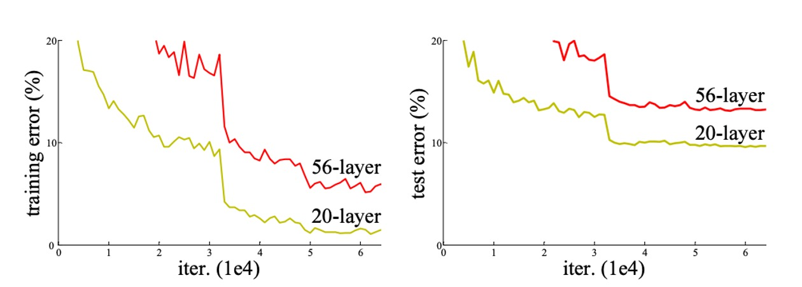
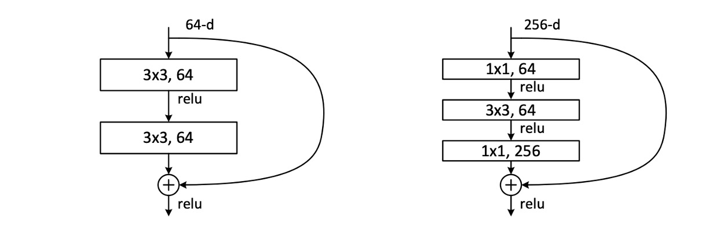
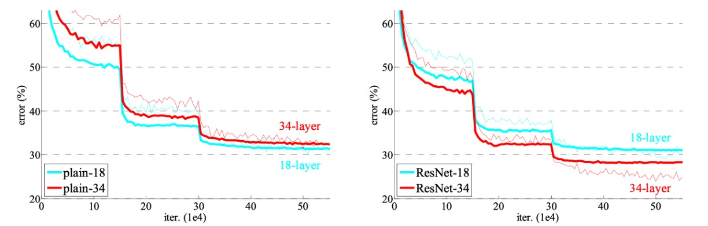

## 畳み込みネットワーク 100 層

[**Deep Residual Learning for Image Recognition**](https://arxiv.org/abs/1512.03385)

---

BatchNorm が提案された後、勾配消失や爆発の問題は解決されたように見えました。

それでも、なぜモデルはうまく訓練できないのでしょうか？

## 問題の定義

著者はまず一組の実験を行いました。

理論的には、深いモデルは浅いモデルよりも訓練誤差が高くなることはないはずです。なぜなら、深いモデルは追加された深層を恒等写像に設定し、浅いモデルの他の層をコピーすることによって構築できるからです。しかし、上の図からわかるように、ネットワークの深さが増すにつれて、訓練セットとテストセットの誤差率が増加するという現象が見られました。

勾配消失の問題は解決されたので、モデルのパフォーマンスが退化する問題は、明らかに勾配のせいではありません。さらに、これは過剰適合の問題でもなく、過剰適合であれば訓練セットの誤差率は下がり、テストセットの誤差率が上昇し、両者の差が大きくなるはずです。

したがって、著者はこの問題を「モデルの退化」と定義しています。

## 問題解決

### 残差とは？

残差（Residual）は、数学および工学で通常、観測値と参照値の間の差異を指します。

画像処理やコンピュータビジョンの分野では、残差の概念は局所画像記述子に適用され、各記述子と事前定義された基準（例えば辞書やモデル）との間の差異を捉えます。

残差をこのように命名し使用する理由は以下の通りです：

1. **変化と差異の捉え方**：残差は、局所特徴と参照特徴の間の差異を識別してエンコードするもので、局所特徴が参照特徴からどのように偏っているかに関する有益な情報を提供します。
2. **効率性と精度の向上**：元の記述子ではなく残差に注目することで、情報のエンコードと処理がより効率的に行えるようになります。残差は通常、より小さく構造化されており、管理や分析が容易です。
3. **適応性と汎用性**：残差を表現することで、モデルは異なる画像間の微妙な違いをよりよく適応し認識できます。これは、画像検索や分類などのタスクにおいて非常に重要です。

### 残差学習

$H(x)$ を深層学習モデルが学習すべき目標関数と仮定します。深層ニューラルネットワークにおいて、$H(x)$ は入力 $x$ が一連の層を通った後の出力を表します。$x$ はこれらの層に入力される元のデータです。

深層学習において、特にネットワークが深くなると、$H(x)$ を直接学習することが非常に困難になることがあります。これが訓練効率の低下やパフォーマンスの悪化を引き起こす可能性があります（著者はこれを退化問題と呼びます）。残差とは、モデルの出力と元の入力の差、すなわち $H(x) - x$ です。この差異は、モデルが $x$ を $H(x)$ に変換するために学習する「追加情報」を反映しています。

最適な写像が恒等写像（つまり出力が入力と等しい）に近い場合、$F(x)$ を学習する方が $H(x)$ を学習するよりも簡単であるため、最適化プロセスを簡略化します。この方法の利点は、最適解が恒等写像に近い場合、ネットワークは残差がゼロに近いことを学習しやすく、最適解により効果的に近づける点です。

この方法を実現するために、著者はネットワークにショートカット接続を導入しました。これらの接続は 1 層または複数の層を飛ばして、入力 $x$ を中間層の出力に直接加算し、$F(x) + x$ の計算を実現します。この方法によって最適化問題が変換され、深層ニューラルネットワークがより効率的に学習と最適化を行えるようになり、訓練結果と最終パフォーマンスが改善されました。

### 残差モジュール

論文で著者が実際に使用した残差モジュールは、上の図に示された 2 つの形式です。どちらもパラメータ量は似ていますが、右側の形式はボトルネック設計を持ち、著者は後でこれらの 2 つの形式のパフォーマンスをテストします。各モジュールの畳み込み層数は多くなったり少なくなったりできますが、著者は実際の適用では 1 層の畳み込み層のみでは効果が薄いことを発見しました。

モデルを積み重ねる際に、チャネル数が異なる場合、著者は$1 \times 1$ の畳み込みを使用してチャネル数を調整しました。

### ネットワークアーキテクチャ

これは論文の中で「最も長い」図の一つです...

ここでは ResNet-34 のネットワークアーキテクチャのみを示しています。VGG の影響を受けて、ここでは畳み込み層のほとんどが $3 \times 3$ の畳み込みカーネルを使用し、2 つのシンプルな設計規則に従っています：

1. 同じ出力特徴マップサイズの場合、積み重ねる畳み込み層は同じ出力チャネル数を持つべきです。
2. 特徴マップサイズが半分になる場合、チャネル数を倍増させ、時間的および空間的一貫性を維持します。

ダウンサンプリングは、ストライド 2 の畳み込みを使用して実現され、最終的にグローバル平均プーリング層と全結合層を使用して分類が行われます。

上図の例では、ResNet-34 の計算量は VGG-19 の 18% に過ぎません。

:::tip
ResNet-152 の場合、マウスをどれくらいスクロールする必要があるか想像もつきません...
:::

### パラメータ設定

上表はすべての ResNet モデルのパラメータ設定を示しています。ネットワークの深さが増すとパラメータ量も増加しますが、ResNet-152 の計算量は VGG よりもはるかに少ないことがわかります。

他の訓練設定は以下の通りです：

1. **データ拡張：**

   - **スケール拡張**：画像の短辺がランダムなサイズに調整され、範囲は [256, 480] の間でスケール拡張が行われます。
   - **切り抜きと反転**：画像またはその水平反転からランダムに 224×224 の領域を切り抜き、各ピクセルの平均値を引きます。
   - **カラー拡張**：標準的なカラー拡張手法が使用され、これらの手法は AlexNet で詳細に説明されています。

2. **正規化と活性化：**

   - 各畳み込み後と活性化前にバッチ正規化（Batch Normalization、BN）を採用し、訓練プロセスの安定性と加速を図ります。

3. **重み初期化：**

   - Kaiming 初期化を使用して重みを初期化し、すべての通常のネットワークと残差ネットワークをゼロから訓練します。
     - [**[15.02] Delving deep into rectifiers: Surpassing human-level performance on imagenet classification**](https://arxiv.org/abs/1502.01852)

4. **最適化器：**

   - 小さなバッチサイズで確率的勾配降下法（SGD）を最適化器として使用し、バッチサイズは 256 に設定します。
   - **学習率**：初期学習率は 0.1 に設定し、誤差が安定した水準に達した時点で学習率を 10 で割ります。
   - **重み減衰**：0.0001 に設定します。
   - **モメンタム**：0.9 に設定します。

5. **その他の設定：**

   - **Dropout**：訓練中は Dropout を使用しません。

## 討論

### ResNet-18 vs ResNet-34

著者はまず 18 層と 34 層の通常のネットワークを評価しました。

上表の結果によると、34 層の通常のネットワークは 18 層の通常のネットワークよりも検証誤差が高いことがわかります。理由を明らかにするために、著者は次の図（左）で訓練中の訓練誤差と検証誤差を比較しました。

図から、退化問題が観察されました。18 層の通常のネットワークの解空間は 34 層のネットワークの部分空間であるにもかかわらず、34 層のネットワークは訓練中に高い訓練誤差を持っています。著者は、この最適化の難しさは勾配消失によるものではないと考えています。これらの通常のネットワークはバッチ正規化（BN）を使用して訓練され、前向き伝播の信号がゼロでない分散を持つことを保証しています。また、反向伝播の勾配も BN によって健全な規範を示すことが確認されました。したがって、前向きまたは後向きの信号は消失していません。

実際、34 層の通常のネットワークは競争力のある精度を達成できるため、この求解器はある程度機能していることが示唆されています。著者は、深い通常のネットワークの収束速度が指数関数的に遅くなる可能性があり、これが訓練誤差の減少に影響を与え、最適化の難しさを引き起こす原因になると推測しています。

次に、著者は 18 層と 34 層の残差ネットワーク（ResNet）を評価しました。ベースラインのアーキテクチャは上記の通常のネットワークと同じですが、各 3×3 フィルタペアにショートカット接続を追加したものです。上の図（右）に示すように、残差学習が逆転し、34 層 ResNet は 18 層 ResNet よりも優れており、2.8% 向上しました。さらに重要なのは、34 層 ResNet が非常に低い訓練誤差を示し、検証データにもうまく一般化していることです。これにより、退化問題がこの設定でうまく解決されたことが示されています。

### より深いボトルネックアーキテクチャ

著者は ImageNet のためにさらに深いネットワークを構築しました。

訓練時間を考慮して、著者はモジュール設計をボトルネック設計に変更しました。各残差関数 $F$ に対して、2 層を 3 層のスタックに置き換えました。

これらの 3 層は、それぞれ $1×1$、$3×3$、$1×1$ の畳み込み層であり、$1×1$ 層は次元を減少および増加（回復）させ、$3×3$ 層を小さな入力/出力次元のボトルネックにします。この 2 つの設計は似た時間計算量を持っています。

- **50 層 ResNet**：各 2 層ブロックをこの 3 層のボトルネックブロックに置き換え、ResNet-50 を構築しました。
- **101 層および 152 層 ResNets**：さらに多くの 3 層ブロックを使用して ResNet-101 および ResNet-152 を構築しました。

### ImageNet でのパフォーマンス

上表において、著者は ImageNet での ResNet のパフォーマンスを示しています。ベースラインの 34 層 ResNet はすでに非常に競争力のある精度を達成しています。

ネットワークの深さが増すにつれて、50/101/152 層の ResNet は精度が向上し、34 層よりも顕著な改善が見られました。退化問題は観察されず、深さの利点はすべての評価指標に現れました。

ResNet-152 は top-5 誤差率で 4.49% に達し、top-1 誤差率では 19.38% に達し、その時点で最先端のモデルとなりました。

## 結論

ResNet の登場前、ネットワークの深さが増すと深層ネットワークの訓練が非常に困難になり、勾配消失や勾配爆発の問題がしばしば発生していました。しかし、残差学習の概念はこのボトルネックを打破し、超深層ネットワークの訓練を可能にしました。この画期的な進展は深層学習の発展に大きく寄与し、発表後すぐに深層学習分野の標準モデルとなりました。

ResNet の成功は、その後の改良と変種モデルの出現を促し、DenseNet や ResNeXt などが登場しました。これらの改良モデルは ResNet の利点を継承し、ネットワーク構造とパフォーマンスの最適化をさらに進め、深層学習モデルの継続的な進歩と革新を促しました。

卓越した性能により、ResNet は医療画像分析、自動運転、監視システムなど、さまざまな実際のシーンで広く使用されています。これらのアプリケーションは、ResNet が実際の応用で持つ巨大な潜在能力と価値を示し、深層学習技術の発展における重要なマイルストーンとなりました。
