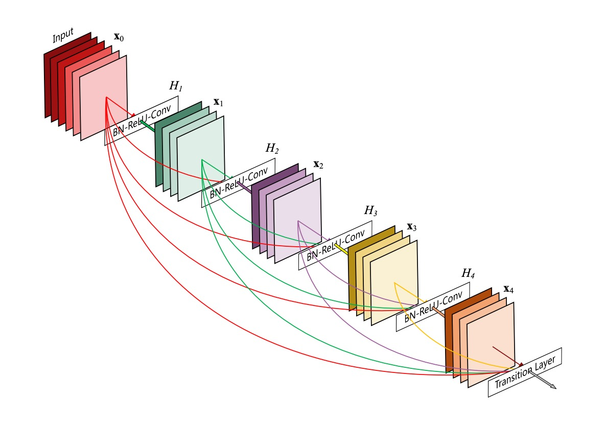
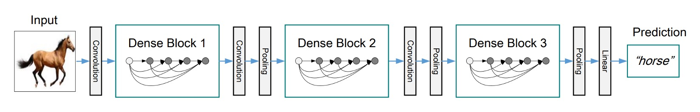
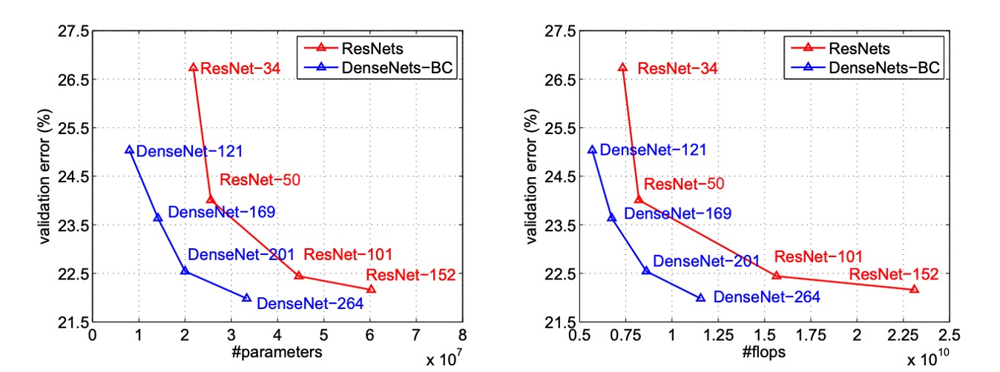
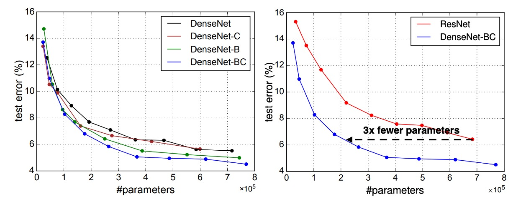

## すべて繋げる

[**Densely Connected Convolutional Networks**](https://arxiv.org/abs/1608.06993)

---

CNN が深くなるにつれて、入力画像の勾配情報が消失することが多く、訓練が困難になります。

そのため、情報が深いネットワーク内でより良く流れる方法について研究が進み、その中でも大作の一つが ResNet です。

- [**Deep Residual Learning for Image Recognition**](https://arxiv.org/abs/1512.03385)

## 問題の定義

ResNet は加算的恒等マッピングにより情報の保存を明確にしましたが、実際には多くの層がほとんど貢献していません：

- [**Deep networks with stochastic depth**](https://arxiv.org/abs/1603.09382)

:::tip
この問題は MobilenetV2 でも再度言及されますので、その論文を読んだ後に詳しく話しましょう。

- [**Mobilenet-V2: ボトルネック内の鍛錬**](../../lightweight/1801-mobilenet-v2/index.md)
  :::

ResNet の他に有名な方法は高速道路ネットワークです：

- [**Highway Networks**](https://arxiv.org/abs/1505.00387)

この論文は上記の研究を否定するものではなく、情報がネットワーク内で効率的に流れる新しい接続方法を提案しようとしています。

## 問題の解決

### ネットワークアーキテクチャ

この図は非常にわかりやすいですが、誤解を招くことがあります：

これは全体のネットワークアーキテクチャではなく、Dense Block の構造を示しています。

この構造では、各層の入力は前のすべての層の出力を接続したものとなり、ここではダウンサンプリング操作は行われません。

著者は、ResNet の末尾層の貢献が小さすぎるという問題を解決するために、この接続方法を提案しました：

- 情報が末尾に届かないのであれば、各層をすべて接続してしまおう！

### 平均プーリング

上の図のように。

畳み込みニューラルネットワーク（CNN）では、ダウンサンプリング層（例えばプーリング層）は特徴マップのサイズを変更する重要な要素です。

効率的にダウンサンプリングを行うために、著者はネットワークを複数の密に接続された Dense Block に分割しました。

各 Dense Block 間にはトランジション層があり、これらのトランジション層は畳み込みとプーリング操作を行います。

トランジション層は、Batch Normalization と 1×1 畳み込み層から成り、続いて 2×2 の平均プーリング層があります。

### 成長率

DenseNet の重要な特徴の一つは成長率（Growth Rate）です。

DenseNet では、各関数$ H_l $がk個の特徴マップを生成する場合、l層は$ k_0 + k \times (l - 1) $個の入力特徴マップを持ち、ここで$ k_0 $は入力層のチャネル数です。

DenseNet と他のネットワークアーキテクチャの重要な違いは、非常に狭い層を持つことができる点です。例えば、k = 12 です。このハイパーパラメータ k はネットワークの成長率と呼ばれます。

研究によると、比較的小さな成長率でもテストされたデータセットで最先端の結果を得ることができることが示されています。これは、各層がそのブロック内のすべての先行する特徴マップにアクセスできるため、ネットワークの「集団的知識」を取得できるからです。成長率は、各層が全体の状態に貢献する新しい情報の量を制御します。そして、一度全体の状態が書き込まれると、それはネットワーク内のどこからでもアクセス可能となり、層ごとにそれを複製する必要はありません。

### ボトルネック層

各層が k 個の出力特徴マップしか生成しないにもかかわらず、通常はより多くの入力があります。

研究によると、各 3×3 畳み込みの前に 1×1 畳み込みをボトルネック層として導入し、入力特徴マップの数を減らすことで計算効率を向上させることができると指摘されています。

この設計は DenseNet に特に効果的であり、著者はこのようなネットワークをボトルネック層を持つ DenseNet-B と呼んでいます。

ボトルネック層の構造は、BN-ReLU-Conv(1×1)-BN-ReLU-Conv(3×3)です。実験では、各 1×1 畳み込みが 4k の特徴マップを生成します。

### 圧縮

モデルのコンパクト性をさらに向上させるために、著者はトランジション層の特徴マップ数を減少させる方法を設計しました。

もし Dense Block が m 個の特徴マップを含んでいる場合、次のトランジション層は$ bθmc $個の出力特徴マップを生成します。ここで$ 0 < θ ≤ 1 $は圧縮因子と呼ばれます。$ θ = 1 $の場合、トランジション層の特徴マップ数は変わりません。

著者は$ θ < 1 $のDenseNetをDenseNet-Cと呼び、実験で$ θ = 0.5 $を設定しました。$ θ < 1 $のボトルネック層とトランジション層を同時に使用した場合、このようなモデルは DenseNet-BC と呼ばれます。

### 実装の詳細

著者は ImageNet 以外のすべてのデータセットで、3 つの Dense Block を持つ DenseNet を使って実験を行いました。

各 Dense Block は同じ数の層を持っています。最初の Dense Block に入る前に、入力画像には 16 個（または DenseNet-BC の成長率の 2 倍）の出力チャネルを持つ畳み込みが行われます。3×3 の畳み込み層において、入力の各側面にはゼロパディングが施され、特徴マップのサイズが一定に保たれます。

2 つの連続した Dense Block の間には、1×1 畳み込みを使用し、次に 2×2 の平均プーリングがトランジション層として使用されます。最後の Dense Block の末尾では、グローバル平均プーリングを行い、次に softmax 分類器が追加されます。3 つの Dense Block の特徴マップのサイズは、それぞれ 32×32、16×16、8×8 です。

著者は実験で以下の基本的な DenseNet 構成を使用しました：

- L = 40, k = 12
- L = 100, k = 12
- L = 100, k = 24

DenseNet-BC について評価された構成は次の通りです：

- L = 100, k = 12
- L = 250, k = 24
- L = 190, k = 40

ImageNet データセットでの実験では、著者は 4 つの Dense Block を持つ DenseNet-BC 構造を使用し、224×224 の入力画像で実験を行いました。

初期の畳み込み層には 2k 個の 7×7 の畳み込み、ストライド 2 が含まれています。

他のすべての層の特徴マップ数も、k の設定によって決まります。

## 討論

### 実験結果

上の図は、DenseNet と ResNet の単一作物 top-1 検証誤差を、パラメータ数および FLOPs 数の関数としてプロットし、両者の性能と計算資源の使用における違いを示しています。

左の図では、

DenseNet と ResNet の検証誤差とパラメータ数との関係がわかります。DenseNet-201 は約 20M のパラメータを持ち、その検証誤差は 40M 以上のパラメータを持つ ResNet-101 と似ています。これは、DenseNet が少ないパラメータで ResNet に類似した性能を実現できることを示しています。

右の図では、検証誤差と FLOPs 数との関係が示されています。この図では、ResNet-50 と同じ計算量で DenseNet が ResNet-101 と同じ性能を発揮し、ResNet-101 は 2 倍の計算量を必要とすることがわかります。これにより、DenseNet が計算効率において優れており、比較的少ない計算資源で高い性能を達成できることが確認できます。

### コンパクトなモデル

DenseNet 層で学習されたすべての特徴マップは、すべての後続層でアクセス可能です。これは入力の接続の直接的な結果です。

これにより、ネットワーク全体で機能が再利用され、モデルがよりコンパクトになります。

左側の 2 つの図は、DenseNet のすべての変種（左）と ResNet に似た構造（右）のパラメータ効率を比較した実験結果を示しています。著者は C10+でいくつかの異なる深さの小型ネットワークを訓練し、それらのテスト精度をネットワークのパラメータ数の関数としてプロットしました。結果として、DenseNet-BC はすべての DenseNet 変種の中で最もパラメータ効率が高いことが示されました。

さらに、同じ精度を達成するために、DenseNet-BC は ResNet の約 3 分の 1 のパラメータしか必要としません。

0.8M の訓練可能なパラメータしか持たない DenseNet-BC は、1001 層の ResNet（10.2M パラメータ）と同等の精度を達成することができます。

### 特徴再利用

DenseNet の設計では、各層が前のすべての層から特徴マップにアクセスできます（トランジション層を通じて）。

著者は訓練されたネットワークがこの特徴を利用しているかどうかを調査する実験を行いました。彼らは DenseNet（L=40、k=12）を訓練し、各畳み込み層が他の層に割り当てた重みを計算しました。

上の図は、すべての 3 つの Dense Block のヒートマップを示しています。この図の読み方は、横軸がターゲット層、縦軸がソース層を表し、色が重みの大きさを示しています。色が濃いほど、重みが大きいことを意味します。

図からいくつかの特徴が見て取れます：

- すべての層はその重みを同じブロック内の複数の入力に分配しており、初期層で抽出された特徴が深い層で直接使用されていることを示しています。
- トランジション層の重みは前の Dense Block 内のすべての層に分配され、情報が少数の間接的な経路を通じて最初の層から最後の層へと流れていることが示されています。
- 2 番目と 3 番目の Dense Block 内の層は一致して、トランジション層の出力に最小の重みを割り当てており（三角形の最上部の行）、これはトランジション層の出力に冗長な特徴が多いことを示しています。
- 最終分類層は最終的な特徴マップを集中して使用しており、ネットワークが後期により高度な特徴を生成したことを示しています。

:::tip
この部分を見て、私たちは完全に理解できません：

**なぜ「第二層と第三層の Dense Block 内の層が一致してトランジション層の出力に最小の重みを割り当てるのか」？**

Block2 と Block3 の最上部の Row が完全にゼロに見えるのですが、これは合理的ではありません。

なぜなら、異なる Dense Block 間はトランジション層によってのみ情報が伝達されるからです。この場合、重みがすべてゼロだと情報が伝達されないことになりますか？次の層をよく見てください。それが Second Row です。ここでは重みが正常に見えます、少なくとも高低がありますので、何かしらの数値があります。

理論的には、Second Layer も第一層と一緒に畳み込みを行い、Concat するだけなので、こんなに極端な差があるべきではありません。

そのため、ビジュアライゼーションの部分にプログラムのバグがある可能性があります。

もし本当の理由をご存知でしたら、教えてください！
:::

## 結論

DenseNet は恒等マッピング、深度監視、および多様な深度の特徴を組み合わせ、ネットワーク全体で特徴を再利用することを可能にし、よりコンパクトで精度の高いモデルを学習します。そのコンパクトな内部表現と特徴の冗長性の削減により、DenseNet は畳み込み特徴に基づくさまざまなコンピュータビジョンタスクの優れた特徴抽出器としての潜力を示しています。

今後の研究では、DenseNet の特徴転送における応用を探り、コンピュータビジョン分野での実用性をさらに拡展させることが期待されます。
