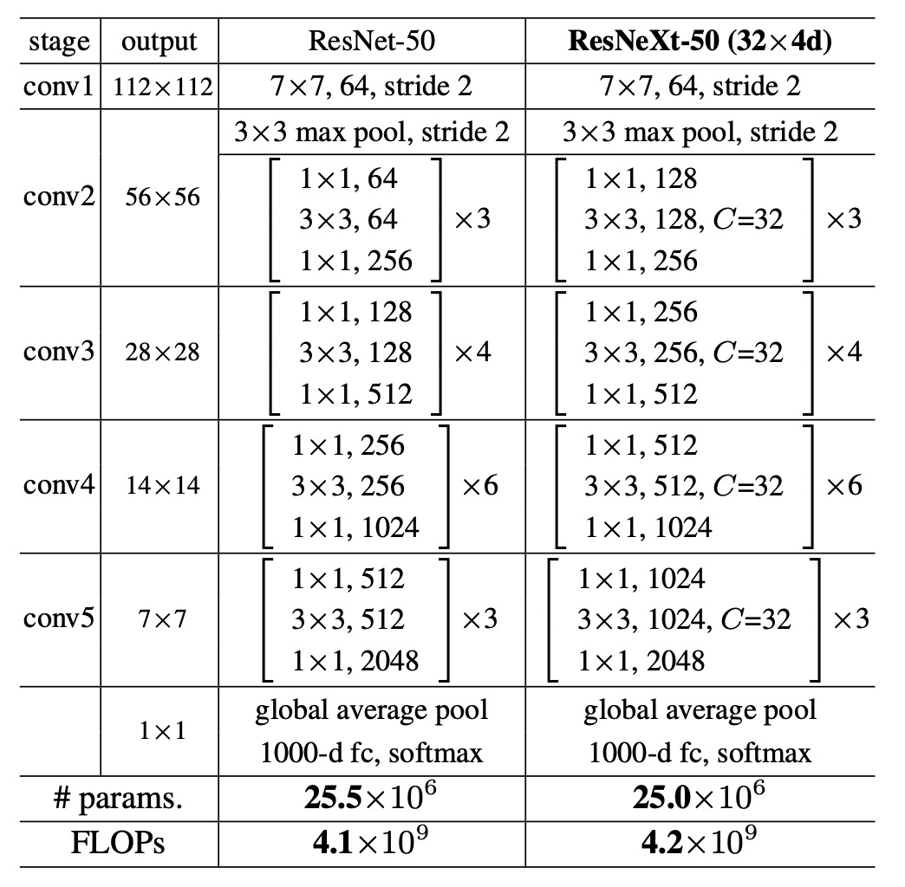
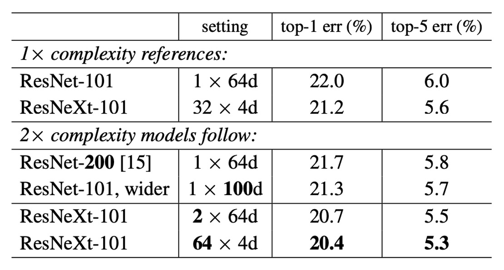
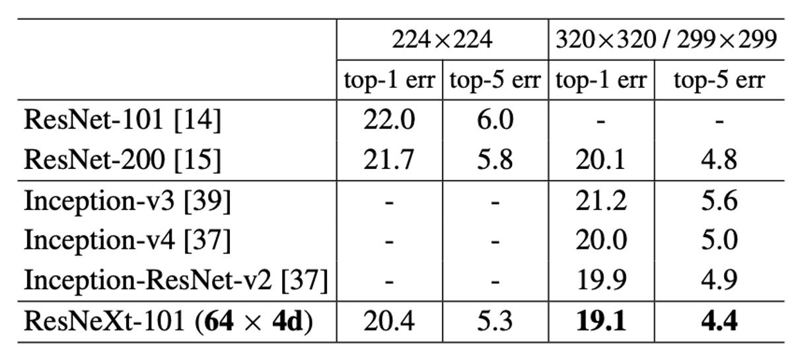

## 次元を探る

[**Aggregated Residual Transformations for Deep Neural Networks**](https://arxiv.org/abs/1611.05431)

---

以前に紹介された Inception モデルを覚えていますか？

- [**Going Deeper with Convolutions**](https://arxiv.org/abs/1409.4842)

あの目を見張るような分岐構造は印象的でしたね？

## 問題の定義

Inception は精緻に設計されたトポロジ構造が、理論的な複雑度を低く保ちながらより良い性能を実現できることを証明しました。

しかし、この設計方法にはいくつかの問題が伴います：

### 下流タスクの一般化能力

Inception モデルでは、異なるサイズの畳み込みカーネル（例：1x1、3x3、5x5 など）を使用して、異なるスケールで特徴を同時に抽出することが一般的です。

データセットの特徴に基づいて、各層で使用する畳み込みカーネルのサイズと数を決定する必要があります。たとえば、画像データセットの場合、大きな畳み込みカーネルはより多くのコンテキスト情報を捉えることができ、小さな畳み込みカーネルはより詳細な特徴を抽出します。

各 Inception モジュールには通常、異なるサイズの畳み込み層とプーリング層が含まれ、モジュール内の構造は必要に応じて設計され、交差検証を使用して最良の組み合わせが選択されます。

:::tip
これは人間工学に反しています！

このモデルを使うたびに、ためらってしまいます……これはエンジニアにとっての逆効果の集大成です。
:::

### モデル設計に不向き

現在の神経ネットワークに関する研究は、すでに「特徴エンジニアリング」から「モデル設計エンジニアリング」へとシフトしています。つまり、良い神経ネットワークをどう設計するかということです。

Inception モデルの設計には大量の人力と時間がかかり、より大きなモデルに拡張するのが難しいです。

しかし、この「分割・変化・統合」の設計思想は非常に参考になります。

## 解決策

### ネットワークアーキテクチャ

上図のように、左側が元の ResNet 構造、右側が著者が提案した ResNeXt 構造です。

著者は VGG および ResNet の設計方法を参考にし、高度にモジュール化された設計を採用し、モデルを多数の残差ブロック（residual blocks）で構成しました。次に、新しい次元として「基数（cardinality）」を導入し、深さや幅に加えて重要な要素として位置付けました。

この基数は ResNeXt モジュール内でのグループ数を指し、入力チャネルをいくつかのグループに分けて畳み込みを行います。たとえば、上図の「total 32 paths」の「32」はグループ数を表しており、各グループには 4 つのチャネルがあります。

さらに、著者は次の 2 つのシンプルなルールで設計空間を簡素化し、ネットワーク全体の設計をより簡単で統一的にしました：

- ルール 1：同じサイズの空間マップを生成する場合、それらのブロックは同じハイパーパラメータ（幅とフィルタサイズ）を共有する。
- ルール 2：空間マップを 2 倍にダウンサンプリングするたびに、モジュールの幅を 2 倍にする。

最後に、集約変換（Aggregated Transformations）の概念を導入し、ニューロンの基本的な操作をより複雑な変換に拡張し、ボトルネック型のアーキテクチャとグループ化された畳み込みを使用して実装を簡素化し、モデルの性能を向上させました。

このアーキテクチャにはいくつかの同等な形が存在します、以下の図のように：

- 上図(a)は本論文で提案された構造です。
- 上図(b)は 4 つの 1x1 256 の分岐操作を省略し、concat で代替したものです。その後、128 1x1 256 の畳み込みを加えます。
- 上図(c)は Conv2D 内のグループ化された畳み込みパラメータを直接呼び出し、その後 128 1x1 256 の畳み込みを加えます。

:::tip
Norm、ReLU、Pooling を省いた場合、これらのアーキテクチャの出力は同等です。

実装時には、私たちは第三の方法を使用し、迅速で簡単に行います。
:::

### モデル設定

グループ化畳み込みを使用することで計算量が削減されます。そのため、同じ基準で比較を維持するために、著者は ResNeXt モジュール内の中間チャネル数を元の ResNet の 2 倍に増加させ、グループ数を 32 に設定しました。

## 討論

### ImageNet-1K トレーニング結果

上図は、異なるモデルの検証誤差と訓練誤差が訓練回数（エポック数）に対してどのように変化するかを示しています。

ResNet-50 と比較して、32×4d ResNeXt-50 の検証誤差は 22.2%、ResNet-50 の 23.9%より 1.7%低くなっています。

基数$C$が 1 から 32 に増加するにつれて、モデルの複雑さを維持しながら、誤差率は減少し続けます。32×4d ResNeXt の訓練誤差も ResNet-50 よりも明らかに低く、性能の向上が主にモデルの表現能力の強化によるもので、正則化効果によるものではないことを示しています。

ResNet-101 の場合、32×4d ResNeXt-101 の性能は ResNet-101 よりも 0.8%高いです。検証誤差の改善は ResNet-50 と比較して小さいですが、訓練誤差の改善は依然として顕著です（ResNet-101 は 20%、32×4d ResNeXt-101 は 16%）。

### モデル複雑度の増加

グループ数がモデルの性能に与える影響をテストするため、著者は以下のいくつかの実験を行いました：

1. **複雑さを 2 倍に増加**

   - ResNet-101 のベースライン（22.0%）と比較して、モデルの複雑さを増加させると常に誤差が減少します。
   - しかし、効果には限界があります：
     - 深さを増加させる（ResNet-200、改善 0.3%）
     - 幅を増加させる（広い ResNet-101、改善 0.7%）。

2. **基数を増加させる方が効果的**

   実験により、基数$C$を増やすことが深さや幅を増やすことよりも良い結果を示すことが分かりました。

   - 2×64d ResNeXt-101 は top-1 誤差を 20.7%に低減しました。
     - 1×64d ResNet-101 のベースラインに$C$を 2 倍にして幅を保持した場合
   - 64×4d ResNeXt-101 は top-1 誤差を 20.4%に低減しました。
     - 32×4d ResNeXt-101 で$C$を 2 倍にして幅を保持した場合

3. **低い複雑度での性能**

   32×4d ResNet-101（21.2%）の性能は、より深い ResNet-200 やより広い ResNet-101 よりも優れていますが、その複雑度は約 50%に過ぎません。これは、基数$C$が深さや幅よりも効果的な次元であることを示しています。

### ImageNet-1K モデルのパフォーマンス

上表は、ImageNet 検証セットで単一作物テストを行った結果を示しています。

ResNeXt の結果は ResNet、Inception-v3/v4、および Inception-ResNet-v2 と比較しても遜色なく、単一作物の top-5 誤差率で 4.4%を達成しました。

さらに、ResNeXt のアーキテクチャ設計はすべての Inception モデルよりもはるかにシンプルで、手動で設定する必要があるハイパーパラメータも少なくなっています。

## 結論

本論文では、ResNeXt というシンプルで高度にモジュール化されたネットワークアーキテクチャを提案し、同じトポロジー構造を持つ変換を繰り返し集約することで構築し、同質な多分岐アーキテクチャを形成しました。このアーキテクチャは、少数のハイパーパラメータ設定のみで実現できます。

著者は、新しい次元「基数（cardinality）」を導入し、深さや幅に加えて重要な要素として位置付けました。

実験結果は、モデルの複雑さを維持しながら、基数を増加させることで分類精度が大幅に向上することを示しています。

モデルの深さや幅を単純に増加させるよりも、基数を増加させる方が効果的であることが確認されました。

:::tip
この論文は、後の可分離畳み込み、MobileNet などの軽量モデルの開発に重要な参考を提供しています。
:::
