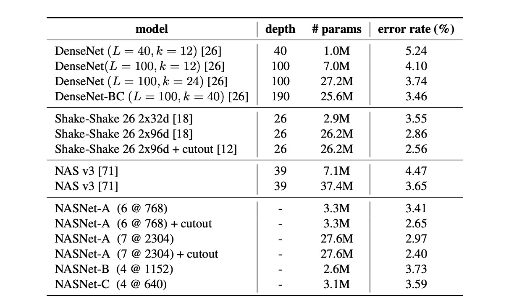

## ネットワークアーキテクチャの探索

[**Learning Transferable Architectures for Scalable Image Recognition**](https://arxiv.org/abs/1707.07012)

---

ハンマーを手にすると、すべてが釘に見える。

＊

深層学習のニューラルネットワークが普及してから、効果的なネットワークアーキテクチャを構築する方法が重要な問題となりました。

この問題を解決するために、研究者たちは自動的にネットワークアーキテクチャを探索する方法（Neural Architecture Search, NAS）をいくつも提案しています。

その中でも特に優れた技術を持つのが Google チームであり、彼らはさまざまな場所で NAS 技術を使ってネットワークを探索しています。

:::tip
Neural Architecture Search（NAS）は、深層学習モデルのアーキテクチャ設計と最適化に特化した自動化技術です。この技術は、特に複雑なデータや特定のアプリケーションシナリオに対処する際に、手動でネットワークアーキテクチャを設計する挑戦や限界を克服することを目的としています。自動探索プロセスを通じて、NAS は最も効率的なネットワーク構造を特定し、モデルの性能を向上させ、設計にかかる時間と専門知識を削減します。
:::

## 問題の定義

AlexNet が流行して以来、これまでにさまざまなネットワークアーキテクチャが開発されてきました。

しかし、これらのアーキテクチャの設計は、通常経験や直感に基づいて行われ、厳密な理論的基盤に基づくものではありません。

これにより、次のような問題が生じています：

- どのネットワークアーキテクチャが最適なのかが分からない。
- ネットワークアーキテクチャの設計には多くの専門知識と経験が必要。
- ネットワークアーキテクチャの設計過程は通常時間がかかり、リソースを多く消費する。

ここでは理論的基盤の部分は省略し、この論文が提案する自動的にネットワークアーキテクチャを探索する方法が、これらの「一部の問題」を解決できることを示します。

## 解決策

### 転送可能なアーキテクチャ

現段階でのすべての論文の目標は同じです。それは、ImageNet データセット上で最適なパフォーマンスを達成することです。

しかし、ImageNet は非常に大きなデータセットであり、直接 ImageNet でネットワークアーキテクチャを探索すると、非常に多くのリソースを消費してしまいます。

そこで、本論文ではまず CIFAR-10 データセットで適切なネットワークアーキテクチャを探索し、その後このアーキテクチャを ImageNet に転送する方法を提案しています。

### 基本構造

著者はネットワークアーキテクチャを構築するための 2 つの基本的なセルを提案しています：

1. **Normal Cell**：主に入力特徴マップのサイズ（高さと幅）を維持する役割を持つ。この設計により、特徴抽出過程で空間情報の整合性が保たれ、深層ネットワークにおける情報の効率的な伝達が促進されます。
2. **Reduction Cell**：特徴マップの空間次元を減少させる役割を持ち、具体的には高さと幅を半分に縮小します。これは、ストライドを 2 に設定することで実現され、計算量を効果的に削減し、モデルの抽象能力を高めます。

Reduction と Normal Cell は同じアーキテクチャを持つこともできますが、経験的には 2 つの異なるアーキテクチャを学習することが有益です。

また、空間次元を減少させるたびに、情報の密度を維持するためにフィルタの数を倍増させて情報損失を補っています。

この設計のインスピレーションは、Inception や ResNet の構造に由来しており、各層の深さとフィルタ数は、特定のアプリケーションの要求に応じて調整されます。

### 探索プロセス

探索空間では、各畳み込みユニットは 2 つの初期隠れ状態 $h_i$ と $h_{i-1}$ を受け取ります。この隠れ状態は、前の 2 つの低い層のユニットから出力されたものか、入力画像から来るものです。

検索プロセス全体は RNN を通じて実行され、RNN は畳み込みユニットの構造を予測し、その予測結果に基づいて新しい隠れ状態を生成します。

- **RNN の予測プロセス**

  RNN は畳み込みユニットの構造を再帰的に予測し、次の手順で行います：

  1. **隠れ状態の選択**：$h_i$、$h_{i-1}$、または前のブロックで生成された隠れ状態の集合から隠れ状態を選びます。
  2. **2 番目の隠れ状態の選択**：手順 1 と同じ選択肢から 2 番目の隠れ状態を選びます。
  3. **操作の選択**：手順 1 で選んだ隠れ状態に対して操作を選びます。
  4. **2 番目の操作の選択**：手順 2 で選んだ隠れ状態に対しても操作を選びます。
  5. **出力の統合**：手順 3 と 4 の出力を統合する方法を選び、新しい隠れ状態を生成します。

- **予測ステップの繰り返しとブロック**

  RNN は上記の 5 つの予測ステップを B 回繰り返し、畳み込みユニットの B 個のブロックに対応します。

  実験では、B=5 を選ぶことが良い結果をもたらすことが一般的です。

  各ラウンドでの予測は、新たに作成した隠れ状態を既存の隠れ状態集合に追加し、次のブロックでの潜在的な入力として使用されます。

- **操作の選択**

  RNN は以下の操作から選択します。これらの操作は、CNN 文献においてよく使われているものです：

  - identity
  - 1x3 then 3x1 convolution
  - 1x7 then 7x1 convolution
  - 3x3 dilated convolution
  - 3x3 average pooling
  - 3x3 max pooling
  - 5x5 average pooling
  - 5x5 max pooling
  - 7x7 max pooling
  - 1x1 convolution
  - 3x3 convolution
  - 3x3 depthwise separable convolution
  - 5x5 depthwise separable convolution
  - 7x7 depthwise separable convolution

- **統合方法**

  手順 5 では、RNN は 2 つの隠れ状態を統合する方法を選択します。これは、隠れ状態間の要素ごとの加算またはフィルタ次元での連結のいずれかです。

### DropPath モジュール

過去の文献では、DropPath 技術が過学習を防ぎ、モデルの一般化能力を高めるために使用されてきました。

- [**Fractalnet: Ultra-deep neural networks without residuals**](https://arxiv.org/abs/1605.07648)

本論文では、著者は DropPath 技術を探索プロセスに適用し、効果がないことを発見しました。

そこで、DropPath 技術を改良し、**ScheduledDropPath**と呼ばれる新しい技術を導入しました。この技術は、訓練過程で「線形に」モジュールを削除する確率を増加させ、良好な実験結果を得ることができました！

### 探索実験結果

最終的に著者は CIFAR-10 データセットで有効なネットワークアーキテクチャを探索し、上の図のような結果を得ました。

この図は複雑に見えますが、よく見ると理解しやすいです：

- 第 $h_{i-1}$ 層は破線で示され、第 $h_i$ 層は実線で示され、最終的にこれらが統合されて $h_{i+1}$ になります。
- ダウンサンプリングが必要な場合は`Reduction Cell`の経路を通り、それ以外の場合は`Normal Cell`の経路を通ります。

## 討論

### CIFAR-10 での結果

表から分かるように、データ増強を施した大規模な NASNet-A モデルは、2.40%の最先端エラーレートを達成しました（5 回の実行の平均値）。これは、以前の最良記録である 2.56%をわずかに上回る結果です。

著者は、単一実行での最良エラーレートが 2.19%に達したことを報告しています。

### ImageNet へのアーキテクチャの転送

ここで転送されたのはネットワーク構造だけであり、モデルは再訓練されています。

上の表から分かるように、同類のアーキテクチャと比較して、NASNet は少ない浮動小数点演算とパラメータで最先端の性能を実現しました。

最も大きなモデルは、ImageNet で新しい最先端性能（82.7%）を達成しました。これは、以前発表された最良結果（DPN-131）を約 1.2%上回るものです。

### モバイルデバイスでの評価

以前の研究では、MobileNet と ShuffleNet が最先端の結果を提供しており、約 550M の乗算加算操作で 224x224 の画像に対してそれぞれ 70.6%と 70.9%の精度を達成しています。

NASNet によって構築されたアーキテクチャは、計算需要が同等であることを前提に、これらの前のモデルを超える予測性能を実現し、74.0%の精度を達成しました。

:::tip
単純に計算量だけでモデルを評価することは、実際の性能を反映していない場合があります。実際に機械で推論してみることで、その効果が本物かどうかが分かります。

NASNet では、複数の分岐間での加算や連結計算が多いため、これらの操作が複数の分岐で待機を引き起こし、最終的にモデルの効率が低下する可能性があります。
:::

## 結論

本論文では、興味のあるデータセット上でモデルアーキテクチャを学習する方法を提案しました。

アーキテクチャの複雑さとネットワークの深さを分離する探索空間を設計することにより、画像分類タスクからスケーラブルな畳み込みユニットを学習しました。

この方法はモデルの適応性を高め、十分な計算リソースがない研究者でも、NAS によって見つけられたこれらのユニットアーキテクチャを直接使用できるようにしました。

:::info
もしリソースが十分であれば、ImageNet 上で直接アーキテクチャ検索を行った場合、より良い結果が得られるかもしれません。

おそらく Google チームがその気になれば、この疑問にも答えが出るでしょう。
:::
