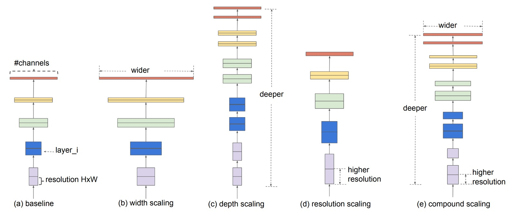
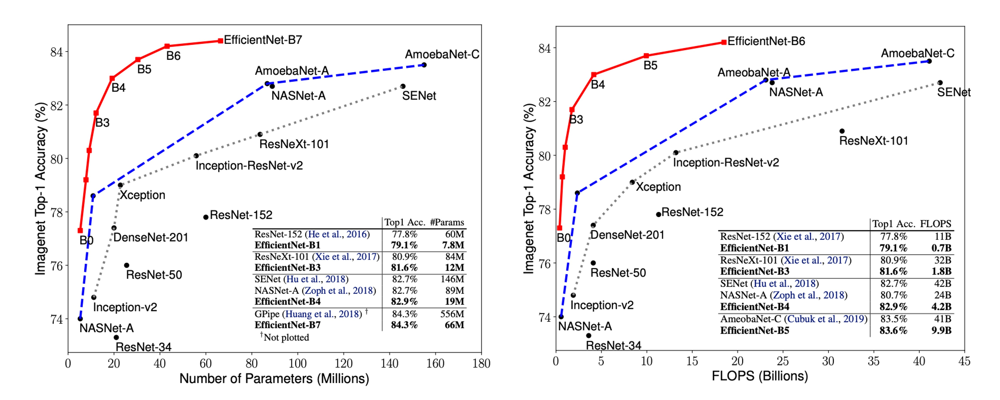

## 結合スケーリングアーキテクチャ

[**EfficientNet: Rethinking Model Scaling for Convolutional Neural Networks**](https://arxiv.org/abs/1905.11946)

---

畳み込みニューラルネットワークの性能を向上させる一般的な方法には 3 つあります：

1. **深いネットワーク**：ネットワークの深さを増加させる、例えば ResNet。
2. **広いネットワーク**：ネットワークの幅を増加させる、例えば WideResNet。
3. **高い解像度**：入力画像の解像度を増加させる。

今日、私は少し、あなたも少し、毎回精度を少しずつ上げて、皆で楽しくランキングを更新している。なんと素晴らしいことでしょうか？

## 問題の定義

この論文の著者は言います：それではいけません、私たちは問題全体を一緒に考慮すべきです！

そこで、結合スケーリングアーキテクチャ（**Compound Scaling**）を提案します。

## 問題の解決

### 2 つの観察

この論文で、著者は 2 つの重要な観察を提案しました。これらの観察は結合スケーリング法の基盤です。

- **観察 1：任意の次元の拡張は精度を向上させるが、モデルが大きくなると精度向上は急速に飽和する**

  

  畳み込み神経ネットワークの深さ、幅、または解像度を拡張すると、通常、モデルの精度は向上します。しかし、ネットワークが非常に深く、広く、または解像度が非常に高くなると、精度の向上幅は次第に減少し、最終的には飽和します。これは、ネットワークのいずれかの次元を単独で増加させても、無限にモデルの性能を向上させることはできないことを意味します。最終的にはボトルネックにぶつかります。

- **観察 2：モデルのスケーリングにおいて、ネットワークの幅、深さ、解像度のバランスが鍵である**

  

  与えられたリソース制約の下で、より良い精度と効率を追求するためには、ネットワークの幅、深さ、解像度を同時に考慮し、それらのバランスを保つ必要があります。単独で 1 つの次元を調整するのは簡単ですが、効果は限られています。逆に、すべての次元を調和させてスケーリングすることで、リソースをより効率的に活用し、より高い精度を達成できます。

### 結合スケーリング

ここで、モデルスケーリングの問題を再定義します：

畳み込み神経ネットワークの各層は、次のような関数 $Y_i = F_i(X_i)$ として定義できます。

- ここで $F_i$ は演算子、$Y_i$ は出力テンソル、$X_i$ は入力テンソルです。

全体の畳み込み神経ネットワーク $N$ は、一連の層の組み合わせとして表されます：$N = F_k \odot ... \odot F_2 \odot F_1(X_1)$。

実際には、畳み込み神経ネットワークの層は複数のステージに分割されており、各ステージ内のすべての層は同じアーキテクチャを共有しています。

したがって、ここでは畳み込み神経ネットワークを次のように定義できます：

$$N = \odot_{i=1}^s F_i^{L_i}(X)$$

ここで、$F_i^{L_i}$ は第 $i$ ステージ内の層 $F_i$ が $L_i$ 回繰り返されることを示します。

モデルスケーリングの目標は、与えられたリソース制約の下でモデルの精度を最大化することです。私たちは、基礎ネットワークアーキテクチャ $F_i$ を不変に保ちながら、ネットワークの深さ ($d$)、幅 ($w$)、および解像度 ($r$) を調整してモデルを最適化したいと考えています。

これは最適化問題として形式化できます：

- $\max_{d,w,r} \text{Accuracy}(N(d, w, r))$

制約条件としては：

- $\text{Memory}(N) \leq \text{target memory}$
- $\text{FLOPs}(N) \leq \text{target flops}$

著者は結合スケーリング法を提案し、1 つの結合係数 $\phi$ を使用してネットワークの幅、深さ、および解像度を統一的にスケーリングします：

- $\text{depth: } d = \alpha^\phi$
- $\text{width: } w = \beta^\phi$
- $\text{resolution: } r = \gamma^\phi$

制約として、$\alpha \cdot \beta^2 \cdot \gamma^2 \approx 2$ という関係を満たし、ここで $\alpha, \beta, \gamma$ は小範囲の探索によって決定された定数で、$\phi$ はユーザーがスケーリングリソースを制御するために指定する係数です。

この方法は、計算コスト（FLOPs）が適度に増加することを保証しつつ、各次元のバランスを取るスケーリングを実現し、与えられたリソース制約の下でより良い精度を達成します。

### モデルの基礎アーキテクチャ

良いベースラインネットワークを開発するために、著者はマルチ目標神経アーキテクチャ探索（Multi-Objective NAS）を参考にし、精度と FLOPs（毎秒浮動小数点演算回数）を最適化しました。

著者は $\text{Acc}(m) \times \left(\frac{\text{FLOPs}(m)}{T}\right)^w$ を最適化目標として使用しました。

- ここで、$\text{Acc}(m)$ と $\text{FLOPs}(m)$ はそれぞれモデル $m$ の精度と $\text{FLOPs}$ を表します。
- $T$ は目標 $\text{FLOPs}$。
- $w=-0.07$ は精度と $\text{FLOPs}$ のトレードオフを制御するハイパーパラメータです。

最終的に、EfficientNet-B0 が検索され、そのアーキテクチャは `MnasNet` に似ていますが、少し大きめで、$\text{FLOPs}$ 目標は 400M です。

下の表に EfficientNet-B0 のアーキテクチャが示されています：

EfficientNet-B0 の主な構成単位は、モバイル逆瓶頸畳み込み（Mobile Inverted Bottleneck MBConv）で、squeeze-and-excitation の最適化も組み込まれています。

### モデル拡張アーキテクチャ

ベースラインの EfficientNet-B0 から、著者は以下の 2 つのステップで結合スケーリング法を適用してネットワークを拡張しました：

- **ステップ 1**：まず、$\phi = 1$ を固定し、2 倍のリソースが利用できると仮定し、式 2 および 3 に基づいて$\alpha, \beta, \gamma$の最適値を小範囲でグリッド検索で決定します。EfficientNet-B0 の場合、最適値は$\alpha = 1.2, \beta = 1.1, \gamma = 1.15$ で、$\alpha \cdot \beta^2 \cdot \gamma^2 \approx 2$ の条件を満たします。

- **ステップ 2**：次に、$\alpha, \beta, \gamma$を定数として固定し、異なる$\phi$値を使用してベースラインネットワークを拡張し、EfficientNet-B1 から B7 までのモデルを得ます。

さらに、$\alpha, \beta, \gamma$を大規模なモデルで直接検索して性能を向上させることもできますが、この検索は大規模モデルでは非常にコストがかかります。著者の方法では、小型のベースラインネットワークで一度だけ検索（ステップ 1）を行い、同じスケーリング係数を使って他のすべてのモデルにスケーリングを適用（ステップ 2）することで、この問題を効果的に解決しています。

## 討論

### 結合スケーリングの重要性

結合スケーリング法が他の方法よりも優れている理由をさらに理解するために、著者は上記の図で異なるスケーリング方法を使用した代表的なモデルのクラス活性化マップ（CAM）を比較しました。

これらのモデルはすべて同じベースライン（EfficientNet-B0）からスケーリングされており、異なるモデルが画像を処理する際に注目している領域が示されています：

- **単次元スケーリングモデル**：物体の細部に対する注目が不足しており、画像中のすべての物体を捉えることができません。
- **結合スケーリングモデル**：物体の細部がより多く含まれている、関連する領域に注目し、物体の特徴をより広範に捉えています。

さらに、著者はさまざまなスケーリング方法の性能を観察しました：

1. **単次元スケーリング法**：

   - **深さスケーリング**：ネットワークの深さ、つまり層数を増加させます。
   - **幅スケーリング**：ネットワークの幅、つまり各層のチャンネル数を増加させます。
   - **解像度スケーリング**：入力画像の解像度を増加させます。

2. **結合スケーリング法**：
   - 深さ、幅、および解像度の増加を組み合わせ、本文で提案された$\alpha, \beta, \gamma$パラメータを使用して調和的にスケーリングします。

実験結果は以下の図に示されており、すべてのスケーリング方法が精度を向上させることができますが、結合スケーリング法の精度向上は最も顕著で、最大 2.5％に達します。これは、同じリソース増加のもとで、結合スケーリング法がリソースをより効率的に利用し、モデル性能の向上において顕著な優位性を持つことを示しています。

### ImageNet 上の結果

この論文では、著者は次のような具体的な訓練設定を使用しました：

- **オプティマイザ**：RMSProp
- **重み減衰**：$1 \times 10^{-5}$
- **初期学習率**：0.256、2.4 エポックごとに 0.97 で減衰
- **活性化関数**：SiLU
- **データ拡張**：AutoAugment、ランダム深度

大きなモデルにはより多くの正則化が必要であることを考慮して、著者は dropout 比率を EfficientNet-B0 の 0.2 から EfficientNet-B7 の 0.5 まで線形に増加させました。

上の表のデータは、EfficientNet モデルが通常、他の類似の精度を持つ畳み込み神経ネットワークよりも 1 桁少ないパラメータと FLOPS を使用していることを示しています。特に、EfficientNet-B7 は 66M のパラメータと 37B の FLOPS で 84.3％の Top-1 精度を達成し、以前の最良の GPipe よりも正確ですが、モデルサイズは 8.4 倍減少しています。

EfficientNet モデルは、サイズが小さいだけでなく、計算コストも低いです。例えば、EfficientNet-B3 は FLOPS を 18 倍削減して、ResNeXt101 よりも高い精度を実現しています。

### 推論速度

遅延を検証するために、著者は実際の CPU 上でいくつかの代表的な畳み込み神経ネットワークの推論遅延も測定しました。

下の表は、20 回の実行の平均遅延を示しています：

これらの結果は、EfficientNet が ResNet-152 や GPipe と比較して、パラメータと FLOPS で優れているだけでなく、実際のハードウェア上での推論速度も非常に速いことを示しています。

### パラメータ-精度曲線

上の図は、代表的な畳み込み神経ネットワークのパラメータ-精度および FLOPS-精度曲線を示しています。その中で、EfficientNet モデルはより少ないパラメータと FLOPS を使用して、より高い精度を実現しており、その性能における顕著な優位性を示しています。

## 結論

モデルの深さ、幅、解像度は、畳み込み神経ネットワークの性能において重要な要素です。

この論文では、著者は結合スケーリング法を提案し、ネットワークの深さ、幅、解像度を調和的にスケーリングすることによって、より良い精度と効率を実現しました。

今後の研究では、結合スケーリング法のパラメータ選択をさらに最適化し、他のタイプの神経ネットワークへの応用を探ることで、深層学習モデルの効率と性能をさらに向上させることができます。

:::tip
この論文は、要約を読んだ後、直接モデルアーキテクチャを使用して効果が確かに良好でした。
:::
