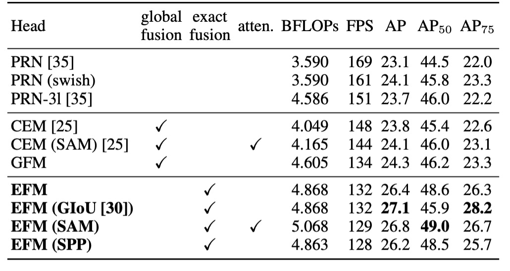

## 半半半プラグイン

[**CSPNet: A New Backbone that can Enhance Learning Capability of CNN**](https://arxiv.org/abs/1911.11929)

---

CSPNet は「Cross Stage Partial Network」の略です。

この論文は産業界で非常に広く応用されており、Timm パッケージにも多くの関連実装が含まれています。例えば、`cspdarknet53`、`cspresnet50`、`cspresnext50` などです。

## 問題の定義

著者は現在の神経ネットワークアーキテクチャを分析し、DenseNet の特性に注目しましたが、DenseNet には改善すべき問題がいくつかあるため、以下にまとめました：

1. **計算ボトルネック：**

   計算ボトルネックとは、計算過程において、特定の部分または層の計算リソース（例えば、処理ユニット、メモリ、データ転送など）が効率的に利用されず、全体的なパフォーマンスが制限される現象を指します。計算ボトルネックが発生すると、システムの一部の計算リソースがアイドル状態になり、他の部分は過剰に使用されることになります。

   CNN では、異なる層が異なる計算タスクを担当します。もしある層で必要な計算量が過剰であり、他の層での計算量が少ない場合、このような状況ではシステムの一部の計算ユニットが過剰に忙しく、他のユニットはアイドル状態にあります。

2. **メモリ使用量の増加**

   先日提案された DenseNet は、学習能力を向上させる一方で、メモリ使用量が増加します。これは内部に大量の Concat 操作があり、毎回データを結合する際にコピーが必要となるためです。また、その後のネットワークアーキテクチャの改良版である PeleeNet や VoVNet も同様の問題を抱えています。

:::tip
DenseNet については別の論文ノートを参考にできます：

- [**[16.08] DenseNet: 全部繋げる**](../1608-densenet/index.md)
  :::

## 問題の解決

### モデルアーキテクチャ

上図の上半分は DenseNet の元々の設計です。簡単に言うと、このプロセスは次のようになります：

1. 入力`x`を通じて畳み込み層を通し、`y1`を得る。
2. `y1`と`x`を結合して`y2`を得る。
3. `y2`を畳み込み層を通して`y3`を得る。
4. `y3`と`x`を結合して`y4`を得る。
5. 上記のステップを繰り返します。

DenseNet では、複数の層が同じ勾配情報を共有するため、同じ勾配を繰り返し学習してしまい、学習効果に影響を与えます。

---

メモリ使用量を低減するために、著者が行った変更は「全ての特徴マップを使用しないこと」です。

変更後の違いは以下の通りです：

1. **勾配パスの増加**：交差分割戦略により、勾配パスの数が倍増し、特徴マップのコピー回数が減少します。
2. **各層の計算量のバランス**：計算ボトルネックを減少させるため、いくつかの dense ブロックではチャンネル数を半分にしています。
3. **メモリ転送量の削減**：分割された戦略により、メモリ流量の半分を節約できます。

全体として、この設計は DenseNet の特徴再利用の利点を保持しつつ、勾配の流れを切断することで、重複した勾配情報を防ぎ、学習能力を向上させます。

:::tip
論文で「半分」という表現が繰り返し出てきますが、実際にはこの分割比率は設定可能です。

後の消融実験で、著者は異なる分割比率を実験しましたが、ここでは説明を簡単にするため「半分」の比率を使って説明します。
:::

### トランジションレイヤー

<figure style={{ "width": "60%"}}>

</figure>

特徴マップを分割するのは簡単ですが、それらをどのように統合するかが問題です。

この問題に対して、著者は 2 つの融合戦略を提案しました：

1. **Fusion First**: 上図 (c) のように、最初に 2 つの特徴マップを結合し、その後トランジション操作を行います。この戦略では、多くの勾配情報が重複して使用されます。
2. **Fusion Last**: 上図 (d) のように、最初にトランジションを行い、その後別の特徴マップと結合します。この戦略では勾配の流れが効果的に切断され、重複した情報が減少します。

両者の実験結果は以下の通りです：

1. **Fusion First**: 計算コストは確かに大幅に削減されますが、精度は 1.5%低下します。
2. **Fusion Last**: 計算コストは大幅に削減され、Top-1 精度は 0.1%の低下にとどまります。

比較してみて、著者は**Fusion Last**戦略を選択しました。

### 正確な融合モデル

上記で述べた CSP モジュールの構築方法が、実際この論文の主な内容です。

最後に、この部分では著者が FPN 構造の最適化内容を述べています。

---

上図 (c) は著者が提案する EFM アーキテクチャで、これまでの PANet に似ていますが、著者は PANet をベースに高解像度の特徴マップからより多くの全体的な情報を取り入れています。

- [**[18.03] PANet: 私に一つの近道をください**](../../feature-fusion/1803-panet/index.md)

最後に、特徴マップの結合にかかる計算量を削減するために、著者は`Maxout`操作を使用して特徴マップを圧縮し、負担を軽減しています。

:::tip
Maxout は入力データに直接非線形変換を行うのではなく、複数の線形出力の最大値を選択して学習に使用します。

例えば、2 つの線形出力$z_1$と$z_2$がある場合、Maxout はより大きい方の値を出力として選択します：

$$
\text{Maxout}(z_1, z_2) = \max(z_1, z_2)
$$

この技術の利点は、ReLU のような「死区間」問題を避けることができる点です。毎回最適な線形出力が選択され、ReLU のように出力が 0 になることがありません。
:::

## 討論

### CSP 構造の有効性

まず最初に確認すべきことは、CSP 構造が本当に有効かどうかです。

これを検証するために、著者は過去の文献で提供されたバックボーンアーキテクチャである PeleeNet を選択し、それを CSP アーキテクチャに改造して一連の実験を行いました。

- [**[18.04] Pelee: A Real-Time Object Detection System on Mobile Devices**](https://arxiv.org/abs/1804.06882)

表中の$\gamma$は CSP アーキテクチャにおける特徴マップ分割の比率を制御します。$\gamma = 0.5$の場合、特徴マップは 2 つに分割され、それぞれが元の特徴マップの半分を占

めることになります。$\gamma = 0.25$の場合、パラメータ量はあまり減少せず、$\gamma = 0.75$の場合、パラメータ量は多く減少しますが、モデル性能も低下します。

CSP（Fusion First）戦略のみを使用した場合、モデルの性能は PeleeNet および PeleeNeXt よりも若干優れています。部分的なトランジション層は冗長な情報の学習を減少させ、非常に良い結果を出しました。例えば、計算量が 21%減少した場合でも、精度は 0.1%しか低下しませんでした。

$\gamma = 0.25$の場合、計算量は 11%減少しましたが、精度は 0.1%向上しました。これは計算効率と精度の良いバランスを示しています。

基準モデルである PeleeNet と比較して、CSPPeleeNet は最良のパフォーマンスを示し、計算量は 13%減少し、精度は 0.2%向上しました。分割比率を$\gamma = 0.25$に調整することで、計算量が 3%減少し、精度が 0.8%向上しました。

### EFM 構造の有効性

著者は MS COCO データセットに基づいて EFM の消融実験を行い、その結果を表に示しました。

EFM は GFM と比較して毎秒フレーム数が 2fps 遅くなりましたが、AP（平均精度）および$AP_{50}$がそれぞれ 2.1%および 2.4%向上しました。SPP の視野拡張機構に対して、SAM の注意機構はフレームレートと AP の両方で優れた結果を得るため、最終的に**EFM(SAM)**を選択しました。

### ImageNet での性能

実験結果は、ResNet、ResNeXt、DenseNet ベースのモデルに CSPNet を導入することで、計算量が少なくとも 10%減少し、精度が維持されるか向上することを示しています。

軽量モデルでは、CSPNet の導入が特に効果的です。例えば：

- **CSPResNet-10**は ResNet-10 に対して精度が 1.8%向上しました。
- **CSPPeleeNet**と**CSPDenseNet-201-Elastic**はそれぞれ 13%と 19%の計算量削減を実現し、精度は少し向上または維持されました。
- **CSPResNeXt-50**は計算量を 22%減らし、Top-1 精度は 77.9%に向上しました。

### MS COCO での性能

**30∼100 fps の物体検出器**では、CSPResNeXt50 が PANet（SPP）を組み合わせて最良の結果を出し、38.4%の AP、60.6%の $AP_{50}$、41.6%の $AP_{75}$ を達成しました。

**100∼200 fps の物体検出器**では、CSPPeleeNet と EFM(SAM)を組み合わせたモデルが $AP_{50}$ を 12.1%増加させ、PeleeNet と同じ速度で実行し、CenterNet と同じ速度で検出率が 4.1%向上しました。

非常に速い物体検出器（ThunderNet、YOLOv3-tiny、YOLOv3-tiny-PRN）では、CSPDenseNet Reference と PRN の組み合わせが最速で 400 fps を達成し、ThunderNet と SNet49 よりも 133 fps、$AP_{50}$ で 0.5%高い結果を出しました。

### 推論速度

最後に、著者は CSPNet がさまざまなハードウェア上で推論速度を示した実験結果を提供しました。この実験は NVIDIA Jetson TX2 および Intel Core i9-9900K を使用し、OpenCV DNN モジュールを使って CPU 上での推論速度を評価しました。公平を期すため、モデル圧縮や量子化技術は使用していません。

上の表に示されるように、**CSPDenseNetb Ref-PRN**は YOLOv3-tiny、YOLOv3-tiny-PRN、SNet49-ThunderNet よりもそれぞれ 55fps、48fps、31fps 速く、$AP_{50}$ がそれらのモデルより高い結果を出しました。

**EFM**はモバイル GPU 上でも優れた性能を示し、特に特徴ピラミッドを生成する際には、EFM がメモリ要求を大幅に削減します。これによりメモリ帯域幅が限られたモバイル環境での利点が大きくなります。**CSPPeleeNet Ref-EFM (SAM)**は、YOLOv3-tiny よりも高いフレームレートを達成し、$AP_{50}$ を 11.5%向上させ、顕著な改善を示しました。

## 結論

CSPNet は、効果的な特徴融合戦略と勾配切断技術を通じて、さまざまなアーキテクチャの計算効率を向上させ、特にエッジコンピューティング環境において顕著な性能向上を示しました。

アーキテクチャの複雑さは増していますが、それでも計算リソースの要求を大幅に削減し、メモリ流量を低減させつつ、高い精度を維持するため、物体検出や他のリアルタイムタスクにおいて強力な選択肢となります。

バックボーンというよりも、むしろプラグインとして利用できるため、次回モデルを構築する際に CSP 構造を挿入してみるのも良いかもしれません。予想外の驚きが得られるかもしれません。
