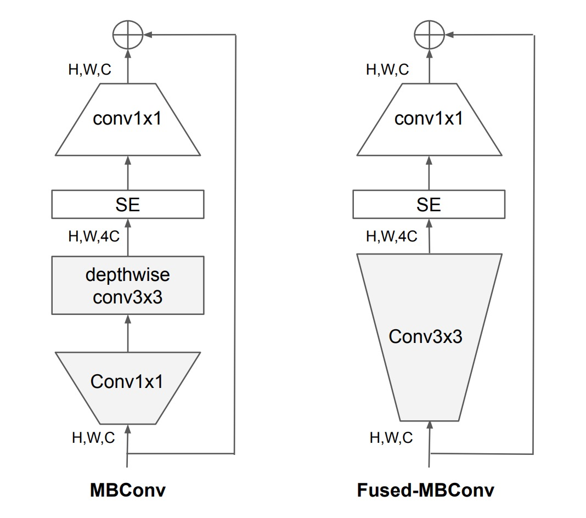
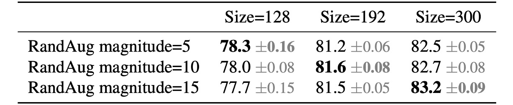

# [21.04] EfficientNet-V2

## 深層畳み込みの這い進み

[**EfficientNetV2: Smaller Models and Faster Training**](https://arxiv.org/abs/2104.00298)

---

EfficientNet の著者は、第一世代モデルを提案した後、さらに改善の余地があると感じました。

そのため、彼らは EfficientNetV2 を提案しました。これは、より小さく、より高速なモデルであり、効率性を保ちながら性能を向上させることができます。

## 問題の定義

過去の EfficientNet の開発過程で、著者は以下のいくつかの問題に気づきました：

1. 非常に大きな画像サイズ（例えば 800x800）を使用すると、トレーニング速度が非常に遅くなる。
2. 深層畳み込みがネットワークの初期層に配置されると、トレーニング速度が遅くなる。
3. 過去の ResNet の指針に従い、各段階でチャンネル数を均等に増加させることが、最適な結果を得るわけではない。

さらに、Google での以前の研究において、彼らは深層畳み込みのトレーニングが通常の畳み込みよりも遅いことを発見しました。

- [**[20.03] Accelerator-aware Neural Network Design using AutoML**](https://arxiv.org/abs/2003.02838)

  

  <figure style={{"width": "80%"}}>
  
  </figure>
  

  - この論文では、深層畳み込みは一見すると計算量を大幅に削減するが、実際にはハードウェアアクセラレーションを十分に活用できないことが指摘されています。

問題が発見されたので、解決策を考えなければなりません！

## 問題解決

### モデルアーキテクチャ

<figure style={{"width": "70%"}}>

</figure>

深層畳み込みは通常の畳み込みよりも少ないパラメータと FLOPs を持ちますが、現代のアクセラレーターを十分に活用できないことが多いです。

そのため、著者は EfficientNet-V1 で使用されていた`MBConv`モジュールを、`Fused-MBConv`モジュールに置き換えることを提案しました。

具体的な操作は上図の通りで、深層畳み込みを除去し、標準的な畳み込みを使用してチャンネル拡張を行っています。

### 漸進的学習

以前、他の多くの研究がトレーニング中に動的に画像サイズを変更していましたが、これらは通常、精度の低下を引き起こしていました。

著者は、精度の低下は不均衡な正則化から来ていると仮定しました：

- 異なる画像サイズを使用してトレーニングする場合、正則化の強度もそれに応じて調整すべきであり、従来の研究のように固定された正則化を使用するべきではありません。

実際、大きなモデルは過剰適合に対抗するために強力な正則化を必要とすることが一般的です：例えば、EfficientNet-B7 は B0 よりも大きなドロップアウトと強化されたデータ拡張を使用します。

著者は、同じネットワークにおいても、より小さな画像サイズはネットワーク容量を小さくするため、弱い正則化が必要であると考えました；逆に、画像サイズが大きいほど計算量が増え、容量も増加するため、過剰適合が起こりやすくなります。

この考えを検証するため、著者は ImageNet で以下の実験を行いました。

<figure style={{"width": "80%"}}>

</figure>

上の表から、入力サイズが 128 のときは、少ない正則化が効果的であることがわかります；入力サイズが 300 の場合、より多くの正則化が効果的であることがわかります。

実験結果は上記の考えを支持し、著者はトレーニング過程で自適応的に正則化と画像サイズを調整し、従来の漸進的学習法を改善しました。

### 再度の NAS

基本モジュールを変更した後、著者は再び NAS（ニューラルアーキテクチャ検索）を行いました。

この部分で、著者は EfficientNet-V1 のトレーニングで大きな画像サイズを広く使用すると、メモリ消費が大きく、トレーニングが遅くなることに気づきました。この問題を解決するために、本論文ではスケーリング規則を変更し、最大画像サイズを 480 ピクセルに制限しました。

## 議論

### Fused-MBConv はどこに配置するか？

<figure style={{"width": "80%"}}>

</figure>

実験によると、`Fused-MBConv`の配置場所も重要です。

上の表から、`Fused-MBConv`をすべてのブロックに置き換えると、パラメータと FLOPs が大幅に増加し、速度も遅くなることがわかります。

Stage 1〜3 に配置すると、FLOPs は増加するものの、速度とモデル性能の向上が見込めます。

### ネットワーク検索結果

<figure style={{"width": "80%"}}>

</figure>

第一世代と比較して、第二世代のモデルにはいくつかの違いがあります：

1. 初期層で`Fused-MBConv`が使用されています。
2. EfficientNet-V2 は、MBConv のより小さな拡張比率を好みます。
3. EfficientNet-V2 は、より小さな 3x3 の畳み込みカーネルサイズを好みますが、感受野の損失を補うためにより多くの層を追加しています。

### トレーニングの加速

<figure style={{"width": "60%"}}>

</figure>

著者は EfficientNet-V2 と他のモデルのトレーニング速度を比較しました。

上の表から、EfficientNet-V2 のトレーニング速度が他のモデルよりもはるかに速いことがわかります。

### ImageNet での結果

EfficientNetV2 モデルは、速度と精度の両面で、従来の ConvNet や Transformer モデルを大きく上回ります。

特に、EfficientNetV2-M は同じ計算リソースで EfficientNet-B7 に匹敵する精度を達成し、トレーニング速度は 11 倍向上しました。

精度と推論速度の両方で、EfficientNetV2 モデルは最新の RegNet や ResNeSt モデルよりも優れています。

Vision Transformers は ImageNet で優れた結果を示していますが、トレーニング方法を改善し、適切な ConvNet を設計することで、EfficientNetV2 は依然として精度とトレーニング効率の点で優れた性能を持っています。特に、EfficientNetV2-L は 85.7%の top-1 精度を達成し、より大きなデータセット ImageNet21k で事前トレーニングされた ViT-L/16 (21k)モデルを超えました。

推論速度に関しても、EfficientNetV2 モデルは優れた性能を示しています。トレーニング速度が通常推論速度に関連しているためです。

ViT-L/16 (21k)と比較して、EfficientNetV2-L (21k)は top-1 精度を 1.5%向上させ（85.3% vs. 86.8%）、使用されるパラメータ数は 2.5 倍減少し、FLOP 回数は 3.6 倍減少し、トレーニングと推論速度は 6〜7 倍向上しました。

最後に著者が述べた重要な観察結果：

- 高精度を達成するには、モデルの規模を単純に拡大するよりも、データセットの規模を拡大する方が効果的です。top-1 精度が 85%以上になると、モデル規模をさらに拡大して精度を向上させるのは困難ですが、追加の ImageNet21k での事前トレーニングが精度を大幅に向上させます。
- ImageNet21k での事前トレーニングは非常に効率的です。ImageNet21k のデータ量は 10 倍ですが、32 個の TPU コアを使用して、EfficientNetV2 の事前トレーニングは 2 日で完了し、ViT の数週間よりも大幅に短縮されました。

今後の研究では、公共の ImageNet21k データセットを使用して、大規模モデルの事前トレーニングを行うことが推奨されます。

## 結論

モデルを構築するエンジニアにとって、この論文から得られるインスピレーションは次のとおりです：

- 畳み込みネットワークアーキテクチャの初期 3 段階で`Fused-MBConv`を使用すると、モデル性能を向上させることができます。
- トレーニング中に画像サイズの変化に応じて正則化強度を自適応的に調整することで、モデルの精度を向上させることができます。

これらの方法は、モデルのトレーニング時に現場での問題をより効率的に解決するのに役立ちます。
