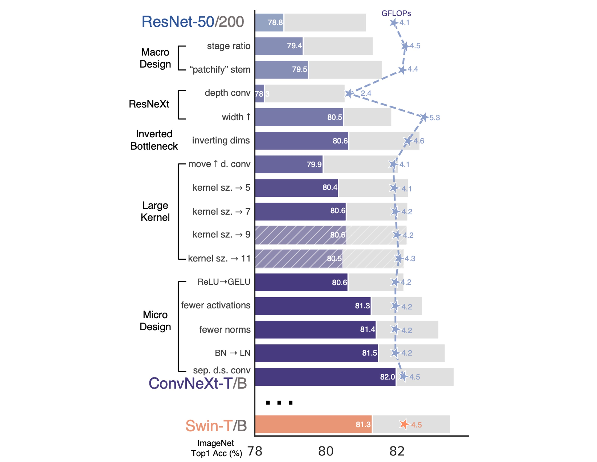

## 卷積を再び偉大に

[**A ConvNet for the 2020s**](https://arxiv.org/abs/2201.03545)

---

2010 年代を振り返ると、深層学習はこの期間に著しい進展を遂げ、多くの分野に深遠な影響を与えました。

この進展を牽引した中心は、ニューラルネットワークの復活、特に畳み込みニューラルネットワーク（ConvNet）でした。

過去 10 年間、視覚認識の分野は手作りの特徴量から畳み込みニューラルネットワークのアーキテクチャ設計に移行することに成功しました。

畳み込みニューラルネットワークの概念は 1980 年代にさかのぼりますが、視覚特徴の学習におけるその潜力が本当に証明されたのは 2012 年であり、この転換点は AlexNet の登場によって示され、コンピュータビジョンの新しい時代の「ImageNet の瞬間」が開かれました。

その後、この分野は急速に進展し、代表的な作品には以下があります：

- [**[14.09] VGG**](https://arxiv.org/abs/1409.1556)
- [**[14.09] GoogLeNet**](https://arxiv.org/abs/1409.4842)
- [**[15.12] ResNet**](https://arxiv.org/abs/1512.03385)
- [**[16.08] DenseNet**](https://arxiv.org/abs/1608.06993)
- [**[17.04] MobileNet**](https://arxiv.org/abs/1704.04861)
- [**[19.05] EfficientNet**](https://arxiv.org/abs/1905.11946)
- [**[20.03] RegNet**](https://arxiv.org/abs/2003.13678)

これらの画期的な研究は効率性とスケーラビリティを強調し、多くの実用的な設計原則を普及させました。

しかし、このすべては ViT の登場によって突然終息しました。

- [**[20.10] ViT**](https://arxiv.org/abs/2010.11929)

## 問題の定義

視覚変換器（ViT）の導入は、ネットワークアーキテクチャの設計を根本的に覆しました。最初の「スライス」層が画像を複数のパッチに分割することを除いて、ViT は画像に特化した帰納的バイアスを導入せず、元の NLP Transformer を最小限に修正しただけです。

ViT の大きな利点は、その拡張性にあります：モデルとデータセットが大きくなるにつれて、その性能は標準的な ResNet を大きく上回ります。

性能の差を埋めるために、階層的 Transformer はハイブリッドアプローチを採用しました。例えば、「スライディングウィンドウ」戦略は局所的な注意機構を再導入し、Transformer が ConvNet により近い動作をするようにしました。

Swin Transformer はこの面での里程標となり、Transformer が汎用的な視覚バックボーンとして、画像分類以外のさまざまなコンピュータビジョンのタスクで最先端の性能を達成できることを初めて証明しました。

Swin Transformer の成功と迅速な受け入れは、畳み込みの本質が依然として置き換えが難しいことを示しています。

- [**[21.03] Swin Transformer**](https://arxiv.org/abs/2103.14030)

これらの進展を踏まえ、実際には多くの視覚変換器の進展は畳み込みの利点を復活させるものでした。

しかし、これらの試みは費用がかかります：スライディングウィンドウの自己注意機構の実装はコストがかかり、循環的シフトなどの高度な手法で効率を向上させることができますが、システム設計はより複雑になります。

皮肉なことに、ConvNet はすでに多くの必要な特性を備えており、シンプルで素朴な方法でそれを実現しています。

ConvNet が失速した唯一の理由は、Transformer が多くの視覚タスクでそれを超えたからです。

著者は言います：この状況は本来あるべきではない。

## 解決策

### ネットワークアーキテクチャの再設計

簡単にするために、著者は ResNet-50 を開始点として、同規模の Swin Transformer を参照比較対象としました。

### 現代的なトレーニング技術の導入

ViT は新しいネットワークアーキテクチャを導入しただけでなく、多くの現代的なトレーニング技術ももたらしました。そのため、著者は ViT のトレーニング技術を ConvNet に応用することから始めました。

- トレーニング時間を 90 エポックから 300 エポックに増加。
- AdamW オプティマイザを使用。
- 画像強化技術を使用：

  - [**Mixup**](https://arxiv.org/abs/1710.09412)
  - [**CutMix**](https://arxiv.org/abs/1905.04899)
  - [**RandAugment**](https://arxiv.org/abs/1909.13719)
  - [**ランダム削除**](https://arxiv.org/abs/1708.04896)

- 正則化スキームの使用：

  - [**ランダムディープ**](https://arxiv.org/abs/1608.06993)
  - [**ラベルスムージング**](https://arxiv.org/abs/1512.00567)

:::info
上記のトレーニング技術を完了した後、ResNet-50 の性能は 2.7%向上し、76.1%から 78.8%に増加しました。
:::

### マクロ設計

この部分には二つの設計上の考慮点があります：

1. **ステージ計算比率**

   ResNet では、ステージ間の計算分布の設計は主に経験に基づいています。

   例えば、ResNet の stage-4 は下流のタスク（物体検出など）との互換性を持たせることを目的としています。検出器ヘッドは 14×14 の特徴平面で動作します。

   同様に、Swin-T も同じ原理に従い、ステージ計算比率は 1:1:3:1 です。より大きな Swin Transformer では、この比率は 1:1:9:1 です。

   Swin-T と一致する FLOP を維持するため、著者は ResNet-50 の各ステージのブロック数を(3, 4, 6, 3)から(3, 3, 9, 3)に調整しました。

   :::info
   ステージ計算比率に関連する研究：

   - [**[19.05] On network design spaces for visual recognition**](https://arxiv.org/abs/1905.13214)
   - [**[20.03] Designing network design spaces**](https://arxiv.org/abs/2003.13678)
     :::

   今後、モデルはこのステージ計算比率を使用します。

   :::info
   このステージにより、モデルの精度は 78.8%から 79.4%に向上しました。
   :::

2. **Stem 構造設計**

   ConvNet における stem は、入力が最初に通過する層を指します。

   通常、入力の空間的なサイズを早期に縮小するために使用されます。

   ViT では、stem は 16×16 の大きな畳み込み核を使用したパッチ化層です。

   Swin-T では、stem は 4×4 のサイズで、ストライドが 4 の畳み込みです。

   ここで著者は Swin-T と同じ設計を採用し、ResNet-50 の stem を 4×4 の非重複畳み込みに調整しました。

   :::info
   この設計により、モデルの精度は 79.4%から 79.5%に向上しました。
   :::

### ResNeXt 化

この部分では、著者は ResNeXt の設計思想を採用しました。このモデルは通常の ResNet よりも FLOPs/精度のバランスが良いです。

- [**Aggregated Residual Transformations for Deep Neural Networks**](https://arxiv.org/abs/1611.05431)

ResNeXt のコア設計はグループ畳み込みであり、畳み込みフィルタは異なるグループに分けられます。

ResNeXt の指針は「もっと多くのグループを使い、幅を広げる」というもので、3×3 の畳み込み層でグループ畳み込みを採用します。

この論文では、著者は深層畳み込みを使用しました。これはグループ畳み込みの特別な形式で、グループの数がチャネルの数と等しくなります。

深層畳み込みは自己注意における加重和演算に似ており、各チャネルで操作を行います。

深層畳み込みを使用すると、ネットワークの FLOPs を効率的に削減できますが、精度が低下することが予想されます。

ResNeXt の戦略に従って、著者はネットワークの幅を Swin-T と同じチャネル数（64 から 96 へ）に増加させました。

:::info
これにより、ネットワークの性能は 80.5%に向上し、FLOPs は 5.3G に増加しました。
:::

### 逆瓶頸

Transformer の各ブロックには逆瓶頸構造があり、通常は膨張率 4 が使用されます。

その後、MobileNetV2 がこの概念を普及させました。違いは、膨張後に 3×3 の深層畳み込みを追加することです。

上図(a)は ResNeXt の基本構造であり、(b)は MobileNetV2 の基本構造、(c)は別の選択肢で、3×3 の深層畳み込みを前方に移動させ、次章で大きな畳み込み核を探る準備をしています。

:::info
(b)の設計を採用すると、モデルの精度は 80.6%に向上しました。

大規模な ResNet-200 / Swin-B システムではさらに性能が向上し、81.9%から 82.6%に増加しました。
:::

### 大きな畳み込み核

ViT における非局所的な自己注意は、その重要な特性の一つであり、これによりネットワークは各層で全体の感受野を持ちます。

これは、従来の ConvNet が使用する小さなカーネル（例えば 3×3、VGGNet によって普及）とは対照的です。

大きなカーネルの適用を探るために、著者は深層畳み込み層を前方に移動する戦略を提案し、これは Transformer での MHSA ブロックを MLP 層の前に配置する方法に似ています。

この構造調整により、FLOPs を削減し、性能を最適化することができます。

これらの調整後、異なるカーネルサイズ（3×3 から 11×11）をテストしました：

- 3x3：79.9%
- 7x7：80.6%

著者は、カーネルサイズを 7×7 に増加させると、ネットワーク性能が 79.9%から 80.6%に向上し、この時 FLOPs は変わらないことを発見しました。

カーネルサイズをさらに増加させても（7×7 を超えて）、ResNet-200 モデルではさらなる性能向上は見られませんでした。

:::info
これらの手順は性能を向上させませんでしたが、(b)の設計を(c)の設計に変更して、Transformer の自己注意のスタイルを模倣しました。
:::

### 微細設計

1. **GELU への ReLU の置き換え**

   ReLU（整流線形単位）は、そのシンプルさと計算効率により、畳み込みニューラルネットワーク（ConvNet）では常に最も選ばれる活性化関数です。

   GELU（ガウス誤差線形単位）は、ReLU のより滑らかな変種として、Google の BERT や OpenAI の GPT-2 など、最先端の Transformer モデルで徐々に人気を集めています。

   著者は ConvNet で ReLU を GELU に置き換えましたが、モデルの精度には変化がありませんでした。

   :::info
   性能は向上しませんでしたが、著者は GELU に変更することを選びました。
   :::

2. **活性化関数の削減**

   

   Transformer アーキテクチャ、特に MLP ブロックでは通常、活性化関数が一つだけ使用されます。

   対照的に、ResNet モジュールでは、各畳み込み層の後、さらには小さな 1×1 畳み込み層の後にも活性化関数が使用されることが一般的です。

   著者は、残差ネットワークブロック内のすべての GELU 活性化層を削除し、1×1 畳み込み層の間に 1 層だけを残して、Transformer ブロックのスタイルを模倣しました。

   この調整により、性能が向上し、精度は元の 80.6%から 81.3%に増加し、Swin-T とほぼ同等の性能となりました。

   :::info
   この設計により、モデルの精度は 80.6%から 81.3%に向上しました。
   :::

3. **Normalization 層の削減**

   Transformer では通常、Normalization 層が少なく、ConvNet では Batch Normalization（BN）が各畳み込み層の後に使用されます。

   そのため、著者はさらに 2 つの Batch Normalization 層を削除し、1x1 畳み込みの前にのみ保持しました。

   :::info
   この設計により、モデルの精度は 81.3%から 81.4%に向上しました。
   :::

4. **BatchNorm を LayerNorm に置き換える**

   Transformer では、より簡単な Layer Normalization（LN）が使用されており、これによりさまざまなアプリケーションで優れた性能を発揮しています。

   元の ResNet では LN を BN に置き換えると性能が低下します。

   - [**[21.05] Rethinking "batch" in batchnorm**](https://arxiv.org/abs/2105.07576)

   ネットワークアーキテクチャとトレーニング技術のすべての修正を経て、著者は LN を使用した場合の影響を再評価し、ConvNet モデルは LN でトレーニングする際に問題がないことを発見しました。

   :::info
   この設計により、モデルの精度は 81.4%から 81.5%に向上しました。
   :::

5. **ダウンサンプリング層**

   ResNet アーキテクチャでは、空間的なダウンサンプリングは各ステージの最初に始まる残差ブロックで実現され、主にストライド 2 の 3×3 畳み込み層とショートカット接続でストライド 2 の 1×1 畳み込み層が使用されます。

   ResNet に対して、Swin Transformers は各ステージ間に独立したダウンサンプリング層を追加しました。

   さらなる調査により、空間解像度が変化する場所に Normalization 層を追加することで、トレーニングが安定することがわかりました。

   これには、Swin Transformers で使用される複数の Layer Normalization（LN）層が含まれます：各ダウンサンプリング層の前、stem の後、および最終的なグローバル平均プーリング後にそれぞれ追加されます。

   これらの結果を基に、著者は最終モデルに独立したダウンサンプリング層を使用し、これを ConvNeXt というモデル名で呼ぶことにしました。

   :::info
   この設計により、モデルの精度は 81.5%から 82%に向上しました。
   :::

## 討論

### モデル設定の概要

これらのモデルは、ResNet アーキテクチャの「現代的な」アップグレードであり、各バリアントは主にチャネル数（C）と各ステージのブロック数（B）に違いがあります。

以下は各モデルの特定の設定です：

1. **ConvNeXt-T**（Tiny 版）:

   - チャネル数 C = (96, 192, 384, 768)
   - 各ステージのブロック数 B = (3, 3, 9, 3)

2. **ConvNeXt-S**（Small 版）:

   - チャネル数 C = (96, 192, 384, 768)
   - 各ステージのブロック数 B = (3, 3, 27, 3)

3. **ConvNeXt-B**（Base 版）:

   - チャネル数 C = (128, 256, 512, 1024)
   - 各ステージのブロック数 B = (3, 3, 27, 3)

4. **ConvNeXt-L**（Large 版）:

   - チャネル数 C = (192, 384, 768, 1536)
   - 各ステージのブロック数 B = (3, 3, 27, 3)

5. **ConvNeXt-XL**（Extra Large 版）:

   - チャネル数 C = (256, 512, 1024, 2048)
   - 各ステージのブロック数 B = (3, 3, 27, 3)

各新しいステージでチャネル数が倍増するのは、ResNet および Swin Transformers の設計理念に従っています。

この階層的な設計は、異なるサイズや複雑さのデータセットを処理する際に、さまざまな規模のモデルがより柔軟で効率的な性能を提供できることを可能にします。

### ImageNet 上での性能

1. **ImageNet-1K 性能比較**：

   - **ConvNeXt と ConvNet のベンチマーク比較**：ConvNeXt は精度と推論スループットにおいて、強力な ConvNet ベンチマーク（RegNet や EfficientNet など）と競り合える性能を発揮します。
   - **Swin Transformers との比較**：ConvNeXt は同じ複雑さの下で通常、Swin Transformers よりも優れた性能を示します。例えば、ConvNeXt-T は Swin-T より 0.8%高いです。ConvNeXt は移動ウィンドウや相対位置バイアスなどの専用モジュールを使用せず、より高いスループットを示します。
   - **特定のモデル性能**：例えば、ConvNeXt-B は解像度を上げると（224² から 384² に変更）、Swin-B と比較して、FLOPs/スループットの優位性がさらに顕著になり、精度は 0.6%向上しました（85.1% vs 84.5%）、推論スループットは 12.5%増加しました。

2. **ImageNet-22K 性能比較**：

   - **大規模事前学習の影響**：通常、視覚変換器は大規模事前学習でより良いパフォーマンスを発揮すると考えられていますが、実験結果では適切に設計された ConvNet（ConvNeXt など）は、大規模事前学習後に Swin Transformer と同等かそれ以上のパフォーマンスを示し、スループットがわずかに高いことが示されました。
   - **ConvNeXt-XL の性能**：ConvNeXt-XL に拡張した場合、精度は 87.8%に達し、ConvNeXt アーキテクチャのスケーラビリティを示しました。

3. **ConvNeXt アーキテクチャの優位性**：

   - ImageNet-1K では、EfficientNetV2-L が漸進的トレーニングプロセスで最良のパフォーマンスを達成しました。
   - ImageNet-22K の事前学習を通じて、ConvNeXt は EfficientNetV2 を超えることができ、規模の大きいトレーニングの重要性をさらに証明しました。

## 結論

2020 年代において、Swin Transformers のような階層的視覚変換器の台頭により、従来の畳み込みニューラルネットワークは徐々に優れた選択肢ではなくなったように見えます。

しかし、この記事で提案された ConvNeXt モデルは、構造のシンプルさと効率性を保ちながら、最先端の視覚変換器と競り合うことができることを示しています。

この戦いはまだ終わっていません！
