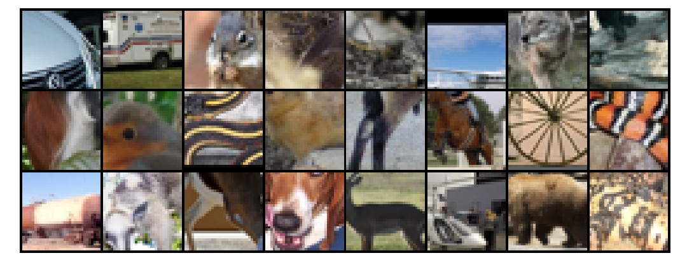
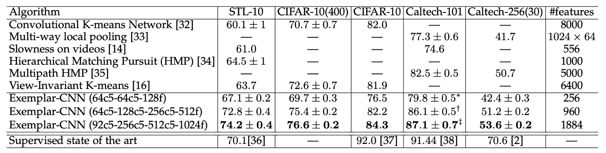
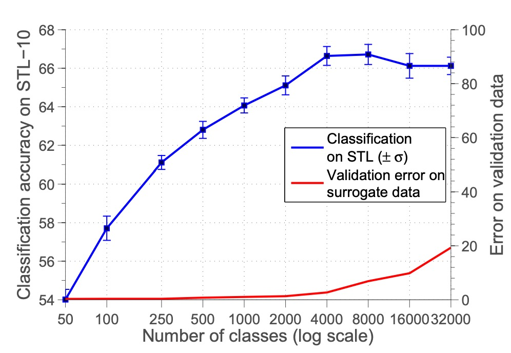
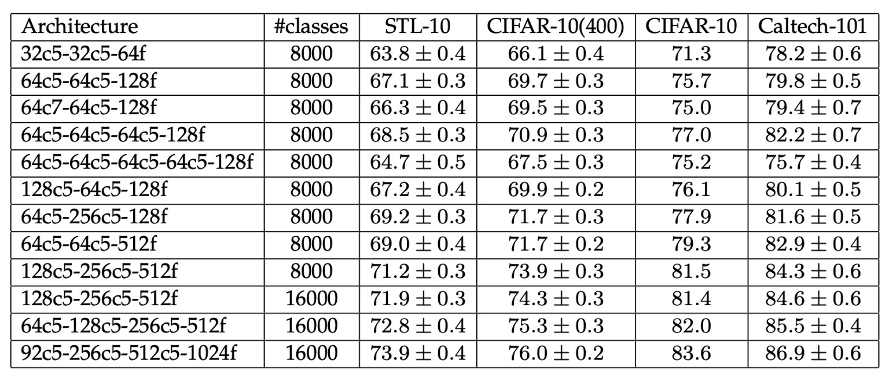

## 不変の特徴を探る

[**Discriminative Unsupervised Feature Learning with Exemplar Convolutional Neural Networks**](https://arxiv.org/abs/1406.6909)

---

論文を読んでいると、多くの研究がこの論文のアイデアを参考にしていることが分かりました。そのため、時間をかけて詳しく見ていきましょう。

この論文のコンセプトは非常にシンプルですが、多くの実験結果が新たな視点を与えてくれます。

## 問題の定義

教師あり学習のメリットは同時にそのデメリットでもあります。それは、大量のラベル付きデータが必要という点です。しかし、特定の応用場面では、こうしたデータを入手するのが難しかったり、コストがかかったりすることがあります。

さらに、物体分類から特徴記述子マッチング（descriptor matching）など、異なるタスク間で転移学習を行いたい場合、教師あり学習の効果は必ずしも十分ではありません。

このような課題に対して、単純な発想として「ラベルを使わない」という選択肢があります。

しかし、ラベルを使わない場合、モデルはどのように学習すれば良いのでしょうか？

著者はこう述べています：「代理タスクを設定する必要があります。」

## 問題の解決

論文では、完全に人間のラベル付けを必要としない学習方法「**Exemplar-CNN**」が提案されています。

そのコアコンセプトは非常にシンプルです：

1. **ランダムな画像パッチの抽出**
   物体情報を多く含む領域に注目するため、画像の勾配の大きさに基づいて重み付けサンプリングを行い、ラベルなし画像から複数の $32 \times 32$ サイズの画像パッチを抽出します。

   :::tip
   ここでの「勾配」とはバックプロパゲーションのそれではなく、画像の勾配を指します。著者は、画像の勾配が意味のあるパッチを見つける手助けになると考えています。
   :::

2. **画像パッチへのランダム変換の適用**
   平行移動、スケーリング、回転、色調整、コントラスト調整などのランダムな変換を適用し、複数の「変形バージョン」を作成します。これにより、ネットワークが回転や色変化などに対する不変性を学習することが明確に定義されます。

3. **「代理クラス」を形成し、判別学習を行う**
   各元画像パッチとそのすべての変形バージョンは、同じ代理クラス内の「正例」と見なされます。

システムは大量の画像からこれを繰り返し、多くの代理クラスを生成します。そして、CNN を訓練して「どの画像パッチが同じ代理クラスに属し、どれが他のクラスに属するか」を判別させます。この方法で、モデルは異なる画像パッチを区別する能力を獲得しつつ、「同じ画像のさまざまな変形」に対する不変性を習得します。

論文で使用されている変換リストは以下の通りです：

- **平行移動**：水平方向または垂直方向に、画像パッチサイズの 20％以下の距離を移動。
- **スケーリング**：スケール係数を 0.7 から 1.4 の範囲で変更。
- **回転**：±20 度以内でランダム回転。
- **コントラスト 1**：各画素をすべての画素の主成分方向に投影し、それぞれの方向に 0.5 から 2 の係数を乗じる（主成分方向ごとに独立、画像パッチ内の画素は同一係数）。
- **コントラスト 2**：
  - HSV 表色系の彩度（S）および明度（V）を 0.25 から 4 のべき乗に調整。
  - さらに 0.7 から 1.4 の範囲で乗じ、-0.1 から 0.1 のオフセット値を加算。
- **色相**：HSV 表色系の色相（H）に-0.1 から 0.1 のオフセット値を加算。

:::tip
消去法実験のセクションで、これらの変換の有効性が検証されます。
:::

裁断後のトレーニングデータ例：（STL-10 を例に）

<figure style={{"width": "90%"}}>

</figure>

### 実験設定

著者は、**Exemplar-CNN**を以前の教師なし特徴学習手法と比較するために、以下のデータセットを用いて一連の実験を実施しました：STL-10、CIFAR-10、Caltech-101、および Caltech-256。

データセットの規模、クラス数、画像サイズなどの詳細は次の通りです：

- **分類数**：
  - STL-10 および CIFAR-10：10 クラス。
  - Caltech-101：101 クラス。
  - Caltech-256：256 クラス。
- **画像サイズ処理**：
  - CIFAR-10：$32 \times 32$から$64 \times 64$にリサイズ。
  - Caltech-101：$150 \times 150$にリサイズ。
  - Caltech-256：$256 \times 256$にリサイズ。

続いて、いくつかのネットワークアーキテクチャを設計しました：

- **小型ネットワーク（64c5-64c5-128f）**：
  - 2 層の畳み込み層（各層 64 フィルタ）。
  - 1 層の全結合層（128 ユニット）。
  - 最後に Softmax 層を追加。
- **中型ネットワーク（64c5-128c5-256c5-512f）**：
  - 3 層の畳み込み層（フィルタ数はそれぞれ 64、128、256）。
  - 1 層の全結合層（512 ユニット）。
- **大型ネットワーク（92c5-256c5-512c5-1024f）**：
  - 3 層の畳み込み層（フィルタ数はそれぞれ 92、256、512）。
  - 1 層の全結合層（1024 ユニット）。
- **畳み込みとプーリングの詳細**：
  - 全ての畳み込みフィルタは入力の$5 \times 5$領域に対応。
  - $2 \times 2$の最大プーリングが前 2 層の畳み込み層に適用される。
- **その他の技術**：
  - 全結合層に Dropout を適用。
  - Caffe をベースに実装し、訓練の詳細は付録 B.2 を参照。

テスト方法はネットワークを任意サイズの画像に適用し、特徴マップを計算し、データセットに応じた適切なプーリング方法を選択しました：

- STL-10 および CIFAR-10：4 象限最大プーリング（各特徴マップで 4 値）。
- Caltech-101 および Caltech-256：3 層空間ピラミッドプーリング（$1+4+16=21$値）。

最後に、1 対多線形サポートベクターマシン（SVM）を使用して分類を行いました。

## 討論

### 他手法との比較

<figure style={{"width": "90%"}}>

</figure>

上記の表は、**Exemplar-CNN** と他の教師なし特徴学習手法を異なるデータセット上で比較した結果です。

実験結果によると、**Exemplar-CNN** はすべてのデータセットで最良の結果を達成し、特に STL-10 データセットでは、全ての既報の結果を大幅に上回り、教師あり手法よりも優れた性能を示しました。

### 消去法実験 - 代理クラス数

<figure style={{"width": "70%"}}>

</figure>

まず、代理クラスの数が性能に与える影響をテストしました。

実験では代理クラスの数 $N$ を 50 から 32000 まで調整し、分類精度の変化を観察しました。

結果は上図の通りで、代理クラスの数が増加するにつれて分類精度が向上し、8000 クラス付近で最高値に達した後、安定または低下しました。著者は、クラス数が多すぎるとサンプル間の類似性が高くなり区別が困難になり、結果として分類性能が低下すると考えています。

:::tip
ただし、その後の研究では特徴の正規化が不足していたことが原因とされ、特徴を正規化すればクラス数が増えるにつれて性能がさらに向上することが示されています。
:::

### 消去法実験 - サンプル数

<figure style={{"width": "70%"}}>

</figure>

次に、1 クラスあたりの代理サンプル数 $K$ が性能に与える影響を調べました。

$K$ を 1 から 300 まで調整し、分類精度の変化を観察しました。

結果は、1 クラスあたりのサンプル数が増えるにつれて精度が向上し、100 サンプル付近で安定することを示しました。これにより、100 サンプルが目標に近似するのに十分であり、これ以上サンプル数を増やしても最適化にはあまり影響しないことが分かります。

### 消去法実験 - 画像拡張の種類

<figure style={{"width": "70%"}}>

</figure>

さらに、異なる画像拡張の種類が性能に与える影響を調査しました。

実験では元の「シード」サンプルを固定し、代理データに適用する変換の種類（スケーリング、回転、平行移動、色変化、コントラスト変化など）を調整しました。

結果は、平行移動、色変化、コントラスト変化が性能に大きく影響する一方、スケーリングと回転の影響は比較的小さいことを示しています。

### 消去法実験 - 画像分類の性能

<figure style={{"width": "90%"}}>

</figure>

上記の表は、**Exemplar-CNN** が異なるデータセットで示した性能を表示しています。

ネットワークの規模が大きくなるにつれて分類精度が全体的に向上しており、より大きなネットワークがデータの特徴をより十分に学習し活用できることを示しています。また、代理クラスの数が結果に顕著な影響を及ぼすことから、代理データの選択と生成が教師なし学習の鍵となることが分かります。

### フィルタの可視化

<figure style={{"width": "70%"}}>

</figure>

上図は、`64c5-64c5-128f` ネットワークが異なるデータセットで代理データを用いて訓練された際に学習したフィルタを示しています。配置は以下の通りです：

- **上段**：STL-10 データセットの代理データ。
- **中段**：CIFAR-10 データセットの代理データ。
- **下段**：Caltech-101 データセットの代理データ。

上図を分析すると、異なるデータセットに基づいてモデルが学習した特徴が異なることが分かります：

- STL-10 データセットは画像解像度が高く対象が多様であるため、フィルタはエッジやテクスチャなどの詳細な特徴を学習する傾向があります。
- CIFAR-10 データセットは画像解像度が低いため、フィルタは色ブロックや簡単な形状などの粗い特徴を学習する傾向があります。
- Caltech-101 データセットは画像の整列が良好であるため、フィルタは特定の物体に関連する局所的な特徴を学習する傾向があります。

これにより、異なるデータセットからの代理データであっても、ネットワークが分類またはマッチング能力を持つ有効な特徴を学習できることが示されています。

## 結論

本論文では、物体クラスのラベルに依存せずに、判別目的に基づく教師なし特徴学習手法を提案しました。著者はデータ拡張により代理ラベルを生成し、画像拡張によってネットワークが学習すべき特徴の不変性を定義しました。

実験結果は、Exemplar-CNN が学習した特徴が分類精度を大幅に向上させ、従来の教師なし学習目標に比べて判別目的が優れていることを示しています。

:::tip
初期の対比学習研究の多くはこの論文を引用しており、現在の視点から見ると多くの最適化の余地があるものの、この論文が後続の研究に多大なインスピレーションを与えたことは間違いなく、一読の価値があります。
:::
