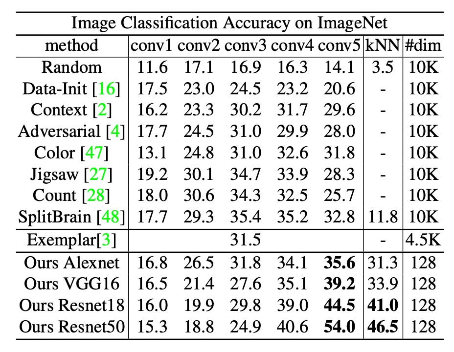
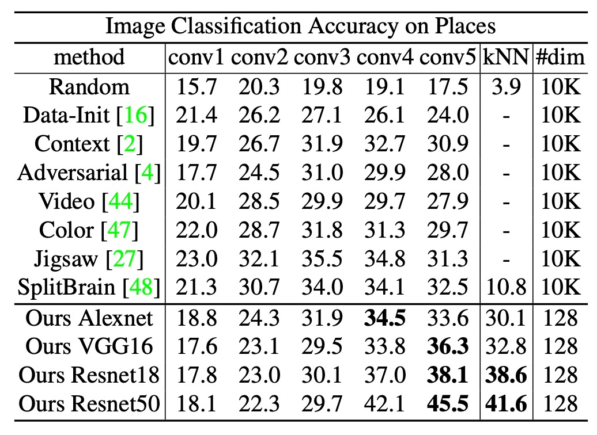

## 多々益善

[**Unsupervised Learning via Non-Parametric Instance Discrimination**](https://arxiv.org/abs/1805.01978)

---

開発の隙間時間を利用して、コントラスト学習に関する論文をいくつか読みました。

以前マスタークラスを受講したことがありますが、やはり自分で読んでみると理解が深まります。

:::info
コントラスト学習に興味がある方には、以下のマスタークラスをお勧めします：[**コントラスト学習論文の概要【論文精読】**](https://www.youtube.com/watch?v=iIczStGLkss)

約 90 分の動画で、コントラスト学習の基本概念、発展経緯、関連論文の詳細解説を含みます。視聴後はスキルが 10 年分向上するかも。（？）
:::

コントラスト学習の概念が流行する前、距離学習（Metric Learning）は業界で広く使われていました。その代表的な応用例が顔認識であり、これ以上のものはありません。

距離学習の核心は、特徴表現 $F$ を学習することで、サンプル $x$ と $y$ 間に距離を定義することです：

$$
d_F(x, y)=\|F(x)-F(y)\|
$$

モデルが訓練を完了した後、学習した特徴のみに基づいて推論を行い、線形分類器は使用できません。

:::tip
距離学習（Metric Learning）の古典的な論文として以下を参照できます：

- [**[18.01] ArcFace: 反余弦損失**](../../face-recognition/1801-arcface/index.md)
- [**[18.01] CosFace: 大余弦損失**](../../face-recognition/1801-cosface/index.md)

研究の過程で、正規化（Normalization）が非常に重要であることが発見されました。すなわち、特徴ベクトルを統一して超球面上に投影することで、モデルの性能が向上します。
:::

## 問題の定義

しかし、これらの距離学習は「クラス」レベルの学習に依存しており、各画像が具体的にどのクラスに属するかを知る必要があります。

距離学習は本質的に教師あり学習です。しかし、現実のアプリケーションでは、大量の「ラベルなし」データしかない場合がほとんどで、このような状況では距離学習の概念を適用するのが困難です。

そのため、研究者たちはさまざまな解決策を模索しました：

### 生成モデル

生成モデル（Generative Models）の概念は非常に魅力的です。エンコーダーとデコーダーを構築し、画像を隠れた特徴表現に変換してから、その特徴表現から画像を再構築します。一般的なモデルには、Autoencoder、GANs、VAEs などがあります。

長所はラベルが不要で、画像さえあれば訓練を開始できることです。しかし、短所として計算コストが非常に高く、画像の再構築解像度が高くなるほど計算量が指数的に増加します。

さらに、生成モデルはデータの分布に依存しており、汎化能力が弱い場合があります。特定の状況下ではモデル崩壊も発生する可能性があります。

### 自己教師あり構造学習

自己教師あり学習（Self-supervised Learning）の概念は、データの内部構造を利用して予測タスクを構築し、モデルを訓練するものです。

いくつかの興味深い例を見てみましょう：

- **文脈予測**

  - [**[15.05] Unsupervised visual representation learning by context prediction**](https://arxiv.org/abs/1505.05192)

      

      <figure style={{"width": "60%"}}>
      
      </figure>
      

- **グレースケール画像の色復元**

  - [**[16.03] Colorful Image Colorization**](https://arxiv.org/abs/1603.08511)

      

      <figure style={{"width": "80%"}}>
      
      </figure>
      

- **ジグソーパズルの解決**

  - [**[16.03] Unsupervised Learning of Visual Representations by Solving Jigsaw Puzzles**](https://arxiv.org/abs/1603.09246)

      

      <figure style={{"width": "80%"}}>
      
      </figure>
      

- **画像の欠損部分の補完**

  - [**[16.04] Context Encoders: Feature Learning by Inpainting**](https://arxiv.org/abs/1604.07379)

      

      <figure style={{"width": "50%"}}>
      
      </figure>
      

- **物体数の計算**

  - [**[17.08] Representation Learning by Learning to Count**](https://arxiv.org/abs/1708.06734)

      

      <figure style={{"width": "70%"}}>
      
      </figure>
      

---

これだけ多くの代理タスクを見てきましたが、どれも理にかなっているように見えます。しかし、これらのタスクが意味認識にどのように寄与するのかを説明することはできず、最適な自己教師ありタスクを確定することもできません。

共通の認識がないのであれば、新たに共通認識を作り出そうと考えました。著者は距離学習に着想を得て、人工ラベルがない条件下で、新しい特徴学習の訓練方法を提案しました。

## 問題の解決

優れた特徴表現を得るために、著者は「インスタンスレベルの識別」という戦略を採用しました。具体的には、各画像を独立した「クラス」と見なし、それぞれの画像が自分の「クラス」に属するかを区別する分類器を訓練します。

モデルの構造を見てみましょう。

### モデル構造

図の左側は「**Backbone CNN**」とラベル付けされた深層畳み込みニューラルネットワークです。このネットワークの役割は、入力画像 $x$（例：224$\times$224 の画像）を高次のセマンティック特徴に変換することです。一般的な CNN ネットワークには、複数の畳み込み層、バッチ正規化、プーリング処理などが含まれます。最終層では高次元ベクトルを出力し、それが「視覚特徴表現」となります。

Backbone CNN から出力される高次特徴は、通常非常に高次元（例：2048 次元）です。大規模データでの処理を効率化するため、著者は「**Projection Head**」を追加し、CNN 出力を **128 次元** のベクトル空間に投影します。

投影後、この 128 次元ベクトルに **L2 ノルム（$\|\mathbf{v}\|_2 = 1$）** を適用します。これにより、各サンプルが単位長に制約され、類似度計算に便利になります。この状態では、ベクトル内積 $\mathbf{v}_i^T \mathbf{v}_j$ が球面上での余弦類似度に対応し、値は $[-1, 1]$ の範囲に収まります。これにより直感的かつ安定した計算が可能になります。

### 従来の分類器の問題

従来の Softmax 分類モデルでは、各クラス $j$ に対応する重みベクトル $\mathbf{w}_j$ が存在します。画像 $x$ から得られる特徴ベクトル $\mathbf{v} = f_\theta(x)$ に基づいて、画像がクラス $i$ に属する条件付き確率は次のように記述されます：

$$
P(i \mid \mathbf{v}) \;=\; \frac{\exp(\mathbf{w}_i^T \mathbf{v})}{\sum_{j=1}^{n} \exp(\mathbf{w}_j^T \mathbf{v})}
$$

この式では、$\mathbf{w}_i^T \mathbf{v}$ が特徴 $\mathbf{v}$ とクラス $i$ の適合度を示します。分母はすべてのクラス（1 から $n$）について指数関数の総和を計算することで、確率の合計を 1 に保ちます。

一般的な分類問題ではクラス数が固定かつそれほど多くないため、このようなパラメトリック Softmax がよく使用されます。しかし、ここでは「各画像」が新しいクラスと見なされ、クラス数が非常に多くなる可能性があります（数万、数百万、またはそれ以上）。そのため、各クラスごとに独立した重みベクトル $\mathbf{w}_j$ を持つと、ストレージコストが高くなるだけでなく、計算も非常に負荷が高くなります。

要するに、訓練が実行不可能になるのです。

### 非パラメトリック分類器

上述の問題を改善するため、著者は「非パラメトリック」アプローチを提案しました：

- **式中の $\mathbf{w}_j$ を「メモリ（memory bank）内に格納された特徴ベクトル」$\mathbf{v}_j$ に置き換えます。**

つまり、クラス重みベクトル $\mathbf{w}_j$ は独立したパラメータではなく、画像自身の特徴ベクトル $\mathbf{v}_j$ を直接使用します。さらに、これらの特徴ベクトルを単位ベクトルに正規化（長さを 1 に）することで、類似度計算を容易にします。

このようにして、Softmax の式は次のように書き換えられます：

$$
P(i \mid \mathbf{v})
= \frac{\exp\!\bigl(\mathbf{v}_i^T \mathbf{v} / \tau\bigr)}{\sum_{j=1}^{n} \exp\!\bigl(\mathbf{v}_j^T \mathbf{v} / \tau\bigr)}
$$

ここで $\tau$ は「温度パラメータ」と呼ばれ、Softmax 分布の「鋭さ」を調整します。$\mathbf{v}$ は現在の画像 $x$ から得られた特徴で、$\mathbf{v}_i$ は「メモリ」に格納された第 $i$ 番目の画像の特徴（単位ベクトル）です。$\mathbf{v}_i^T \mathbf{v}$ は二つの単位ベクトルの内積で、値は -1 から 1 の範囲に収まり、類似度を表します。

:::tip
元の $\mathbf{w}_i$ は学習可能なパラメータで、各クラスの「分類アンカー」として機能していました。特徴ベクトルとアンカーの内積が大きいほど、分類確率が高くなり、モデルはそのクラスに特徴を割り当てる傾向がありました。

ここで著者は $\mathbf{w}_i$ を使わず、データ自体の特徴 $\mathbf{v}_i$ を比較対象とすることで、各画像クラスごとに $\mathbf{w}_i$ を学習する必要がなくなり、計算コストが削減されます。
:::

### メモリバンク

非パラメトリック Softmax の訓練目標は一般的な分類問題と類似しており、各訓練画像が「自分自身に正しく分類される確率」を最大化する、または訓練セット全体の負の対数尤度を最小化することです：

$$
J(\theta)
= - \sum_{i=1}^{n} \log P\bigl(i \mid f_\theta(x_i)\bigr)
$$

ここで $f_\theta(x_i)$ を $\mathbf{f}_i$ と表記します。$P(i \mid \mathbf{f}_i)$ を計算する際には、理論上すべての画像特徴 $\{\mathbf{v}_j\}$ が必要です。しかし、各逆伝播で全画像をニューラルネットに通すと、計算コストが非常に高くなります。

そのため、実際の実装では「メモリバンク」（$\mathbf{V} = \{\mathbf{v}_j\}$）を用いて現在すべての画像特徴を保持し、各訓練イテレーション後に新たに計算された特徴 $\mathbf{f}_i$ でメモリバンク内の対応する画像のエントリを即時更新します。

画像数 $n$ が非常に大きい場合、分母の計算（$\sum_{j=1}^{n} \exp(\mathbf{v}_j^T \mathbf{v} / \tau)$）の計算量は各画像あたり $O(n)$ となり、$n$ が数百万以上に達すると実行はほぼ不可能です。

### Noise-Contrastive Estimation

NCE の核心的なアイデアは次の通りです：

1. **多クラス分類問題を複数の二値分類問題に変換する**。
2. 二値分類の目標：真のデータサンプルとノイズサンプルを区別する。

多クラスの場合、通常は各画像が 1 つの「クラス」として扱われます。NCE を用いる場合、特定の画像に対して「この画像である」か「この画像でない（ノイズ）」を区別するだけで済みます。

具体的には、「他の画像」をノイズと見なし、あるいはノイズ分布（$P_n$）からサンプルを抽出して負例とし、モデルが正例と負例を区別できるように学習します。

例えば、特徴 $\mathbf{v}$ が第 $i$ 番目の画像に由来する確率を次のように書けます：

$$
P(i \mid \mathbf{v}) = \frac{\exp(\mathbf{v}^T \mathbf{f}_i/\tau)}{Z_i}
$$

ここで、

$$
Z_i = \sum_{j=1}^n \exp\bigl(\mathbf{v}_j^T \mathbf{f}_i/\tau\bigr)
$$

- $\mathbf{f}_i$ は「第 $i$ 番目の画像」に対応する特徴（メモリバンクに保存されたもの）であり、$\mathbf{v}$ は任意の画像の特徴です。
- $Z_i$ は「正規化定数」と呼ばれ、すべての $i$ に対する確率の総和が 1 になるようにします。
- ただし、$n$ が非常に大きい場合、$Z_i$ を計算するにはすべての $j = 1, 2, \dots, n$ を走査する必要があり、計算コストが非常に高くなります。

NCE の巧妙な発想は、大量の可能なクラスが存在する場合でも、上記の分母を完全には計算しない点にあります。代わりに、「第 $i$ クラス」に対応する正例と、「ノイズ分布」に対応する負例を区別することに焦点を当てます。

:::tip
要するに、正例以外はすべて負例と見なし、その中から適当に一部を選んで計算に使用するということです。
:::

ノイズ分布 $P_n$ を**一様分布**（uniform）と仮定すると、$P_n(i) = \frac{1}{n}$ となります。

論文では、超パラメータ $m$ を導入し、これは「ノイズサンプルが真のサンプルより $m$ 倍多い」ことを表します。そして次のように「事後確率」を定義します：

$$
h(i, \mathbf{v}) := P(D=1 \mid i, \mathbf{v})= \frac{P(i \mid \mathbf{v})}{P(i \mid \mathbf{v}) + m P_n(i)}
$$

この $h(\cdot)$ の意味は、特徴 $\mathbf{v}$ とクラス $i$ が与えられたとき、「$\mathbf{v}$ が第 $i$ 番目の画像に由来する真のデータであり、ノイズではない」確率です。$P(i \mid \mathbf{v})$ は上記式の出力であり、$m P_n(i)$ はノイズサンプル（負例）が $i$ に対応する確率を表します。

次に重要なのは次の 2 点です：

1. **正例の log-likelihood を負符号付きで計算**（正例が正確に分類されること）。
2. **負例の log-likelihood を負符号付きで計算**（負例が正確に分類されること）。

:::tip
要するに、正例と負例の確率を個別に計算し、それらを足し合わせるだけの話です。
:::

最終的な目的関数は以下のように表されます：

$$
J_{\text{NCE}}(\theta)
= - \mathbb{E}_{P_d}\bigl[\log h(i, \mathbf{v})\bigr]
  \;-\; m \,\mathbb{E}_{P_n}\bigl[\log \bigl(1 - h(i, \mathbf{v}')\bigr)\bigr]
$$

- $P_d$ は「真のデータ分布」、すなわち実際に存在する画像（正例）を表します。
- $P_n$ は「ノイズ分布」、すなわちノイズサンプル（負例）を表します。
- $\mathbf{v}$ と $\mathbf{v}'$ はどちらもメモリバンク（$\mathbf{V}$）から取り出された特徴ベクトルですが、$\mathbf{v}$ は正例に対応し、$\mathbf{v}'$ はランダムに選ばれたノイズです。

直感的には、$\log h(i, \mathbf{v})$ が大きいほど、モデルは「$\mathbf{v}$ が第 $i$ 番目の画像に属する」確率を高いと判断していることを意味し、良い結果と言えます。一方、$\log(1 - h(\cdot))$ が大きいほど、モデルはノイズを正確に排除できていることを示します。

### $Z_i$ の近似

これまでに多くを述べてきましたが、最大の課題は依然として解決されていません。

私たちはまだ $Z_i$ を計算する必要がありますが、その中には $\sum_{j=1}^{n} \exp(\mathbf{v}_j^T \mathbf{f}_i/\tau)$ があります。$n$ が非常に大きい場合、これがボトルネックとなります。

NCE（Noise-Contrastive Estimation）で一般的な手法としては、$Z_i$ を「定数」とみなして推定または近似し、勾配更新には含めない方法があります。本論文では、以下の文献を参考にしています：

- [**Learning word embeddings efficiently with noise-contrastive estimation**](https://www.cs.toronto.edu/~amnih/papers/wordreps.pdf)

モンテカルロ近似（Monte Carlo approximation）を用いて次のように推定します：

$$
Z
\simeq Z_i
\simeq n \,\mathbb{E}_{j \in \text{subset}}
\bigl[\exp(\mathbf{v}_j^T \mathbf{f}_i / \tau)\bigr]
= \frac{n}{m} \sum_{k=1}^{m}
\exp\bigl(\mathbf{v}_{j_k}^T \mathbf{f}_i / \tau\bigr)
$$

ここで、$\{j_k\}$ はランダムに抽出されたインデックスの集合であり、全体集合の平均値を近似するために使用されます。

本来であれば、すべての $n$ 項を合計して $Z_i$ を求める必要がありますが、ここでは負例を $m$ 個だけ抽出し、それらで指数演算を行い加算した後、$\frac{n}{m}$ という係数を掛けることで全体の平均値を近似しています。

論文では、実験的に訓練の初期段階で少数のバッチを用いるだけで十分な推定が可能であり、その後の訓練ではこの推定値を固定しても良好な結果が得られると述べられています。

### 近接正則化（Proximal Regularization）

:::info
参考文献：[**Proximal Algorithms**](https://web.stanford.edu/~boyd/papers/pdf/prox_algs.pdf)
:::

:::tip
先ほどの疑問として、分類のアンカー点が固定されておらず、訓練に伴って移動する場合、モデルはどのようにその安定性を保証できるのでしょうか？
:::

通常の分類問題とは異なり、ここでは「各クラス」につき「1 つの」訓練サンプルしか存在しません。各訓練エポックでは、各クラスは一度だけサンプリングされるため、学習プロセスの揺らぎ（oscillation）が非常に大きくなります。例えば、ある画像が過学習または偏移を起こした場合、次回それに遭遇したときに大幅な勾配更新が行われ、訓練全体の目的関数が大きく揺れ動く可能性があります。

このようなランダムサンプリングによる不安定性を緩和するため、著者は近接正則化（Proximal Regularization）の概念を採用し、損失関数に「**スムージング制約**」を加えることで、特徴ベクトルが各更新で過度に変化しないようにしています。この手法により訓練が安定化し、収束が加速します。

具体的な手法として、以下の 2 つの変数を仮定します：

- **現在の反復（iteration $t$）**：訓練データ $x_i$ に対し、ネットワークを通じて計算される特徴ベクトル $\mathbf{v}_i^{(t)} = f_\theta(x_i)$。
- **メモリバンク**：前回の反復（iteration $t-1$）での特徴ベクトルを保存したもの。$\mathbf{v}_i^{(t-1)}$ と記載。

元の NCE 損失に次の項を追加します：$\lambda \|\mathbf{v}_i^{(t)} - \mathbf{v}_i^{(t-1)}\|^2$。

最終的な目的関数は次のようになります：

$$
- \log h\bigl(i, \mathbf{v}_i^{(t-1)}\bigr)
\;+\; \lambda \,\bigl\|\mathbf{v}_i^{(t)} - \mathbf{v}_i^{(t-1)}\bigr\|_2^2
$$

- 第一項（$- \log h(i, \mathbf{v}_i^{(t-1)})$）は NCE の元の正例損失。
- 第二項（$\lambda \|\mathbf{v}_i^{(t)} - \mathbf{v}_i^{(t-1)}\|^2$）は、新しい特徴ベクトル $\mathbf{v}_i^{(t)}$ が前回の $\mathbf{v}_i^{(t-1)}$ と大きく異ならないようにするもの。

この「**近接項（proximal term）**」を用いることで、特徴ベクトルが大きく変化した場合にペナルティが課されます。訓練が進むにつれて収束が進むと、理想的には $\mathbf{v}_i^{(t)} \approx \mathbf{v}_i^{(t-1)}$ となり、このペナルティ項はほとんどゼロに近づきます。最終的には元の目的関数に戻ります。

統合後、著者は「近接正則化を含む最終的な目的関数」を次のように示しました：

$$
J_{\text{NCE}}(\theta)
$$

$$
= - \mathbb{E}_{P_d}
  \Bigl[
    \log h\bigl(i, \mathbf{v}_i^{(t-1)}\bigr)
    \;-\; \lambda \,\bigl\|\mathbf{v}_i^{(t)} - \mathbf{v}_i^{(t-1)}\bigr\|^2
  \Bigr]
  \;-\; m \,\mathbb{E}_{P_n}
  \Bigl[
    \log\bigl(1 - h\bigl(i, \mathbf{v}'^{(t-1)}\bigr)\bigr)
  \Bigr].
$$

この式では、元の NCE における「正例の $\log h(\cdot)$」および「負例の $\log(1 - h(\cdot))$」の 2 つの主要な項を保持しつつ、$\lambda \|\mathbf{v}_i^{(t)} - \mathbf{v}_i^{(t-1)}\|^2$ を追加することで特徴ベクトルの急激な変動を抑制しています。

近接正則化の効果を確認するため、著者は異なる $\lambda$ 値（例：0、10、30、50）を比較しました：

<figure style={{"width": "70%"}}>

</figure>

上図の通り、$\lambda = 0$（すなわち近接項なし）の場合、目的関数は訓練中に大きく振動し、収束速度も遅くなります。一方、適切な値の $\lambda$ を設定することで、目的関数の曲線が滑らかになり、より速く収束し、最終的に優れた特徴表現を学習できます。

## 討論

### パラメトリック vs ノンパラメトリック Softmax

<figure style={{"width": "70%"}}>

</figure>

本論文の中心である「ノンパラメトリック Softmax」について、著者はまず CIFAR-10 を用いて「パラメトリック Softmax」と「ノンパラメトリック Softmax」の効果を比較する実験を行いました。

CIFAR-10 は比較的小規模なデータセットであり、ノンパラメトリック Softmax の分母を直接計算できるため、両者の違いを正確に評価することが可能です。評価方法としては、Linear SVM と k-NN 分類器を用い、それぞれ「パラメトリック」と「ノンパラメトリック」特徴で分類を行い、その精度を比較しました。

実験結果は上表の通りで、パラメトリック Softmax の SVM と k-NN の精度はそれぞれ 60.3% と 63.0%、ノンパラメトリック Softmax はそれぞれ 75.4% と 80.8% でした。この結果は、ノンパラメトリック Softmax の有効性を明確に示しており、提案手法の優位性を証明しています。

さらに、著者は「ノンパラメトリック設定」において NCE 近似を使用した場合の影響も調査しました。この結果も上表に示されており、NCE のハイパーパラメータ $m$（各正例に対して抽出される負例の数）による影響を評価しています：

- $m = 1$（負例を 1 つだけ抽出）の場合、k-NN の精度は 42.5% に急落し、負例が少なすぎると近似が不十分であることを示しています。
- $m$ が増加するにつれ、精度は徐々に向上し、$m = 4,096$ では「完全版（$m = 49,999$）」に近い結果が得られます。これにより、十分な負例数があれば、NCE でも完全なノンパラメトリック Softmax に近い性能を達成できることが示されました。

### 画像分類タスクでの性能

次に、著者は ImageNet を用いた大規模実験を行い、異なる手法をさまざまなネットワークアーキテクチャで比較しました。

**実験設定**：

- **データセット**：ImageNet（約 128 万枚の画像、1,000 クラス）
- **温度パラメータ $\tau$**：0.07 に設定
- **NCE 負例数 $m$**：4,096（計算コストと特徴品質のバランスを考慮）
- **訓練条件**：
  - 200 エポックの訓練を Momentum SGD を用いて実施
  - バッチサイズ：256
  - 初期学習率：0.03（最初の 120 エポックで一定、以降 40 エポックごとに 0.1 倍に減衰）

**比較対象の手法**：

- **Random initialization**（ランダム初期化、下限として使用）
- **Self-supervised learning**
- **Adversarial learning**
- **Exemplar CNN**
- **Split-brain autoencoder**（最近の優れた自律学習手法）

評価には以下の 2 つの方法を採用：

1. **線形 SVM (conv1 ~ conv5)**：各畳み込み層（conv1、conv2、conv3、...）の中間特徴に基づいて線形分類器を訓練し、ImageNet 検証セットでの分類性能を評価。
2. **k-NN (最終 128 次元出力)**：最終出力の 128 次元特徴で最近傍分類を実施。

**結果**：

<figure style={{"width": "70%"}}>

</figure>

著者の手法は conv1 ~ conv5 の評価において最大 35.6%（top-1 精度）を達成し、従来の手法（Split-brain を含む）よりも優れた結果を示しました。

さらに、ResNet-50 を用いた場合、精度は 54.0% に達し、Exemplar CNN（ResNet-101 を使用）よりも遥かに高性能でした。本手法はネットワークの深さが増すにつれて性能が大幅に向上することが示されています。

k-NN 分類の結果も線形分類（conv5）の結果とほぼ一致しており、最終出力の 128 次元特徴が優れた埋め込み空間を形成していることを示しています。また、ネットワークが深くなる（conv4、conv5）ほど性能が向上していることから、高次元特徴の抽出において本手法の優位性が確認されました。

**効率面**：

多くの手法では最適層（conv3、conv4 など）で 10,000 次元以上の特徴を生成し、記憶や計算に不向きです。一方、本手法では最終出力が 128 次元と非常にコンパクトであり、ImageNet 全体（128 万枚）の特徴を約 600 MB に収められます。また、Titan X GPU 上での最近傍検索は 20 ms 未満で実行可能です。

### データセット間の汎化能力

<figure style={{"width": "70%"}}>

</figure>

著者は次に、ImageNet で学習した特徴を**直接**別の大規模データセットである Places（2.45M 枚の画像、205 クラス）に適用する実験を行いました。この際、ファインチューニングは行わず、特徴抽出だけを実施し、その後 Places で線形分類器を訓練するか、k-NN を用いました。

実験結果は上記の表の通りです。線形分類と k-NN の両方で、本手法は ResNet-50 を用いた場合、それぞれ 45.5%と 41.6%の性能を示し、他の手法（例: Exemplar CNN、Split-brain など）を大幅に上回りました。

これらの結果は、ImageNet で学習した特徴をそのまま用いても、異なる分野（シーン分類）で良好な性能を維持できることを示しており、方法の**分野横断的な汎化能力**を証明しています。

### アブレーション実験 - 特徴次元

<figure style={{"width": "70%"}}>

</figure>

モデル構造の有効性を確認した後、最後にいくつかのアブレーション実験を見てみます。

まずは、特徴次元の影響についてです。著者は特徴次元を 32 → 64 → 128 → 256 と変化させて比較を行いました。その結果は上記の表の通りです。

実験の結果、次元が 32 から 128 に増加するにつれて性能が大幅に向上しましたが、128 → 256 では向上幅が飽和（saturate）する傾向にありました。つまり、128 次元で既に十分な表現能力を提供しており、それ以上次元を増やしてもわずかな利点しか得られないことが分かります。

### アブレーション実験 - 訓練データセットサイズ

<figure style={{"width": "70%"}}>

</figure>

次に、著者は「訓練データセットのサイズ」がモデル性能に与える影響を検証しました。実験設定は以下の通りです。

- **ImageNet 訓練データセット**: 10%、50%、100%の画像を訓練データとして使用。
- **検証データセット**: 完全な ImageNet 検証データセットを使用し、モデルの性能を評価。

実験結果は上記の表に示されています。訓練データセットのサイズが増えるにつれて、モデル性能も向上し続けていることが分かります。この結果は、本手法がラベルなしデータをより多く利用することで特徴の品質を向上させ、大規模な訓練データセットにおいてより優れた性能を発揮することを示しています。

:::tip
この結果は非常に魅力的です。なぜなら、未ラベルのデータを増やし続けることで、この手法が恩恵を受け、より強力な特徴を学習できることを意味しているからです。
:::

### 可視化分析

<figure style={{"width": "90%"}}>

</figure>

論文の最後では、いくつかの特徴視覚化の結果、すなわち「画像検索」機能を示しました。これは、画像特徴の比較を通じて「クエリ」に最も近い画像を見つけるものです。

実験結果は上記の図の通りです。

- **最良ケース（上段 4 行）**: 検索結果の上位 10 枚がすべてクエリ画像と同じカテゴリに属している（モデルの距離空間が非常に正確であることを示しています）。
- **最悪ケース（下段 4 行）**: 上位 10 枚が「実際のカテゴリ」と一致しないものの、視覚的または形状的には非常に似ている例（例えば、種やカテゴリは異なるが、見た目が非常に似ているものなど）。

著者は、「失敗例」であっても視覚的に類似した画像が見つかることを指摘し、「インスタンスレベル」の埋め込み空間が視覚的特徴を確実に捉えていることを証明しています。

## 結論

論文では、「半教師あり分類」や「物体検出」への応用実験についても触れられていますが、ここでは詳しく説明しません。興味のある読者は原文を参照してください。

全体として、これらの実験は著者の手法の汎用性と拡張性を十分に実証しています。分類や検索だけでなく、異なるネットワーク構造、異なるデータスケール、および異なる下流タスク（半教師あり分類、検出）でも優れた汎化能力を発揮しています。

この論文が提案された後、NCE 損失に基づく自己教師あり学習フレームワークは、大規模データセットで驚くべき結果を迅速に達成し、実際のアプリケーションで強力な性能を示しました。

この後もいくつかの代表的な論文が続きますので、次に進みましょう。
